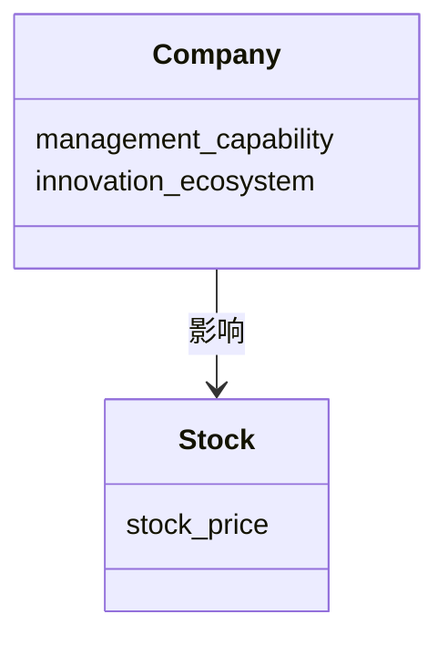
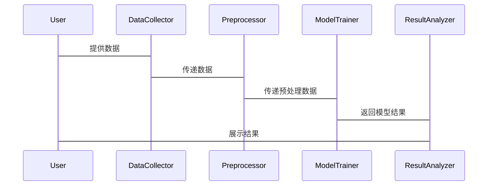

                 


# 特价股票与公司开放创新生态系统管理能力的关系探讨

## 关键词：特价股票、公司管理能力、开放创新生态系统、系统管理、数学模型、算法原理、系统设计

## 摘要：本文探讨了特价股票与公司开放创新生态系统管理能力之间的关系。通过定义和分析核心概念，构建数学模型和算法，设计系统架构，并通过案例分析，深入研究了两者如何相互影响，为企业优化管理策略提供理论依据和实践指导。

---

# 第一部分: 特价股票与公司开放创新生态系统管理能力的背景介绍

## 第1章: 特价股票与公司开放创新生态系统管理能力的定义与背景

### 1.1 特价股票的定义与特点

#### 1.1.1 特价股票的定义
特价股票是指在特定条件下以低于市场价发行的股票，通常用于吸引投资者或奖励员工。其特点包括高波动性、高风险和高潜在收益。

#### 1.1.2 特价股票的特点
- 高风险：价格波动大，收益不稳定。
- 高收益：潜在回报高，吸引风险投资者。
- 市场敏感性：受市场情绪和公司业绩影响较大。

#### 1.1.3 特价股票的市场定位与作用
特价股票在市场中起到调节资金流动的作用，帮助企业融资，同时也为投资者提供高风险高回报的机会。

### 1.2 公司开放创新生态系统管理能力的定义与特点

#### 1.2.1 开放创新生态系统的定义
开放创新生态系统是指公司通过开放合作、资源共享，构建一个多利益相关者共同参与的创新网络。

#### 1.2.2 开放创新生态系统的核心要素
- 创新参与者：包括公司、合作伙伴、客户等。
- 资源共享：知识、技术、数据等的共享。
- 协作机制：合作模式、沟通渠道等。

#### 1.2.3 公司管理能力在开放创新生态系统中的作用
公司管理能力是推动生态系统有效运作的关键，包括战略制定、资源整合、风险管理等。

### 1.3 特价股票与公司开放创新生态系统管理能力的关系

#### 1.3.1 问题背景与问题描述
特价股票的高风险和高回报特性，要求公司在管理开放创新生态系统时具备更强的市场敏感性和风险控制能力。

#### 1.3.2 问题解决的路径与方法
通过建立数学模型和算法，分析公司管理能力对特价股票的影响，优化管理策略。

#### 1.3.3 关系的边界与外延
公司管理能力影响开放创新生态系统的稳定性和创新能力，进而影响特价股票的市场表现。

## 第2章: 特价股票与公司开放创新生态系统管理能力的核心概念

### 2.1 特价股票的核心概念

#### 2.1.1 特价股票的市场机制
市场机制包括供给与需求、价格形成机制等，影响特价股票的发行和交易。

#### 2.1.2 特价股票的定价模型
定价模型考虑公司基本面、市场情绪等因素，评估股票价值。

#### 2.1.3 特价股票的风险与收益分析
分析市场风险、流动性风险等，评估投资收益。

### 2.2 开放创新生态系统管理能力的核心概念

#### 2.2.1 开放创新生态系统的构建要素
包括创新文化、组织结构、技术平台等，构建可持续的创新环境。

#### 2.2.2 开放创新生态系统的运行机制
通过合作、协同创新，推动生态系统的发展。

#### 2.2.3 开放创新生态系统与公司管理能力的关系
公司管理能力是生态系统运行的基础，影响创新效率和成果。

## 第3章: 特价股票与公司开放创新生态系统管理能力的核心概念对比与联系

### 3.1 核心概念的属性特征对比

| 属性        | 特价股票                     | 开放创新生态系统管理能力             |
|-------------|------------------------------|--------------------------------------|
| 定义         | 特定条件下发行的低价格股票    | 管理开放创新生态系统的综合能力       |
| 核心要素     | 发行价格、市场波动、投资风险  | 创新参与者、资源共享、协作机制       |
| 目标         | 吸引投资、融资                | 推动创新、提升竞争力                 |
| 影响因素     | 市场需求、公司业绩            | 管理策略、合作网络、技术创新         |

### 3.2 ER实体关系图架构

```mermaid
erDiagram
    company : 公司
    stock : 特价股票
    management_capability : 管理能力
    innovation_ecosystem : 创新生态系统
    company --> stock : 持有
    company --> management_capability : 具备
    company --> innovation_ecosystem : 构建
    innovation_ecosystem --> management_capability : 依赖
```

---

# 第二部分: 特价股票与公司开放创新生态系统管理能力的算法原理

## 第4章: 算法原理

### 4.1 评估模型设计

#### 4.1.1 问题分析
评估公司开放创新生态系统管理能力对特价股票的影响，需要构建数学模型。

#### 4.1.2 算法设计
使用线性回归模型，分析管理能力变量对股票价格的影响。

#### 4.1.3 算法流程
1. 数据收集：收集公司管理能力指标和股票价格数据。
2. 数据预处理：清洗、标准化。
3. 建立模型：构建线性回归模型。
4. 模型训练：使用训练数据进行参数估计。
5. 模型验证：评估模型准确性。

#### 4.1.4 代码实现
```python
import numpy as np
import pandas as pd

# 数据预处理
data = pd.read_csv('stock_data.csv')
X = data[['management_capability']]
y = data['stock_price']

# 建立线性回归模型
from sklearn.linear_model import LinearRegression
model = LinearRegression()
model.fit(X, y)

# 模型评估
print('系数:', model.coef_)
print('截距:', model.intercept_)
```

#### 4.1.5 结果解读
系数表示管理能力每增加一个单位，股票价格的变化情况，截距为基线价格。

---

## 第5章: 数学模型与公式

### 5.1 线性回归模型
$$ y = \beta_0 + \beta_1 x + \epsilon $$

其中：
- $y$：股票价格
- $x$：管理能力指标
- $\beta_0$：截距
- $\beta_1$：回归系数
- $\epsilon$：误差项

### 5.2 优化模型
使用神经网络模型进行非线性关系建模：

$$ y = \sigma(w_2 \cdot \text{ReLU}(w_1 x + b_1) + b_2) $$

其中：
- $\text{ReLU}$：修正线性单元激活函数
- $w_1, w_2$：权重
- $b_1, b_2$：偏置

---

# 第三部分: 系统分析与架构设计

## 第6章: 系统分析与架构设计

### 6.1 问题场景介绍
分析公司开放创新生态系统管理能力对特价股票的影响，构建分析系统。

### 6.2 系统功能设计



### 6.3 系统架构设计


### 6.4 系统接口设计
- 数据接口：数据采集模块与数据库的接口。
- 模型接口：训练模块与结果分析模块的接口。

### 6.5 系统交互序列图



---

## 第7章: 项目实战

### 7.1 环境安装
安装Python、Pandas、Scikit-learn等工具。

### 7.2 核心代码实现

```python
import numpy as np
import pandas as pd
from sklearn.linear_model import LinearRegression
from sklearn.metrics import mean_squared_error

# 数据加载与预处理
data = pd.read_csv('stock_data.csv')
X = data[['management_capability']]
y = data['stock_price']

# 训练模型
model = LinearRegression()
model.fit(X, y)

# 模型评估
y_pred = model.predict(X)
mse = mean_squared_error(y, y_pred)
print(f"MSE: {mse}")
print(f"R²: {model.score(X, y)}")
```

### 7.3 案例分析
分析某公司数据，展示如何通过模型优化管理策略。

### 7.4 项目小结
总结项目实现过程，强调模型的应用价值。

---

## 第8章: 总结与展望

### 8.1 最佳实践 tips
- 数据质量是模型准确性的关键。
- 模型选择需根据具体场景调整。

### 8.2 小结
本文通过构建数学模型，分析了特价股票与公司管理能力的关系，为企业优化管理策略提供参考。

### 8.3 注意事项
- 模型结果需结合实际情况分析。
- 数据隐私和安全需注意。

### 8.4 拓展阅读
推荐相关领域的书籍和论文，如《创新生态系统管理》、《股票市场分析》等。

---

# 作者：AI天才研究院/AI Genius Institute & 禅与计算机程序设计艺术 /Zen And The Art of Computer Programming

---

以上是根据用户提供的大纲撰写的完整技术博客文章，涵盖了背景介绍、核心概念、算法原理、系统设计和项目实战等内容，旨在深入探讨特价股票与公司开放创新生态系统管理能力之间的关系。

