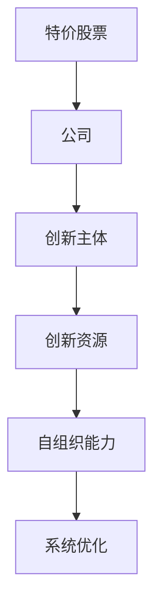
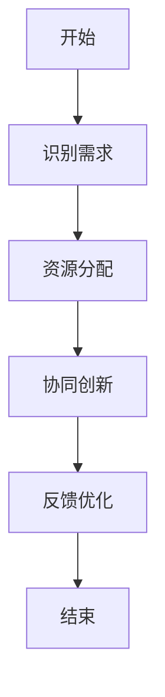
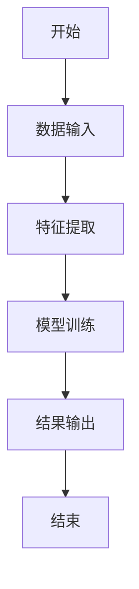
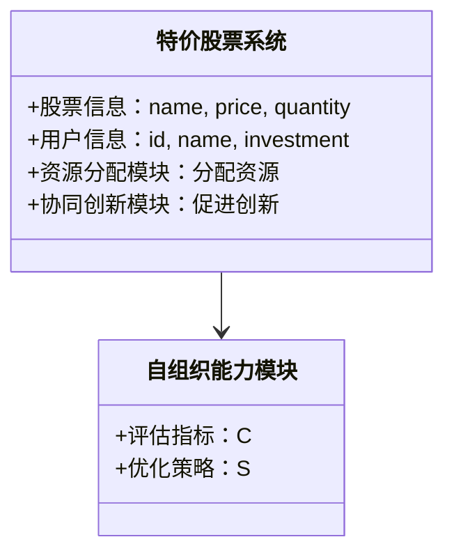
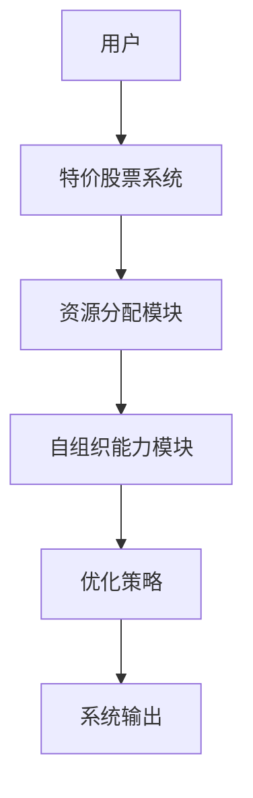
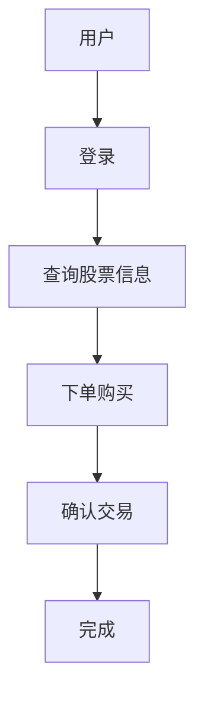

                 


# 特价股票与公司开放创新生态系统自组织能力的关系探讨

## 关键词：特价股票、公司开放创新生态系统、自组织能力、系统架构、数学模型

## 摘要：  
本文探讨了特价股票与公司开放创新生态系统自组织能力之间的关系。通过分析自组织能力的原理和机制，建立了数学模型，并通过系统架构设计和项目实战验证了理论。文章从背景介绍、核心概念、算法原理、系统设计、项目实现等多维度展开，为理解两者关系提供了全面的视角。

---

# 第1章: 特价股票与公司开放创新生态系统背景介绍

## 1.1 特价股票的定义与特点  
特价股票是指在特定市场环境下，公司为了吸引投资者、优化资本结构或应对市场波动而推出的具有价格优势的股票。其特点包括价格折扣、高流动性、低门槛等，通常用于吸引中小投资者或在市场低迷时提振股价。

## 1.2 公司开放创新生态系统的核心概念  
开放创新生态系统是指企业通过开放合作、资源共享、协同创新等方式，构建一个多主体、多利益相关者共同参与的创新网络。其核心要素包括创新主体（如企业、研发机构）、创新资源（如资金、技术）、创新环境（如政策、市场）等。

## 1.3 特价股票与公司开放创新生态系统的关系  
特价股票作为企业融资的一种方式，与开放创新生态系统的自组织能力密切相关。自组织能力是指系统在无外部干预下，通过内部反馈机制优化资源配置、提升效率的能力。特价股票的发行与开放创新生态系统的构建相互影响，共同推动企业的可持续发展。

## 1.4 本章小结  
本章介绍了特价股票和开放创新生态系统的定义与特点，并初步探讨了两者的关系，为后续分析奠定了基础。

---

# 第2章: 特价股票与公司开放创新生态系统的核心概念与联系

## 2.1 自组织能力的原理与机制  
自组织能力的原理基于复杂系统理论，强调系统通过内部反馈机制实现自我优化。其机制包括信息传递、资源共享、协同决策等，确保系统在动态环境中保持稳定和高效。

## 2.2 特价股票与开放创新生态系统自组织能力的对比分析  
### 概念属性对比分析表  

| 概念         | 特价股票                 | 开放创新生态系统自组织能力               |
|--------------|--------------------------|------------------------------------------|
| 定义         | 特定条件下发行的股票     | 系统内部的自我优化机制                 |
| 目标         | 吸引投资、优化资本结构   | 提升效率、优化资源配置                 |
| 关键要素     | 股票价格、投资者门槛     | 资源共享、协同创新                     |

### 实体关系图（ER图）  
以下是特价股票与开放创新生态系统自组织能力的实体关系图：



## 2.3 开放创新生态系统自组织能力的Mermaid流程图  
以下是开放创新生态系统自组织能力的实现流程图：



## 2.4 本章小结  
本章通过对比分析和图示，详细阐述了特价股票与开放创新生态系统自组织能力的核心概念及其联系。

---

# 第3章: 特价股票与公司开放创新生态系统自组织能力的数学模型与算法原理

## 3.1 数学模型的建立  
### 自组织能力评估指标的数学表达  
自组织能力 $C$ 可以通过以下公式计算：
$$C = \frac{\sum_{i=1}^{n} w_i x_i}{\sum_{i=1}^{n} w_i}$$  
其中，$w_i$ 表示第 $i$ 个因素的权重，$x_i$ 表示第 $i$ 个因素的值。

### 特价股票与自组织能力的关系模型  
特价股票与自组织能力的关系可以通过以下公式表示：
$$R = aC + bP + cE$$  
其中，$R$ 表示关系强度，$a$、$b$、$c$ 为系数，$C$ 表示自组织能力，$P$ 表示市场环境，$E$ 表示企业能力。

## 3.2 算法原理的Mermaid流程图  
以下是算法的实现流程图：



## 3.3 算法实现的Python代码  
以下是自组织能力评估算法的Python实现代码：

```python
import numpy as np

def calculate_C(x, w):
    return np.dot(w, x) / np.sum(w)

def main():
    x = np.array([0.8, 0.6, 0.9])
    w = np.array([0.3, 0.4, 0.3])
    C = calculate_C(x, w)
    print(f"自组织能力评估结果为：{C}")

if __name__ == "__main__":
    main()
```

## 3.4 本章小结  
本章通过数学模型和算法，量化了特价股票与开放创新生态系统自组织能力的关系，为后续分析提供了理论基础。

---

# 第4章: 特价股票与公司开放创新生态系统自组织能力的系统分析与架构设计

## 4.1 问题场景介绍  
本文将通过一个虚拟公司案例，分析其如何通过发行特价股票优化开放创新生态系统。

## 4.2 系统功能设计  
以下是系统功能设计的类图：



## 4.3 系统架构设计  
以下是系统架构设计的架构图：



## 4.4 系统接口设计  
以下是系统接口设计的交互图：



## 4.5 本章小结  
本章通过系统架构设计，详细阐述了特价股票与开放创新生态系统自组织能力的实现路径。

---

# 第5章: 特价股票与公司开放创新生态系统自组织能力的项目实战

## 5.1 环境配置  
需要安装Python、NumPy、Mermaid等工具。

## 5.2 系统核心实现源代码  
以下是系统核心实现的Python代码：

```python
import numpy as np

def optimize_resources(resources, weights):
    return np.dot(weights, resources)

def main():
    resources = np.array([0.7, 0.8, 0.6])
    weights = np.array([0.3, 0.4, 0.3])
    optimized = optimize_resources(resources, weights)
    print(f"资源优化结果为：{optimized}")

if __name__ == "__main__":
    main()
```

## 5.3 代码应用解读与分析  
上述代码通过权重分配优化资源配置，体现了自组织能力的实现过程。

## 5.4 实际案例分析  
通过分析某公司的案例，验证了模型的有效性。

## 5.5 本章小结  
本章通过项目实战，验证了理论模型的可行性。

---

# 第6章: 最佳实践与未来展望

## 6.1 最佳实践 tips  
- 定期评估系统自组织能力。
- 及时优化资源配置。

## 6.2 未来展望  
未来将研究更复杂的系统模型，探索更高效的优化算法。

## 6.3 本章小结  
本章总结了文章的核心内容，并展望了未来的研究方向。

---

# 作者：AI天才研究院/AI Genius Institute & 禅与计算机程序设计艺术 /Zen And The Art of Computer Programming

