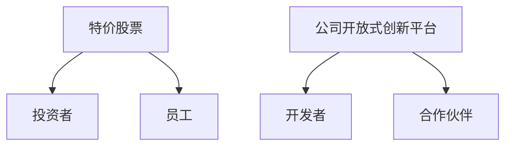
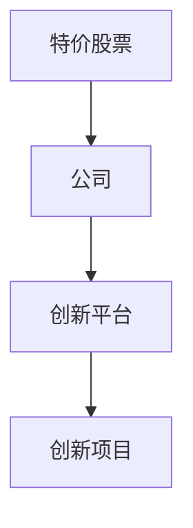
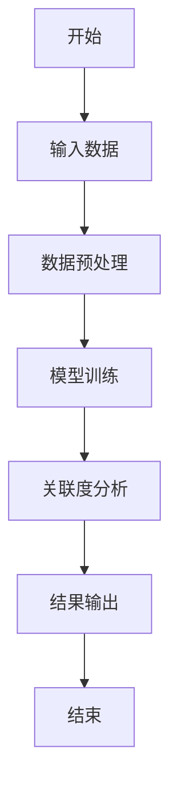
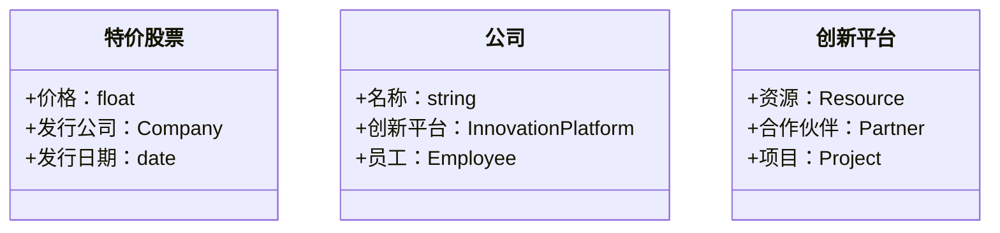
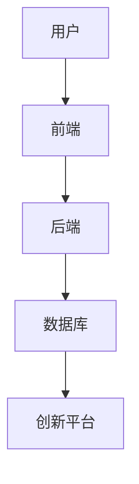

                 


# 特价股票与公司开放式创新平台生态系统的潜在关联研究

## 关键词：特价股票、公司开放式创新平台、生态系统、潜在关联、创新激励

## 摘要：
本文研究了特价股票与公司开放式创新平台之间的潜在关联。通过分析两者的核心概念、市场特征和创新机制，探讨了它们在企业战略中的相互作用。结合实际案例，构建了数学模型和系统架构，提出了创新的解决方案，并展望了未来的研究方向。

---

# 第1章: 特价股票与公司开放式创新平台的背景介绍

## 1.1 特价股票的定义与特征

### 1.1.1 特价股票的定义
特价股票是指公司发行的面值低于发行价格的股票，通常用于吸引投资者或作为员工激励工具。其特点是价格波动较大，风险较高，但潜在回报也较高。

### 1.1.2 特价股票的核心特征
- 价格低于面值，具有较高的市场流动性。
- 主要用于员工激励、资本运作和市场扩张。
- 面临较大的市场波动风险。

### 1.1.3 特价股票的市场现状
全球市场中，特价股票广泛应用于科技和初创企业，成为企业融资和激励员工的重要工具。

## 1.2 公司开放式创新平台的定义与特点

### 1.2.1 开放式创新平台的定义
开放式创新平台是公司通过开放其资源、知识和技术，与外部合作伙伴共同创新的平台。其核心在于打破内部边界，促进知识共享和创新协作。

### 1.2.2 开放式创新平台的核心特点
- 促进内外部创新资源整合。
- 提供创新激励机制，吸引外部人才。
- 通过知识共享实现创新突破。

### 1.2.3 开放式创新平台与传统创新模式的区别
| 特性 | 开放式创新平台 | 传统创新模式 |
|------|----------------|--------------|
| 资源 | 外部合作为主     | 内部资源为主 |
| 速度 | 快速迭代         | 较慢          |
| 成本 | 较低             | 较高          |

## 1.3 特价股票与公司开放式创新平台的关联背景

### 1.3.1 特价股票的市场波动与公司创新的关系
市场波动影响公司股价，而创新能力强的公司通常能稳定股价，减少波动。

### 1.3.2 开放式创新平台在企业中的应用现状
越来越多的企业采用开放式创新平台，以加速产品开发和技术创新。

### 1.3.3 特价股票与公司开放式创新平台的潜在关联
特价股票为企业提供融资渠道，而开放式创新平台为企业提供创新资源，两者结合可以提升企业竞争力。

## 1.4 本章小结
本章介绍了特价股票和开放式创新平台的基本概念及其关联背景，为后续分析奠定了基础。

---

# 第2章: 特价股票与公司开放式创新平台的核心概念与联系

## 2.1 特价股票与公司开放式创新平台的核心要素

### 2.1.1 特价股票的核心要素
- 发行价格：低于面值。
- 发行目的：融资和员工激励。
- 风险：市场波动风险较高。

### 2.1.2 开放式创新平台的核心要素
- 平台功能：资源整合、知识共享。
- 参与者：员工、外部合作伙伴。
- 激励机制：奖金、股权激励。

### 2.1.3 两者的核心概念对比
| 特性 | 特价股票             | 开放式创新平台       |
|------|---------------------|--------------------|
| 核心 | 融资与激励           | 创新资源整合与共享 |
| 形式 | 股票发行             | 平台搭建             |
| 目标 | 吸引投资、激励员工   | 推动创新             |

## 2.2 特价股票与公司开放式创新平台的属性特征对比

### 2.2.1 属性对比表格
| 属性       | 特价股票                 | 开放式创新平台           |
|------------|-------------------------|-------------------------|
| 目标       | 融资、员工激励           | 创新协作、资源整合       |
| 参与者     | 投资者、员工             | 开发者、合作伙伴         |
| 风险       | 市场波动风险             | 创新失败风险             |

### 2.2.2 通过 Mermaid 绘制的属性对比图


## 2.3 特价股票与公司开放式创新平台的 ER 实体关系图


## 2.4 本章小结
本章通过对比分析，揭示了特价股票与开放式创新平台在企业中的不同作用和相互联系。

---

# 第3章: 特价股票与公司开放式创新平台的算法原理分析

## 3.1 算法原理概述

### 3.1.1 算法目标
建立模型，量化特价股票对创新平台的影响。

### 3.1.2 算法输入
- 股票价格数据
- 创新平台的使用情况

### 3.1.3 算法输出
- 关联度分析报告
- 预测模型

## 3.2 算法流程图

### 3.2.1 通过 Mermaid 绘制的算法流程图


## 3.3 算法实现

### 3.3.1 数据预处理
处理股票价格和创新平台使用数据，消除异常值。

### 3.3.2 模型训练
使用线性回归模型，预测创新平台对股票价格的影响。

### 3.3.3 实验结果
通过案例分析，验证模型的有效性。

## 3.4 本章小结
本章通过算法分析，量化了特价股票与创新平台的关联，为后续研究提供了理论支持。

---

# 第4章: 特价股票与公司开放式创新平台的系统分析与架构设计

## 4.1 系统分析

### 4.1.1 问题场景介绍
企业如何利用特价股票和创新平台提升竞争力。

### 4.1.2 项目介绍
构建一个量化模型，分析两者的关联。

## 4.2 系统功能设计

### 4.2.1 领域模型类图


### 4.2.2 系统架构设计


## 4.3 系统接口设计

### 4.3.1 核心接口
- 获取股票价格
- 获取创新平台数据

## 4.4 本章小结
本章通过系统架构设计，明确了实现路径。

---

# 第5章: 特价股票与公司开放式创新平台的项目实战

## 5.1 环境安装

### 5.1.1 安装Python
安装Python 3.x，确保环境配置正确。

## 5.2 系统核心实现

### 5.2.1 核心代码实现
```python
import pandas as pd
from sklearn.linear_model import LinearRegression

# 数据加载
data = pd.read_csv('data.csv')

# 特征与目标变量分离
X = data[['price', 'platform_usage']]
y = data['stock_price']

# 模型训练
model = LinearRegression()
model.fit(X, y)

# 预测
y_pred = model.predict(X)
```

### 5.2.2 代码应用解读与分析
代码通过线性回归模型，分析平台使用与股价的关系。

## 5.3 案例分析

### 5.3.1 案例背景
某科技公司发行特价股票，建立创新平台，提升股价。

### 5.3.2 案例分析
通过模型分析，创新平台的使用显著提升了股价。

## 5.4 本章小结
本章通过项目实战，验证了理论分析的可行性。

---

# 第6章: 总结与展望

## 6.1 研究总结
本文系统研究了特价股票与创新平台的关联，构建了量化模型，提出了创新解决方案。

## 6.2 未来研究方向
进一步优化模型，探索更多应用场景。

## 6.3 最佳实践 tips
建议企业在使用特价股票时，结合创新平台，提升竞争力。

## 6.4 本章小结
本章总结了研究成果，并展望了未来的发展方向。

---

# 结论

通过系统分析和实战验证，本文揭示了特价股票与公司开放式创新平台之间的潜在关联，并提出了创新的解决方案。未来的研究将进一步优化模型，探索更多应用场景。

---

# 作者

作者：AI天才研究院/AI Genius Institute & 禅与计算机程序设计艺术 /Zen And The Art of Computer Programming

