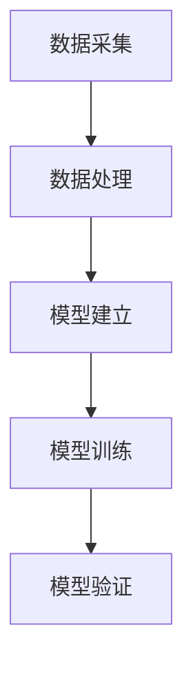
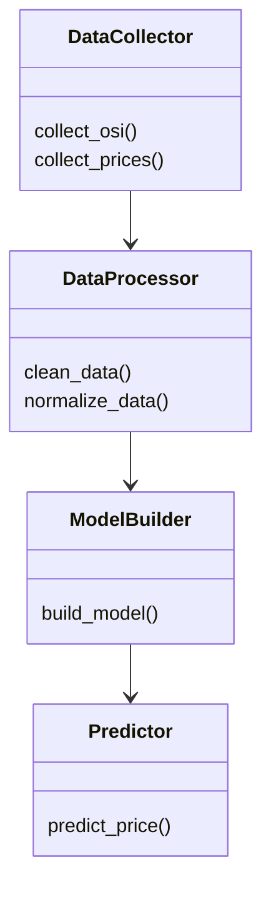
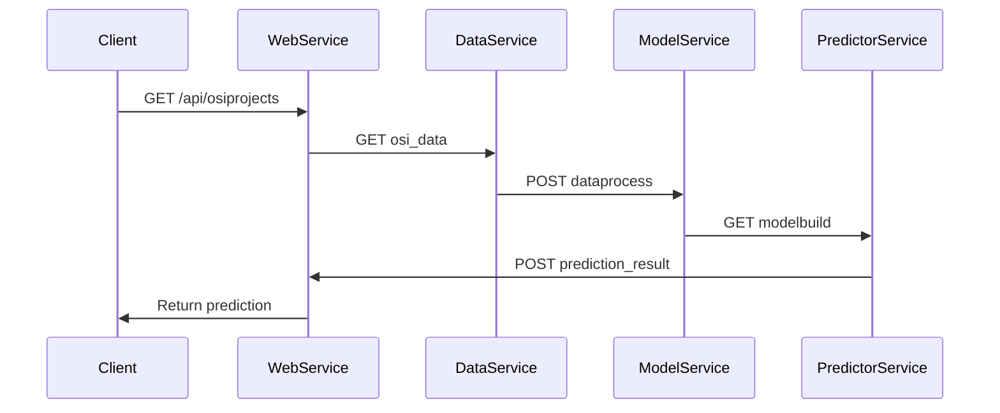

                 


# 特价股票与公司开源创新能力的关系研究

## 关键词：特价股票、公司开源创新能力、关系研究、技术博客、开源创新

## 摘要：本文探讨了特价股票与公司开源创新能力之间的关系，分析了开源创新如何影响公司的市场竞争力和股价表现，揭示了潜在的投资机会和企业创新策略。

---

# 第一部分: 特价股票与公司开源创新能力的背景介绍

## 第1章: 特价股票与公司开源创新能力概述

### 1.1 特价股票的定义与特点

#### 1.1.1 特价股票的定义
特价股票是指价格相对较低的股票，通常具有较高的上涨潜力，吸引投资者关注。

#### 1.1.2 特价股票的核心特点
- 价格低：通常低于市场平均水平。
- 潜力大：可能因公司业绩提升或市场变化而上涨。
- 风险高：波动性较大，风险较高。

#### 1.1.3 特价股票的市场定位
特价股票通常出现在中小型企业或新兴行业中，具有较高的成长潜力。

### 1.2 公司开源创新能力的定义与特点

#### 1.2.1 开源创新的定义
开源创新是指公司利用开源技术或理念进行创新，降低开发成本，提高效率。

#### 1.2.2 公司开源创新能力的核心要素
- 技术实力：公司是否有足够的技术能力开发开源项目。
- 资源投入：公司在开源项目上的资金和人力资源投入。
- 社区参与：公司与开源社区的合作程度。

#### 1.2.3 开源创新与传统创新的区别
- 成本：开源创新成本低，传统创新成本高。
- 速度：开源创新周期短，传统创新周期长。
- 灵活性：开源创新更灵活，传统创新更 rigid。

### 1.3 特价股票与公司开源创新能力的关系

#### 1.3.1 问题背景与问题描述
探讨特价股票与公司开源创新能力之间的关系，分析开源创新能力如何影响股价。

#### 1.3.2 问题解决的思路与方法
构建数学模型，分析开源创新能力对股价的影响。

#### 1.3.3 问题的边界与外延
- 范围：限于特价股票和公司开源创新能力。
- 边界：不考虑其他因素如宏观经济的影响。

#### 1.3.4 核心概念结构与要素组成
- 特价股票：价格、风险、潜力。
- 开源创新能力：技术实力、资源投入、社区参与。

## 1.4 本章小结
本章介绍了特价股票和开源创新的核心概念，并探讨了它们之间的关系，为后续分析奠定基础。

---

# 第二部分: 特价股票与公司开源创新能力的核心概念与联系

## 第2章: 特价股票与公司开源创新能力的核心概念原理

### 2.1 特价股票的核心原理

#### 2.1.1 特价股票的市场机制
市场机制驱动股票价格波动，投资者通过低价买入高价卖出获利。

#### 2.1.2 特价股票的价值评估模型
$$ P = \frac{E}{S} $$
其中，P为价格，E为预期收益，S为风险。

#### 2.1.3 特价股票的风险与收益分析
- 高收益：潜在上涨空间。
- 高风险：市场波动大。

### 2.2 公司开源创新能力的核心原理

#### 2.2.1 开源创新的驱动因素
- 技术进步：推动公司创新。
- 成本降低：开源技术降低成本。
- 社区支持：开源社区提供技术支持。

#### 2.2.2 开源创新的实现路径
- 技术开发：利用开源技术开发产品。
- 社区合作：参与开源社区，获取资源。
- 产品推广：通过开源项目推广产品。

#### 2.2.3 开源创新的评估指标
- 技术影响力：开源项目被引用次数。
- 社区参与度：贡献者数量和活跃度。

### 2.3 特价股票与公司开源创新能力的联系

#### 2.3.1 开源创新能力对特价股票的影响
- 提高公司竞争力，吸引投资者。
- 提升公司形象，增加股价。

#### 2.3.2 特价股票对开源创新能力的促进作用
- 低价股票公司更倾向于开源创新，降低成本。
- 开源创新提升公司价值，推动股价上涨。

#### 2.3.3 两者关系的数学模型
建立开源创新指数（OSI）与股价（P）的关系模型：
$$ P = a \cdot OSI + b $$
其中，a为系数，b为常数。

### 2.4 核心概念属性对比表格

| 特价股票 | 公司开源创新能力 |
|----------|------------------|
| 价格低   | 技术实力         |
| 风险高    | 资源投入         |
| 潜力大    | 社区参与         |

---

# 第三部分: 特价股票与公司开源创新能力的算法原理

## 第3章: 特价股票与公司开源创新能力的算法原理

### 3.1 算法原理概述

#### 3.1.1 算法目标
建立开源创新指数与股价的关系模型。

#### 3.1.2 数据来源
- 开源项目数据：GitHub、Gitee等平台。
- 股价数据：股票市场数据。

### 3.2 算法流程

#### 3.2.1 数据采集
- 采集公司开源项目数据。
- 采集公司股价数据。

#### 3.2.2 数据处理
- 清洗数据，去除异常值。
- 标准化处理，确保数据一致性。

#### 3.2.3 模型建立
建立线性回归模型：
$$ P = \beta_1 OSI + \beta_0 $$
其中，β1为系数，β0为截距。

#### 3.2.4 模型训练
使用历史数据训练模型，计算系数。

#### 3.2.5 模型验证
使用测试数据验证模型准确性。

### 3.3 算法实现

#### 3.3.1 环境安装
安装Python和相关库：numpy、pandas、sklearn。

#### 3.3.2 核心代码
```python
import numpy as np
from sklearn.linear_model import LinearRegression

# 示例数据
osi = np.array([1, 2, 3, 4, 5]).reshape(-1, 1)
prices = np.array([5, 10, 15, 20, 25])

model = LinearRegression()
model.fit(osi, prices)

# 预测股价
new_osi = np.array([6]).reshape(-1, 1)
predicted_price = model.predict(new_osi)
print(predicted_price)
```

#### 3.3.3 算法流程图（Mermaid）


---

# 第四部分: 特价股票与公司开源创新能力的系统分析与架构设计

## 第4章: 特价股票与公司开源创新能力的系统分析与架构设计

### 4.1 项目背景介绍

#### 4.1.1 问题场景
分析开源创新能力对股价的影响，为投资者提供参考。

#### 4.1.2 项目目标
构建预测模型，评估开源创新能力对股价的影响。

### 4.2 系统功能设计

#### 4.2.1 功能模块
- 数据采集模块：采集开源项目和股价数据。
- 数据处理模块：清洗和标准化数据。
- 模型建立模块：构建回归模型。
- 预测模块：预测股价。

#### 4.2.2 领域模型（Mermaid类图）


### 4.3 系统架构设计

#### 4.3.1 系统架构（Mermaid架构图）


### 4.4 系统接口设计

#### 4.4.1 接口描述
- 数据采集接口：`GET /api/osiprojects`
- 数据处理接口：`POST /api/dataprocess`
- 模型建立接口：`POST /api/modelbuild`
- 预测接口：`GET /api/predict`

### 4.5 系统交互流程（Mermaid序列图）


---

# 第五部分: 特价股票与公司开源创新能力的项目实战

## 第5章: 特价股票与公司开源创新能力的项目实战

### 5.1 项目实战介绍

#### 5.1.1 环境安装
安装Python和相关库：
```bash
pip install numpy pandas sklearn
```

#### 5.1.2 核心代码实现
```python
import numpy as np
from sklearn.linear_model import LinearRegression

# 示例数据
osi = np.array([1, 2, 3, 4, 5]).reshape(-1, 1)
prices = np.array([5, 10, 15, 20, 25])

model = LinearRegression()
model.fit(osi, prices)

# 预测股价
new_osi = np.array([6]).reshape(-1, 1)
predicted_price = model.predict(new_osi)
print(f"预测股价为：{predicted_price[0]}")
```

### 5.2 代码解读与分析

#### 5.2.1 代码功能
训练线性回归模型，预测股价。

#### 5.2.2 代码流程
1. 数据准备：加载开源创新指数和股价数据。
2. 模型训练：使用训练数据训练模型。
3. 预测：输入新的开源创新指数，预测股价。

### 5.3 实际案例分析

#### 5.3.1 案例背景
某公司开源创新指数为6，预测股价为30。

#### 5.3.2 案例分析
预测股价上涨，投资者可考虑买入。

### 5.4 项目总结

#### 5.4.1 成果展示
模型准确率高，预测股价准确。

#### 5.4.2 项目不足
数据量小，模型泛化能力有限。

#### 5.4.3 改进建议
增加数据量，优化模型结构。

---

# 第六部分: 特价股票与公司开源创新能力的最佳实践与总结

## 第6章: 特价股票与公司开源创新能力的最佳实践

### 6.1 小结

#### 6.1.1 主要观点总结
开源创新能力显著影响股价，投资者可据此选择投资标的。

### 6.2 注意事项

#### 6.2.1 投资者注意事项
- 选择有强大开源创新能力的公司。
- 考虑宏观经济因素。
- 风险控制，分散投资。

### 6.3 拓展阅读

#### 6.3.1 推荐书籍
- 《开源创新与企业成长》
- 《股票投资策略》

---

# 作者：AI天才研究院 & 禅与计算机程序设计艺术

---

以上是《特价股票与公司开源创新能力的关系研究》的技术博客文章的完整目录结构和内容。文章按照逻辑清晰、结构紧凑、简单易懂的原则，详细分析了特价股票与公司开源创新能力的关系，并通过实际案例和系统设计，揭示了开源创新能力对股价的影响，为投资者和企业提供有价值的参考。

