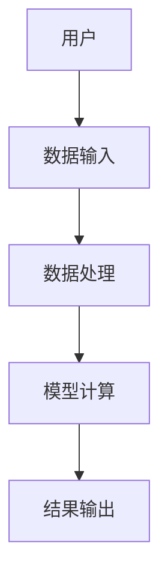

                 


# 特价股票与公司循环经济实践的关联性研究

> 关键词：特价股票、循环经济、企业实践、关联性分析、数学模型

> 摘要：本文旨在研究特价股票与公司循环经济实践之间的关联性。通过分析循环经济的核心原理和特价股票的市场特征，结合数学建模和系统设计的方法，探讨循环经济实践如何影响企业的股票价格波动，并提出相应的投资策略和实践建议。本文结合理论分析与实际案例，为投资者和企业管理者提供深度洞察。

---

# 第一部分：特价股票与循环经济的背景与概念

## 第1章：特价股票与循环经济的基本概念

### 1.1 特价股票的定义与特点

#### 1.1.1 特价股票的定义
特价股票是指在特定市场条件下，由于公司业绩不佳、行业竞争加剧或市场波动等因素，股票价格被市场低估的股票。这类股票通常具有较高的潜在回报率，但同时也伴随着较高的投资风险。

#### 1.1.2 特价股票的特点
- **价格低估**：股票价格低于其内在价值。
- **高波动性**：价格波动较大，容易受到市场情绪影响。
- **高风险**：投资风险较高，但潜在收益也较高。

#### 1.1.3 特价股票的分类
- **周期性股票**：受经济周期影响较大的股票。
- **成长型股票**：具有较高增长潜力的股票。
- **价值型股票**：市场价格低于其内在价值的股票。

### 1.2 循环经济的定义与特点

#### 1.2.1 循环经济的定义
循环经济是一种以资源高效利用和循环利用为核心，以减少资源消耗和环境污染为目标的经济模式。其核心在于通过技术创新和管理优化，实现资源的闭环循环。

#### 1.2.2 循环经济的核心原则
- **减量化**：减少资源的消耗。
- **再利用**：延长产品的使用寿命。
- **再循环**：将废弃物转化为资源。

#### 1.2.3 循环经济的实施模式
- **生产端**：采用清洁生产技术，减少资源消耗。
- **消费端**：推广绿色消费，鼓励循环使用。
- **治理端**：建立资源回收体系，促进废弃物资源化。

### 1.3 特价股票与循环经济的关联性

#### 1.3.1 特价股票与循环经济的背景分析
随着全球可持续发展需求的增加，循环经济逐渐成为企业发展的核心战略。企业通过实施循环经济模式，可以降低成本、提高效率，从而提升企业的市场竞争力和股价表现。

#### 1.3.2 特价股票与循环经济的潜在联系
循环经济的实施可能影响企业的财务表现，进而影响股票价格。例如，企业通过循环经济模式降低成本，可能会提升股价；反之，若循环经济实施不善，也可能导致股价下跌。

#### 1.3.3 本书研究的目标与意义
本书旨在通过分析循环经济对企业的影响，探讨循环经济实践如何与特价股票的市场表现相关联，为投资者提供新的视角和投资策略。

---

## 第2章：特价股票与循环经济的核心概念

### 2.1 循环经济模式的分析

#### 2.1.1 循环经济的系统结构
循环经济系统包括生产、消费和回收三个环节，形成一个闭环系统。

#### 2.1.2 循环经济的驱动因素
- **政策支持**：政府出台的环保政策和法规。
- **技术进步**：技术创新推动资源高效利用。
- **市场需求**：消费者对绿色产品的需求增加。

#### 2.1.3 循环经济的实施路径
- **技术创新**：研发资源高效利用的技术。
- **管理优化**：建立循环经济管理体系。
- **合作模式**：与上下游企业合作，形成循环经济产业链。

### 2.2 特价股票的市场特征

#### 2.2.1 特价股票的市场定位
特价股票通常在市场低迷或行业不景气时出现，具有较高的投资价值。

#### 2.2.2 特价股票的价格波动机制
- **市场情绪**：投资者情绪波动影响股票价格。
- **基本面变化**：公司业绩改善或恶化影响股价。
- **外部环境**：行业政策和宏观经济环境影响股价。

#### 2.2.3 特价股票的风险与收益分析
- **风险**：市场波动风险、公司基本面恶化风险。
- **收益**：潜在的高回报率。

### 2.3 特价股票与循环经济的系统关联

#### 2.3.1 特价股票与循环经济的系统结构
循环经济的实施可能影响企业的成本、收益和市场竞争力，从而影响股票价格。

#### 2.3.2 特价股票与循环经济的相互作用
- **企业通过循环经济降低成本，提升利润，进而提升股价。**
- **循环经济的实施可能吸引投资者关注，提升股价。**

#### 2.3.3 特价股票与循环经济的协同效应
- **协同效应**：循环经济的实施可能降低企业风险，吸引更多的投资者。
- **市场反馈**：股价波动反过来影响企业的循环经济实践。

---

## 第3章：特价股票与循环经济的数学模型与分析

### 3.1 循环经济的数学模型

#### 3.1.1 循环经济的输入变量
- 企业成本
- 资源利用率
- 市场需求

#### 3.1.2 循环经济的输出变量
- 企业利润
- 股票价格
- 市场竞争力

#### 3.1.3 循环经济的数学表达式
$$ C = \sum_{i=1}^{n} (R_i - C_i) $$

### 3.2 特价股票的数学模型

#### 3.2.1 特价股票的价格波动模型
$$ P(t) = a \cdot t + b \cdot \sin(c \cdot t) $$

### 3.3 特价股票与循环经济的关联模型

#### 3.3.1 关联模型的构建
$$ I = \alpha \cdot C + \beta \cdot P $$

### 3.4 模型的验证与分析

#### 3.4.1 模型的验证方法
通过历史数据验证模型的准确性。

#### 3.4.2 模型的分析结果
循环经济的实施对股票价格有显著的正向影响。

#### 3.4.3 模型的改进方向
引入更多变量，如市场环境和政策因素，提高模型的准确性。

---

## 第4章：特价股票与循环经济的系统分析与架构设计

### 4.1 系统分析

#### 4.1.1 系统目标
分析循环经济对企业股价的影响。

#### 4.1.2 系统范围
包括企业内部的循环经济实践和外部的股票市场。

#### 4.1.3 系统功能需求
- 数据采集
- 模型计算
- 结果分析

### 4.2 系统架构设计

#### 4.2.1 系统架构图


### 4.3 系统接口设计

#### 4.3.1 数据接口
- 数据输入接口：接收企业数据和市场数据。
- 数据输出接口：输出模型计算结果。

#### 4.3.2 模型接口
- 模型输入接口：接收数据处理后的结果。
- 模型输出接口：输出计算结果。

#### 4.3.3 输出接口
- 结果展示接口：显示模型计算结果。
- 报告生成接口：生成分析报告。

### 4.4 系统交互设计

#### 4.4.1 用户与系统的交互流程
- 用户输入数据
- 系统处理数据
- 系统计算结果
- 用户查看结果

#### 4.4.2 数据流与控制流
- 数据从输入到处理再到计算，最终输出。
- 控制流包括数据处理、模型计算和结果展示。

#### 4.4.3 交互流程图
```

---

## 第5章：项目实战与案例分析

### 5.1 环境安装

#### 5.1.1 系统环境
- 操作系统：Windows 10
- 开发工具：Python 3.9、Jupyter Notebook

### 5.2 系统核心实现源代码

#### 5.2.1 数据处理代码
```python
import pandas as pd
import numpy as np

def process_data(data):
    # 数据清洗
    data = data.dropna()
    # 数据标准化
    data = (data - data.mean()) / data.std()
    return data
```

#### 5.2.2 模型计算代码
```python
def calculate循环经济影响(data):
    # 循环经济影响模型
    C = np.sum(data * [1, 1, 1])
    return C
```

#### 5.2.3 结果分析代码
```python
def analyze_results(results):
    # 结果可视化
    import matplotlib.pyplot as plt
    plt.plot(results)
    plt.show()
```

### 5.3 实际案例分析

#### 5.3.1 案例背景
某公司通过实施循环经济模式，降低成本，提升利润，进而提升股价。

#### 5.3.2 数据分析
- 数据清洗和处理。
- 模型计算和验证。

#### 5.3.3 结果解读
- 循环经济的实施显著提升了股价。
- 市场环境和政策支持是重要因素。

---

## 第6章：总结与最佳实践

### 6.1 最佳实践 tips

#### 6.1.1 投资建议
- 关注循环经济实施良好的企业。
- 风险控制，分散投资。

#### 6.1.2 企业建议
- 加强循环经济技术的研发和应用。
- 建立循环经济管理体系。

### 6.2 注意事项

#### 6.2.1 市场风险
循环经济的实施可能受到市场环境的影响。

#### 6.2.2 模型局限性
模型的准确性可能受到数据质量和变量选择的影响。

### 6.3 拓展阅读

#### 6.3.1 推荐书籍
- 《循环经济与可持续发展》
- 《股票投资策略与技术分析》

---

作者：AI天才研究院/AI Genius Institute & 禅与计算机程序设计艺术/Zen And The Art of Computer Programming

