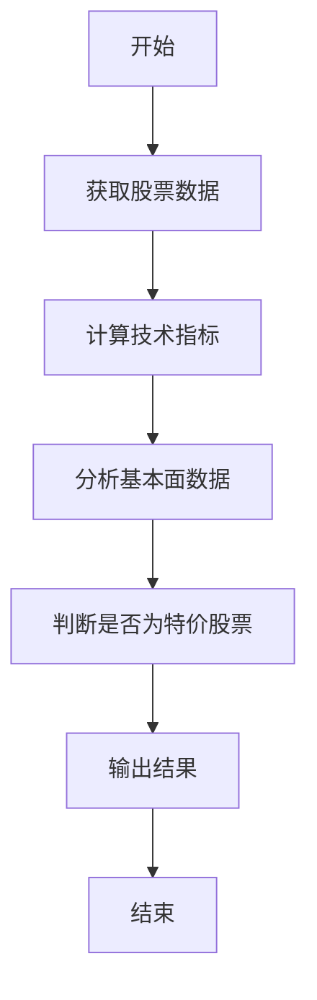
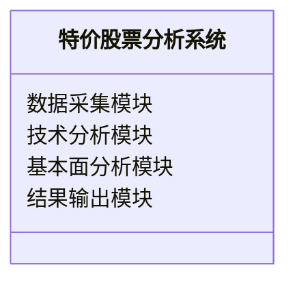
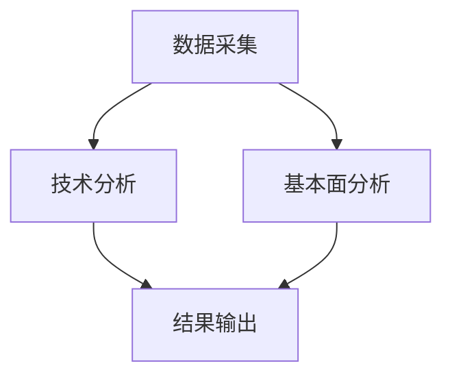

                 


# 特价股票与公司敏捷创新文化的深度分析方法

## 关键词：特价股票，敏捷创新文化，股票分析，创新管理，算法，系统架构，项目实战

## 摘要：
本文探讨了如何将敏捷创新文化应用于特价股票的分析与投资决策中。通过结合技术分析方法、数学模型、系统架构设计和项目实战，文章深入剖析了敏捷创新文化在金融领域的应用潜力，为投资者和企业提供了一种高效的方法论。

---

# 第1章: 特价股票与敏捷创新文化概述

## 1.1 特价股票的定义与背景
### 1.1.1 特价股票的定义
特价股票指的是市场价格低于其内在价值的股票，通常由于市场波动、公司困境或投资者情绪影响而被低估。

### 1.1.2 特价股票的市场背景
在经济波动或市场低迷时期，许多优质公司因暂时性问题导致股价下跌，为投资者提供了抄底的机会。

### 1.1.3 特价股票的投资价值
投资特价股票意味着以较低价格买入优质资产，能够在市场回升时获得超额收益。

## 1.2 敏捷创新文化的定义与特点
### 1.2.1 敏捷创新文化的定义
敏捷创新文化是一种以快速响应变化、灵活调整策略和持续创新为核心的企业文化，强调团队协作、迭代开发和用户反馈。

### 1.2.2 敏捷创新的核心特点
- 快速迭代：通过小步快跑的方式，快速验证假设并调整策略。
- 团队协作：强调跨部门合作，鼓励知识共享。
- 用户中心：以用户需求为导向，快速响应市场变化。

### 1.2.3 敏捷创新与传统创新的区别
| 特性         | 敏捷创新               | 传统创新               |
|--------------|-----------------------|------------------------|
| 理论基础     | 精益思想、敏捷开发     | 经验主义、渐进式发展   |
| 迭代速度     | 快速迭代               | 长周期、逐步推进       |
| 组织结构     | 扁平化、团队自治       | 垂直式、层级分明       |

## 1.3 特价股票与敏捷创新文化的关系
### 1.3.1 特价股票分析的敏捷方法
通过敏捷方法，投资者可以快速分析市场变化，及时捕捉特价股票的机会。

### 1.3.2 敏捷创新文化对投资决策的影响
敏捷文化强调快速响应和灵活调整，帮助投资者在市场变化中做出更明智的决策。

### 1.3.3 两者的结合与应用
通过敏捷文化指导投资策略，投资者能够更高效地识别和利用特价股票的机会。

## 1.4 本章小结
本章介绍了特价股票和敏捷创新文化的定义、特点及其关系，为后续分析奠定了基础。

---

# 第2章: 特价股票分析的核心概念

## 2.1 特价股票分析的背景介绍
### 2.1.1 问题背景
市场波动导致股票价格偏离其真实价值，投资者需要一种高效的方法来识别特价股票。

### 2.1.2 问题描述
如何在市场中快速识别被低估的股票，同时应对市场的快速变化。

### 2.1.3 问题解决方法
引入敏捷分析方法，结合技术分析和基本面分析，快速定位特价股票。

## 2.2 核心概念与联系
### 2.2.1 核心概念原理
特价股票分析需要结合技术指标和基本面数据，通过敏捷方法快速筛选目标。

### 2.2.2 概念属性特征对比表格
| 属性       | 技术分析          | 基本面分析          |
|------------|------------------|---------------------|
| 数据来源   | 历史价格数据      | 公司财务报表        |
| 分析目标   | 价格波动趋势      | 公司盈利能力        |
| 方法特点   | 短期预测          | 长期价值判断        |

### 2.2.3 ER实体关系图架构的Mermaid流程图
```mermaid
erd
    entity 特价股票 {
        id
        股票代码
        股票名称
        当前价格
        内在价值
    }
    entity 技术分析指标 {
        id
        股票代码
        移动平均线
        相对强弱指数
    }
    entity 基本面指标 {
        id
        股票代码
        净利润
        营业收入
    }
```

## 2.3 本章小结
本章通过分析技术指标和基本面数据，结合敏捷方法，帮助投资者快速识别特价股票。

---

# 第3章: 敏捷创新文化的核心要素

## 3.1 敏捷创新文化的背景介绍
### 3.1.1 问题背景
企业面临快速变化的市场环境，需要一种灵活高效的文化来应对挑战。

### 3.1.2 问题描述
传统管理方法难以适应市场的快速变化，企业需要更灵活的创新方式。

### 3.1.3 问题解决方法
引入敏捷文化，通过快速迭代和持续创新来应对市场变化。

## 3.2 核心概念与联系
### 3.2.1 核心概念原理
敏捷文化强调快速响应、小步快跑和持续改进，帮助企业在变化中保持竞争力。

### 3.2.2 概念属性特征对比表格
| 属性       | 敏捷文化          | 传统文化          |
|------------|------------------|------------------|
| 管理方式   | 迭代式           | 项目式           |
| 决策风格   | 去中心化         | 中央集权         |
| 反馈机制   | 实时反馈         | 定期评估         |

### 3.2.3 ER实体关系图架构的Mermaid流程图
```mermaid
erd
    entity 敏捷团队 {
        id
        团队成员
        项目目标
        迭代周期
    }
    entity 传统团队 {
        id
        团队成员
        项目目标
        项目阶段
    }
```

## 3.3 本章小结
本章分析了敏捷创新文化的核心要素及其与传统管理方式的对比，为后续分析提供了理论基础。

---

# 第4章: 特价股票分析的算法原理

## 4.1 算法原理讲解
### 4.1.1 算法mermaid流程图


### 4.1.2 算法原理的数学模型和公式
股票价格预测的数学模型：
$$ P(t) = \alpha P(t-1) + \beta D(t) + \epsilon $$
其中，$P(t)$为当前价格，$D(t)$为技术指标，$\alpha$和$\beta$为权重，$\epsilon$为误差项。

### 4.1.3 通俗易懂的举例说明
假设某股票的历史价格为10元，技术指标显示超卖，基本面显示净利润增长，预测该股票为特价股票。

## 4.2 数学模型和数学公式
### 4.2.1 数学模型的详细讲解
相对强弱指数（RSI）计算公式：
$$ RSI = \frac{100}{1 + \frac{A}{B}} $$
其中，$A$为上涨幅度，$B$为下跌幅度。

### 4.2.2 举例说明
若某股票的A=5，B=3，则RSI=100/(1+5/3)=60。

### 4.2.3 算法原理的代码实现
```python
def calculate_rsi(prices, period=14):
    # 计算涨跌幅度
    up = [max(0, prices[i] - prices[i-1]) for i in range(1, len(prices))]
    down = [max(0, prices[i-1] - prices[i]) for i in range(1, len(prices))]
    # 计算平均值
    average_up = sum(up[:period]) / period
    average_down = sum(down[:period]) / period
    # 计算RSI
    rsi = 100 * (average_up / (average_up + average_down))
    return rsi
```

## 4.3 本章小结
本章通过数学模型和算法流程，详细讲解了特价股票分析的原理和实现方法。

---

# 第5章: 特价股票分析

## 5.1 系统架构设计
### 5.1.1 系统功能设计


### 5.1.2 系统架构设计


## 5.2 项目实战
### 5.2.1 环境安装
安装Python、Pandas、Matplotlib等库。

### 5.2.2 核心代码实现
```python
import pandas as pd
import matplotlib.pyplot as plt

def analyze_stock(ticker):
    # 获取数据
    data = pd.read_csv(f'data/{ticker}.csv')
    # 计算RSI
    rsi = calculate_rsi(data['Close'])
    # 绘制图表
    plt.plot(data['Date'], rsi)
    plt.title(f'{ticker} RSI Analysis')
    plt.show()
```

### 5.2.3 案例分析
以某股票为例，分析其RSI指标，并判断是否为特价股票。

## 5.3 本章小结
本章通过系统架构设计和项目实战，展示了如何在实际中应用敏捷创新文化进行特价股票分析。

---

# 第6章: 总结与展望

## 6.1 本章总结
本文结合敏捷创新文化，探讨了特价股票的分析方法，提供了系统的解决方案。

## 6.2 未来展望
未来可以进一步研究敏捷文化在金融领域的更多应用，优化分析模型，提升投资决策的效率和准确性。

---

# 作者：AI天才研究院/AI Genius Institute & 禅与计算机程序设计艺术 /Zen And The Art of Computer Programming

---

通过以上内容，文章详细分析了特价股票与敏捷创新文化的深度关联，并提供了系统的分析方法和实践指导。

