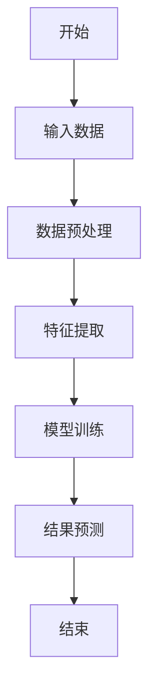
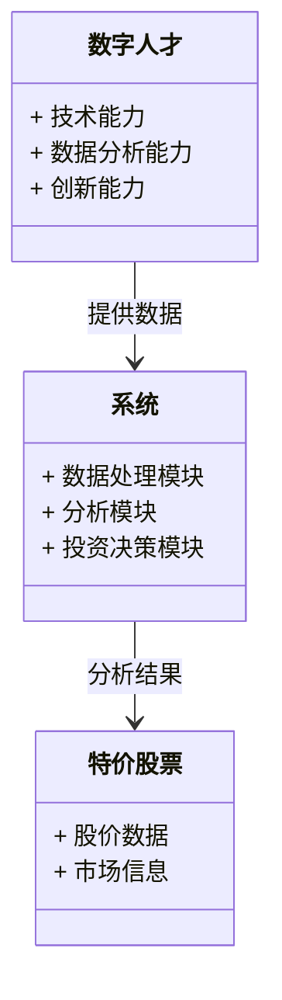
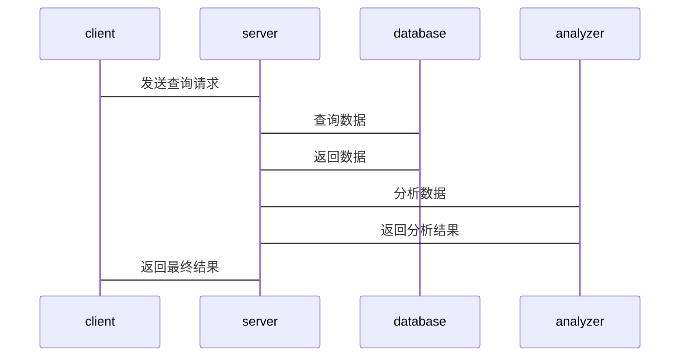

                 


# 特价股票与公司数字人才创新能力的关系探讨

## 关键词：
特价股票、数字人才、创新能力、数据分析、技术能力、企业绩效、市场机制

## 摘要：
本文探讨了特价股票与公司数字人才创新能力之间的关系，分析了数字人才如何通过其数据分析和技术能力影响公司的创新能力，从而影响公司在特价股票市场中的表现。文章从背景介绍、核心概念、算法原理、系统分析、项目实战等多个维度展开，深入剖析了数字人才在提升公司创新能力中的关键作用，并通过实际案例和数学模型进行了详细阐述。

---

# 目录

1. 特价股票与公司数字人才创新能力的背景介绍  
   1.1 特价股票的基本概念  
   1.2 数字人才的核心能力  
   1.3 特价股票与数字人才创新能力的关系  

2. 数字人才创新能力的核心概念与联系  
   2.1 数字人才创新能力的原理  
   2.2 核心概念属性特征对比表格  
   2.3 ER实体关系图  

3. 数字人才创新能力的算法原理与数学模型  
   3.1 算法原理概述  
   3.2 算法流程图  
   3.3 数学模型与公式  

4. 数字人才创新能力的系统分析与架构设计  
   4.1 问题场景介绍  
   4.2 系统功能设计（领域模型类图）  
   4.3 系统架构设计（架构图）  
   4.4 系统接口设计与交互序列图  

5. 数字人才创新能力的项目实战  
   5.1 环境安装与数据准备  
   5.2 系统核心实现源代码  
   5.3 代码应用解读与实际案例分析  

6. 数字人才创新能力的最佳实践与挑战  
   6.1 小结  
   6.2 注意事项  
   6.3 拓展阅读  

---

## 第一章：特价股票与公司数字人才创新能力的背景介绍

### 1.1 特价股票的基本概念

#### 1.1.1 特价股票的定义与特点
- 特价股票通常指价格较低的股票，具有高波动性和高风险的特点。
- 这类股票通常来自小市值公司或处于困境中的企业，但潜在回报较高。

#### 1.1.2 特价股票的市场机制
- 特价股票的交易机制包括竞价交易、限价单、市价单等。
- 市场参与者包括散户、机构投资者和做市商。

#### 1.1.3 特价股票的分类与应用场景
- 按照行业分类：科技、金融、制造业等。
- 按照市值分类：小盘股、中盘股、大盘股。

### 1.2 数字人才的核心能力

#### 1.2.1 数字人才的定义与特征
- 数字人才是指具备数据分析、人工智能、编程等数字化技能的人才。
- 其核心特征包括技术能力、创新能力和数据分析能力。

#### 1.2.2 数字人才的能力模型
- 技术能力：编程、算法设计、系统架构。
- 数据分析能力：数据清洗、建模、可视化。
- 创新能力：解决问题的新方法、新技术的应用。

#### 1.2.3 数字人才在企业中的角色与价值
- 数字人才是企业数字化转型的核心驱动力。
- 他们通过技术创新和数据分析提升企业绩效。

### 1.3 特价股票与数字人才创新能力的关系

#### 1.3.1 问题背景与问题描述
- 特价股票市场存在信息不对称和高风险。
- 数字人才可以通过技术手段优化投资策略。

#### 1.3.2 问题解决的思路与方法
- 利用大数据分析技术筛选潜在的特价股票。
- 通过算法优化投资组合，降低风险。

#### 1.3.3 关系的边界与外延
- 数字人才创新能力影响企业对特价股票的投资决策。
- 技术创新可以提升企业在特价股票市场的竞争力。

#### 1.3.4 核心概念结构与要素组成
- 核心要素包括数字人才、创新能力、特价股票、市场机制。

---

## 第二章：数字人才创新能力的核心概念与联系

### 2.1 数字人才创新能力的原理

#### 2.1.1 数字人才创新能力的定义
- 数字人才创新能力是指数字人才通过技术手段提升企业创新能力的能力。

#### 2.1.2 数字人才创新能力的构成要素
- 数据分析能力、技术创新能力、团队协作能力。

#### 2.1.3 数字人才创新能力与企业绩效的关系
- 数字人才创新能力越强，企业绩效越好。

### 2.2 核心概念属性特征对比表格

| 核心概念 | 定义 | 特性 | 影响 |
|----------|------|------|------|
| 数字人才 | 具备数字化技能的人才 | 技术能力、创新能力 | 提升企业绩效 |
| 特价股票 | 价格较低的股票 | 高波动性、高风险 | 潜在回报高 |

### 2.3 ER实体关系图

```mermaid
er
actor: 数字人才
ability: 创新能力
company: 公司
stakeholder: 利益相关者
关系:
actor -o> ability: 拥有
company -o> actor: 雇佣
company -o> ability: 影响
stakeholder -o> ability: 依赖
```

---

## 第三章：数字人才创新能力的算法原理与数学模型

### 3.1 算法原理概述

#### 3.1.1 算法的输入与输出
- 输入：历史股价数据、市场信息。
- 输出：投资建议、股票筛选结果。

#### 3.1.2 算法的步骤与流程



### 3.2 数学模型与公式

#### 3.2.1 模型的数学表达
$$ y = f(x) $$

其中，$x$ 是输入数据，$y$ 是预测结果。

#### 3.2.2 模型的优化
通过梯度下降优化模型参数：
$$ \theta = \theta - \alpha \nabla J(\theta) $$

---

## 第四章：数字人才创新能力的系统分析与架构设计

### 4.1 问题场景介绍
- 针对特价股票市场，设计一个基于数字人才能力的分析系统。

### 4.2 系统功能设计（领域模型类图）



### 4.3 系统架构设计（架构图）


### 4.4 系统接口设计与交互序列图



---

## 第五章：数字人才创新能力的项目实战

### 5.1 环境安装与数据准备
- 环境：Python 3.8，安装库如pandas、numpy、scikit-learn。
- 数据：历史股价数据、市场信息数据。

### 5.2 系统核心实现源代码

```python
import pandas as pd
from sklearn.model_selection import train_test_split
from sklearn.linear_model import LinearRegression

# 数据加载与预处理
data = pd.read_csv('stock_data.csv')
X = data[['volume', 'market_cap']]
y = data['price']
X_train, X_test, y_train, y_test = train_test_split(X, y, test_size=0.2)

# 模型训练
model = LinearRegression()
model.fit(X_train, y_train)

# 模型预测
predictions = model.predict(X_test)
print('预测结果:', predictions)
```

### 5.3 代码应用解读与实际案例分析
- 代码实现了一个简单的线性回归模型，用于预测股票价格。
- 实际案例中，数字人才可以利用该模型优化投资策略，选择合适的特价股票。

---

## 第六章：数字人才创新能力的最佳实践与挑战

### 6.1 小结
数字人才创新能力是企业在特价股票市场中取得竞争优势的关键。通过技术手段和数据分析，数字人才可以显著提升企业的创新能力。

### 6.2 注意事项
- 数据质量：确保数据的准确性和完整性。
- 技术选型：选择合适的算法和工具。
- 团队协作：加强跨部门合作。

### 6.3 拓展阅读
- 《数据驱动的投资决策》
- 《人工智能在金融领域的应用》

---

## 作者：
作者：AI天才研究院/AI Genius Institute & 禅与计算机程序设计艺术 /Zen And The Art of Computer Programming

