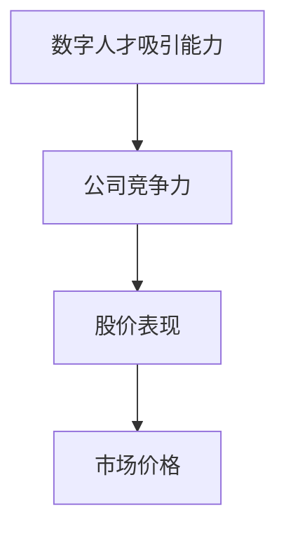
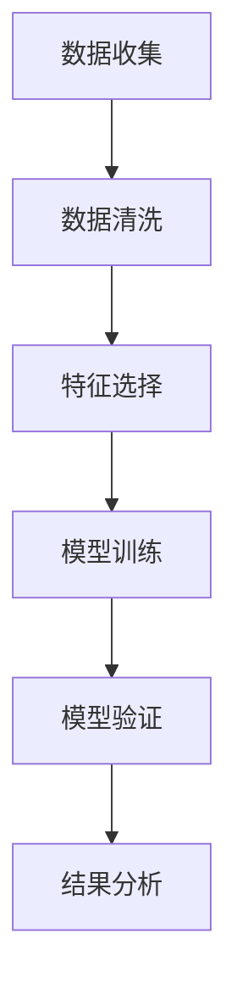
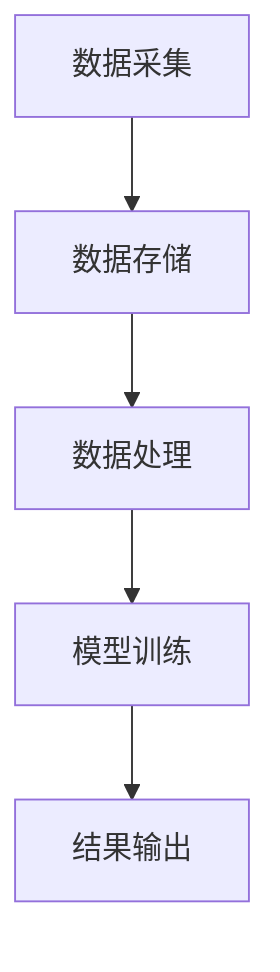
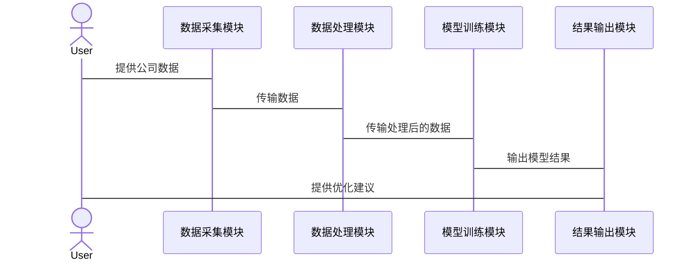

                 


# 特价股票与公司数字人才吸引与保留能力的关系探讨

## 关键词：
- 特价股票
- 数字人才
- 人才吸引
- 人才保留
- 公司能力
- 市场分析
- 数学模型

## 摘要：
本文探讨了特价股票与公司数字人才吸引与保留能力之间的关系。通过分析特价股票的市场表现、数字人才的特征以及两者之间的相互影响，构建了数学模型，并提出了优化策略。文章结合实际案例和数据，为公司提升数字人才吸引与保留能力提供了理论支持和实践指导。

---

## 第一部分: 特价股票与公司数字人才吸引能力的关系概述

### 第1章: 特价股票的基本概念与市场分析

#### 1.1 特价股票的定义与特征
##### 1.1.1 特价股票的定义
特价股票是指市场价格低于其内在价值的股票，通常被视为被市场低估的投资标的。这类股票往往具有较高的潜在回报，但同时也伴随着较高的风险。

##### 1.1.2 特价股票的核心特征
- **低估值**：市场价格低于行业平均水平或历史平均水平。
- **高潜力**：公司基本面良好，具有增长潜力。
- **波动性**：市场价格波动较大，容易受到市场情绪影响。

##### 1.1.3 特价股票的市场表现与投资价值
特价股票的投资价值取决于其内在价值与市场价格的差异。投资者通常通过基本面分析、技术分析等方法来判断其投资价值。

#### 1.2 数字人才吸引能力的定义与评估
##### 1.2.1 数字人才的定义
数字人才是指具备数字技术相关技能，能够适应数字化转型需求的人才。这类人才通常包括数据科学家、软件开发人员、人工智能工程师等。

##### 1.2.2 数字人才吸引能力的核心要素
- **薪酬福利**：具有竞争力的薪资和福利。
- **职业发展**：提供清晰的职业晋升路径。
- **企业文化**：公司文化与员工价值观匹配。
- **技术创新**：公司技术实力强，能够吸引技术人才。

##### 1.2.3 数字人才吸引能力的评估指标
- **招聘效率**：招聘周期、招聘成本等。
- **人才质量**：入职人员的技能水平、工作经验等。
- **员工留存率**：员工在公司内的留存情况。

#### 1.3 特价股票与数字人才吸引能力的关系模型
##### 1.3.1 关系模型的构建
特价股票与数字人才吸引能力之间存在间接关系。公司吸引数字人才的能力会影响其整体竞争力，进而影响股价表现。

##### 1.3.2 模型的核心要素与相互作用
- **公司基本面**：包括财务状况、技术创新能力等。
- **人才吸引能力**：包括薪酬、职业发展机会等。
- **股价表现**：包括市场价格、波动性等。

##### 1.3.3 模型的边界与外延
模型主要关注公司内部因素对股价的影响，同时也考虑外部市场环境的变化。

---

### 第2章: 特价股票与数字人才吸引能力的核心概念与联系

#### 2.1 特价股票的核心概念原理
##### 2.1.1 特价股票的市场定位
特价股票通常在市场低迷或公司遇到短期困难时出现。投资者需要识别这些股票的潜在价值。

##### 2.1.2 特价股票的投资价值评估
通过基本面分析（如市盈率、市净率等）和技术分析（如K线图、均线等）来评估其投资价值。

##### 2.1.3 特价股票的市场波动与投资者行为
投资者情绪、市场环境等因素会影响特价股票的市场价格波动。

#### 2.2 数字人才吸引能力的核心概念原理
##### 2.2.1 数字人才的技能特征
数字人才通常具备技术技能（如编程、数据分析）和软技能（如团队合作、创新思维）。

##### 2.2.2 数字人才吸引能力的驱动因素
- **薪酬福利**：具有竞争力的薪资和福利。
- **职业发展机会**：清晰的职业晋升路径和培训机会。
- **企业文化**：公司文化是否吸引人才。
- **技术创新**：公司是否具备技术创新能力。

##### 2.2.3 数字人才吸引能力的组织文化影响
良好的组织文化能够吸引和保留优秀数字人才。

#### 2.3 特价股票与数字人才吸引能力的关系分析
##### 2.3.1 关系的内在逻辑
公司吸引数字人才的能力会影响其整体竞争力，进而影响股价表现。

##### 2.3.2 关系的特征对比
- **吸引能力**：吸引能力强的公司通常具有更高的股价。
- **市场表现**：公司股价波动与人才吸引能力密切相关。

##### 2.3.3 关系的实体关系图


---

## 第二部分: 特价股票与数字人才吸引能力的算法与数学模型

### 第3章: 特价股票与数字人才吸引能力的关系分析模型

#### 3.1 数据分析方法
##### 3.1.1 数据收集与处理
- **数据来源**：公司财务数据、股价数据、人才招聘数据等。
- **数据处理**：清洗、转换、标准化等。

##### 3.1.2 数据分析工具与方法
- **工具**：Python、R、Excel等。
- **方法**：回归分析、聚类分析、时间序列分析等。

##### 3.1.3 数据可视化与结果解读
- **工具**：Matplotlib、Seaborn、Tableau等。
- **结果解读**：通过可视化图表分析数据之间的关系。

#### 3.2 数学模型构建
##### 3.2.1 模型假设与变量定义
- **假设**：公司吸引数字人才的能力与股价表现正相关。
- **变量**：吸引能力（X）、股价表现（Y）。

##### 3.2.2 模型构建过程
- **回归模型**：建立线性回归模型，分析X对Y的影响。
- **公式**：
  $$ Y = \beta_0 + \beta_1 X + \epsilon $$

##### 3.2.3 模型的验证与优化
- **验证**：通过R²值、残差分析等方法验证模型的准确性。
- **优化**：引入更多变量（如公司规模、行业因素）进行模型优化。

#### 3.3 算法实现与流程图
##### 3.3.1 算法流程图


##### 3.3.2 算法实现代码
```python
import pandas as pd
import numpy as np
from sklearn.linear_model import LinearRegression
from sklearn.metrics import r2_score

# 数据加载
data = pd.read_csv('data.csv')

# 特征与目标变量分离
X = data[['吸引能力']]
y = data['股价表现']

# 模型训练
model = LinearRegression()
model.fit(X, y)

# 模型预测
y_pred = model.predict(X)

# 模型评估
r2 = r2_score(y, y_pred)
print(f"R² = {r2}")
```

##### 3.3.3 算法结果分析
- **回归系数**：吸引能力对股价表现的影响程度。
- **R²值**：模型的拟合优度。

---

### 第4章: 特价股票与数字人才吸引能力的关系数学模型

#### 4.1 系统分析与架构设计方案
##### 4.1.1 问题场景介绍
公司希望通过提升数字人才吸引能力来优化股价表现。

##### 4.1.2 系统功能设计
- **数据采集**：采集公司财务数据、股价数据、人才招聘数据等。
- **数据分析**：分析数据之间的关系，构建数学模型。
- **结果输出**：输出模型结果，提出优化策略。

##### 4.1.3 系统架构设计


##### 4.1.4 系统接口设计
- **输入接口**：接收公司数据。
- **输出接口**：输出模型结果和优化建议。

##### 4.1.5 系统交互序列图


---

### 第5章: 项目实战与案例分析

#### 5.1 环境安装与数据准备
##### 5.1.1 环境安装
- **工具安装**：安装Python、Pandas、Scikit-learn等工具。

##### 5.1.2 数据准备
- **数据来源**：选择一家公司，收集其股价数据、人才招聘数据等。

#### 5.2 核心实现与代码解读
##### 5.2.1 核心实现
```python
import pandas as pd
import numpy as np
from sklearn.linear_model import LinearRegression
from sklearn.metrics import r2_score

# 数据加载
data = pd.read_csv('data.csv')

# 特征与目标变量分离
X = data[['吸引能力']]
y = data['股价表现']

# 模型训练
model = LinearRegression()
model.fit(X, y)

# 模型预测
y_pred = model.predict(X)

# 模型评估
r2 = r2_score(y, y_pred)
print(f"R² = {r2}")
```

##### 5.2.2 代码解读
- **数据加载**：读取CSV文件中的数据。
- **特征选择**：选择“吸引能力”作为自变量。
- **模型训练**：使用线性回归模型进行训练。
- **模型评估**：计算R²值，评估模型的拟合优度。

#### 5.3 案例分析与结果解读
##### 5.3.1 案例分析
选择一家公司，分析其股价表现与数字人才吸引能力之间的关系。

##### 5.3.2 结果解读
- **回归系数**：吸引能力对股价表现的影响程度。
- **R²值**：模型的拟合优度。

#### 5.4 项目小结
通过案例分析，验证了模型的有效性，并提出了优化建议。

---

## 第三部分: 优化策略与结论

### 第6章: 优化策略与最佳实践

#### 6.1 提升数字人才吸引能力的策略
##### 6.1.1 提供有竞争力的薪酬福利
- 提供市场领先的薪资和福利。

##### 6.1.2 提供职业发展机会
- 提供清晰的职业晋升路径和培训机会。

##### 6.1.3 建设良好的企业文化
- 营造开放、包容的企业文化。

##### 6.1.4 加强技术创新能力
- 提升公司技术实力，吸引优秀人才。

#### 6.2 优化股价表现的策略
##### 6.2.1 提升公司基本面
- 优化财务状况，增强公司竞争力。

##### 6.2.2 加强投资者关系管理
- 提高公司透明度，增强投资者信心。

##### 6.2.3 利用市场波动
- 在市场低迷时寻找特价股票，提升股价表现。

### 第7章: 结论与展望

#### 7.1 研究结论
- 特价股票与数字人才吸引能力之间存在密切关系。
- 提升数字人才吸引能力能够优化公司竞争力，进而提升股价表现。

#### 7.2 未来研究方向
- 进一步研究市场环境对股价表现的影响。
- 探讨其他因素（如政策、经济环境）对数字人才吸引能力的影响。

---

## 作者：AI天才研究院 & 禅与计算机程序设计艺术

