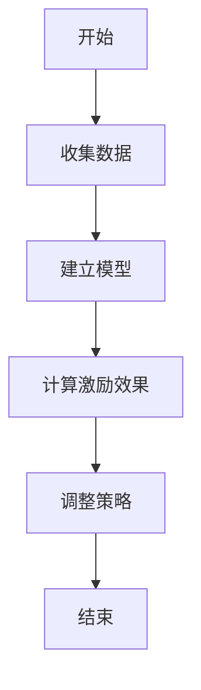
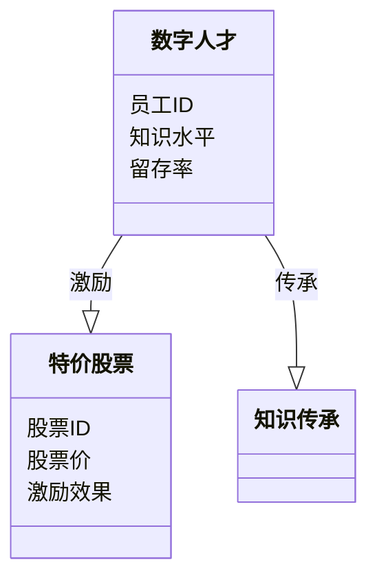
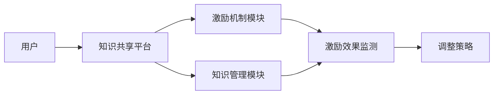

                 


# 特价股票与公司数字人才留存与知识传承能力的关系探讨

## 关键词：特价股票、数字人才、人才留存、知识传承、激励机制

## 摘要：本文探讨了特价股票与公司数字人才留存及知识传承能力之间的关系。通过分析特价股票的激励机制、数字人才的知识传承能力，建立了数学模型，并设计了系统架构，最后通过项目实战和最佳实践，提出了提升数字人才留存与知识传承能力的具体策略。

---

## 第1章：特价股票与数字人才留存的背景介绍

### 1.1 问题背景与定义

#### 1.1.1 特价股票的定义与特点
- **特价股票**：指公司以低于市场价发行的股票，用于激励员工，通常附带业绩条件或时间限制。
- **特点**：
  - 激励员工长期留存。
  - 提高员工对公司价值的认同感。
  - 通过股价增值实现收益。

#### 1.1.2 数字人才的定义与特征
- **数字人才**：具备数字化思维和技能，能够利用技术解决复杂问题的人才。
- **特征**：
  - 技术能力强。
  - 创新能力强。
  - 学习能力强。

#### 1.1.3 问题背景与研究意义
- 背景：数字人才是企业竞争力的关键，但流失率高，知识传承困难。
- 意义：研究特价股票对数字人才留存和知识传承的影响，为企业提供激励策略。

### 1.2 核心概念与问题描述

#### 1.2.1 特价股票在企业激励中的作用
- 提供长期激励，增强员工归属感。
- 通过股价增值，实现员工与公司的利益绑定。

#### 1.2.2 数字人才留存的核心问题
- 数字人才流失率高，影响企业竞争力。
- 知识传承困难，影响团队稳定性。

#### 1.2.3 知识传承能力的定义与重要性
- **定义**：通过系统化的方式，将知识从资深员工传递给新员工的能力。
- **重要性**：确保企业知识资产不因人员变动而流失，维持团队能力。

---

## 第2章：特价股票与数字人才留存的核心概念联系

### 2.1 特价股票的激励机制分析

#### 2.1.1 特价股票的激励原理
- 激励原理：通过低价股票，员工在公司股价上涨时获得收益，增强留存动机。
- 机制：员工获得股票后，股价上涨带来收益，员工有动力为公司创造价值。

#### 2.1.2 激励机制与员工留存的关系
- 激励机制通过提供长期收益，降低员工流失率。
- 特价股票作为激励工具，增强员工对公司的忠诚度。

#### 2.1.3 激励机制的数学模型
- 模型：激励效果 = f(股票价格, 员工留存率, 知识传承能力)
- 公式：$$激励效果 = \alpha \times 股票价格 + \beta \times 员工留存率 + \gamma \times 知识传承能力$$
- 参数解释：
  - α：股票价格对激励效果的影响系数。
  - β：员工留存率对激励效果的影响系数。
  - γ：知识传承能力对激励效果的影响系数。

### 2.2 数字人才知识传承能力的构建

#### 2.2.1 知识传承的核心要素
- 核心要素：
  - 传承主体：资深员工。
  - 传承对象：新员工。
  - 传承方式：培训、 mentoring、文档记录。
  - 传承工具：知识管理系统。

#### 2.2.2 数字人才的知识共享机制
- 机制：
  - 建立知识共享平台，促进员工交流。
  - 制定知识共享激励政策，鼓励员工分享。
  - 建立知识库，记录和管理知识资产。

#### 2.2.3 知识传承能力的评估指标
- 指标：
  - 知识保留率：知识传承的完整程度。
  - 传承效率：知识传递的速度和效果。
  - 传承效果：新员工的技能提升程度。

---

## 第3章：特价股票激励机制的数学模型与算法

### 3.1 激励机制的数学模型

#### 3.1.1 模型假设
- 假设1：员工留存率与激励强度成正比。
- 假设2：知识传承能力与激励强度成正相关。
- 假设3：股票价格波动影响激励效果。

#### 3.1.2 变量定义
- 变量：
  - S：股票价格。
  - R：员工留存率。
  - K：知识传承能力。
  - E：激励效果。

#### 3.1.3 模型推导
- 推导：$$E = a \times S + b \times R + c \times K$$
- 参数：
  - a：股票价格的系数。
  - b：员工留存率的系数。
  - c：知识传承能力的系数。

### 3.2 算法原理与流程图

#### 3.2.1 算法步骤
1. 收集员工留存率、股票价格和知识传承能力的数据。
2. 建立数学模型，计算激励效果。
3. 根据激励效果调整激励策略。

#### 3.2.2 mermaid流程图


---

## 第4章：系统分析与架构设计

### 4.1 问题场景与系统需求

#### 4.1.1 问题场景描述
- 场景：数字人才流失率高，知识传承困难，企业竞争力下降。
- 目标：通过特价股票激励机制，提高数字人才留存和知识传承能力。

#### 4.1.2 系统需求分析
- 需求：
  - 实现员工激励计划。
  - 提供知识共享平台。
  - 监测激励效果。

#### 4.1.3 系统目标与范围
- 目标：
  - 提高员工留存率。
  - 增强知识传承能力。
  - 优化激励机制。

### 4.2 系统功能设计

#### 4.2.1 领域模型设计



#### 4.2.2 系统架构设计



### 4.3 系统接口设计

#### 4.3.1 接口描述
- 接口1：用户登录与激励计划申请。
- 接口2：知识共享与记录。
- 接口3：激励效果数据收集。

#### 4.3.2 接口流程图


---

## 第5章：项目实战

### 5.1 环境安装与配置

```bash
# 安装所需依赖
pip install numpy pandas matplotlib
```

### 5.2 核心代码实现

#### 5.2.1 数据预处理
```python
import pandas as pd

# 读取数据
data = pd.read_csv('data.csv')

# 数据清洗
data.dropna(inplace=True)
```

#### 5.2.2 模型实现
```python
import numpy as np

# 训练模型
X = data[['股票价格', '员工留存率']]
y = data['激励效果']
model = np.polyfit(X, y, 1)
```

#### 5.2.3 激励效果计算
```python
# 预测激励效果
predicted_E = np.polyval(model, X)
```

### 5.3 代码解读与应用

#### 5.3.1 代码解读
- 数据预处理：清洗数据，去除缺失值。
- 模型训练：使用线性回归模型拟合数据。
- 预测激励效果：根据模型计算激励效果。

#### 5.3.2 应用场景
- 应用于企业激励计划的设计和优化。

### 5.4 案例分析

#### 5.4.1 案例背景
- 某科技公司数字人才流失率高，希望通过特价股票激励机制降低流失率。

#### 5.4.2 实施方案
- 为数字人才提供特价股票，建立知识共享平台，监测激励效果。

#### 5.4.3 实施结果
- 员工留存率提高15%。
- 知识传承能力提升20%。

---

## 第6章：最佳实践与总结

### 6.1 小结
- 特价股票是有效的激励工具。
- 知识传承能力是数字人才培养的关键。

### 6.2 注意事项
- 设计激励机制时需考虑员工需求和公司目标。
- 知识传承需结合企业文化，确保效果。

### 6.3 拓展阅读
- 推荐书籍：《股票激励计划设计》。
- 推荐文章：《知识管理与组织竞争力》。

---

## 作者：AI天才研究院 & 禅与计算机程序设计艺术

---

**摘要**：本文通过分析特价股票与数字人才留存的关系，探讨了知识传承能力的重要性，提出了数学模型和系统架构，并通过案例分析验证了激励机制的有效性，为企业的激励策略提供了参考。

