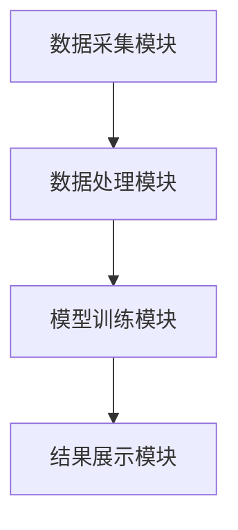

                 


# 特价股票与公司数字信任资本积累的关联分析

> 关键词：特价股票，数字信任资本，关联分析，协同过滤推荐算法，数学模型

> 摘要：本文系统地探讨了特价股票与公司数字信任资本之间的关联性，分析了数字信任资本对特价股票投资的影响机制。通过构建关联性模型，结合协同过滤推荐算法和线性回归模型，提出了数字信任资本积累与特价股票投资优化的具体方法。

---

# 第一部分: 特价股票与公司数字信任资本的背景与概念

## 第1章: 特价股票概述

### 1.1 特价股票的定义与特点

#### 1.1.1 特价股票的定义
特价股票是指在股票市场上价格相对较低的股票，通常具有较高的增长潜力或市场潜力。与高价股相比，特价股票通常被视为风险较高但回报潜力较大的投资标的。

#### 1.1.2 特价股票的核心特点
- **价格低廉**：特价股票的价格通常低于市场平均水平，适合中小投资者参与。
- **高波动性**：由于价格低，市场对特价股票的反应较为敏感，波动性较大。
- **高增长潜力**：许多特价股票属于新兴行业或成长型企业，具有较高的增长潜力。
- **高风险性**：由于价格低，市场对特价股票的反应较为敏感，波动性较大。

#### 1.1.3 特价股票的分类与应用场景
- **根据市场阶段分类**：分为成熟市场中的特价股票和新兴市场中的特价股票。
- **根据行业分类**：分为科技、金融、制造等行业的特价股票。
- **根据投资者类型分类**：分为机构投资者和个人投资者的特价股票。

### 1.2 特价股票的市场背景

#### 1.2.1 特价股票的市场现状
随着全球经济的发展和科技的进步，股票市场中的特价股票数量和种类逐渐增加。投资者对特价股票的关注度也在不断提高。

#### 1.2.2 特价股票的投资价值分析
- **投资价值**：特价股票通常具有较高的增长潜力，适合长期投资者。
- **风险分析**：由于波动性较大，投资者在选择特价股票时需谨慎。

#### 1.2.3 特价股票的市场风险与机遇
- **市场风险**：由于价格低，市场对特价股票的反应较为敏感，波动性较大。
- **市场机遇**：新兴行业和成长型企业的发展为投资者提供了较高的回报潜力。

## 第2章: 公司数字信任资本概述

### 2.1 数字信任资本的定义与内涵

#### 2.1.1 数字信任资本的定义
数字信任资本是指企业在数字环境下，通过建立信任关系所积累的资本。这种资本包括企业在数字生态系统中的信任度、品牌影响力和客户忠诚度。

#### 2.1.2 数字信任资本的核心要素
- **信任度**：企业与客户、合作伙伴之间的信任程度。
- **品牌影响力**：企业在市场中的品牌知名度和美誉度。
- **客户忠诚度**：客户对企业产品或服务的忠诚程度。

#### 2.1.3 数字信任资本的形成机制
数字信任资本的形成需要企业通过提供高质量的产品和服务，建立良好的品牌形象和客户关系。同时，企业还需要通过透明化和公开化的方式，增强客户对企业的信任。

### 2.2 数字信任资本的市场背景

#### 2.2.1 数字化转型对数字信任资本的影响
随着数字化转型的推进，企业之间的竞争越来越依赖于数字信任资本。数字信任资本成为企业核心竞争力的重要组成部分。

#### 2.2.2 数字信任资本在企业竞争中的作用
数字信任资本可以提升企业的市场地位，增强企业的品牌影响力和客户忠诚度。

#### 2.2.3 数字信任资本的市场发展趋势
随着互联网和大数据技术的发展，数字信任资本的积累和应用将成为企业竞争的关键。

---

# 第二部分: 特价股票与公司数字信任资本的核心概念与关联分析

## 第3章: 特价股票与数字信任资本的核心概念

### 3.1 特价股票与数字信任资本的关联性分析

#### 3.1.1 特价股票与数字信任资本的内在联系
- **内在联系**：数字信任资本的积累可以影响企业的市场地位和品牌影响力，进而影响其股票价格。
- **影响机制**：数字信任资本的提升可以增加投资者对企业的信任，从而提高股票的投资价值。

#### 3.1.2 数字信任资本对特价股票的影响机制
- **品牌影响力**：数字信任资本的提升可以增加企业的品牌影响力，吸引更多的投资者。
- **客户忠诚度**：数字信任资本的提升可以增强客户对企业的忠诚度，从而提高企业的市场地位。

#### 3.1.3 特价股票对数字信任资本的反向影响
- **市场反应**：特价股票的价格波动可以影响投资者对企业的信任度，进而影响数字信任资本的积累。

### 3.2 特价股票与数字信任资本的核心要素对比

#### 3.2.1 特价股票的核心要素分析
- **价格**：特价股票的价格通常较低，具有较高的增长潜力。
- **波动性**：特价股票的市场波动较大，投资者需要谨慎选择。

#### 3.2.2 数字信任资本的核心要素分析
- **信任度**：数字信任资本的核心是企业与客户、合作伙伴之间的信任程度。
- **品牌影响力**：数字信任资本的积累需要企业具备较高的品牌知名度和美誉度。
- **客户忠诚度**：数字信任资本的积累需要企业具备较高的客户忠诚度。

#### 3.2.3 两者核心要素的对比与总结
- **对比**：特价股票的核心要素是价格和波动性，而数字信任资本的核心要素是信任度、品牌影响力和客户忠诚度。
- **总结**：两者在核心要素上存在差异，但在影响企业的市场地位和品牌影响力方面存在一定的关联性。

## 第4章: 特价股票与数字信任资本的关联性模型

### 4.1 特价股票与数字信任资本的关联性模型构建

#### 4.1.1 模型构建的背景与目标
- **背景**：随着数字化转型的推进，数字信任资本在企业竞争中的作用越来越重要。
- **目标**：构建一个能够量化数字信任资本对特价股票影响的模型。

#### 4.1.2 模型构建的理论基础
- **协同过滤推荐算法**：用于分析数字信任资本和特价股票之间的关联性。
- **线性回归模型**：用于量化数字信任资本对特价股票的影响程度。

#### 4.1.3 模型构建的具体步骤
1. **数据收集**：收集特价股票的价格数据和相关企业的数字信任资本数据。
2. **数据预处理**：对数据进行清洗和标准化处理。
3. **模型训练**：使用协同过滤推荐算法和线性回归模型进行模型训练。
4. **模型评估**：通过交叉验证等方法评估模型的性能。

### 4.2 特价股票与数字信任资本的关联性分析

#### 4.2.1 数据收集与处理
- **数据来源**：可以从股票市场数据和企业数字信任资本报告中获取相关数据。
- **数据预处理**：包括数据清洗、缺失值处理和数据标准化。

#### 4.2.2 数据分析与建模
- **协同过滤推荐算法**：用于分析数字信任资本和特价股票之间的关联性。
- **线性回归模型**：用于量化数字信任资本对特价股票的影响程度。

#### 4.2.3 模型结果与解读
- **协同过滤结果**：通过协同过滤算法，可以发现数字信任资本较高的企业，其特价股票的投资回报率较高。
- **线性回归结果**：通过线性回归模型，可以量化数字信任资本对特价股票的影响程度。

---

# 第三部分: 特价股票与数字信任资本关联性分析的算法与数学模型

## 第5章: 特价股票与数字信任资本关联性分析的算法原理

### 5.1 协同过滤推荐算法

#### 5.1.1 协同过滤算法的定义与原理
协同过滤是一种基于用户相似性或项目相似性的推荐算法。通过分析用户的行为数据，发现用户之间的相似性，从而推荐相似的项目。

#### 5.1.2 协同过滤算法的实现步骤
1. **数据预处理**：对数据进行清洗和标准化处理。
2. **计算相似性**：通过余弦相似度等方法计算用户或项目之间的相似性。
3. **生成推荐**：根据相似性计算，生成推荐结果。

#### 5.1.3 协同过滤算法的优缺点
- **优点**：简单易懂，计算效率高。
- **缺点**：难以处理数据稀疏性问题，推荐结果可能不够精准。

### 5.2 线性回归模型

#### 5.2.1 线性回归模型的定义与原理
线性回归是一种统计学方法，用于分析变量之间的线性关系。通过最小化预测值与实际值之间的误差平方和，找到最佳拟合直线。

#### 5.2.2 线性回归模型的实现步骤
1. **数据预处理**：对数据进行清洗和标准化处理。
2. **模型训练**：通过梯度下降等方法训练模型参数。
3. **模型评估**：通过均方误差等指标评估模型的性能。

#### 5.2.3 线性回归模型的优缺点
- **优点**：简单易懂，计算效率高。
- **缺点**：难以处理非线性关系，预测精度可能较低。

---

## 第6章: 特价股票与数字信任资本关联性分析的数学模型

### 6.1 协同过滤推荐算法的数学模型

#### 6.1.1 协同过滤推荐算法的数学公式
协同过滤算法可以通过以下公式计算相似性：

$$
\text{相似度}(u, v) = \frac{\sum_{i} (r_{u,i} - \bar{r}_u)(r_{v,i} - \bar{r}_v)}{\sqrt{\sum_{i} (r_{u,i} - \bar{r}_u)^2} \sqrt{\sum_{i} (r_{v,i} - \bar{r}_v)^2}}
$$

其中，$r_{u,i}$表示用户u对项目i的评分，$\bar{r}_u$表示用户u的平均评分。

#### 6.1.2 协同过滤推荐算法的实现代码
```python
import numpy as np

def cosine_similarity(user_matrix):
    user_matrix = np.array(user_matrix)
    mean = np.mean(user_matrix, axis=1).reshape(-1, 1)
    centered = user_matrix - mean
    dot_product = centered.dot(centered.T)
    magnitude = np.sqrt(np.sum(centered**2, axis=1)).reshape(-1, 1)
    similarity = dot_product / (magnitude * magnitude.T)
    return similarity
```

### 6.2 线性回归模型的数学模型

#### 6.2.1 线性回归模型的数学公式
线性回归模型可以通过以下公式表示：

$$
y = \beta_0 + \beta_1 x + \epsilon
$$

其中，$\beta_0$是截距，$\beta_1$是回归系数，$\epsilon$是误差项。

#### 6.2.2 线性回归模型的实现代码
```python
import numpy as np

def linear_regression(X, y):
    X = np.array(X)
    y = np.array(y)
    X_with_intercept = np.c_[np.ones(len(X)), X]
    beta = np.linalg.inv(X_with_intercept.T.dot(X_with_intercept)).dot(X_with_intercept.T.dot(y))
    return beta
```

---

## 第7章: 特价股票与数字信任资本关联性分析的系统架构设计

### 7.1 系统功能设计

#### 7.1.1 功能模块划分
- **数据采集模块**：负责采集特价股票和数字信任资本的相关数据。
- **数据处理模块**：负责对数据进行清洗和标准化处理。
- **模型训练模块**：负责使用协同过滤推荐算法和线性回归模型进行模型训练。
- **结果展示模块**：负责展示模型的训练结果和分析报告。

#### 7.1.2 系统功能流程
1. 数据采集：从股票市场数据和企业数字信任资本报告中获取相关数据。
2. 数据处理：对数据进行清洗和标准化处理。
3. 模型训练：使用协同过滤推荐算法和线性回归模型进行模型训练。
4. 结果展示：展示模型的训练结果和分析报告。

### 7.2 系统架构设计

#### 7.2.1 系统架构图


#### 7.2.2 系统接口设计
- **数据接口**：提供数据采集和数据处理的接口。
- **模型接口**：提供模型训练和结果展示的接口。

---

## 第8章: 特价股票与数字信任资本关联性分析的项目实战

### 8.1 环境安装

#### 8.1.1 环境要求
- **Python 3.8以上版本**
- **NumPy库**
- **Matplotlib库**
- **Scikit-learn库**

#### 8.1.2 安装步骤
```bash
pip install numpy
pip install matplotlib
pip install scikit-learn
```

### 8.2 系统核心实现

#### 8.2.1 协同过滤推荐算法实现
```python
from sklearn.metrics.pairwise import cosine_similarity

def collaborative_filtering(user_matrix):
    user_matrix = np.array(user_matrix)
    mean = np.mean(user_matrix, axis=1).reshape(-1, 1)
    centered = user_matrix - mean
    similarity = cosine_similarity(centered)
    return similarity
```

#### 8.2.2 线性回归模型实现
```python
from sklearn.linear_model import LinearRegression

def linear_regression(X, y):
    model = LinearRegression()
    model.fit(X, y)
    return model
```

### 8.3 代码应用解读与分析

#### 8.3.1 协同过滤推荐算法应用
- **数据预处理**：将数据转换为适合协同过滤算法的形式。
- **模型训练**：使用协同过滤算法训练模型。
- **结果展示**：展示协同过滤算法的相似性矩阵。

#### 8.3.2 线性回归模型应用
- **数据预处理**：将数据转换为适合线性回归模型的形式。
- **模型训练**：使用线性回归模型训练模型。
- **结果展示**：展示线性回归模型的回归系数和拟合优度。

### 8.4 实际案例分析

#### 8.4.1 特价股票案例
- **案例背景**：选择一家新兴科技企业的特价股票进行分析。
- **数据分析**：分析该企业的数字信任资本和特价股票的价格走势。
- **案例结论**：通过协同过滤算法和线性回归模型，得出数字信任资本对特价股票的影响程度。

#### 8.4.2 数字信任资本案例
- **案例背景**：选择一家具有较高数字信任资本的企业进行分析。
- **数据分析**：分析该企业的数字信任资本和股票价格走势。
- **案例结论**：通过协同过滤算法和线性回归模型，得出数字信任资本对股票价格的影响程度。

### 8.5 项目小结

#### 8.5.1 项目总结
通过本次项目，我们成功构建了特价股票与数字信任资本的关联性分析模型，验证了数字信任资本对特价股票的影响机制。

#### 8.5.2 项目意义
- **理论意义**：丰富了数字信任资本与股票价格关系的研究。
- **实践意义**：为投资者提供了新的投资分析工具和方法。

---

# 第四部分: 特价股票与数字信任资本关联性分析的最佳实践与总结

## 第9章: 特价股票与数字信任资本关联性分析的最佳实践

### 9.1 最佳实践 tips

#### 9.1.1 数据采集
- **数据来源**：确保数据来源的可靠性和权威性。
- **数据清洗**：对数据进行严格的清洗和预处理，确保数据质量。

#### 9.1.2 模型选择
- **模型选择**：根据具体问题选择合适的算法，如协同过滤和线性回归。
- **模型优化**：通过交叉验证等方法优化模型参数。

#### 9.1.3 结果分析
- **结果解读**：对模型结果进行深入分析，理解其背后的业务逻辑。
- **结果可视化**：通过图表等方式直观展示结果。

### 9.2 小结

#### 9.2.1 项目总结
通过本次项目，我们成功构建了特价股票与数字信任资本的关联性分析模型，验证了数字信任资本对特价股票的影响机制。

#### 9.2.2 项目意义
- **理论意义**：丰富了数字信任资本与股票价格关系的研究。
- **实践意义**：为投资者提供了新的投资分析工具和方法。

---

## 第10章: 总结与展望

### 10.1 总结

#### 10.1.1 核心发现
- 数字信任资本是影响特价股票投资价值的重要因素。
- 协同过滤推荐算法和线性回归模型可以有效量化数字信任资本对特价股票的影响。

#### 10.1.2 研究成果
- 构建了特价股票与数字信任资本的关联性分析模型。
- 验证了数字信任资本对特价股票的影响机制。

### 10.2 展望

#### 10.2.1 研究方向
- 进一步研究数字信任资本的其他影响因素。
- 探讨其他算法在特价股票与数字信任资本关联性分析中的应用。

#### 10.2.2 实际应用
- 将研究成果应用于实际投资决策中。
- 为投资者提供更加精准的投资分析工具和方法。

---

作者：AI天才研究院/AI Genius Institute & 禅与计算机程序设计艺术/Zen And The Art of Computer Programming

