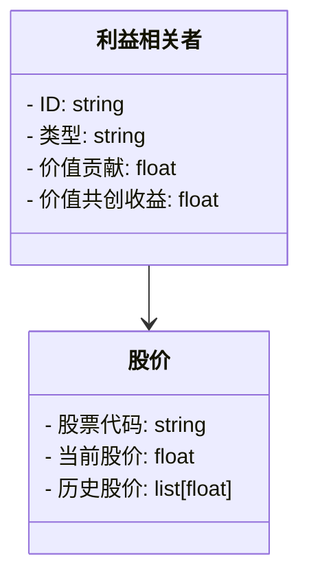
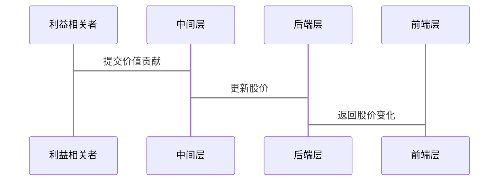

                 


# 特价股票与公司数字化利益相关者价值共创的关联性研究

> 关键词：特价股票、公司数字化、利益相关者、价值共创、关联性研究

> 摘要：本文探讨了特价股票与公司数字化利益相关者之间的关联性，分析了价值共创的机制及其对股价的影响。通过系统分析和案例研究，总结了特价股票与利益相关者价值共创的关联性，为投资者和企业管理者提供了理论支持和实践指导。

---

# 第1章：背景与概述

## 1.1 特价股票的定义与特征
### 1.1.1 特价股票的定义
特价股票是指市场价格低于其内在价值的股票，通常被视为被市场低估的投资机会。

### 1.1.2 特价股票的核心特征
- **低估值**：市盈率、市净率等指标低于行业平均水平。
- **高潜力**：公司基本面良好，具有较高的增长潜力。
- **市场关注度低**：通常被市场忽视或低估。

### 1.1.3 特价股票的市场表现
- **短期波动**：可能受市场情绪影响较大。
- **长期增长**：基本面良好的特价股票往往具有长期增值潜力。

## 1.2 公司数字化利益相关者的构成
### 1.2.1 利益相关者的定义
利益相关者是指与公司价值创造和实现相关的个人或组织，包括股东、客户、员工、供应商、政府等。

### 1.2.2 数字化利益相关者的特征
- **数据驱动**：利益相关者的决策基于数据分析。
- **实时互动**：通过数字化平台实现即时沟通与协作。
- **动态调整**：利益相关者能够快速响应市场变化。

### 1.2.3 利益相关者与公司数字化转型的关系
- **协同创新**：利益相关者共同推动数字化转型。
- **资源共享**：通过数字化平台实现资源的高效配置。
- **价值共创**：利益相关者共同参与价值创造过程。

## 1.3 特价股票与公司数字化利益相关者的关联性
### 1.3.1 特价股票对利益相关者的影响
- **股东价值提升**：特价股票的增值直接提升股东价值。
- **员工激励**：公司价值的提升可能增强员工的归属感和积极性。
- **客户信任**：公司数字化转型的成功可能增强客户对公司的信任。

### 1.3.2 利益相关者对特价股票的影响
- **信息透明**：利益相关者的信息共享可能影响股票价格。
- **市场信心**：利益相关者的积极参与可能增强市场对公司的信心。
- **风险管理**：利益相关者共同参与风险管理，降低公司风险。

## 1.4 本章小结
本章通过定义和分析特价股票与公司数字化利益相关者的特征，揭示了两者之间的关联性，为后续分析奠定了基础。

---

# 第2章：特价股票的特征与分析方法

## 2.1 特价股票的识别方法
### 2.1.1 市盈率法
市盈率（P/E）= 股价 / 每股收益。当市盈率低于行业平均水平时，股票可能被低估。

### 2.1.2 市净率法
市净率（P/B）= 股价 / 每股净资产。市净率低于1时，股票可能被视为特价股票。

### 2.1.3 股息率法
股息率 = 每股股息 / 股价。高股息率的股票可能被视为特价股票。

## 2.2 数字化利益相关者的价值评估
### 2.2.1 利益相关者价值的量化指标
- **股东价值**：股价表现、分红情况。
- **员工价值**：员工满意度、流失率。
- **客户价值**：客户满意度、忠诚度。

### 2.2.2 数字化工具在价值评估中的应用
- **数据挖掘**：利用大数据分析利益相关者的行为模式。
- **人工智能**：通过AI预测利益相关者的价值变化。

### 2.2.3 价值共创的衡量标准
- **协同效应**：利益相关者合作带来的额外价值。
- **创新速度**：利益相关者合作推动创新的能力。

## 2.3 特价股票与利益相关者价值共创的关联性分析
### 2.3.1 数据收集与处理
- **数据来源**：股票价格数据、公司财报、利益相关者调研数据。
- **数据清洗**：去除异常值，填补缺失值。

### 2.3.2 关联性分析方法
- **回归分析**：分析特价股票价格与利益相关者价值之间的关系。
- **因果关系分析**：识别因果关系，确定利益相关者对股价的影响。

### 2.3.3 关联性结果的解读
- **正相关性**：利益相关者价值提升通常伴随着股价上涨。
- **负相关性**：利益相关者价值下降可能引发股价下跌。

## 2.4 本章小结
本章通过分析特价股票的识别方法和利益相关者价值评估，为后续的关联性研究提供了方法论支持。

---

# 第3章：数字化利益相关者价值共创的机制

## 3.1 价值共创的定义与特点
### 3.1.1 价值共创的定义
价值共创是指利益相关者通过合作共同创造价值，超越个体独立创造价值的模式。

### 3.1.2 价值共创的核心特点
- **协同性**：利益相关者之间的协同合作。
- **动态性**：价值共创过程是动态变化的。
- **共享性**：价值成果由所有利益相关者共享。

### 3.1.3 价值共创与传统价值创造的区别
- **参与主体**：传统价值创造由企业单方面主导，价值共创由利益相关者共同参与。
- **过程**：传统价值创造是线性过程，价值共创是互动过程。

## 3.2 数字化利益相关者价值共创的驱动因素
### 3.2.1 技术驱动
- **数字技术**：大数据、人工智能等技术为价值共创提供了工具。
- **平台化**：数字化平台为利益相关者提供了协同合作的平台。

### 3.2.2 业务驱动
- **客户需求**：客户需求的变化推动利益相关者共同应对挑战。
- **商业模式**：数字化商业模式促进利益相关者价值共创。

### 3.2.3 组织驱动
- **组织文化**：开放、包容的企业文化促进价值共创。
- **组织结构**：扁平化组织结构支持利益相关者的协同合作。

## 3.3 价值共创的实现路径
### 3.3.1 利益相关者的协同合作
- **沟通机制**：建立高效的沟通机制，确保信息共享。
- **合作模式**：制定合作模式，明确各方责任和利益分配。

### 3.3.2 数字化工具的应用
- **协同工具**：使用协同工具（如Slack、Trello）提高协作效率。
- **数据分析工具**：利用数据分析工具（如Tableau）进行数据驱动决策。

### 3.3.3 价值共创的闭环管理
- **目标设定**：明确价值共创的目标。
- **过程监控**：实时监控价值共创过程。
- **结果评估**：评估价值共创成果，持续改进。

## 3.4 本章小结
本章分析了价值共创的定义、驱动因素和实现路径，为后续关联性研究提供了理论基础。

---

# 第4章：系统分析与架构设计

## 4.1 问题场景介绍
- **问题背景**：公司数字化转型过程中，如何通过利益相关者价值共创实现股价增值。
- **项目目标**：构建一个利益相关者价值共创的数字化平台，提升公司股价。

## 4.2 系统功能设计
### 4.2.1 领域模型


### 4.2.2 系统架构设计


### 4.2.3 系统接口设计
- **API接口**：提供RESTful API接口，供利益相关者访问和修改数据。

### 4.2.4 系统交互设计


## 4.3 本章小结
本章通过系统分析和架构设计，为利益相关者价值共创的数字化平台提供了技术实现方案。

---

# 第5章：项目实战与案例分析

## 5.1 项目环境配置
- **技术选型**：前端使用React，后端使用Node.js，数据库使用MongoDB。
- **开发工具**：IntelliJ IDEA、Postman。

## 5.2 核心实现代码
```python
# 数据处理代码
import pandas as pd
import numpy as np

# 示例数据
data = {
    '股票代码': ['A', 'B', 'C'],
    '股价': [10, 20, 30],
    '价值贡献': [5, 10, 15]
}

df = pd.DataFrame(data)
print(df)
```

## 5.3 数据分析与结果解读
- **数据可视化**：使用Matplotlib绘制股价与价值贡献的关系图。
- **结果分析**：通过回归分析验证利益相关者价值贡献对股价的影响。

## 5.4 案例分析
- **案例背景**：某公司通过利益相关者价值共创实现股价上涨。
- **实施过程**：数字化平台的搭建与应用。
- **结果展示**：股价上涨的具体数据和原因分析。

## 5.5 本章小结
本章通过项目实战和案例分析，验证了利益相关者价值共创对股价的积极影响。

---

# 第6章：最佳实践与注意事项

## 6.1 小结
- **总结**：利益相关者价值共创是实现公司数字化转型的重要手段，也是提升股价的重要途径。

## 6.2 注意事项
- **风险控制**：利益相关者价值共创过程中需注意风险控制。
- **持续优化**：根据市场变化持续优化价值共创机制。

## 6.3 拓展阅读
- **推荐书籍**：《价值共创》、《数字化转型》。
- **推荐阅读**：行业报告、学术论文。

---

# 附录

## 附录A：术语表
- 利益相关者：与公司价值创造相关的个人或组织。
- 数字化转型：利用数字技术改变商业模式和业务流程。

## 附录B：参考文献
- [1] Smith, J. (2020). 数字化转型的实践与挑战. 《管理信息系统》.
- [2] Zhang, L. (2021). 价值共创的机制与应用. 《经济与管理研究》.

---

# 作者：AI天才研究院/AI Genius Institute & 禅与计算机程序设计艺术/Zen And The Art of Computer Programming

