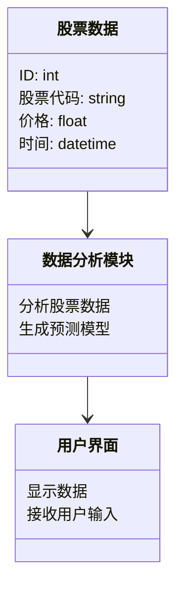
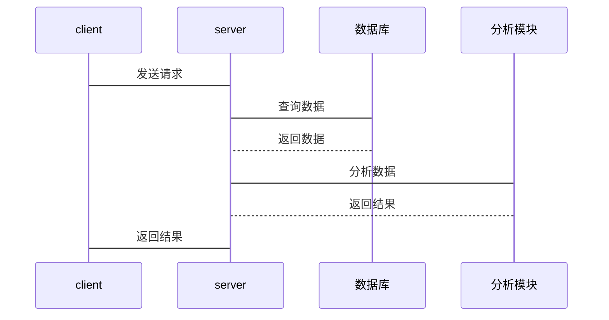
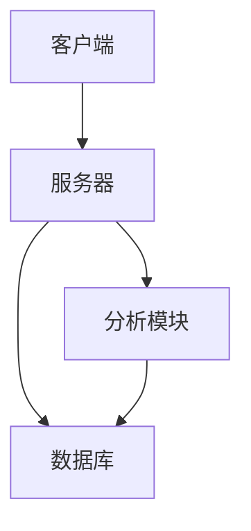
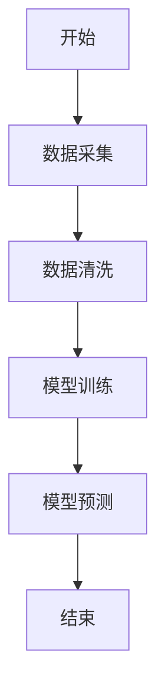

                 


# 特价股票与公司数字化敏捷创新文化感染力的深度分析方法

## 关键词：
特价股票，数字化创新，敏捷文化，文化感染力，算法分析，系统架构

## 摘要：
本文系统分析了特价股票的特征，结合公司数字化敏捷创新文化，深入探讨其文化感染力，并通过算法分析和系统架构设计，提出了创新的分析方法。文章从背景介绍、核心概念、算法原理、系统架构、项目实战等多个维度展开，旨在为投资者和企业提供科学的分析工具和实践指导。

---

## 第1章：特价股票与数字化敏捷创新的背景

### 1.1 特价股票的定义与特征

#### 1.1.1 特价股票的定义
特价股票通常指价格较低的股票，具有高波动性和高风险特征，适合短线交易和套利机会。

#### 1.1.2 特价股票的市场特征
- 市场波动性高
- 交易量波动大
- 价格受市场情绪影响显著

#### 1.1.3 特价股票的投资价值
- 低价优势
- 市场波动带来的套利机会
- 高风险高回报并存

### 1.2 数字化敏捷创新的背景

#### 1.2.1 数字化转型的现状
企业通过数字化技术提升效率和竞争力，数字化转型已成为企业发展的必经之路。

#### 1.2.2 敏捷创新的核心理念
敏捷方法强调快速迭代和灵活调整，注重快速响应市场变化和客户需求。

#### 1.2.3 数字化与敏捷创新的结合
通过数字化技术实现敏捷创新，提升企业应对市场变化的能力。

### 1.3 文化感染力的内涵

#### 1.3.1 企业文化感染力的定义
文化感染力指企业文化的影响力和扩散能力，能够影响员工和外部合作伙伴的行为和决策。

#### 1.3.2 数字化文化感染力的特点
- 数据驱动
- 技术赋能
- 持续创新

#### 1.3.3 敏捷创新文化感染力的传播路径
从内部员工到外部合作伙伴，逐步形成企业文化影响力。

### 1.4 特价股票与数字化敏捷创新的关联

#### 1.4.1 特价股票市场与数字化技术的结合
通过数字化技术分析市场趋势和交易数据，提升投资决策的准确性。

#### 1.4.2 敏捷创新对特价股票的影响
敏捷方法可以快速调整投资策略，抓住市场机会。

#### 1.4.3 数字化文化感染力在特价股票中的应用
企业文化感染力能够提升团队协作和创新能力，增强市场竞争力。

---

## 第2章：特价股票的市场特征

### 2.1 特价股票的市场波动性分析

#### 2.1.1 市场波动的定义与衡量指标
市场波动性指价格的短期波动，常用波动率和标准差衡量。

#### 2.1.2 特价股票波动性的表现
- 高频交易
- 市场情绪影响显著
- 价格波动剧烈

#### 2.1.3 波动性对投资的影响
高波动性带来高风险和高回报，投资者需谨慎应对。

### 2.2 特价股票的技术分析指标

#### 2.2.1 常用技术分析指标介绍
- 移动平均线（MA）
- 相对强弱指数（RSI）
- 布林带（Bollinger Bands）

#### 2.2.2 特价股票的技术分析策略
结合技术指标和市场趋势进行综合分析。

#### 2.2.3 技术指标与市场趋势的关系
技术指标能够反映市场趋势，但需结合市场环境综合判断。

### 2.3 特价股票的投资行为特征

#### 2.3.1 投资者行为的分类
- 长期投资者
- 短线交易者
- 套利者

#### 2.3.2 特价股票投资者的行为模式
- 短线交易为主
- 追逐市场热点
- 高风险承受能力

#### 2.3.3 行为特征对市场的影响
投资者行为影响市场价格和波动性，需理性应对市场变化。

### 2.4 特价股票的风险特征

#### 2.4.1 投资风险的定义与分类
- 系统性风险
- 非系统性风险

#### 2.4.2 特价股票的风险来源
- 市场波动
- 公司基本面变化
- 宏观经济影响

#### 2.4.3 风险管理策略
- 分散投资
- 设置止损
- 定期评估投资组合

---

## 第3章：数字化敏捷创新文化的核心要素

### 3.1 数字化文化的核心要素

#### 3.1.1 数字化思维的培养
- 数据驱动决策
- 技术赋能业务
- 创新意识培养

#### 3.1.2 数字化工具的应用
- 数据分析工具
- 项目管理软件
- 协作平台

#### 3.1.3 数字化团队的构建
- 多学科团队协作
- 技术与业务结合
- 持续学习与创新

### 3.2 敏捷创新的组织结构

#### 3.2.1 敏捷开发模式
- 小团队协作
- 迭代开发
- 用户反馈驱动

#### 3.2.2 敏捷文化的核心特征
- 快速响应
- 灵活调整
- 透明沟通

#### 3.2.3 敏捷文化与传统文化的对比
| 特征 | 敏捷文化 | 传统文化 |
|------|----------|-----------|
| 组织结构 | 小团队 | 大部门 |
| 沟通方式 | 透明 | 层级分明 |
| 反馈机制 | 快速 | 延迟 |

### 3.3 文化感染力的传播机制

#### 3.3.1 内部传播路径
- 核心团队示范
- 员工培训
- 文化融入日常

#### 3.3.2 外部传播路径
- 合作伙伴影响
- 客户体验提升
- 品牌效应

#### 3.3.3 文化感染力的增强策略
- 提供培训和学习机会
- 鼓励创新和尝试
- 建立激励机制

### 3.4 数字化与敏捷创新的融合

#### 3.4.1 数字化赋能敏捷创新
- 数据驱动决策
- 技术支持快速迭代
- 数字化工具提升效率

#### 3.4.2 敏捷创新推动数字化转型
- 快速响应市场变化
- 持续优化业务流程
- 提升客户体验

#### 3.4.3 数字化与敏捷创新的协同效应
- 提高企业竞争力
- 增强市场适应能力
- 促进企业创新文化

---

## 第4章：数字化敏捷创新对特价股票的影响

### 4.1 数据驱动的决策

#### 4.1.1 数据分析的重要性
- 提供客观决策依据
- 发现市场趋势和机会
- 优化投资策略

#### 4.1.2 数据分析工具与方法
- 使用Python进行数据分析
- 机器学习模型预测市场趋势
- 数据可视化工具辅助决策

#### 4.1.3 数据驱动的决策策略
- 基于数据的买卖决策
- 量化分析与定性分析结合
- 实时监控市场变化

### 4.2 敏捷开发方法

#### 4.2.1 敏捷开发的核心理念
- 迭代开发
- 用户故事优先
- 灵活调整计划

#### 4.2.2 敏捷开发在股票分析中的应用
- 快速开发数据分析工具
- 及时响应市场变化
- 持续优化分析模型

#### 4.2.3 敏捷开发与传统开发的对比
| 特征 | 敏捷开发 | 传统开发 |
|------|----------|-----------|
| 开发周期 | 短 | 长 |
| 反馈机制 | 快速 | 延迟 |
| 灵活性 | 高 | 低 |

### 4.3 文化感染力的增强

#### 4.3.1 数字化文化感染力的表现
- 员工主动学习新技术
- 团队协作效率提升
- 创新意识增强

#### 4.3.2 文化感染力对市场的影响
- 提高企业竞争力
- 增强客户信任
- 提升市场影响力

#### 4.3.3 文化感染力的持续优化
- 建立反馈机制
- 持续改进文化
- 加强文化传播

---

## 第5章：系统架构设计与实现

### 5.1 系统需求分析

#### 5.1.1 项目背景
开发一个基于数字化敏捷创新的股票分析系统，提升投资决策的效率和准确性。

#### 5.1.2 系统目标
- 实时数据分析
- 智能预测市场趋势
- 提供投资决策支持

### 5.2 系统架构设计

#### 5.2.1 领域模型设计


#### 5.2.2 系统架构设计


#### 5.2.3 系统接口设计
- 数据接口：与数据库交互
- 用户接口：接收用户请求
- 分析接口：调用分析模块

#### 5.2.4 系统交互设计


---

## 第6章：项目实战与案例分析

### 6.1 项目背景与目标

#### 6.1.1 项目背景
开发一个基于Python的股票数据分析系统，利用机器学习算法预测市场趋势。

#### 6.1.2 项目目标
- 实现实时数据分析
- 开发预测模型
- 提供投资决策支持

### 6.2 数据采集与处理

#### 6.2.1 数据源
- 股票市场数据（如Yahoo Finance API）
- 市场新闻和社交媒体数据

#### 6.2.2 数据处理步骤
1. 数据清洗
2. 数据转换
3. 数据存储

#### 6.2.3 数据采集代码
```python
import pandas as pd
import yfinance as yf

# 下载股票数据
data = yf.download('AAPL', start='2020-01-01', end='2023-12-31')

# 数据清洗
data.dropna(inplace=True)
data['Close'].plot()
plt.show()
```

### 6.3 数据分析与建模

#### 6.3.1 数据分析方法
- 时间序列分析
- 机器学习模型（如LSTM）

#### 6.3.2 模型训练
```python
from sklearn.model_selection import train_test_split
from sklearn.linear_model import LinearRegression

X = data[['Open', 'High', 'Low']]
y = data['Close']

X_train, X_test, y_train, y_test = train_test_split(X, y, test_size=0.2)

model = LinearRegression()
model.fit(X_train, y_train)
```

#### 6.3.3 模型预测
```python
y_pred = model.predict(X_test)
print('预测值:', y_pred)
print('真实值:', y_test)
```

### 6.4 策略制定与优化

#### 6.4.1 投资策略
- 基于模型预测结果制定买卖策略
- 结合市场情绪和宏观经济指标

#### 6.4.2 策略优化
- 调整模型参数
- 结合多种分析方法
- 定期评估策略效果

### 6.5 项目总结与反思

#### 6.5.1 项目成果
成功开发了一个基于Python的股票分析系统，提升了投资决策的效率和准确性。

#### 6.5.2 项目经验
- 数据清洗和处理是关键
- 模型选择和优化影响结果
- 文化感染力提升团队协作效率

#### 6.5.3 项目不足
- 数据来源有限
- 模型预测精度有待提高
- 系统稳定性需要优化

---

## 第7章：总结与展望

### 7.1 核心发现

- 特价股票具有高波动性和高风险特征
- 数字化敏捷创新文化能够提升企业的市场竞争力
- 系统架构设计和算法分析是提升投资决策的关键

### 7.2 展望与建议

- 持续优化算法模型，提高预测精度
- 加强系统架构设计，提升系统稳定性
- 推动数字化文化感染力，提升团队协作效率

---

## 附录

### 附录A：核心概念对比表

| 特征 | 特价股票 | 数字化敏捷创新 |
|------|----------|----------------|
| 定义 | 价格低的股票 | 快速迭代的创新方法 |
| 特征 | 波动性高 | 灵活性强 |
| 影响 | 高风险高回报 | 提高竞争力 |

### 附录B：系统架构图


### 附录C：算法流程图


### 附录D：参考文献
1. 《股票投资策略与技术分析》
2. 《数字化转型与敏捷创新》
3. 《系统架构设计与实现》

---

## 作者：
AI天才研究院/AI Genius Institute  
禅与计算机程序设计艺术/Zen And The Art of Computer Programming

