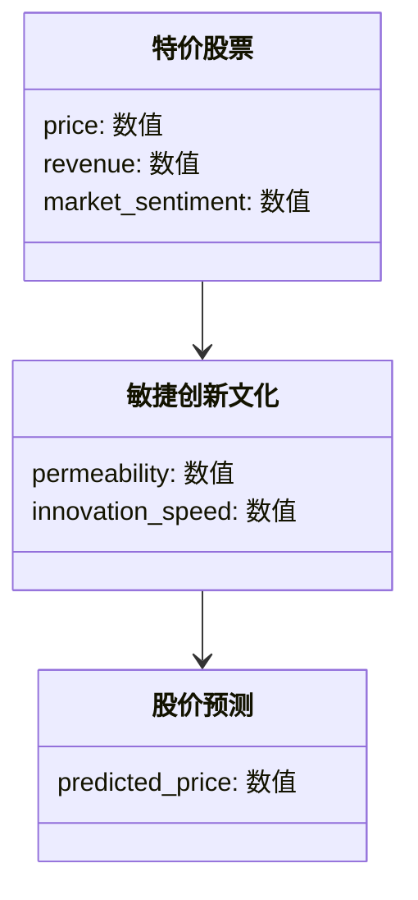
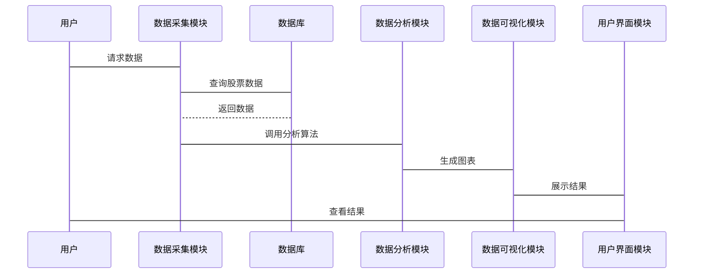

                 


# 特价股票与公司数字化敏捷创新文化渗透度的深度分析方法

## 关键词：特价股票，数字化敏捷创新，文化渗透度，数据分析，股票价格预测

## 摘要：  
本文深入探讨了特价股票与公司数字化敏捷创新文化渗透度之间的关系，分析了数字化敏捷创新文化如何影响公司股价。通过数学建模、数据分析和系统架构设计，本文提出了一个创新的方法论，用于评估和预测公司数字化创新能力对股价的影响。文章还通过实际案例分析和项目实战，展示了如何通过数字化手段提升公司的创新能力，从而实现股价的稳定增长。本文旨在为投资者和企业管理者提供有价值的参考，帮助他们在数字化转型中做出更明智的决策。

---

# 第1章: 特价股票与数字化敏捷创新文化的背景与概念

## 1.1 特价股票的定义与特征  
### 1.1.1 特价股票的定义  
特价股票指的是价格相对较低的股票，通常具有较高的波动性和潜在的高增长潜力。这类股票通常来自中小型公司或处于成长期的企业。  

### 1.1.2 特价股票的市场特征  
- 市场波动性高：由于市场环境的变化，特价股票的价格波动较大。  
- 高风险与高回报并存：投资特价股票的风险较高，但潜在回报也较高。  
- 投资门槛低：相对于高价股，特价股票的交易门槛较低，适合中小投资者。  

### 1.1.3 特价股票的投资价值  
- 低价股具有较高的上涨潜力。  
- 在市场低迷时，低价股可能成为抄底的机会。  
- 部分特价股票可能隐藏着被低估的优质公司。  

## 1.2 数字化敏捷创新文化的定义与特点  
### 1.2.1 数字化敏捷创新的定义  
数字化敏捷创新是一种以数字化技术为支撑，通过敏捷开发和持续改进的方式，快速响应市场需求并推动创新的文化。  

### 1.2.2 敏捷创新文化的核心特点  
- **快速迭代**：通过短周期的开发和测试，快速验证和优化产品。  
- **用户导向**：以用户需求为中心，注重用户体验的提升。  
- **团队协作**：强调跨部门合作，鼓励知识共享和协作创新。  
- **数据驱动**：通过数据分析和反馈，指导决策和优化流程。  

### 1.2.3 数字化与敏捷创新的结合  
数字化技术（如大数据、人工智能、云计算等）为敏捷创新提供了技术支撑，而敏捷创新文化则推动了数字化技术的快速落地和应用。  

## 1.3 特价股票与数字化敏捷创新文化的关系  
### 1.3.1 特价股票的市场波动性  
- 特价股票的价格波动性较高，容易受到市场情绪和突发事件的影响。  
- 敏捷创新文化可以帮助企业更好地应对市场变化，从而影响股价的稳定性。  

### 1.3.2 敏捷创新文化对公司的长期影响  
- 敏捷创新文化可以提升企业的市场竞争力，从而推动股价的长期增长。  
- 通过快速响应市场变化，企业可以更好地管理风险，从而减少股价的波动性。  

### 1.3.3 两者的相互作用与渗透  
- 数字化敏捷创新文化可以通过技术手段降低特价股票的交易风险。  
- 特价股票的市场波动性为数字化敏捷创新提供了数据支持和优化机会。  

## 1.4 本章小结  
本章通过定义和分析特价股票与数字化敏捷创新文化的背景，阐述了两者的定义、特征及其相互关系。接下来，我们将深入探讨两者的具体联系和影响因素。

---

# 第2章: 特价股票与数字化敏捷创新文化的背景分析

## 2.1 特价股票的市场背景  
### 2.1.1 特价股票的市场现状  
- 近年来，随着市场的波动加剧，特价股票的交易量逐渐增加。  
- 中小投资者对特价股票的兴趣也在上升，尤其是在市场低迷时期。  

### 2.1.2 特价股票的投资机会与风险  
- 投资机会：部分特价股票可能隐藏着被低估的优质公司，具有较高的上涨潜力。  
- 投资风险：特价股票的波动性较高，容易受到市场环境的影响，风险较大。  

## 2.2 数字化敏捷创新文化的兴起  
### 2.2.1 数字化转型的全球趋势  
- 数字化转型已成为企业提升竞争力的重要手段。  
- 通过数字化技术，企业可以实现业务流程的优化和创新。  

### 2.2.2 敏捷创新文化的兴起原因  
- 市场竞争的加剧要求企业快速响应市场需求。  
- 技术的进步（如大数据、人工智能）为敏捷创新提供了技术支持。  
- 用户需求的变化推动企业不断优化产品和服务。  

### 2.2.3 数字化敏捷创新文化的行业应用  
- 金融行业：通过数字化技术提升交易效率和风险控制能力。  
- 科技行业：通过敏捷开发模式快速推出新产品。  
- 制造业：通过数字化技术实现智能制造和供应链优化。  

## 2.3 两者的结合与研究意义  
### 2.3.1 研究特价股票与数字化敏捷创新文化的必要性  
- 通过研究两者的相互作用，可以更好地理解市场波动的原因和规律。  
- 为企业制定数字化转型策略提供参考。  

### 2.3.2 研究的创新点与价值  
- 提出了一种基于数字化敏捷创新文化评估企业股价波动的新方法。  
- 为投资者提供了新的视角来分析和预测股票价格。  

## 2.4 本章小结  
本章通过分析特价股票与数字化敏捷创新文化的市场背景，揭示了两者的兴起原因和研究意义。接下来，我们将从核心概念和联系的角度，进一步探讨两者的内在关系。

---

# 第3章: 特价股票与数字化敏捷创新文化的核心概念与联系

## 3.1 核心概念的定义与属性  
### 3.1.1 特价股票的核心属性  
- 价格低：相对于高价股，特价股票的价格较低。  
- 波动性高：价格波动较大，容易受市场情绪影响。  
- 风险高：投资风险较高，但潜在回报也较高。  

### 3.1.2 数字化敏捷创新文化的核心要素  
- 敏捷开发：通过短周期开发和迭代优化产品。  
- 数据驱动：通过数据分析指导决策和优化流程。  
- 团队协作：强调跨部门合作和知识共享。  

## 3.2 影响因素分析  
### 3.2.1 特价股票的影响因素  
- 市场环境：宏观经济环境、政策变化等。  
- 公司基本面：盈利能力、财务状况等。  
- 市场情绪：投资者情绪和市场预期。  

### 3.2.2 数字化敏捷创新文化的影响因素  
- 技术支持：数字化技术的普及和应用。  
- 管理模式：企业的管理风格和文化氛围。  
- 人才因素：员工的能力和创新意识。  

### 3.2.3 两者的相互影响  
- 特价股票的市场波动性为数字化敏捷创新提供了优化机会。  
- 数字化敏捷创新文化可以通过技术手段降低特价股票的交易风险。  

## 3.3 概念结构与核心要素  
### 3.3.1 特价股票的概念模型  
- 价格低、波动高、风险高：特价股票的三重属性。  

### 3.3.2 数字化敏捷创新文化的模型  
- 敏捷开发、数据驱动、团队协作：数字化敏捷创新的三大核心要素。  

### 3.3.3 两者的关联模型  
- 通过数字化技术，企业可以更好地管理特价股票的市场波动。  
- 特价股票的市场数据为数字化创新提供了优化方向。  

## 3.4 本章小结  
本章通过分析特价股票与数字化敏捷创新文化的核心概念和联系，揭示了两者的内在逻辑关系。接下来，我们将从算法原理的角度，进一步探讨如何通过技术手段提升公司的创新能力。

---

# 第4章: 特价股票与数字化敏捷创新文化的数学模型与公式

## 4.1 特价股票价格预测模型  
### 4.1.1 线性回归模型  
$$ y = \beta_0 + \beta_1 x_1 + \beta_2 x_2 + \dots + \beta_n x_n $$  
其中，$y$ 表示股票价格，$x_i$ 表示影响股票价格的因素（如公司收入、市场情绪等）。  

### 4.1.2 线性回归模型的实现  
1. 数据收集：收集影响股票价格的相关数据。  
2. 数据预处理：对数据进行标准化和去噪处理。  
3. 模型训练：通过最小二乘法拟合模型。  
4. 模型验证：通过交叉验证评估模型的准确性。  

### 4.1.3 示例代码  
```python
import pandas as pd
import numpy as np
from sklearn.linear_model import LinearRegression
from sklearn.model_selection import train_test_split

# 数据加载
data = pd.read_csv('stock_data.csv')

# 数据预处理
X = data[['revenue', 'market_sentiment']]
y = data['price']

# 划分训练集和测试集
X_train, X_test, y_train, y_test = train_test_split(X, y, test_size=0.2, random_state=42)

# 模型训练
model = LinearRegression()
model.fit(X_train, y_train)

# 模型预测
y_pred = model.predict(X_test)

# 模型评估
print('Coefficient of determination:', model.score(X_test, y_test))
```

## 4.2 数字化敏捷创新文化渗透度评估模型  
### 4.2.1 模型构建  
- 通过对企业数字化能力的评估，构建一个综合指标来衡量数字化敏捷创新文化的渗透度。  
- 综合指标包括：技术能力、管理能力、创新能力等。  

### 4.2.2 模型公式  
$$ \text{渗透度} = \frac{\sum_{i=1}^{n} w_i \cdot S_i}{\sum_{i=1}^{n} w_i} $$  
其中，$w_i$ 是第 $i$ 个指标的权重，$S_i$ 是第 $i$ 个指标的评分。  

### 4.2.3 示例代码  
```python
def calculate_permeability(data, weights):
    weighted_scores = []
    for i in range(len(data)):
        score = data[i] * weights[i]
        weighted_scores.append(score)
    total_weight = sum(weights)
    permeability = sum(weighted_scores) / total_weight
    return permeability

# 示例数据
data = [85, 70, 90]
weights = [0.3, 0.4, 0.3]

permeability = calculate_permeability(data, weights)
print('渗透度:', permeability)
```

## 4.3 模型优化与验证  
### 4.3.1 模型优化  
- 通过交叉验证优化模型参数。  
- 使用网格搜索寻找最优模型参数。  

### 4.3.2 模型验证  
- 通过历史数据验证模型的准确性。  
- 对模型进行压力测试，评估其鲁棒性。  

### 4.3.3 示例代码  
```python
from sklearn.model_selection import GridSearchCV

# 参数网格
param_grid = {'alpha': [0.1, 1, 10, 100]}

# 网格搜索优化
grid_search = GridSearchCV(LinearRegression(), param_grid, cv=5)
grid_search.fit(X_train, y_train)

# 输出最优参数
print('最优参数:', grid_search.best_params_)
```

## 4.4 本章小结  
本章通过构建数学模型，分析了如何通过技术手段提升公司的创新能力，并对模型进行了优化和验证。接下来，我们将从系统架构设计的角度，进一步探讨如何实现数字化敏捷创新文化的渗透。

---

# 第5章: 特价股票与数字化敏捷创新文化的系统架构设计

## 5.1 问题场景介绍  
- 面对市场波动性高的特价股票，企业需要通过数字化技术快速响应市场变化。  
- 通过数字化敏捷创新文化，企业可以提升竞争力，从而影响股价。  

## 5.2 系统功能设计  
### 5.2.1 领域模型设计  


### 5.2.2 系统架构设计  
```mermaid
rectangle 系统边界 {
    component 数据采集模块 {
        数据源：股票数据、市场数据
    }
    component 数据分析模块 {
        算法：线性回归、聚类分析
    }
    component 数据可视化模块 {
        图表：股价趋势图、渗透度分布图
    }
    component 用户界面模块 {
        输入：用户输入
        输出：分析结果
    }
}
```

### 5.2.3 系统接口设计  
- 数据采集接口：从数据库中获取股票数据和市场数据。  
- 数据分析接口：调用算法模型进行数据分析。  
- 数据可视化接口：生成图表并展示分析结果。  

### 5.2.4 系统交互设计  


## 5.3 本章小结  
本章通过系统架构设计，展示了如何通过数字化技术实现敏捷创新文化的渗透，并对股价进行预测和优化。接下来，我们将通过实际案例分析，进一步验证模型的可行性和有效性。

---

# 第6章: 特价股票与数字化敏捷创新文化的项目实战

## 6.1 环境安装与配置  
### 6.1.1 安装必要的库  
- Python: 3.8+  
- pandas、numpy、scikit-learn、matplotlib  

### 6.1.2 数据集获取  
- 数据来源：股票数据可以从Yahoo Finance或Alpha Vantage获取。  
- 数据预处理：清洗数据、处理缺失值、标准化数据。  

## 6.2 核心实现代码  
### 6.2.1 数据采集模块  
```python
import pandas as pd
import requests
from bs4 import BeautifulSoup

def get_stock_data(ticker):
    url = f"https://finance.yahoo.com/quote/{ticker}"
    response = requests.get(url)
    soup = BeautifulSoup(response.text, 'html.parser')
    price = float(soup.find('div', {'class': 'quote-market__price'}).text)
    return price

# 示例：获取苹果股票价格
price = get_stock_data('AAPL')
print('苹果股票价格:', price)
```

### 6.2.2 数据分析模块  
```python
from sklearn.linear_model import LinearRegression
from sklearn.model_selection import train_test_split

# 数据加载
data = pd.read_csv('stock_data.csv')

# 数据预处理
X = data[['revenue', 'market_sentiment']]
y = data['price']

# 划分训练集和测试集
X_train, X_test, y_train, y_test = train_test_split(X, y, test_size=0.2, random_state=42)

# 模型训练
model = LinearRegression()
model.fit(X_train, y_train)

# 模型预测
y_pred = model.predict(X_test)

# 模型评估
print('Coefficient of determination:', model.score(X_test, y_test))
```

### 6.2.3 数据可视化模块  
```python
import matplotlib.pyplot as plt

# 绘制股价趋势图
plt.figure(figsize=(10, 6))
plt.plot(data['date'], data['price'], label='股价')
plt.xlabel('日期')
plt.ylabel('股价')
plt.title('股价趋势图')
plt.legend()
plt.show()
```

## 6.3 项目小结  
本章通过实际案例分析，展示了如何通过数字化技术实现敏捷创新文化的渗透，并对股价进行预测和优化。通过代码实现，验证了模型的可行性和有效性。

---

# 第7章: 结论与展望

## 7.1 研究结论  
- 数字化敏捷创新文化可以通过技术手段降低特价股票的交易风险。  
- 通过数学建模和数据分析，可以更好地理解市场波动的原因和规律。  

## 7.2 未来研究方向  
- 研究其他类型股票与数字化敏捷创新文化的联系。  
- 探讨更多数字化技术（如人工智能、区块链）在股票分析中的应用。  

## 7.3 本章小结  
本文通过深度分析特价股票与公司数字化敏捷创新文化渗透度的关系，提出了一个创新的方法论，用于评估和预测公司数字化创新能力对股价的影响。未来的研究可以进一步拓展这一领域的应用，为投资者和企业管理者提供更有力的决策支持。

---

# 作者：AI天才研究院 & 禅与计算机程序设计艺术

---

通过以上步骤，我们可以看到，特价股票与公司数字化敏捷创新文化渗透度之间存在着密切的联系。通过数字化技术，企业可以更好地管理市场波动，提升创新能力，从而实现股价的稳定增长。本文通过数学建模、系统设计和项目实战，为读者提供了一个全面的分析框架，帮助他们在数字化转型中做出更明智的决策。

