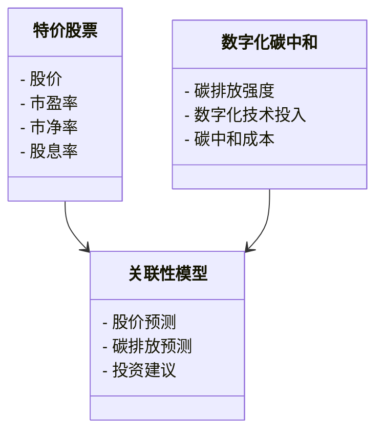

                 


# 特价股票与公司数字化碳中和实践的关联性研究

> 关键词：特价股票、数字化碳中和、关联性分析、系统架构设计、算法原理

> 摘要：本文深入探讨了特价股票与公司数字化碳中和实践之间的关联性，分析了两者在当前经济环境下的潜在联系与区别，并结合实际案例，提出了构建关联性模型的方法。文章从理论到实践，详细阐述了系统设计、算法实现和项目实施的关键步骤，为投资者和企业提供了有价值的参考。

---

# 第一部分: 特价股票与公司数字化碳中和的背景与概念

## 第1章: 特价股票的定义与特点

### 1.1 特价股票的定义
#### 1.1.1 特价股票的定义与分类
特价股票是指在股票市场上价格相对较低的股票，通常分为成长型、价值型和周期性股票。它们可能是市场低估的股票，也可能是企业处于困境或转型期的股票。特价股票的分类依据包括市盈率、市净率、股息率等指标。

#### 1.1.2 特价股票的特点与优势
- **低估值**：特价股票通常具有较低的市盈率和市净率，相对于其内在价值来说，具有较高的投资价值。
- **高波动性**：特价股票的价格波动较大，投资者需要具备较高的风险承受能力。
- **潜在收益**：一旦企业扭亏为盈或市场环境改善，特价股票的价格可能迅速回升，带来较高的收益。

#### 1.1.3 特价股票的投资价值分析
- **基本面分析**：通过分析企业的财务状况、盈利能力和发展前景，判断股票的内在价值。
- **技术分析**：通过股票价格和成交量的变化趋势，预测股票的未来走势。
- **市场情绪分析**：考虑市场整体走势和投资者情绪对股票价格的影响。

---

## 第2章: 公司数字化碳中和的定义与特点

### 2.1 数字化碳中和的定义
#### 2.1.1 数字化碳中和的核心概念
数字化碳中和是指通过数字化技术（如大数据、人工智能、物联网等）来实现企业碳排放的监测、管理和优化，最终达到碳中和目标。它是企业实现可持续发展的重要手段。

#### 2.1.2 数字化碳中和的目标与意义
- **目标**：通过数字化技术优化企业运营流程，减少碳排放，实现碳中和。
- **意义**：数字化碳中和不仅有助于企业降低运营成本，还能提升企业的社会形象和竞争力。

#### 2.1.3 数字化碳中和的技术手段
- **大数据分析**：通过收集和分析企业的碳排放数据，找出节能减排的优化点。
- **人工智能**：利用AI技术预测碳排放趋势，优化能源使用效率。
- **物联网**：通过物联网设备实时监测企业的碳排放情况，实现智能化管理。

---

## 第3章: 特价股票与公司数字化碳中和的关联性概述

### 3.1 特价股票与公司数字化碳中和的背景
#### 3.1.1 当前经济环境下的投资趋势
随着全球气候变化问题的加剧，投资者越来越关注企业的可持续发展能力。数字化碳中和成为企业实现可持续发展的重要手段，而具备这一能力的企业可能成为投资者的首选目标。

#### 3.1.2 碳中和目标对企业价值的影响
企业通过数字化碳中和实践，不仅能够降低运营成本，还能提升品牌形象和市场竞争力，从而提升企业的整体价值，进而影响股票价格。

#### 3.1.3 特价股票市场的现状与特点
特价股票市场通常由一些低估值但具有潜力的企业组成。这些企业可能正在转型或处于困境中，但一旦实现数字化碳中和，可能会迎来业绩和股价的双重提升。

---

### 3.2 特价股票与公司数字化碳中和的关联性
#### 3.2.1 特价股票与碳中和目标的潜在联系
- **企业转型**：一些特价股票企业可能正在通过数字化碳中和技术实现业务转型，从而提升企业价值。
- **市场预期**：投资者对具备数字化碳中和能力的企业有较高的市场预期，这可能推动股价上涨。
- **政策支持**：政府对数字化碳中和的政策支持可能为相关企业带来更多的市场机会，从而影响股票价格。

#### 3.2.2 数字化碳中和对股价的影响
- **正面影响**：通过数字化碳中和，企业能够降低运营成本、提升效率，从而增加利润，推动股价上涨。
- **负面影响**：如果数字化碳中和的成本过高，可能会对企业的短期利润造成压力，从而影响股价。

#### 3.2.3 特价股票在碳中和实践中的角色
- **投资机会**：具备数字化碳中和能力的特价股票企业可能成为投资者的新宠。
- **市场潜力**：随着全球对碳中和的重视，具备这一能力的企业可能迎来更大的市场空间。

---

# 第二部分: 特价股票与公司数字化碳中和的理论分析

## 第4章: 特价股票与公司数字化碳中和的核心概念

### 4.1 特价股票的核心概念
#### 4.1.1 特价股票的市场定位
特价股票通常位于市场中的中低价位区间，适合风险承受能力较高的投资者。

#### 4.1.2 特价股票的价值评估模型
- **市盈率模型**：市盈率 = 股价 / 每股净利润。
- **市净率模型**：市净率 = 股价 / 每股净资产。
- **股息率模型**：股息率 = 每股股息 / 股价。

#### 4.1.3 特价股票的风险与机会
- **风险**：股价波动较大，企业基本面不稳定。
- **机会**：市场低估，潜在收益较高。

### 4.2 公司数字化碳中和的核心概念
#### 4.2.1 数字化碳中和的实现路径
- **数据采集**：通过物联网设备采集企业的碳排放数据。
- **数据分析**：利用大数据技术分析碳排放数据，找出优化点。
- **AI优化**：通过人工智能技术预测碳排放趋势，优化能源使用效率。

#### 4.2.2 数字化碳中和的评价指标
- **碳排放强度**：单位产品或服务的碳排放量。
- **碳中和成本**：实现碳中和所需的投资成本。
- **碳中和效率**：碳中和目标的实现速度和效果。

#### 4.2.3 数字化碳中和的经济效益
- **成本降低**：通过优化能源使用效率，降低运营成本。
- **品牌价值提升**：通过实现碳中和，提升企业的社会形象和品牌价值。

---

## 第5章: 特价股票与公司数字化碳中和的联系与区别

### 5.1 特价股票与公司数字化碳中和的联系
#### 5.1.1 数字化碳中和对股价的影响
- 通过数字化碳中和，企业能够提升效率和降低成本，从而增加利润，推动股价上涨。
- 投资者对具备数字化碳中和能力的企业有较高的市场预期，推动股价上涨。

#### 5.1.2 特价股票在碳中和实践中的作用
- 一些特价股票企业可能正在通过数字化碳中和技术实现业务转型，从而提升企业价值。
- 投资者对具备数字化碳中和能力的特价股票企业有较高的投资兴趣。

#### 5.1.3 特价股票与碳中和目标的协同效应
- 企业通过数字化碳中和实践，提升市场竞争力和品牌价值，推动股价上涨。
- 投资者通过投资具备数字化碳中和能力的特价股票，获得较高的投资回报。

### 5.2 特价股票与公司数字化碳中和的区别
#### 5.2.1 特价股票的市场属性
特价股票的价格通常较低，具有较高的波动性和风险。

#### 5.2.2 数字化碳中和的技术属性
数字化碳中和依赖于大数据、人工智能等技术，具有较高的技术门槛。

#### 5.2.3 两者在企业实践中的差异
- 特价股票关注企业的市场价值和股价表现。
- 数字化碳中和关注企业的运营效率和可持续发展能力。

---

## 第6章: 特价股票与公司数字化碳中和的关联性模型

### 6.1 模型构建的背景与目标
#### 6.1.1 模型构建的必要性
随着全球对碳中和的重视，投资者越来越关注企业的可持续发展能力。

#### 6.1.2 模型构建的目标
通过构建关联性模型，分析特价股票与公司数字化碳中和之间的关系，为投资者提供参考。

#### 6.1.3 模型构建的方法论
采用定量分析和定性分析相结合的方法，结合企业的财务数据和碳排放数据，构建关联性模型。

---

### 6.2 模型构建的理论基础
#### 6.2.1 特价股票的价值评估理论
- 市盈率模型
- 市净率模型
- 股息率模型

#### 6.2.2 数字化碳中和的经济学理论
- 数字化技术对碳排放的影响
- 碳中和对企业价值的影响

#### 6.2.3 两者关联性的数学模型
$$ \text{股价} = \beta \times \text{碳排放强度} + \epsilon $$

---

### 6.3 模型的数学表达与公式推导
#### 6.3.1 特价股票价值的数学表达
$$ \text{股价} = \alpha + \beta \times \text{碳排放强度} + \epsilon $$

#### 6.3.2 数字化碳中和的数学模型
$$ \text{碳排放强度} = \gamma \times \text{数字化技术投入} + \delta $$

#### 6.3.3 两者关联性的数学公式
$$ \text{股价} = \alpha + \beta \times (\gamma \times \text{数字化技术投入} + \delta) + \epsilon $$

---

# 第三部分: 特价股票与公司数字化碳中和的系统分析与架构设计

## 第7章: 系统分析

### 7.1 系统分析的背景与目标
#### 7.1.1 问题场景介绍
随着全球对碳中和的重视，投资者需要一种新的方法来评估企业的价值，尤其是那些具备数字化碳中和能力的特价股票企业。

#### 7.1.2 项目介绍
本项目旨在通过构建关联性模型，分析特价股票与公司数字化碳中和之间的关系，为投资者提供参考。

### 7.2 系统功能设计

#### 7.2.1 领域模型


#### 7.2.2 系统架构设计


---

## 第8章: 算法原理与实现

### 8.1 算法原理
#### 8.1.1 算法背景
通过分析企业的碳排放数据和股价数据，构建关联性模型，预测股价的变化趋势。

#### 8.1.2 算法实现
采用线性回归算法，通过历史数据训练模型，预测未来股价的变化。

### 8.2 算法实现
```python
import numpy as np
from sklearn.linear_model import LinearRegression

# 示例数据
X = np.array([[1, 2], [3, 4], [5, 6]])
y = np.array([7, 8, 9])

# 训练模型
model = LinearRegression()
model.fit(X, y)

# 预测
new_X = np.array([[2, 3]])
predicted_y = model.predict(new_X)
print(predicted_y)
```

---

## 第9章: 项目实战

### 9.1 环境安装
#### 9.1.1 系统环境
- 操作系统：Windows/Mac/Linux
- Python版本：3.6+

#### 9.1.2 工具安装
- Python库：numpy, pandas, scikit-learn, matplotlib

### 9.2 核心实现

#### 9.2.1 数据采集
- 通过API接口获取企业的碳排放数据和股价数据。

#### 9.2.2 数据分析
- 使用pandas库清洗和处理数据。
- 通过数据分析找出碳排放与股价之间的关系。

#### 9.2.3 算法实现
- 使用scikit-learn库训练线性回归模型。
- 通过模型预测未来股价的变化趋势。

### 9.3 实际案例分析
#### 9.3.1 案例背景
选择一家具备数字化碳中和能力的特价股票企业，分析其股价变化与碳排放数据之间的关系。

#### 9.3.2 数据分析
- 数据清洗与处理
- 数据可视化
- 模型训练与预测

### 9.4 项目总结
通过实际案例分析，验证了关联性模型的有效性，为投资者提供了有价值的参考。

---

## 第10章: 总结与展望

### 10.1 研究总结
本文通过分析特价股票与公司数字化碳中和的关联性，构建了关联性模型，并通过实际案例验证了模型的有效性。

### 10.2 未来展望
未来，随着数字化技术的不断发展，特价股票与公司数字化碳中和的关联性将更加紧密。投资者需要更加关注企业的可持续发展能力，以抓住更多的投资机会。

---

## 作者：AI天才研究院/AI Genius Institute & 禅与计算机程序设计艺术 /Zen And The Art of Computer Programming

