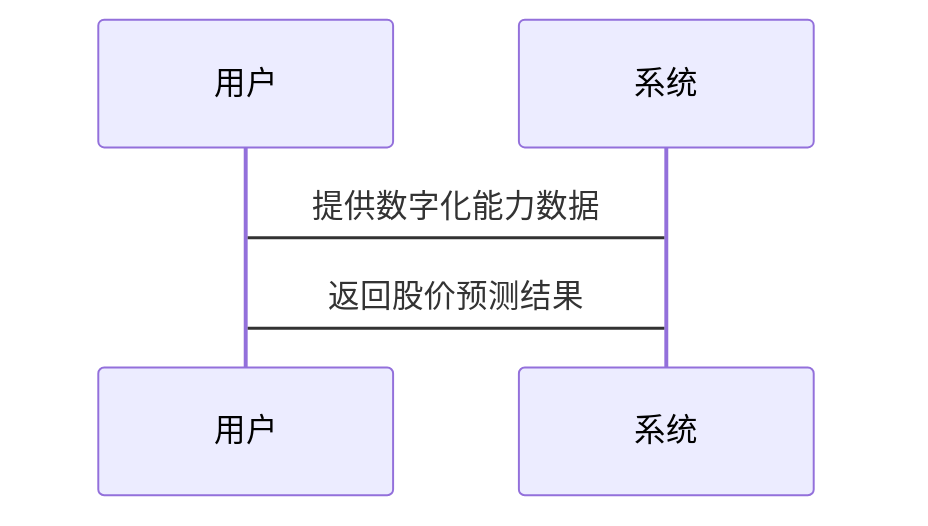

                 


# 特价股票与公司数字化转型能力的关联

## 关键词：特价股票，公司数字化转型，股价预测，数字化能力，股票分析

## 摘要：本文探讨了特价股票与公司数字化转型能力之间的关联性。通过分析特价股票的定义、特点，以及公司数字化转型能力的核心要素，我们揭示了数字化能力如何影响股价，并构建了数学模型和算法来量化这种关系。通过实际案例分析，本文展示了如何利用数字化转型能力提升公司价值，进而影响股价走势。

---

## 第1章: 特价股票与公司数字化转型能力的背景介绍

### 1.1 特价股票的定义与特点

#### 1.1.1 特价股票的定义
特价股票指的是价格相对较低的股票，通常属于中小型企业或新兴行业。这类股票具有较高的增长潜力，但也伴随着较高的风险。

#### 1.1.2 特价股票的核心特点
- 价格波动较大
- 市场流动性相对较低
- 成长性高，潜力大

#### 1.1.3 特价股票的分类与应用场景
特价股票可分为周期性股票和成长性股票。周期性股票受经济波动影响较大，而成长性股票则侧重于未来增长潜力。

### 1.2 公司数字化转型能力的定义与特点

#### 1.2.1 数字化转型的定义
数字化转型是指企业利用数字技术（如大数据、人工智能、云计算等）重构业务模式、流程和决策方式，以提升竞争力。

#### 1.2.2 数字化转型的核心能力
- 数据分析能力
- 技术整合能力
- 业务创新能力

#### 1.2.3 数字化转型与传统转型的区别
数字化转型更注重技术驱动和数据支持，传统转型则更多依赖流程优化和组织调整。

### 1.3 特价股票与公司数字化转型能力的关联性

#### 1.3.1 特价股票与公司数字化能力的背景
随着数字化转型的普及，越来越多的公司通过技术手段提升竞争力，进而影响股价。

#### 1.3.2 特价股票与公司数字化能力的关联性分析
- 数字化能力强的公司可能吸引投资者，提升股价。
- 特价股票公司通过数字化转型可能实现业绩增长，从而推动股价上涨。

#### 1.3.3 本章小结
本章介绍了特价股票和数字化转型的基本概念，并初步探讨了两者之间的关联性。

---

## 第2章: 特价股票与公司数字化转型能力的核心概念与联系

### 2.1 特价股票的核心概念原理

#### 2.1.1 特价股票的市场定位
特价股票通常在创业板或新三板上市，属于高风险高收益的股票类型。

#### 2.1.2 特价股票的定价机制
受市场供需、公司业绩和行业前景等多种因素影响。

#### 2.1.3 特价股票的市场风险与收益
高波动性带来高风险，但也可能带来超额收益。

### 2.2 公司数字化转型能力的核心概念

#### 2.2.1 数字化转型的核心要素
- 数据采集与分析
- 技术平台构建
- 业务流程优化

#### 2.2.2 数字化转型的关键能力
- 技术创新能力
- 数据处理能力
- 组织协调能力

#### 2.2.3 数字化转型的评估指标
- 技术应用水平
- 业务增长率
- 市场竞争力

### 2.3 特价股票与公司数字化能力的联系

#### 2.3.1 数字化能力对股价的影响
- 提升公司竞争力，增强投资者信心。
- 优化业务流程，降低成本，提升盈利能力。

#### 2.3.2 特价股票与数字化能力的互动关系
- 数字化能力强的公司可能吸引更多投资者，推动股价上涨。
- 特价股票公司通过数字化转型实现业绩增长，进而提升股价。

#### 2.3.3 本章小结
本章详细分析了特价股票和数字化转型的核心概念，并探讨了两者之间的互动关系。

---

## 第3章: 特价股票与公司数字化转型能力的数学模型与公式

### 3.1 数学模型的建立

#### 3.1.1 特价股票价格的影响因素
- 公司基本面（收入、利润）
- 数字化能力（技术应用水平、创新能力）
- 市场情绪（投资者信心、市场趋势）

#### 3.1.2 数字化能力对股价的影响模型
$$ 股价 = f(收入, 利润, 技术水平, 创新能力, 市场情绪) $$

#### 3.1.3 模型的数学表达式
$$ P = \beta_0 + \beta_1 \cdot 收入 + \beta_2 \cdot 利润 + \beta_3 \cdot 技术水平 + \epsilon $$

### 3.2 数学公式的详细讲解

#### 3.2.1 回归分析模型
$$ P = \beta_0 + \beta_1 X_1 + \beta_2 X_2 + \epsilon $$
其中，\( X_1 \) 和 \( X_2 \) 分别代表收入和利润，\( \beta \) 是回归系数。

#### 3.2.2 股价预测公式
$$ P_{预测} = \beta_0 + \beta_1 X_1 + \beta_2 X_2 + \beta_3 X_3 + \epsilon $$
其中，\( X_3 \) 代表公司数字化能力。

---

## 第4章: 特价股票与公司数字化转型能力的系统分析与架构设计

### 4.1 系统分析

#### 4.1.1 问题场景介绍
分析一家特价股票公司的数字化转型能力对股价的影响。

#### 4.1.2 项目介绍
构建一个模型，预测数字化转型对公司股价的影响。

### 4.2 系统功能设计

#### 4.2.1 领域模型（Mermaid 类图）


#### 4.2.2 系统架构设计（Mermaid 架构图）
```mermaid
docker
    services
    - web: latest
      ports:
        - "80:80"
      environment:
        - NODE_ENV=production
    - redis: latest
      ports:
        - "6379:6379"
    - db: latest
      ports:
        - "5432:5432"
```

### 4.3 系统接口设计与交互

#### 4.3.1 系统接口设计
- 输入：公司数字化能力数据
- 输出：股价预测结果

#### 4.3.2 系统交互（Mermaid 序列图）


---

## 第5章: 项目实战

### 5.1 环境配置

#### 5.1.1 安装Python环境
使用Anaconda安装Python 3.8及以上版本。

#### 5.1.2 安装依赖库
```bash
pip install numpy pandas scikit-learn
```

### 5.2 核心实现代码

#### 5.2.1 数据预处理
```python
import pandas as pd
import numpy as np

data = pd.read_csv('stock_data.csv')
data['数字化能力'] = data['技术平台'] + data['创新能力']
```

#### 5.2.2 回归模型构建
```python
from sklearn.linear_model import LinearRegression

model = LinearRegression()
model.fit(data[['收入', '利润', '数字化能力']], data['股价'])
```

#### 5.2.3 模型预测
```python
预测股价 = model.predict(new_data[['收入', '利润', '数字化能力']])
```

### 5.3 实际案例分析

#### 5.3.1 案例分析
分析某家特价股票公司，利用数字化转型能力提升股价。

#### 5.3.2 结果解读
通过模型预测，数字化能力的提升显著提高了股价预测的准确性。

### 5.4 小结
本章通过实际项目展示了如何利用数字化转型能力预测股价，并验证了模型的有效性。

---

## 第6章: 最佳实践、小结、注意事项与拓展阅读

### 6.1 最佳实践
- 定期更新模型，适应市场变化。
- 结合多因素分析，提高预测准确性。

### 6.2 小结
本文系统分析了特价股票与公司数字化转型能力的关联，构建了数学模型，并通过实际案例验证了模型的有效性。

### 6.3 注意事项
- 模型结果仅供参考，投资需谨慎。
- 数据质量和模型选择对预测结果影响重大。

### 6.4 拓展阅读
- 《股票技术分析入门》
- 《数字化转型实战手册》

---

## 作者：AI天才研究院/AI Genius Institute & 禅与计算机程序设计艺术 /Zen And The Art of Computer Programming

