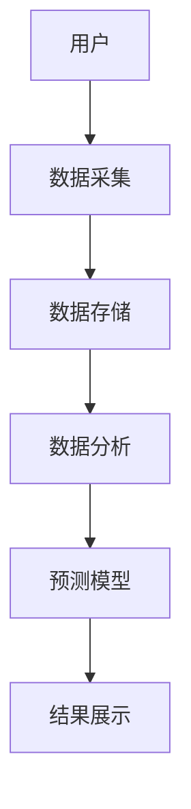

                 


# 特价股票与公司数字化转型能力的潜在联系

> 关键词：特价股票、数字化转型、公司能力、潜在联系、数据分析、系统架构

> 摘要：本文探讨了特价股票与公司数字化转型能力之间的潜在联系，分析了两者的核心概念、数学模型、算法原理、系统架构及项目实战，为读者提供了全面的理解和实践指导。

---

## 第1章: 特价股票的定义与背景

### 1.1 特价股票的定义与特征
#### 1.1.1 特价股票的定义
特价股票是指在特定时间段内，公司以低于市场价发行的股票，通常用于促销或吸引投资者。

#### 1.1.2 特价股票的核心特征
- **价格优惠**：低于市场价，吸引投资者。
- **时间限制**：通常在特定促销期间。
- **数量有限**：限制发行数量。

#### 1.1.3 特价股票的分类与应用场景
- **按发行目的**：促销、市场推广。
- **按发行方式**：线上、线下。

### 1.2 公司数字化转型的定义与背景
#### 1.2.1 数字化转型的定义
数字化转型是企业利用数字技术改变业务模式、流程和文化的过程。

#### 1.2.2 数字化转型的核心特征
- **数据驱动**：依赖数据进行决策。
- **技术驱动**：使用AI、大数据等技术。

#### 1.2.3 数字化转型的驱动力与挑战
- **驱动力**：技术进步、市场竞争。
- **挑战**：数据隐私、技术整合。

### 1.3 特价股票与公司数字化转型的潜在联系
#### 1.3.1 特价股票对企业数字化能力的需求
- 数据分析需求：分析市场反应。
- 技术支持：优化定价策略。

#### 1.3.2 数字化转型对特价股票的影响
- 提高效率：优化发行和管理。
- 增强竞争力：吸引投资者。

---

## 第2章: 特价股票与公司数字化转型能力的核心概念与联系

### 2.1 特价股票的核心概念与属性
#### 2.1.1 特价股票的业务流程
- 发行、销售、结算。

#### 2.1.2 市场定位与用户行为
- 分析用户需求和行为。

#### 2.1.3 特价股票的生命周期与风险控制
- 生命周期管理，控制风险。

### 2.2 公司数字化转型能力的核心要素
#### 2.2.1 数据驱动的决策能力
- 数据分析、预测。

#### 2.2.2 智能化技术的应用能力
- AI、机器学习。

#### 2.2.3 数字化平台的构建能力
- 平台设计、功能开发。

### 2.3 联系模型
#### 2.3.1 联系模型的构建
- 理论基础：数据驱动决策。

#### 2.3.2 联系模型的属性与特征
- 特价股票影响数字化转型能力。

#### 2.3.3 模型的验证与优化
- 实证分析，持续优化。

---

## 第3章: 特价股票与公司数字化转型能力的数学模型与算法原理

### 3.1 数学模型
#### 模型构建
使用线性回归分析特价股票对股价的影响：
$$ y = \beta_0 + \beta_1x + \epsilon $$

### 3.2 算法原理
#### 数据预处理
- 清洗、转换。

#### 算法选择
- 决策树、随机森林。

#### 性能评估
- 准确率、召回率。

### 3.3 关联分析
#### 关联规则挖掘
- 发现关联项。

#### 聚类分析
- 分组分析用户行为。

#### 回归分析
- 预测股价变化。

---

## 第4章: 特价股票与公司数字化转型能力的系统分析与架构设计

### 4.1 系统分析与需求分析
#### 问题场景
特价股票发行中的数据管理问题。

### 4.2 系统架构设计
#### 模块划分
- 数据采集、分析、预测。

#### 架构图


### 4.3 系统交互设计
#### 交互流程
- 用户请求数据，系统处理并返回结果。

---

## 第5章: 特价股票与公司数字化转型能力的项目实战

### 5.1 环境安装与配置
#### 开发环境
- Python、Jupyter Notebook。

### 5.2 核心代码实现
```python
import pandas as pd
from sklearn.tree import DecisionTreeRegressor

# 数据加载
data = pd.read_csv('stock_data.csv')

# 特征与目标分离
X = data[['price', 'volume']]
y = data['target']

# 模型训练
model = DecisionTreeRegressor().fit(X, y)

# 预测
print(model.predict(X))
```

### 5.3 案例分析
#### 案例解读
分析模型预测结果，优化发行策略。

### 5.4 项目总结
通过数字化转型，提升特价股票管理效率。

---

## 第6章: 最佳实践与未来展望

### 6.1 最佳实践
- 数据治理、技术选型。

### 6.2 注意事项
- 数据隐私、模型维护。

### 6.3 未来展望
- 更智能的算法、更广泛的应用。

---

## 作者
作者：AI天才研究院 & 禅与计算机程序设计艺术

