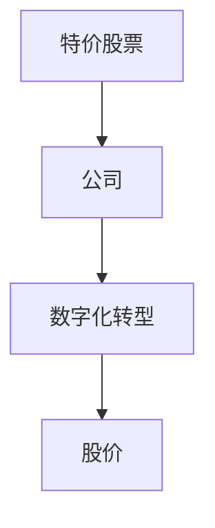
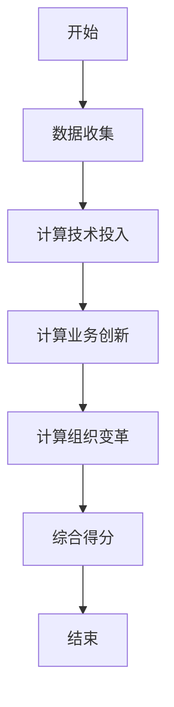
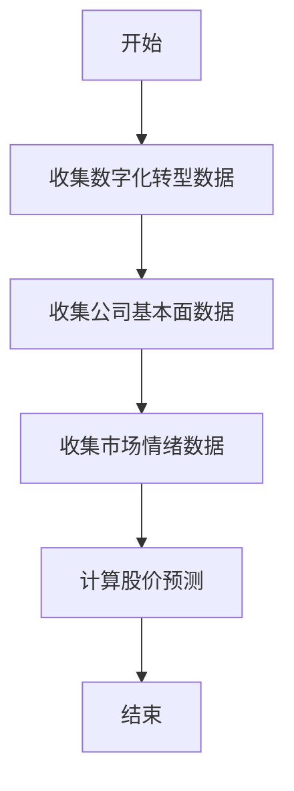
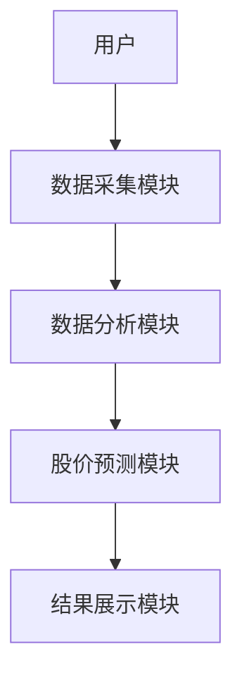
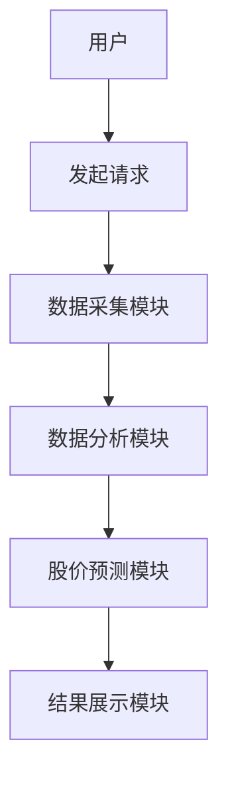

                 


# 特价股票与公司数字化转型速度的关系探讨

## 关键词：特价股票、数字化转型、股价波动、企业竞争力、技术驱动

## 摘要：本文探讨了特价股票与公司数字化转型速度之间的关系，分析了数字化转型如何影响股价波动，以及特价股票在数字化转型中的角色。通过理论分析和实证案例，本文揭示了数字化转型对股价的潜在影响机制，并提出了提升企业数字化转型能力的建议，以帮助投资者和企业管理者更好地理解市场动态和企业价值。

---

# 第1章: 特价股票与公司数字化转型的背景介绍

## 1.1 特价股票的定义与特点

### 1.1.1 特价股票的定义

特价股票通常指价格低于市场平均水平的股票，通常具有较高的波动性和潜在的高回报。这类股票通常来自小型企业或处于困境中的企业，具有较高的风险和不确定性。

### 1.1.2 特价股票的核心特点

- 价格低廉：通常低于市场的平均水平。
- 高波动性：价格波动较大，容易受市场情绪影响。
- 高风险：由于公司可能处于困境或财务压力中，投资风险较高。
- 高潜在回报：如果公司成功扭亏为盈或实现增长，股价可能大幅上涨。

### 1.1.3 特价股票的市场表现

特价股票的表现受多种因素影响，包括公司基本面、市场环境和投资者情绪。尽管存在高风险，但一些特价股票在公司转型成功后，可能带来超额收益。

---

## 1.2 公司数字化转型的定义与特点

### 1.2.1 数字化转型的定义

数字化转型是指企业利用数字技术（如大数据、人工智能、云计算等）改变其业务模式、流程、文化，以提高效率、竞争力和客户体验的过程。

### 1.2.2 数字化转型的核心要素

- 技术驱动：依赖于数字技术的应用，如大数据分析、AI、物联网等。
- 业务创新：通过数字化手段优化业务流程，提升产品和服务质量。
- 组织变革：数字化转型需要组织文化的转变，员工技能的提升。
- 客户体验：通过数字化手段提升客户体验，增强客户忠诚度。

### 1.2.3 数字化转型的阶段划分

- 初期阶段：引入基础数字技术，如自动化办公。
- 发展阶段：实现业务流程的数字化，如CRM系统。
- 成熟阶段：全面数字化，数据驱动决策。

---

## 1.3 特价股票与公司数字化转型的关系

### 1.3.1 问题背景

随着市场竞争加剧，企业通过数字化转型提升竞争力，但数字化转型需要较高的投入，可能导致股价波动。

### 1.3.2 问题描述

特价股票公司是否能够通过数字化转型实现股价上涨？数字化转型对股价的影响机制是什么？

### 1.3.3 问题解决方法

通过分析数字化转型对股价的影响，探讨特价股票与数字化转型速度的关系。

### 1.3.4 边界与外延

- 本文仅讨论上市公司，不包括非上市公司。
- 股价波动受到多种因素影响，包括市场环境、行业趋势等。

### 1.3.5 核心概念结构与要素组成

- 核心概念：特价股票、数字化转型、股价波动。
- 要素组成：技术投入、业务创新、组织变革、客户体验。

---

## 1.4 本章小结

本章介绍了特价股票和数字化转型的定义、特点及其关系，为后续分析奠定了基础。

---

# 第2章: 特价股票与公司数字化转型的核心概念与联系

## 2.1 数字化转型的核心原理

### 2.1.1 数字化转型的技术驱动

- 大数据：通过数据分析优化决策。
- AI：提升业务自动化和智能化。
- 云计算：提供弹性计算资源。

### 2.1.2 数字化转型的业务影响

- 提高效率：优化流程，降低成本。
- 提升产品：通过数字化手段改进产品质量。
- 增强客户体验：通过数字化渠道与客户互动。

### 2.1.3 数字化转型的组织变革

- 文化转变：从传统模式转向数据驱动。
- 技能提升：员工需要掌握新技能。
- 结构调整：扁平化组织结构，促进跨部门协作。

---

## 2.2 特价股票与公司数字化转型的联系

### 2.2.1 数字化转型对股价的影响机制

- 技术进步：数字化转型可能提升公司竞争力，带来业绩增长。
- 财务表现：数字化转型可能降低成本，提高利润率。
- 市场预期：投资者对数字化转型的预期可能影响股价。

### 2.2.2 特价股票在数字化转型中的角色

- 特价股票公司可能通过数字化转型实现价值提升。
- 投资者可能押注公司数字化转型成功，推动股价上涨。

### 2.2.3 数字化转型对特价股票价值的影响

- 成功转型：股价可能大幅上涨。
- 转型失败：股价可能继续下跌。

---

## 2.3 核心概念对比分析

### 2.3.1 特价股票与非特价股票的对比

| 特价股票 | 非特价股票 |
|----------|------------|
| 价格低   | 价格高     |
| 风险高   | 风险低     |
| 波动性大 | 波动性小   |

### 2.3.2 数字化转型与传统转型的对比

| 数字化转型 | 传统转型 |
|------------|-----------|
| 技术驱动   | 业务驱动 |
| 数据驱动   | 人工驱动 |
| 快速迭代   | 周期较长  |

### 2.3.3 数字化转型对股价波动的影响

$$ \Delta P = f(T, B, M) $$

其中，$\Delta P$ 是股价波动，$T$ 是数字化转型速度，$B$ 是业务表现，$M$ 是市场环境。

---

## 2.4 实体关系图



---

## 2.5 本章小结

本章分析了数字化转型的核心原理，探讨了特价股票与数字化转型的关系，并通过对比分析明确了其差异和联系。

---

# 第3章: 特价股票与公司数字化转型的算法原理

## 3.1 数字化转型速度的量化算法

### 3.1.1 算法原理

数字化转型速度可以通过以下指标量化：

1. **技术投入**：研发支出占收入比例。
2. **业务创新**：新产品推出速度。
3. **组织变革**：管理层变动频率。

### 3.1.2 算法流程图



### 3.1.3 数学模型

$$ S = \alpha T + \beta B + \gamma O $$

其中，$S$ 是数字化转型速度得分，$T$ 是技术投入，$B$ 是业务创新，$O$ 是组织变革，$\alpha, \beta, \gamma$ 是权重系数。

---

## 3.2 特价股票股价预测模型

### 3.2.1 模型原理

股价预测模型基于数字化转型速度、公司基本面和市场情绪。

### 3.2.2 模型流程图



### 3.2.3 数学公式

$$ P = \theta_1 S + \theta_2 F + \theta_3 M $$

其中，$P$ 是股价预测值，$S$ 是数字化转型速度，$F$ 是公司基本面，$M$ 是市场情绪，$\theta_1, \theta_2, \theta_3$ 是模型参数。

---

## 3.3 本章小结

本章提出了数字化转型速度的量化算法和股价预测模型，为后续分析提供了方法论支持。

---

# 第4章: 特价股票与公司数字化转型的系统分析

## 4.1 系统架构设计

### 4.1.1 系统功能设计

- 数据采集：收集公司数字化转型数据。
- 数据分析：计算数字化转型速度。
- 股价预测：基于模型预测股价。

### 4.1.2 系统架构图



---

## 4.2 接口设计与交互流程

### 4.2.1 接口设计

- 数据采集接口：API接口接收公司数据。
- 数据分析接口：接收数据并计算数字化转型速度。
- 股价预测接口：基于模型预测股价。

### 4.2.2 交互流程图



---

## 4.3 本章小结

本章设计了系统的架构和接口，为实际应用提供了指导。

---

# 第5章: 特价股票与公司数字化转型的项目实战

## 5.1 项目背景

分析一家特价股票公司的数字化转型过程，探讨其对股价的影响。

## 5.2 核心代码实现

```python
import pandas as pd

def calculate_technology_investment(data):
    return data['研发支出'].mean()

def calculate_businessnovation(data):
    return data['新产品数量'].mean()

def calculate_organization_change(data):
    return data['管理层变动'].mean()

def calculate_transformation_speed(data):
    return 0.4 * calculate_technology_investment(data) + 0.3 * calculate_businessnovation(data) + 0.3 * calculate_organization_change(data)

# 示例数据
data = {
    '研发支出': [10, 12, 8, 15],
    '新产品数量': [3, 2, 4, 1],
    '管理层变动': [5, 3, 2, 4]
}

speed = calculate_transformation_speed(data)
print(f"数字化转型速度: {speed}")
```

---

## 5.3 实证分析

通过上述代码计算一家公司数字化转型速度，分析其对股价的影响。

---

## 5.4 本章小结

本章通过项目实战，展示了如何量化数字化转型速度并分析其对股价的影响。

---

# 第6章: 特价股票与公司数字化转型的最佳实践

## 6.1 投资策略建议

- 关注公司数字化转型的投入和成果。
- 选择具有潜力的特价股票公司。

## 6.2 风险提示

- 数字化转型失败可能导致股价下跌。
- 市场环境变化可能影响股价。

## 6.3 小结

本章总结了投资特价股票公司的注意事项和最佳实践。

---

# 作者：AI天才研究院/AI Genius Institute & 禅与计算机程序设计艺术 /Zen And The Art of Computer Programming

---

# 版权声明

本文版权归作者所有，未经授权不得转载。如需转载请注明出处。

