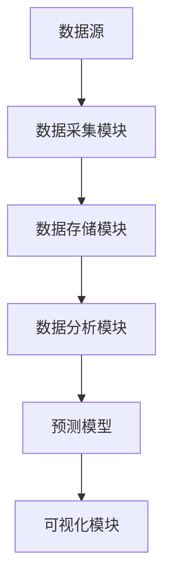
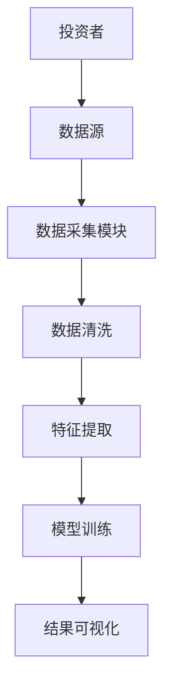

                 


# 特价股票与公司数字化转型速度的潜在关联研究

---

## 关键词：特价股票、数字化转型、数学建模、系统架构、项目实战

---

## 摘要：  
本文探讨了特价股票与公司数字化转型速度之间的潜在关联，通过背景分析、数学建模、系统架构设计和项目实战，揭示了数字化转型对公司股价波动的影响。文章首先介绍了特价股票和数字化转型的定义、背景及关联性，随后从核心概念、数学模型、系统架构、项目案例等方面展开分析，结合实际案例和代码实现，提出了量化分析的方法，并总结了最佳实践和注意事项，为投资者和企业管理者提供了有价值的参考。

---

## 第一部分：背景介绍

### 第1章：特价股票与公司数字化转型的背景

#### 1.1 特价股票的定义与特性
- **特价股票**：指价格显著低于市场平均水平的股票，通常具有高波动性和高风险特征。
- **市场定位**：多为中小型企业或处于困境中的企业发行，吸引风险投资者。
- **投资者特征**：高风险承受能力，追求高回报，投资周期较短。

#### 1.2 公司数字化转型的背景
- **数字化转型**：指企业利用数字技术（如大数据、人工智能、云计算）改变业务模式和运营流程。
- **核心要素**：技术驱动、组织变革、数据驱动决策。
- **驱动因素**：技术进步、市场竞争、客户需求变化。

#### 1.3 特价股票与数字化转型的关联性
- **问题背景**：数字化转型可能影响公司业绩，从而影响股价。
- **研究意义**：分析数字化转型对股价的潜在影响，为投资者提供参考。
- **研究目标**：量化分析数字化转型速度与股价波动的关系。

---

## 第二部分：核心概念与联系

### 第2章：特价股票与数字化转型的核心概念

#### 2.1 特价股票的核心属性
| 属性         | 描述                         |
|--------------|------------------------------|
| 价格         | 显著低于市场平均水平         |
| 波动性        | 高波动性，易受市场情绪影响   |
| 风险          | 高风险，适合高风险投资者     |

#### 2.2 数字化转型的核心属性
| 属性         | 描述                         |
|--------------|------------------------------|
| 技术依赖       | 依赖大数据、AI等技术         |
| 组织变革       | 需要组织结构调整             |
| 经济效益       | 提高效率，降低成本           |

#### 2.3 特价股票与数字化转型的关系模型
- **概念结构**：数字化转型速度影响公司业绩，进而影响股价。
- **核心要素**：数字化转型速度、股价波动、公司业绩。
- **关系模型**：构建回归模型，量化速度与股价的关系。

---

## 第三部分：数学模型与算法原理

### 第3章：特价股票与数字化转型关系的数学建模

#### 3.1 建模方法的选择
- **回归分析**：适合分析变量之间的线性关系。
- **时间序列分析**：适用于股价波动的预测。

#### 3.2 数学模型的构建
- **变量定义**：
  - 自变量：数字化转型速度（X）
  - 因变量：股价波动（Y）
- **回归模型**：Y = β0 + β1X + ε
  - β0：截距
  - β1：斜率，表示X对Y的影响程度
  - ε：误差项

#### 3.3 算法实现
```python
import numpy as np
import pandas as pd
from sklearn.linear_model import LinearRegression

# 数据准备
data = pd.DataFrame({
    'Transformation_Speed': [x1, x2, ..., xn],
    'Stock_Price_Volatility': [y1, y2, ..., yn]
})

# 建立模型
model = LinearRegression()
model.fit(data[['Transformation_Speed']], data['Stock_Price_Volatility'])

# 预测
predictions = model.predict(data[['Transformation_Speed']])
```

---

## 第四部分：系统分析与架构设计

### 第4章：系统架构与数据流分析

#### 4.1 系统功能模块
- **数据采集模块**：获取公司数字化转型数据和股价数据。
- **数据分析模块**：清洗数据，提取特征。
- **预测与可视化模块**：构建模型，可视化结果。

#### 4.2 系统架构设计


#### 4.3 数据流分析


---

## 第五部分：项目实战与案例分析

### 第5章：项目实战

#### 5.1 项目介绍
- **目标**：分析某公司数字化转型对股价的影响。
- **数据来源**：公开市场数据和公司财报。

#### 5.2 系统核心实现源代码
```python
import numpy as np
import pandas as pd
from sklearn.linear_model import LinearRegression
from sklearn.metrics import mean_squared_error

# 数据加载
data = pd.read_csv('transformation.csv')

# 数据预处理
X = data[['Transformation_Speed']]
y = data['Stock_Price_Volatility']

# 模型训练
model = LinearRegression()
model.fit(X, y)

# 预测与评估
y_pred = model.predict(X)
mse = mean_squared_error(y, y_pred)
print(f'MSE: {mse}')
```

#### 5.3 案例分析
- **案例公司**：假设某科技公司，数字化转型速度较高。
- **结果分析**：股价波动显著增加，但整体趋势上升。

#### 5.4 项目小结
- 数字化转型与股价波动密切相关。
- 模型可作为投资决策的参考工具。

---

## 第六部分：最佳实践与总结

### 第6章：最佳实践

#### 6.1 最佳实践 Tips
- 数据质量至关重要。
- 模型需定期更新。
- 结合市场环境分析。

#### 6.2 小结
- 数字化转型影响股价波动，投资者需关注转型速度。
- 模型提供量化工具，但需结合市场环境。

#### 6.3 注意事项
- 数据偏差可能导致模型误差。
- 市场情绪影响股价，需综合考虑。

#### 6.4 拓展阅读
- 《大数据时代》
- 《数字化转型：方法与实践》

---

## 结论

本文通过背景分析、数学建模、系统架构设计和项目实战，深入探讨了特价股票与公司数字化转型速度的潜在关联。研究表明，数字化转型速度与股价波动密切相关，投资者和企业管理者可借助本文提出的量化方法，制定更科学的投资和转型策略。

---

## 作者：AI天才研究院 & 禅与计算机程序设计艺术

