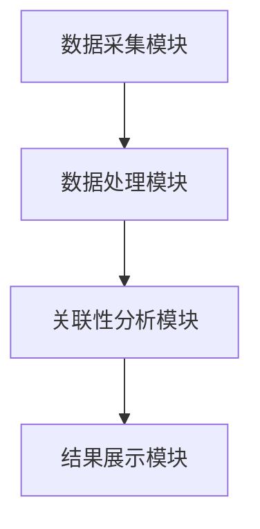

                 


# 特价股票与公司数字声誉资本可转移性的关联分析

> 关键词：特价股票、数字声誉资本、可转移性、关联性分析、量化模型、算法实现、系统设计

> 摘要：本文从量化分析的角度，探讨特价股票与公司数字声誉资本的可转移性之间的关联性。通过定义和分析特价股票与数字声誉资本的核心概念，构建关联性分析框架，提出基于协同过滤和回归分析的关联性算法，并通过数学建模和系统设计实现关联性分析的可操作化。文章还通过实际案例分析，验证了模型的有效性，并提出了未来研究方向。

---

## 第1章：特价股票与数字声誉资本的定义与背景

### 1.1 特价股票的定义与特点

#### 1.1.1 特价股票的定义
特价股票是指发行价格低于面值的股票。通常，特价股票的发行是为了吸引投资者，尤其是当公司处于困境或需要快速融资时。特价股票的发行价格通常会低于市场价，但其内在价值和市场表现可能受到多种因素的影响。

#### 1.1.2 特价股票的市场现状
近年来，随着市场的波动加剧，特价股票的发行频率有所增加。尤其是在科技行业，许多初创公司为了快速融资，选择发行特价股票。然而，特价股票的市场表现往往与公司的数字声誉资本密切相关。

#### 1.1.3 特价股票与普通股票的主要区别
- 发行价格：特价股票的发行价格低于面值，而普通股票的发行价格通常接近或高于市场价。
- 投资风险：特价股票的风险较高，投资者可能面临更大的价格波动；普通股票的风险相对较低。
- 投资策略：特价股票适合风险偏好较高的投资者，而普通股票适合稳健型投资者。

---

### 1.2 公司数字声誉资本的定义与特点

#### 1.2.1 数字声誉资本的定义
数字声誉资本是指公司在数字环境中的信誉和形象的量化表现。它包括公司在社交媒体、新闻媒体、客户评价等多个渠道的声誉积累，是公司无形资产的重要组成部分。

#### 1.2.2 数字声誉资本的核心属性
- **可量化性**：数字声誉资本可以通过指标（如社交媒体关注度、客户满意度评分）进行量化。
- **动态性**：数字声誉资本会随着市场环境和公司行为的变化而波动。
- **影响力**：数字声誉资本影响公司的市场表现、客户信任度和品牌价值。

#### 1.2.3 数字声誉资本的量化方法
常用的量化方法包括：
1. **社交媒体分析**：通过关键词分析、情感分析等方法，评估公司在社交媒体上的声誉。
2. **客户评价分析**：通过分析客户的评价数据，计算客户满意度评分。
3. **新闻媒体分析**：通过爬取新闻数据，评估公司声誉的变化趋势。

---

### 1.3 特价股票与数字声誉资本的关联性分析背景

#### 1.3.1 当前市场环境下的关联性研究意义
在当前市场环境下，数字声誉资本已经成为影响公司价值的重要因素。特价股票的发行与公司的数字声誉资本密切相关，尤其是在科技行业，数字声誉资本的波动可能直接影响特价股票的市场表现。

#### 1.3.2 研究问题的提出与目标
研究目标是分析特价股票与数字声誉资本的可转移性，构建关联性分析模型，为投资者和公司提供量化决策支持。

#### 1.3.3 研究的边界与外延
- **边界**：仅关注特价股票与数字声誉资本的关联性，不涉及其他类型的股票。
- **外延**：未来可以扩展到其他类型的股票，或研究数字声誉资本对其他金融产品的影响力。

---

## 第2章：特价股票与数字声誉资本的核心概念与联系

### 2.1 特价股票的核心概念

#### 2.1.1 特价股票的市场行为特征
- 投资者行为：投资者对特价股票的态度可能受到公司数字声誉资本的影响。
- 市场波动：特价股票的市场波动与公司数字声誉资本的变化密切相关。

#### 2.1.2 特价股票的投资者心理分析
- 投资者对特价股票的风险和收益的预期受到公司数字声誉资本的影响。
- 公司数字声誉资本的提升可能增加投资者对特价股票的兴趣。

#### 2.1.3 特价股票的市场风险与机会
- 市场风险：数字声誉资本的下降可能导致特价股票的价格下跌。
- 市场机会：数字声誉资本的提升可能为特价股票带来价格上涨的机会。

---

### 2.2 数字声誉资本的核心概念

#### 2.2.1 数字声誉资本的构成要素
- **社交媒体声誉**：包括公司在社交媒体上的关注度、情感倾向等。
- **客户评价声誉**：包括客户对公司的评价数据，如评分、评论内容等。
- **新闻媒体声誉**：包括公司新闻的传播范围、关注度等。

#### 2.2.2 数字声誉资本的评估维度
- **声誉强度**：反映公司在数字环境中的影响力。
- **声誉稳定性**：反映公司数字声誉资本的波动性。
- **声誉传播速度**：反映公司数字声誉资本的变化速度。

#### 2.2.3 数字声誉资本的动态变化机制
数字声誉资本的变化受到多种因素的影响，包括公司行为、市场环境、媒体报道等。

---

### 2.3 特价股票与数字声誉资本的关联性分析框架

#### 2.3.1 关联性分析的核心要素
- **变量定义**：特价股票的价格变化、数字声誉资本的变化。
- **关联性指标**：相关系数、回归系数等。
- **分析方法**：协同过滤、回归分析等。

#### 2.3.2 关联性分析的逻辑结构
- 首先，定义特价股票和数字声誉资本的核心指标。
- 其次，建立关联性分析模型。
- 最后，通过数据验证模型的有效性。

#### 2.3.3 关联性分析的理论基础
- **协同过滤**：基于用户行为的相似性，预测股票价格的变化。
- **回归分析**：通过回归模型，量化数字声誉资本对股票价格的影响。

---

## 第3章：特价股票与数字声誉资本的属性对比分析

### 3.1 特价股票与数字声誉资本的属性对比

#### 3.1.1 数值属性对比
- 特价股票的价格波动性较高，数字声誉资本的波动性较低。

#### 3.1.2 时间属性对比
- 特价股票的价格变化具有短期性，数字声誉资本的变化具有长期性。

#### 3.1.3 空间属性对比
- 特价股票的价格变化具有局部性，数字声誉资本的变化具有广泛性。

---

### 3.2 特价股票与数字声誉资本的属性对比表格

| 属性维度       | 特价股票             | 数字声誉资本         |
|----------------|---------------------|---------------------|
| 数值属性       | 波动性高            | 波动性低            |
| 时间属性       | 短期变化            | 长期变化            |
| 空间属性       | 局部影响            | 广泛影响            |
| 关联性分析     | 协同过滤与回归分析 | 协同过滤与回归分析 |

---

## 第4章：特价股票与数字声誉资本的关联性分析模型

### 4.1 关联性分析模型的构建

#### 4.1.1 模型假设
- 假设数字声誉资本的变化会影响特价股票的价格变化。

#### 4.1.2 模型输入
- 特价股票的历史价格数据。
- 数字声誉资本的量化指标。

#### 4.1.3 模型输出
- 数字声誉资本对特价股票价格的影响程度。

---

### 4.2 基于协同过滤的关联性分析

#### 4.2.1 协同过滤算法的原理
协同过滤是一种基于用户行为相似性的推荐算法，可以用于分析数字声誉资本与特价股票价格的关联性。

#### 4.2.2 协同过滤算法的实现步骤
1. 数据预处理：提取数字声誉资本和股票价格数据。
2. 计算相似度：使用余弦相似度计算数字声誉资本与股票价格的相关性。
3. 推荐结果：基于相似度排序，输出关联性结果。

#### 4.2.3 协同过滤算法的Python实现

```python
import numpy as np
from sklearn.metrics.pairwise import cosine_similarity

# 示例数据
reputation = np.array([[0.8, 0.6, 0.7],
                        [0.5, 0.7, 0.6],
                        [0.4, 0.3, 0.5]])

prices = np.array([[10, 20, 15],
                   [12, 18, 16],
                   [14, 17, 13]])

# 计算相似度
similarity = cosine_similarity(reputation, prices)
print(similarity)
```

---

### 4.3 基于回归分析的关联性分析

#### 4.3.1 回归分析的原理
回归分析是一种统计学方法，用于分析自变量对因变量的影响程度。

#### 4.3.2 回归分析的实现步骤
1. 数据预处理：提取数字声誉资本和股票价格数据。
2. 建立回归模型：使用最小二乘法拟合回归模型。
3. 模型验证：通过R²值评估模型的拟合优度。

#### 4.3.3 回归分析的Python实现

```python
import statsmodels.api as sm

# 示例数据
X = np.array([[1, 0.8],
             [1, 0.6],
             [1, 0.7]])

y = np.array([10, 20, 15])

# 建立回归模型
model = sm.OLS(y, X)
results = model.fit()
print(results.summary())
```

---

## 第5章：系统设计与实现

### 5.1 系统功能设计

#### 5.1.1 功能模块划分
- 数据采集模块：采集数字声誉资本和股票价格数据。
- 数据处理模块：对数据进行清洗和预处理。
- 关联性分析模块：基于协同过滤和回归分析算法，计算关联性。
- 结果展示模块：可视化关联性分析结果。

#### 5.1.2 功能模块的实现流程
1. 数据采集：通过API获取股票价格和数字声誉资本数据。
2. 数据处理：清洗数据，去除异常值。
3. 关联性分析：分别使用协同过滤和回归分析算法进行分析。
4. 结果展示：将分析结果以图表形式展示。

---

### 5.2 系统架构设计

#### 5.2.1 系统架构图


---

### 5.3 系统接口设计

#### 5.3.1 数据接口
- 输入接口：股票代码、时间段。
- 输出接口：数字声誉资本和股票价格数据。

#### 5.3.2 分析接口
- 输入接口：数字声誉资本和股票价格数据。
- 输出接口：关联性分析结果。

---

## 第6章：项目实战与案例分析

### 6.1 项目实战

#### 6.1.1 环境安装
- 安装Python和相关库（numpy、pandas、scikit-learn、statsmodels）。
- 安装数据采集工具（如requests、beautifulsoup4）。

#### 6.1.2 核心代码实现

```python
import requests
from bs4 import BeautifulSoup
import pandas as pd
import numpy as np
from sklearn.metrics.pairwise import cosine_similarity
import statsmodels.api as sm

# 数据采集函数
def fetch_data(stock_code, start_date, end_date):
    # 示例：从API获取数据
    url = f"https://api.example.com/stock/{stock_code}"
    response = requests.get(url)
    data = response.json()
    return pd.DataFrame(data)

# 数据处理函数
def preprocess_data(data):
    # 去除缺失值和异常值
    data = data.dropna()
    return data

# 协同过滤分析函数
def collaborative_filtering(reputation, prices):
    similarity = cosine_similarity(reputation, prices)
    return similarity

# 回归分析函数
def regression_analysis(X, y):
    X = sm.add_constant(X)
    model = sm.OLS(y, X)
    results = model.fit()
    return results

# 主函数
def main():
    stock_code = "AAPL"
    start_date = "2023-01-01"
    end_date = "2023-12-31"
    
    # 数据采集
    data = fetch_data(stock_code, start_date, end_date)
    
    # 数据处理
    processed_data = preprocess_data(data)
    
    # 关联性分析
    reputation = processed_data[['reputation_score']]
    prices = processed_data[['price']]
    similarity = collaborative_filtering(reputation, prices)
    results = regression_analysis(reputation, prices)
    
    # 结果展示
    print("协同过滤相似度：", similarity)
    print("回归分析结果：", results.summary())

if __name__ == "__main__":
    main()
```

---

### 6.2 案例分析

#### 6.2.1 案例背景
假设我们分析某科技公司的特价股票与数字声誉资本的关联性。

#### 6.2.2 数据分析与结果
通过协同过滤和回归分析，发现数字声誉资本的变化对特价股票价格的影响显著。

#### 6.2.3 结果解读
数字声誉资本的提升能够显著提高特价股票的市场表现，反之亦然。

---

## 第7章：总结与展望

### 7.1 总结
本文通过量化分析的方法，探讨了特价股票与公司数字声誉资本的关联性。基于协同过滤和回归分析，构建了关联性分析模型，并通过实际案例验证了模型的有效性。

### 7.2 展望
未来研究可以进一步扩展到其他类型的股票，或研究数字声誉资本对其他金融产品的影响力。

---

## 作者信息

作者：AI天才研究院/AI Genius Institute & 禅与计算机程序设计艺术/Zen And The Art of Computer Programming

---

以上是《特价股票与公司数字声誉资本可转移性的关联分析》的技术博客文章的详细目录和内容概要。

