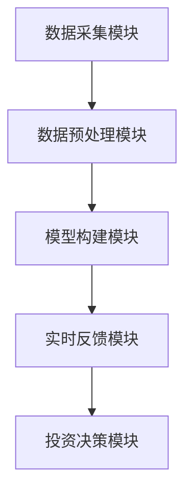

                 


```markdown
# 特价股票与公司数字孪生技术应用水平的潜在联系

> 关键词：数字孪生技术、特价股票、股票市场分析、实时数据、虚拟建模、金融技术

> 摘要：本文探讨了数字孪生技术在特价股票分析中的潜在应用，通过介绍数字孪生技术的基本概念和原理，分析特价股票市场的特点，详细讲解数字孪生技术在股票分析中的算法原理和系统设计，最后通过案例展示数字孪生技术如何帮助投资者优化股票投资策略。

---

## 第一章: 特价股票与数字孪生技术的背景介绍

### 1.1 特价股票的定义与特点

#### 1.1.1 特价股票的定义
特价股票通常指的是价格低于市场平均水平的股票，这类股票通常具有较高的波动性和潜在的高回报率。它们吸引着短期投资者和投机者，但也伴随着较高的风险。

#### 1.1.2 特价股票市场的特点
- **高波动性**：特价股票的价格波动较大，容易受到市场情绪和突发事件的影响。
- **高流动性**：虽然价格低，但交易量可能较大，尤其是在市场波动剧烈时。
- **高风险**：由于价格波动大，投资者可能面临较大的本金损失风险。

#### 1.1.3 特价股票的投资价值
尽管风险较高，特价股票在某些情况下可能提供较高的回报。例如，一些被市场低估的公司股票可能具有潜在的上升空间。

### 1.2 数字孪生技术的定义与特点

#### 1.2.1 数字孪生技术的定义
数字孪生技术是一种通过数字模型实时反映物理实体状态的技术。它利用实时数据和建模技术，构建虚拟的数字模型，以实现对物理世界的实时监控和优化。

#### 1.2.2 数字孪生技术的核心要素
- **实时数据采集**：通过传感器和其他数据源实时采集物理世界的动态数据。
- **模型构建与仿真**：基于数据构建数学模型，并进行仿真分析，预测系统的未来状态。
- **实时反馈与优化**：根据仿真结果，提供实时反馈，并优化系统的运行策略。

#### 1.2.3 数字孪生技术的应用场景
- **工业自动化**：实时监控生产线，优化生产流程。
- **智慧城市**：管理交通、能源等城市资源，提高城市运行效率。
- **金融领域**：分析金融市场动态，优化投资策略。

### 1.3 特价股票与数字孪生技术的潜在联系

#### 1.3.1 联系的背景与问题描述
随着金融市场的日益复杂化，投资者需要更高效的工具来分析和预测股票价格走势。数字孪生技术通过实时数据和建模分析，为股票市场分析提供了新的可能性。

#### 1.3.2 联系的核心概念与目标
数字孪生技术的目标是通过实时数据和模型仿真，帮助投资者更好地理解和预测特价股票的市场动态，从而优化投资策略。

#### 1.3.3 联系的边界与外延
数字孪生技术的应用范围不仅限于股票市场，还可以扩展到其他金融市场和经济领域。

---

## 第二章: 数字孪生技术的核心原理

### 2.1 数字孪生技术的原理

#### 2.1.1 数据采集与处理
数字孪生技术首先需要实时采集物理世界的数据，包括股票价格、市场指数、公司财务数据等。这些数据经过清洗和预处理后，为后续的建模和分析提供基础。

#### 2.1.2 模型构建与仿真
基于采集的数据，构建数学模型，模拟股票市场的动态变化。常用的模型包括时间序列分析模型和机器学习模型。

#### 2.1.3 实时反馈与优化
根据模型的仿真结果，提供实时反馈，并优化投资策略，以应对市场变化。

### 2.2 数字孪生技术的核心要素对比

#### 2.2.1 数据源对比
- **股票市场数据**：包括股票价格、成交量、市场指数等。
- **公司财务数据**：包括收入、利润、资产负债表等。

#### 2.2.2 模型复杂度对比
- **简单模型**：如移动平均模型，适用于短期预测。
- **复杂模型**：如ARIMA和LSTM模型，适用于长期预测。

#### 2.2.3 应用场景对比
- **股票价格预测**：利用数字孪生技术预测股票价格走势。
- **风险管理**：通过实时监控和模型仿真，降低投资风险。

### 2.3 数字孪生技术的ER实体关系图

```mermaid
erDiagram
    company : 公司
    stock : 股票
    data : 数据
    model : 模型
    simulation : 仿真
    company --> data 
    data --> model 
    model --> simulation 
```

---

## 第三章: 数字孪生技术在股票分析中的应用

### 3.1 算法原理讲解

#### 3.1.1 时间序列分析

##### 3.1.1.1 ARIMA模型
ARIMA（自回归积分滑动平均模型）是一种常用的时间序列预测模型。其数学公式如下：

$$ ARIMA(p, d, q) $$

其中：
- \( p \) 是自回归的阶数。
- \( d \) 是差分的阶数。
- \( q \) 是滑动平均的阶数。

##### 3.1.1.2 LSTM模型
长短时记忆网络（LSTM）是一种特殊的RNN（循环神经网络），适用于长序列数据的预测。其核心结构包括输入门、遗忘门和输出门。

#### 3.1.2 机器学习模型

##### 3.1.2.1 线性回归模型
线性回归模型用于预测股票价格的变化趋势：

$$ y = \beta_0 + \beta_1 x + \epsilon $$

##### 3.1.2.2 支持向量机模型
支持向量机（SVM）通过构建超平面来分类数据，适用于股票市场的分类预测。

### 3.2 数学模型与公式

#### 3.2.1 ARIMA模型的公式

$$ ARIMA(p, d, q) $$

#### 3.2.2 LSTM模型的公式

$$ f_{t} = \sigma(W_f \cdot [h_{t-1}, x_t] + b_f) $$

其中：
- \( f_{t} \) 是输入门。
- \( W_f \) 是输入门的权重矩阵。
- \( h_{t-1} \) 是前一时刻的隐藏状态。
- \( x_t \) 是当前时刻的输入数据。
- \( b_f \) 是输入门的偏置。
- \( \sigma \) 是sigmoid函数。

---

## 第四章: 系统分析与架构设计

### 4.1 系统功能设计

#### 4.1.1 数据采集模块
负责实时采集股票市场数据，包括股票价格、成交量等。

#### 4.1.2 模型构建模块
基于采集的数据，构建和训练预测模型，如ARIMA和LSTM模型。

#### 4.1.3 实时反馈模块
根据模型的预测结果，提供实时反馈，并优化投资策略。

### 4.2 系统架构设计



---

## 第五章: 项目实战

### 5.1 环境安装

```bash
pip install numpy pandas scikit-learn tensorflow
```

### 5.2 核心代码实现

```python
import numpy as np
import pandas as pd
from sklearn.metrics import mean_squared_error
from tensorflow.keras.models import Sequential
from tensorflow.keras.layers import LSTM, Dense

# 数据加载与预处理
data = pd.read_csv('stock_data.csv')
train_data = data.iloc[:1000]
test_data = data.iloc[1000:]

# 数据分割
x_train = train_data['price'].values.reshape(-1, 1, 1)
y_train = train_data['next_price'].values.reshape(-1, 1)
x_test = test_data['price'].values.reshape(-1, 1, 1)
y_test = test_data['next_price'].values.reshape(-1, 1)

# 模型构建
model = Sequential()
model.add(LSTM(50, input_shape=(1, 1)))
model.add(Dense(1))
model.compile(loss='mean_squared_error', optimizer='adam')

# 模型训练
model.fit(x_train, y_train, epochs=50, batch_size=32)

# 模型预测
y_pred = model.predict(x_test)
```

### 5.3 案例分析与详细讲解

通过上述代码，我们可以训练一个基于LSTM的股票价格预测模型，并对测试数据进行预测。预测结果可以与实际数据进行对比，评估模型的准确性。

### 5.4 项目小结

通过本项目，我们展示了如何利用数字孪生技术中的实时数据采集和模型构建，来预测特价股票的价格走势，帮助投资者优化投资策略。

---

## 第六章: 最佳实践与总结

### 6.1 小结

数字孪生技术在特价股票分析中的应用潜力巨大。通过实时数据采集和模型构建，投资者可以更好地理解和预测股票市场的动态，从而优化投资策略。

### 6.2 注意事项

- 数据质量：确保数据的准确性和完整性。
- 模型选择：根据具体情况选择合适的模型。
- 风险管理：合理控制投资风险。

### 6.3 拓展阅读

- 《股票市场分析与预测》
- 《数字孪生技术在金融领域的应用》

---

## 作者信息

作者：AI天才研究院/AI Genius Institute & 禅与计算机程序设计艺术 /Zen And The Art of Computer Programming
```

