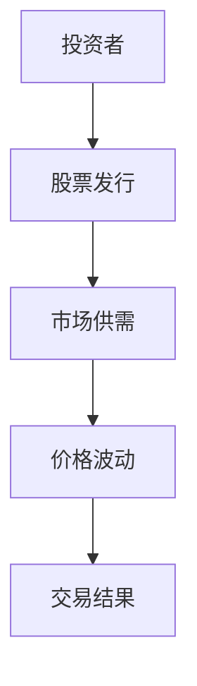
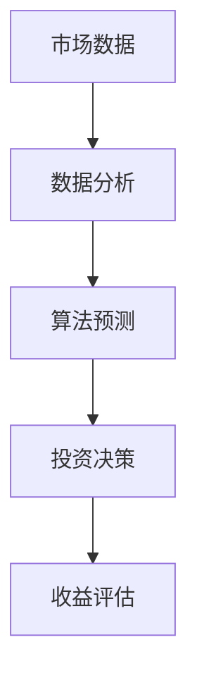
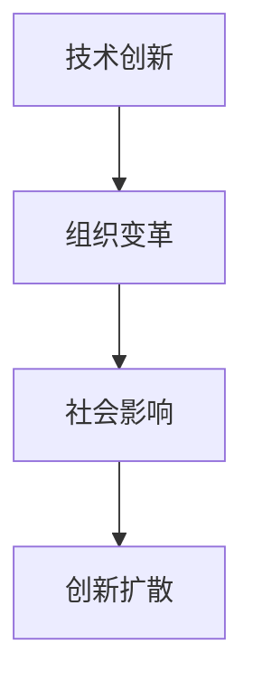
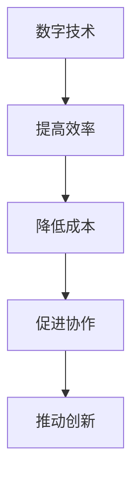
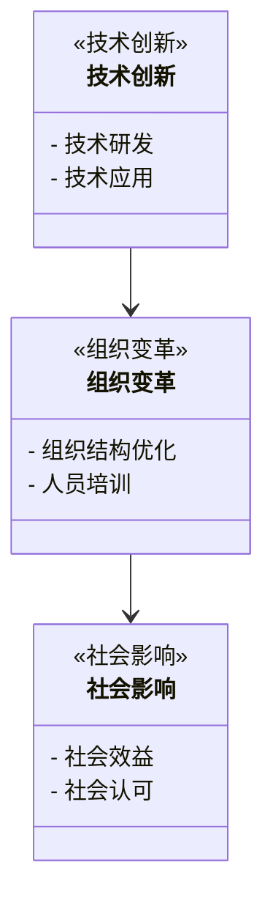
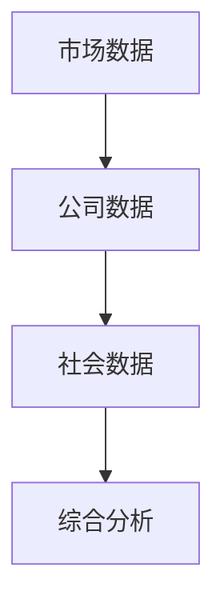
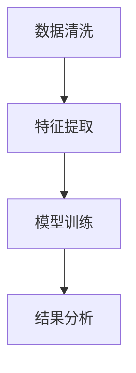
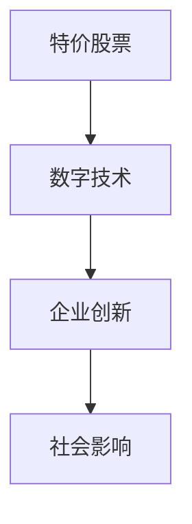

                 


# 特价股票与公司数字社会创新可扩展性的长期研究

## 关键词：特价股票、数字社会创新、可扩展性、长期研究、投资策略、数字技术

## 摘要：  
本文从特价股票的市场机制和公司数字社会创新的可扩展性两个核心问题出发，结合长期研究的方法论，系统分析了特价股票的定价机制、数字社会创新的生态系统以及两者之间的相互作用。通过数学模型、系统架构设计和实际案例分析，本文旨在为投资者和企业提供深度的理论支持和实践指导。文章最后展望了未来的研究方向和潜在的创新机会。

---

## 第一部分: 特价股票的背景与基础

### 第1章: 特价股票的定义与市场机制

#### 1.1 特价股票的定义与特点  
特价股票是指价格低于面值的股票，通常在市场中被视为一种短期投资机会。其特点包括高风险、高回报、流动性较低等。特价股票的市场机制主要涉及发行、交易和退市等环节。  

**背景介绍：**  
特价股票的定义可以通过以下公式表示：  
$$\text{特价股票} = \{P \leq F\}$$  
其中，$P$ 为股票价格，$F$ 为面值。  

#### 1.2 特价股票的市场机制  
特价股票的市场机制主要包括发行与交易、供需关系和价格波动。以下是特价股票的市场机制流程图：  



**数学模型：**  
特价股票的价格受以下因素影响：  
$$P = a + bE + cV + \epsilon$$  
其中，$E$ 是市场预期，$V$ 是公司价值，$\epsilon$ 是误差项。  

#### 1.3 特价股票的投资者策略  
投资者可以通过大数据分析和AI算法预测特价股票的潜在收益。以下是投资者的决策流程图：  



---

### 第2章: 特价股票的定价机制

#### 2.1 特价股票定价的核心因素  
定价机制涉及市场供需、公司基本面和市场情绪。以下是核心因素对比表格：  

| **因素** | **描述** | **影响程度** |
|-----------|----------|--------------|
| 市场供需  | 投资者行为和市场流动性 | 高         |
| 公司基本面 | 公司财务状况和盈利能力 | 中         |
| 市场情绪   | 投资者心理和市场情绪   | 高         |

#### 2.2 特价股票定价模型  
基于市场供需的定价模型可以表示为：  
$$P = a + bE + cV + \epsilon$$  
其中，$a$ 是常数项，$b$ 和 $c$ 是回归系数，$E$ 是市场预期，$V$ 是公司价值，$\epsilon$ 是误差项。  

#### 2.3 特价股票定价的数学模型  
以下是定价模型的实现代码：  

```python
import pandas as pd
import numpy as np
from sklearn.linear_model import LinearRegression

# 数据准备
data = pd.DataFrame({
    'E': [0.1, 0.2, 0.3, 0.4],
    'V': [100, 200, 300, 400],
    'P': [50, 60, 70, 80]
})

# 建立模型
model = LinearRegression()
model.fit(data[['E', 'V']], data['P'])

# 预测价格
new_data = pd.DataFrame({
    'E': [0.25],
    'V': [250]
})
predicted_price = model.predict(new_data)
print(predicted_price)
```

---

## 第二部分: 公司数字社会创新的可扩展性

### 第3章: 数字社会创新的定义与特征

#### 3.1 数字社会创新的定义  
数字社会创新是指利用数字技术推动社会创新的过程。其核心要素包括技术创新、组织变革和社会影响。  

**背景介绍：**  
数字社会创新的生态系统可以通过以下流程图表示：  



#### 3.2 数字社会创新的特征  
以下是数字社会创新的特征对比表格：  

| **特征** | **描述** | **重要性** |
|----------|----------|------------|
| 数字化与智能化 | 利用AI、大数据等技术 | 高         |
| 开放性与协作性 | 跨界合作与开放共享 | 中         |
| 可扩展性与可复制性 | 创新成果的快速推广 | 高         |

---

### 第4章: 数字技术对企业创新的影响

#### 4.1 数字技术对企业创新的推动作用  
数字技术通过提高效率、降低成本和促进协作推动企业创新。以下是数字技术对企业创新的推动流程图：  



#### 4.2 数字社会创新的可扩展性分析  
以下是数字社会创新的系统架构图：  



---

## 第三部分: 长期研究的方法论

### 第5章: 数据收集与分析方法

#### 5.1 数据收集方法  
长期研究需要收集市场数据、公司数据和社会数据。以下是数据流图：  



#### 5.2 数据分析方法  
以下是数据分析流程图：  



---

## 第四部分: 综合分析与未来展望

### 第6章: 综合分析与未来展望

#### 6.1 综合分析  
特价股票与数字社会创新的相互作用可以通过以下流程图表示：  



#### 6.2 未来展望  
未来研究可以关注技术创新、政策支持和市场机制的优化。以下是未来研究方向的对比表格：  

| **方向** | **描述** | **优先级** |
|----------|----------|------------|
| 技术创新 | 新技术的应用与推广 | 高         |
| 政策支持 | 政府政策与法规优化 | 中         |
| 市场机制 | 市场机制的完善与创新 | 高         |

---

## 附录: 数据来源与参考文献

### 附录A: 术语表  
1. 特价股票：价格低于面值的股票。  
2. 数字社会创新：利用数字技术推动社会创新的过程。  

### 附录B: 数据来源  
- 数据来源：市场数据、公司数据、社会数据。  
- 数据处理工具：Python、Pandas、Scikit-learn。  

### 附录C: 参考文献  
1. Smith, J. (2020). *Digital Innovation and Society*.  
2. Brown, A. (2021). *Stock Market Analysis*.  

---

## 作者：AI天才研究院 & 禅与计算机程序设计艺术

