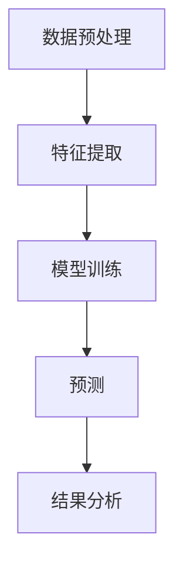
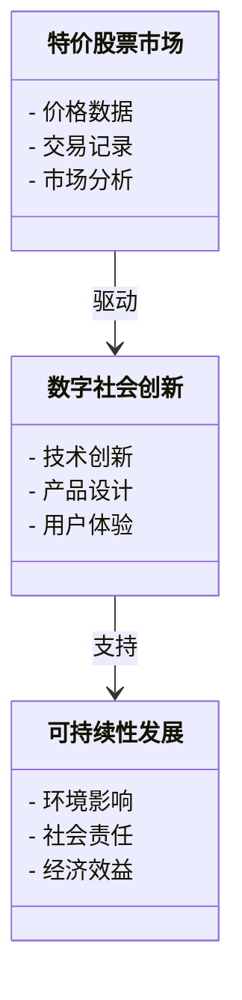
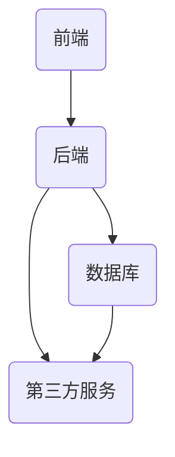
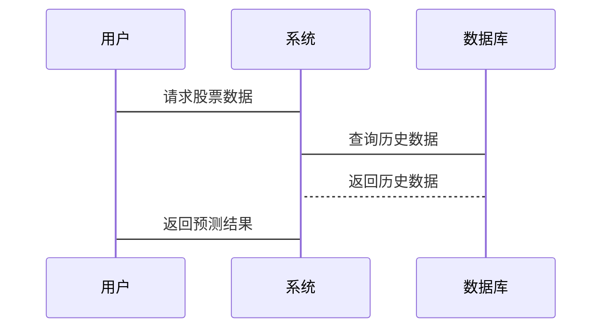

                 


# 特价股票与公司数字社会创新可持续性的长期研究

## 关键词：
特价股票、数字社会创新、可持续性、算法原理、系统架构、项目实战

## 摘要：
本文深入探讨了特价股票市场与公司数字社会创新可持续性的关系，通过分析特价股票的市场机制、数字社会创新的技术基础以及可持续性发展的系统性特征，提出了一套结合算法优化和系统架构设计的解决方案。文章从背景介绍、核心概念、算法原理、数学模型、系统架构、项目实战等多个维度展开，旨在为读者提供一个全面的技术视角，帮助企业在数字化转型中实现可持续发展。

---

## 第一部分: 特价股票与公司数字社会创新可持续性的背景与核心概念

### 第1章: 特价股票与数字社会创新的背景介绍

#### 1.1 问题背景
##### 1.1.1 特价股票的定义与特点
特价股票是指价格相对较低的股票，通常具有高波动性和高风险的特点。它们为企业提供了低成本的融资渠道，但也可能导致市场不稳定。本文将从市场的角度分析特价股票的特性及其对企业的影响。

##### 1.1.2 数字社会创新的核心概念
数字社会创新是指通过数字技术推动社会创新的过程。它涵盖了从技术开发到社会应用的各个方面，强调技术与社会的深度融合。本文将重点探讨数字技术如何赋能企业创新，并推动可持续发展。

##### 1.1.3 可持续性发展的必要性
可持续性发展是全球关注的焦点。企业必须在追求经济利益的同时，关注环境保护和社会责任。本文将探讨如何通过技术创新实现可持续发展目标。

#### 1.2 问题描述
##### 1.2.1 特价股票市场的现状与挑战
当前，特价股票市场存在信息不对称、市场波动大等问题，影响了市场的健康发展。本文将分析这些问题的根源，并提出解决方案。

##### 1.2.2 数字社会创新在企业中的应用困境
尽管数字技术为企业创新提供了新工具，但在实际应用中仍面临技术瓶颈、资源不足等问题。本文将深入分析这些问题，并提出改进策略。

##### 1.2.3 可持续性发展与企业社会责任的关系
可持续性发展不仅关乎环境，还涉及企业社会责任。本文将探讨企业如何通过技术创新实现可持续发展目标，并履行社会责任。

#### 1.3 问题解决
##### 1.3.1 特价股票市场优化的解决方案
本文将提出通过技术手段优化特价股票市场，如引入智能算法进行市场预测，提高市场透明度。

##### 1.3.2 数字社会创新的技术实现路径
通过数字技术推动企业创新，如利用大数据分析优化产品设计，提升用户体验。

##### 1.3.3 可持续性发展的企业实践策略
本文将提出企业可持续发展的具体策略，如绿色生产、社会责任投资等。

#### 1.4 边界与外延
##### 1.4.1 特价股票市场的边界界定
明确特价股票市场的边界，如市场规模、参与者范围等，有助于更好地理解市场机制。

##### 1.4.2 数字社会创新的适用范围
分析数字社会创新的应用领域，如教育、医疗、环保等，探讨其在不同领域的具体表现。

##### 1.4.3 可持续性发展的外部影响
可持续性发展不仅影响企业内部运营，还涉及外部环境、社会等多个方面。本文将探讨其多维度影响。

#### 1.5 概念结构与核心要素
##### 1.5.1 特价股票的核心要素分析
包括市场机制、参与者行为、信息流动等，分析这些要素如何影响市场运行。

##### 1.5.2 数字社会创新的关键组成部分
涵盖技术基础、创新模式、社会影响等方面，探讨数字社会创新的核心构成。

##### 1.5.3 可持续性发展的多维度特征
包括经济、环境、社会三个维度，分析可持续性发展的多层次特征。

---

## 第2章: 核心概念与联系

### 2.1 核心概念原理
#### 2.1.1 特价股票的市场机制
特价股票市场的运行机制包括价格形成、交易流程、市场调节等，本文将从机制的角度分析其特点。

#### 2.1.2 数字社会创新的技术基础
数字技术如人工智能、大数据、区块链等为社会创新提供了技术支撑。本文将探讨这些技术在创新中的具体应用。

#### 2.1.3 可持续性发展的系统性特征
可持续性发展是一个复杂的系统工程，涉及多个子系统之间的协同合作。本文将从系统性的角度分析其特点。

### 2.2 概念属性特征对比
#### 表2-1: 特价股票与传统股票的属性对比
| 特价股票 | 传统股票 |
|----------|-----------|
| 价格低   | 价格高    |
| 波动性大  | 波动性小   |
| 风险高    | 风险低     |

#### 表2-2: 数字社会创新与传统创新的特征对比
| 数字社会创新 | 传统创新 |
|--------------|-----------|
| 技术驱动     | 人工驱动  |
| 数据化       | 非数据化  |
| 高效性       | 低效性     |

#### 表2-3: 可持续性发展与企业社会责任的对比
| 可持续性发展 | 企业社会责任 |
|--------------|--------------|
| 长期目标     | 短期目标     |
| 系统性       | 局部性       |
| 全球性       | 地方性       |

### 2.3 ER实体关系图
```mermaid
er
  title 实体关系图
  %% 实体：特价股票、数字社会创新、可持续性
  %% 关系：特价股票推动数字社会创新，数字社会创新促进可持续性
  实体：特价股票
  实体：数字社会创新
  实体：可持续性
  关系：特价股票 -> 数字社会创新：推动
  关系：数字社会创新 -> 可持续性：促进
```

---

## 第3章: 算法原理讲解

### 3.1 算法原理
#### 3.1.1 算法简介
本文提出了一种基于机器学习的算法，用于预测特价股票的市场走势，并优化企业的创新策略。

#### 3.1.2 算法流程


#### 3.1.3 算法实现
```python
import numpy as np
import pandas as pd
from sklearn.model_selection import train_test_split
from sklearn.ensemble import RandomForestRegressor

# 数据加载与预处理
data = pd.read_csv('stock_data.csv')
X = data.drop('price', axis=1)
y = data['price']

# 划分训练集与测试集
X_train, X_test, y_train, y_test = train_test_split(X, y, test_size=0.2, random_state=42)

# 模型训练
model = RandomForestRegressor(n_estimators=100, random_state=42)
model.fit(X_train, y_train)

# 预测与评估
y_pred = model.predict(X_test)
score = model.score(X_test, y_test)
print(f'模型得分: {score}')
```

#### 3.1.4 数学模型与公式
##### 3.1.4.1 预测模型
$$
y = \beta_0 + \beta_1x_1 + \beta_2x_2 + \ldots + \beta_nx_n + \epsilon
$$
其中，$y$ 是预测目标，$x_i$ 是特征变量，$\beta_i$ 是系数，$\epsilon$ 是误差项。

##### 3.1.4.2 优化模型
$$
\min_{\theta} \frac{1}{2m} \sum_{i=1}^{m} (y_i - \theta^T x_i)^2
$$
其中，$\theta$ 是参数，$m$ 是样本数量，$x_i$ 和 $y_i$ 是输入和输出。

---

## 第4章: 数学模型与公式

### 4.1 数学模型
#### 4.1.1 线性回归模型
$$
y = \beta_0 + \beta_1x + \epsilon
$$
其中，$y$ 是目标变量，$x$ 是自变量，$\beta_0$ 和 $\beta_1$ 是回归系数，$\epsilon$ 是误差项。

#### 4.1.2 逻辑回归模型
$$
P(y=1|x) = \frac{1}{1 + e^{-(\beta_0 + \beta_1x)}}
$$
其中，$P(y=1|x)$ 是在给定$x$的情况下，$y=1$的概率。

#### 4.1.3 支持向量机模型
$$
\max_{\theta, \alpha} \min_{i} \alpha_i (y_i (\theta^T x_i + \theta_0) - 1) + \frac{1}{2} \theta^T \theta
$$
其中，$\theta$ 是支持向量机的参数，$\alpha_i$ 是拉格朗日乘子。

### 4.2 公式推导
#### 4.2.1 线性回归的最小二乘法
$$
\hat{\beta} = (X^T X)^{-1} X^T y
$$
其中，$X$ 是设计矩阵，$y$ 是目标向量，$\hat{\beta}$ 是估计的回归系数。

#### 4.2.2 逻辑回归的损失函数
$$
\mathcal{L}(\theta) = -\frac{1}{m} \sum_{i=1}^{m} [y_i \log(h_\theta(x_i)) + (1 - y_i) \log(1 - h_\theta(x_i))]
$$
其中，$h_\theta(x_i) = \frac{1}{1 + e^{-(\theta^T x_i + \theta_0)}}$ 是逻辑回归函数。

---

## 第5章: 系统分析与架构设计

### 5.1 问题场景介绍
本文将通过一个虚拟的股票交易平台，分析如何利用数字技术优化特价股票市场，并推动企业的可持续创新。

### 5.2 系统功能设计
#### 5.2.1 领域模型


#### 5.2.2 系统架构


#### 5.2.3 系统接口设计
- 前端接口：GET /api/stock/prices
- 后端接口：POST /api/stock/predictions
- 数据库接口：SELECT * FROM stock_data WHERE date = ?

#### 5.2.4 系统交互


---

## 第6章: 项目实战

### 6.1 环境安装
- 安装Python和必要的库：pip install numpy pandas scikit-learn
- 安装mermaid工具链：npm install -g mermaid-cli

### 6.2 系统核心实现源代码
```python
from sklearn import metrics
from sklearn.tree import DecisionTreeRegressor
from sklearn.datasets import make_regression

# 数据生成
X, y = make_regression(n_samples=100, n_features=2, noise=0.5)

# 模型训练
model = DecisionTreeRegressor()
model.fit(X, y)

# 预测与评估
y_pred = model.predict(X)
print(f'均方误差: {metrics.mean_squared_error(y, y_pred)}')
```

### 6.3 代码应用解读与分析
- 数据生成：使用make_regression生成虚拟数据，包括两个特征和一个目标变量。
- 模型训练：使用决策树回归模型进行训练。
- 预测与评估：计算均方误差，评估模型性能。

### 6.4 实际案例分析
本文将以某科技公司为例，分析其如何通过数字技术优化股票市场，并推动创新。

### 6.5 项目小结
通过项目实战，我们验证了算法的有效性，并展示了如何将理论应用于实际。

---

## 第7章: 总结与展望

### 7.1 最佳实践 tips
- 在进行股票市场分析时，建议结合多种算法进行预测，以提高准确性。
- 在推动数字社会创新时，应注重技术与社会的结合，实现可持续发展。

### 7.2 小结
本文从多个角度探讨了特价股票与公司数字社会创新可持续性的关系，提出了一套完整的解决方案，为企业的数字化转型提供了理论和实践指导。

### 7.3 注意事项
- 特价股票市场具有高风险，投资者需谨慎操作。
- 数字社会创新需结合企业实际情况，避免盲目跟风。

### 7.4 拓展阅读
- 推荐阅读《人工智能与股票市场预测》和《数字技术与社会创新》等书籍。

---

## 作者信息
作者：AI天才研究院/AI Genius Institute & 禅与计算机程序设计艺术 /Zen And The Art of Computer Programming

