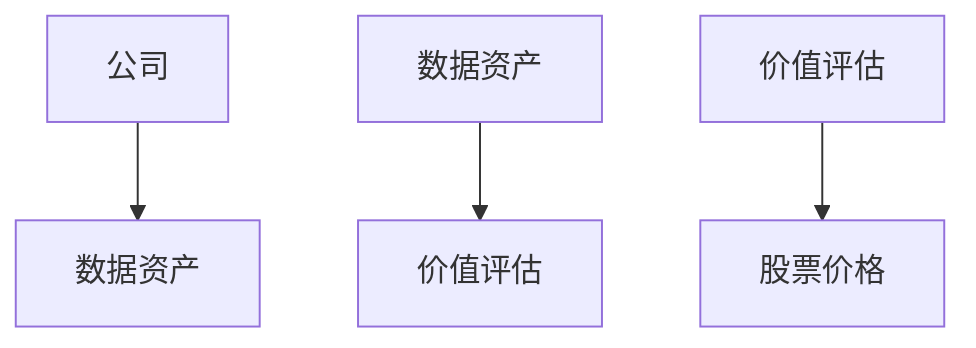
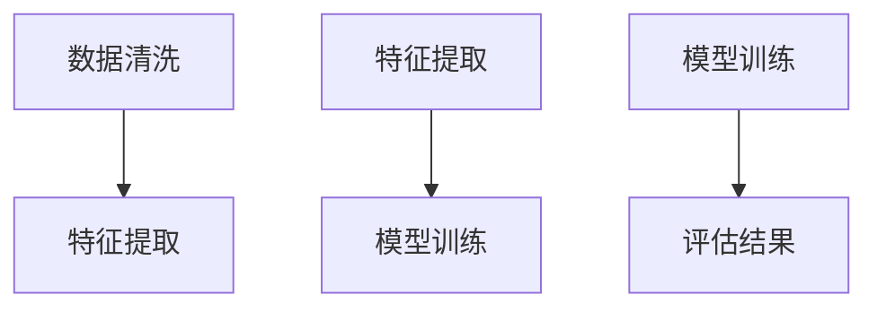
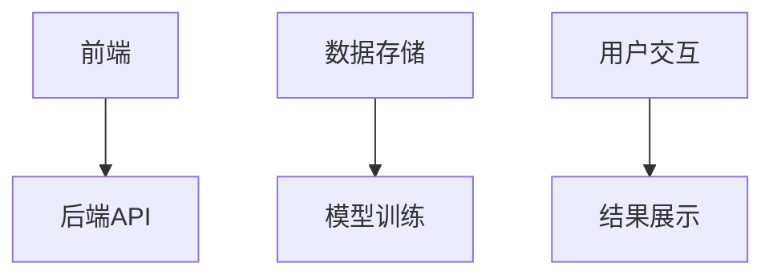
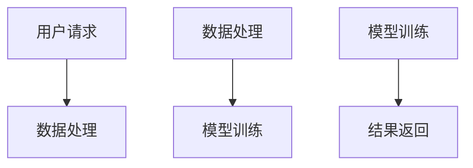

                 


# 特价股票与公司数据主权价值网络的评估

> 关键词：特价股票、数据主权、价值网络、股票评估、数据价值

> 摘要：本文将深入探讨特价股票与公司数据主权价值网络的评估方法，分析数据主权对股票价值的影响，介绍评估的算法原理、系统架构设计以及项目实战。通过详细的案例分析和代码实现，帮助读者理解如何利用数据主权构建股票评估模型，提升投资决策的准确性。

---

# 第一部分: 特价股票与公司数据主权价值网络的评估基础

# 第1章: 特价股票与公司数据主权价值网络的概述

## 1.1 特价股票的基本概念

### 1.1.1 特价股票的定义
特价股票是指在特定时间或特定市场条件下，价格低于其内在价值的股票。这些股票通常被认为具有较大的上涨潜力，吸引投资者关注。

### 1.1.2 特价股票的特征
- **低估值**：市盈率、市净率等指标低于行业平均水平。
- **高增长潜力**：公司基本面良好，未来盈利预期较高。
- **市场流动性**：交易量相对较小，市场关注度较低。

### 1.1.3 特价股票的分类
- **周期性股票**：受经济周期影响较大的股票。
- **成长型股票**：未来增长潜力大的股票。
- **价值型股票**：市场价格低于其内在价值的股票。

## 1.2 数据主权与价值网络的概念

### 1.2.1 数据主权的定义
数据主权是指公司对其数据的控制权和使用权，包括数据的收集、存储、处理和分发等环节。

### 1.2.2 数据主权的核心要素
- **数据所有权**：公司对数据的合法拥有权。
- **数据使用权**：公司对数据的合法使用权限。
- **数据管理权**：公司对数据的管理和控制权。

### 1.2.3 价值网络的构建原理
价值网络是指通过数据主权的管理和利用，构建一个能够评估公司价值的网络体系。该网络通过数据的流动和交换，实现对公司价值的动态评估。

## 1.3 特价股票与数据主权的关系

### 1.3.1 特价股票与数据主权的关联性
数据主权影响公司价值，从而影响股票价格。拥有强大数据主权的公司，其股票更可能成为特价股票。

### 1.3.2 数据主权对股票价值的影响
- **数据资产化**：数据成为公司的重要资产，提升公司整体价值。
- **风险管理**：强大的数据主权能够降低数据泄露等风险，增强投资者信心。
- **竞争优势**：通过数据主权，公司在市场中获得竞争优势。

### 1.3.3 特价股票评估的背景与意义
在当前数字经济时代，数据主权对公司价值的影响日益显著。评估特价股票时，必须考虑公司数据主权的强弱，以确保评估结果的准确性。

## 1.4 本章小结
本章主要介绍了特价股票的基本概念、数据主权的定义及其对股票价值的影响，为后续的评估方法奠定了基础。

---

# 第2章: 特价股票评估的核心概念与联系

## 2.1 数据主权价值网络的实体关系图



## 2.2 特价股票评估的算法原理



## 2.3 算法原理的数学模型

### 2.3.1 线性回归模型
$$ y = \beta_0 + \beta_1x + \epsilon $$

其中：
- $y$ 是目标变量（股票价格）。
- $x$ 是自变量（公司数据主权相关指标）。
- $\beta_0$ 和 $\beta_1$ 是回归系数。
- $\epsilon$ 是误差项。

### 2.3.2 随机森林模型
$$ y = \sum_{i=1}^{n} (a_i x_i + b_i) $$

其中：
- $n$ 是决策树的数量。
- $a_i$ 和 $b_i$ 是每棵决策树的系数。
- $x_i$ 是输入特征。

## 2.4 本章小结
本章通过实体关系图和算法流程图，详细介绍了特价股票评估的核心概念和算法原理，为后续的系统设计提供了理论基础。

---

# 第3章: 特价股票评估的系统分析与架构设计

## 3.1 问题场景介绍

### 3.1.1 特价股票评估的业务场景
投资者需要通过数据主权评估公司价值，从而找到具有潜在上涨空间的特价股票。

### 3.1.2 数据主权价值网络的系统目标
构建一个能够实时评估公司数据主权价值的网络系统，为投资者提供可靠的决策支持。

### 3.1.3 系统的输入输出分析
- **输入**：公司数据、市场数据、用户查询。
- **输出**：公司数据主权评估结果、股票价值预测。

## 3.2 系统功能设计

### 3.2.1 数据采集模块
负责收集公司数据、市场数据等。

### 3.2.2 数据处理模块
对数据进行清洗、转换和特征提取。

### 3.2.3 模型训练模块
利用机器学习算法对数据进行建模和训练。

### 3.2.4 结果展示模块
将评估结果以可视化形式展示给用户。

## 3.3 系统架构设计



## 3.4 系统接口设计

### 3.4.1 数据接口
- **输入**：公司ID。
- **输出**：公司数据详情。

### 3.4.2 模型接口
- **输入**：数据特征。
- **输出**：评估结果。

### 3.4.3 结果接口
- **输入**：用户查询。
- **输出**：评估报告。

## 3.5 系统交互流程



## 3.6 本章小结
本章详细设计了系统的功能模块和架构，为后续的项目实施提供了指导。

---

# 第4章: 特价股票评估的项目实战

## 4.1 环境安装与配置

### 4.1.1 Python环境搭建
安装Python 3.8及以上版本，推荐使用Anaconda。

### 4.1.2 数据库安装
安装MySQL或PostgreSQL，用于存储数据。

### 4.1.3 开发工具配置
安装Jupyter Notebook、PyCharm等开发工具。

## 4.2 数据采集与预处理

### 4.2.1 数据源选择
选择可靠的金融数据源，如Yahoo Finance。

### 4.2.2 数据清洗代码
```python
import pandas as pd

# 加载数据
data = pd.read_csv('stock_data.csv')

# 删除缺失值
data_clean = data.dropna()

# 查看数据分布
print(data_clean.describe())
```

## 4.3 特征工程与模型训练

### 4.3.1 特征提取
```python
from sklearn.feature_selection import SelectKBest

# 提取特征
selector = SelectKBest(k=10)
selected_features = selector.fit_transform(data_clean, target)
```

### 4.3.2 模型训练
```python
from sklearn.ensemble import RandomForestRegressor

# 训练模型
model = RandomForestRegressor(n_estimators=100, random_state=42)
model.fit(selected_features, target)
```

## 4.4 项目实战总结

### 4.4.1 最佳实践
- 数据清洗时，注意处理异常值。
- 特征提取时，选择相关性高的特征。
- 模型训练时，进行交叉验证。

### 4.4.2 小结
通过项目实战，我们掌握了从数据采集到模型训练的全过程，为后续的应用提供了宝贵经验。

### 4.4.3 注意事项
- 数据隐私问题，确保数据处理符合相关法律法规。
- 模型的泛化能力，避免过拟合。

## 4.5 本章小结
本章通过实际项目，详细讲解了特价股票评估的全过程，包括环境搭建、数据处理、模型训练和结果分析。

---

# 第5章: 总结与展望

## 5.1 总结
本文从背景介绍、核心概念、算法原理、系统设计到项目实战，全面探讨了特价股票与公司数据主权价值网络的评估方法。通过理论与实践相结合，为投资者提供了可靠的决策支持。

## 5.2 展望
未来，随着人工智能和大数据技术的发展，数据主权在股票评估中的作用将更加显著。建议进一步研究数据主权的量化评估方法，以及如何利用区块链技术提升数据安全。

---

# 作者：AI天才研究院/AI Genius Institute & 禅与计算机程序设计艺术 /Zen And The Art of Computer Programming

---

这篇文章通过详细的分析和代码实现，帮助读者全面理解特价股票与公司数据主权价值网络的评估方法。

