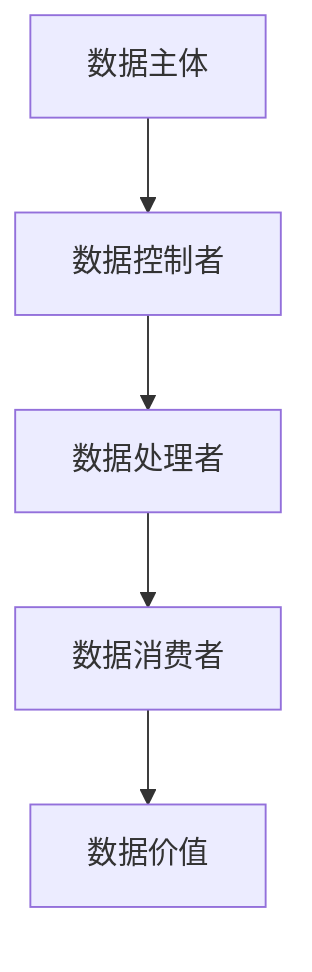
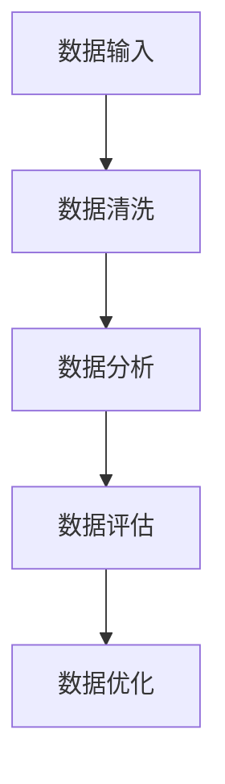
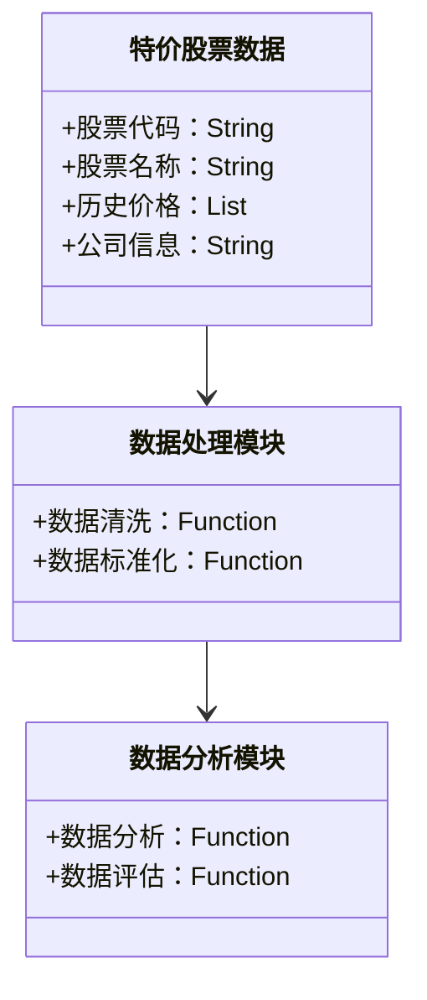
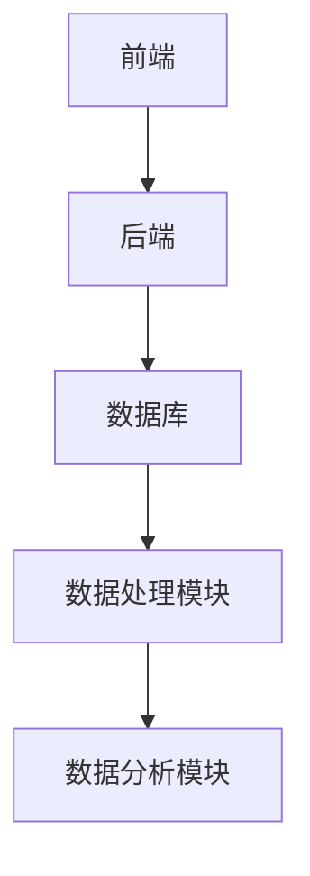

                 


# 特价股票与公司数据主权价值链的评估

> **关键词**: 特价股票、数据主权、价值链、公司数据、评估模型

> **摘要**: 本文探讨了特价股票与公司数据主权价值链的评估方法，通过分析数据主权的核心概念、价值链的构成以及评估模型的设计，结合实际案例，详细阐述了如何利用数据主权来优化特价股票的评估过程，以实现企业价值的最大化。

---

## 第1章 特价股票与数据主权的背景介绍

### 1.1 特价股票的定义与特点

#### 1.1.1 特价股票的定义
特价股票是指价格相对较低的股票，通常具有较高的波动性和潜在的高回报率。这类股票通常属于小盘股或中盘股，且可能处于成长阶段或面临一定的市场风险。

#### 1.1.2 特价股票的核心特点
- **低估值**：市场价格低于其内在价值。
- **高波动性**：价格波动较大，受市场情绪影响显著。
- **潜在高回报**：通过价值回归或公司成长，可能带来超额收益。
- **高风险**：存在较大的市场风险和公司经营风险。

#### 1.1.3 特价股票与普通股票的区别
| 属性 | 特价股票 | 普通股票 |
|------|----------|----------|
| 价格 | 通常较低 | 价格较高 |
| 波动性 | 较高     | 较低     |
| 风险 | 高       | 中低     |
| 投资策略 | 价值投资 | 稳定收益 |

### 1.2 数据主权的定义与特点

#### 1.2.1 数据主权的定义
数据主权是指个人、企业或国家对其数据的完全控制和支配权利。它强调数据的合法性和合规性，确保数据在收集、存储、处理和使用过程中符合相关法律法规。

#### 1.2.2 数据主权的核心特点
- **合法性**：数据的收集和使用必须符合相关法律法规。
- **透明性**：数据的处理过程必须透明，用户有权了解数据的使用方式。
- **可控性**：数据主体可以控制其数据的使用和共享。
- **安全性**：数据必须得到充分的保护，防止未经授权的访问和滥用。

#### 1.2.3 数据主权与数据隐私的区别
| 属性 | 数据主权 | 数据隐私 |
|------|----------|----------|
| 定义 | 数据的合法所有权 | 数据的私密性和机密性 |
| 范围 | 包括数据的使用、存储和共享 | 关注数据的保密性 |
| 目标 | 确保数据的合法性和合规性 | 保护个人隐私不被侵犯 |

### 1.3 特价股票与数据主权的关系

#### 1.3.1 特价股票与数据主权的关联性
- **数据驱动决策**：投资者可以通过分析公司的数据来评估其股票的价值。
- **合规性影响**：公司的数据合规性直接影响其市场形象和投资者信心。
- **风险管理**：数据主权的保护可以降低公司的法律风险，从而影响股票的价值。

#### 1.3.2 数据主权对特价股票价值的影响
- **合规性提升**：公司通过加强数据主权，可以提升其市场信任度，从而提高股票价值。
- **风险降低**：数据主权的保护可以降低公司因数据泄露或滥用而面临的风险，从而稳定股票价格。
- **竞争优势**：在数据驱动的经济中，具备强大数据主权的公司可能具备竞争优势，从而推动股价上涨。

#### 1.3.3 特价股票在数据主权价值链中的地位
特价股票作为数据主权价值链中的重要组成部分，其价值评估需要考虑公司的数据资产、合规性、透明度等因素。通过对数据主权的评估，投资者可以更准确地判断特价股票的潜在价值和风险。

### 1.4 本章小结
本章介绍了特价股票和数据主权的基本概念及其特点，并分析了两者之间的关系。数据主权是影响特价股票价值的重要因素，通过对数据主权的评估，投资者可以更好地做出投资决策。

---

## 第2章 数据主权价值链的核心概念

### 2.1 数据主权价值链的定义

#### 2.1.1 数据主权价值链的定义
数据主权价值链是指从数据的生成、收集、处理、分析到最终应用的整个过程中的价值创造和传递链路。它强调数据的全生命周期管理，确保数据的合法性和合规性。

#### 2.1.2 数据主权价值链的核心要素
- **数据生成**：数据的来源和生成方式。
- **数据收集**：数据的采集和存储。
- **数据处理**：数据的清洗、转换和整合。
- **数据分析**：数据的挖掘和洞察提取。
- **数据应用**：数据的商业化应用和价值实现。

### 2.2 数据主权价值链的构成模型

#### 2.2.1 数据采集与处理
- **数据采集**：通过各种渠道收集数据，包括API接口、爬虫技术等。
- **数据清洗**：去除无效数据，处理缺失值和异常值。
- **数据标准化**：将数据转换为统一的格式，便于后续分析。

#### 2.2.2 数据分析与评估
- **数据分析**：利用统计方法和机器学习算法对数据进行分析，提取有用的信息和洞察。
- **数据评估**：根据分析结果，评估数据的价值和潜在风险。

#### 2.2.3 数据应用与价值实现
- **数据应用**：将分析结果应用于实际业务中，例如优化运营、提升客户体验等。
- **价值实现**：通过数据的应用，实现商业价值的最大化。

### 2.3 数据主权价值链的实体关系图



### 2.4 本章小结
本章详细阐述了数据主权价值链的构成和核心要素，并通过实体关系图展示了数据在价值链中的流动过程。数据的全生命周期管理是实现数据主权的重要保障。

---

## 第3章 数据主权价值链的评估方法

### 3.1 数据主权价值链的评估框架

#### 3.1.1 数据完整性评估
- **数据完整性**：确保数据的准确性和一致性。
- **评估方法**：通过数据清洗和标准化来提升数据的完整性。

#### 3.1.2 数据准确性评估
- **数据准确性**：确保数据的来源可靠，内容无误。
- **评估方法**：通过交叉验证和数据校验来提升数据的准确性。

#### 3.1.3 数据可用性评估
- **数据可用性**：确保数据可以被顺利访问和处理。
- **评估方法**：通过数据备份和容灾技术来提升数据的可用性。

### 3.2 数据主权价值链的评估指标

#### 3.2.1 数据质量指标
- **完整性**：数据是否完整，无缺失。
- **准确性**：数据是否准确，无误。
- **一致性**：数据是否一致，无矛盾。

#### 3.2.2 数据安全指标
- **安全性**：数据是否受到充分的保护，防止未经授权的访问。
- **合规性**：数据的处理是否符合相关法律法规。

#### 3.2.3 数据合规性指标
- **合法性**：数据的收集和使用是否合法。
- **透明性**：数据的处理过程是否透明，用户是否知情。

### 3.3 数据主权价值链的评估流程



### 3.4 本章小结
本章介绍了数据主权价值链的评估框架和指标，并通过流程图展示了评估的步骤。数据的完整性、准确性和可用性是确保数据主权的重要因素。

---

## 第4章 特价股票与数据主权价值链的结合

### 4.1 特价股票数据的采集与处理

#### 4.1.1 特价股票数据的采集方法
- **API接口**：通过金融数据提供商的API获取股票数据。
- **爬虫技术**：通过网络爬虫获取公开的股票信息。

#### 4.1.2 数据清洗与预处理
- **数据清洗**：去除无效数据，处理缺失值和异常值。
- **数据标准化**：将数据转换为统一的格式，便于后续分析。

### 4.2 特价股票数据的分析与评估

#### 4.2.1 数据分析方法
- **统计分析**：计算股票的平均收益率、波动率等指标。
- **机器学习**：使用回归分析、聚类分析等方法预测股票价格。

#### 4.2.2 数据评估模型
- **价值评估**：通过数据分析，评估股票的内在价值。
- **风险评估**：通过数据分析，评估股票的投资风险。

### 4.3 特价股票数据的可视化

#### 4.3.1 数据可视化工具
- **Matplotlib**：用于绘制股票价格走势。
- **Pandas**：用于数据的处理和分析。

#### 4.3.2 数据可视化案例
- **案例1**：绘制某公司股票的历史价格走势。
- **案例2**：绘制某行业特价股票的平均收益率分布。

### 4.4 本章小结
本章结合特价股票和数据主权价值链的评估方法，详细阐述了如何通过数据的采集、处理和分析来评估特价股票的价值。数据主权的保护是实现特价股票价值评估的重要保障。

---

## 第5章 系统分析与架构设计

### 5.1 系统功能设计

#### 5.1.1 领域模型设计


#### 5.1.2 系统架构设计


### 5.2 系统接口设计

#### 5.2.1 数据接口
- **输入接口**：接收外部数据，如股票价格、公司信息等。
- **输出接口**：输出数据处理和分析结果，如股票价值评估报告。

#### 5.2.2 接口规范
- **数据格式**：统一使用JSON格式。
- **通信协议**：使用HTTP协议。

### 5.3 系统交互设计

#### 5.3.1 交互流程
- **用户请求**：用户提交股票代码，查询股票信息。
- **数据处理**：系统接收请求，进行数据清洗和标准化。
- **数据分析**：系统分析数据，生成价值评估报告。
- **结果返回**：系统将评估报告返回给用户。

### 5.4 本章小结
本章通过系统功能设计和架构设计，展示了如何将特价股票与数据主权价值链的评估方法应用于实际系统中。系统架构的设计确保了数据的高效处理和分析。

---

## 第6章 项目实战

### 6.1 环境安装

#### 6.1.1 安装Python
```bash
# 安装Python
sudo apt-get install python3
```

#### 6.1.2 安装依赖库
```bash
# 安装pandas、numpy、matplotlib
pip install pandas numpy matplotlib
```

### 6.2 核心代码实现

#### 6.2.1 数据清洗代码
```python
import pandas as pd

# 读取数据
data = pd.read_csv('stock_data.csv')

# 删除缺失值
data.dropna(inplace=True)

# 处理异常值
data = data[(data['price'] > 0) & (data['volume'] > 0)]
```

#### 6.2.2 数据评估模型
```python
from sklearn.linear_model import LinearRegression

# 数据准备
X = data[['volume', 'open', 'high', 'low']]
y = data['close']

# 模型训练
model = LinearRegression()
model.fit(X, y)

# 预测
predicted_price = model.predict(X)
```

### 6.3 案例分析

#### 6.3.1 数据清洗案例
假设我们有一个包含缺失值和异常值的股票数据集，通过上述代码可以清洗数据，确保数据的完整性和准确性。

#### 6.3.2 数据评估案例
通过模型训练，我们可以预测股票的未来价格，帮助投资者做出更明智的投资决策。

### 6.4 本章小结
本章通过实际案例展示了如何在Python环境中安装必要的依赖库，并通过代码实现数据清洗和评估模型。案例分析帮助读者更好地理解如何将理论应用于实践。

---

## 第7章 最佳实践与总结

### 7.1 最佳实践

#### 7.1.1 数据采集与处理
- **数据来源**：确保数据来源可靠，避免使用非法数据。
- **数据清洗**：定期进行数据清洗，保持数据的准确性和一致性。

#### 7.1.2 数据分析与评估
- **模型选择**：根据具体需求选择合适的分析模型，避免盲目使用复杂算法。
- **模型优化**：通过交叉验证和网格搜索等方法优化模型性能。

### 7.2 小结
本文详细探讨了特价股票与公司数据主权价值链的评估方法，通过理论分析和实际案例展示了如何利用数据主权来优化特价股票的评估过程。数据的全生命周期管理是实现数据主权的重要保障，而数据主权的保护是实现特价股票价值评估的重要前提。

### 7.3 注意事项

- **数据隐私**：在处理数据时，必须遵守相关法律法规，保护数据隐私。
- **数据安全**：加强数据安全措施，防止数据泄露和滥用。
- **模型解释性**：在选择模型时，优先考虑具有高解释性的模型，以便更好地理解数据的潜在价值。

### 7.4 拓展阅读
- **书籍推荐**：《Data Analytics Made Accessible: A Tutorial Approach》
- **在线课程**：Coursera上的《Data Analysis with Python》

---

## 作者

**作者：AI天才研究院/AI Genius Institute & 禅与计算机程序设计艺术 /Zen And The Art of Computer Programming**

---

**免责声明：本文内容仅供参考，不构成任何投资建议。投资者在进行股票投资时，应充分了解相关风险，并根据自身情况做出理性决策。**

