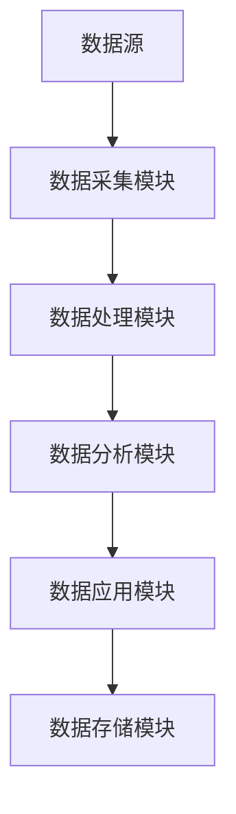
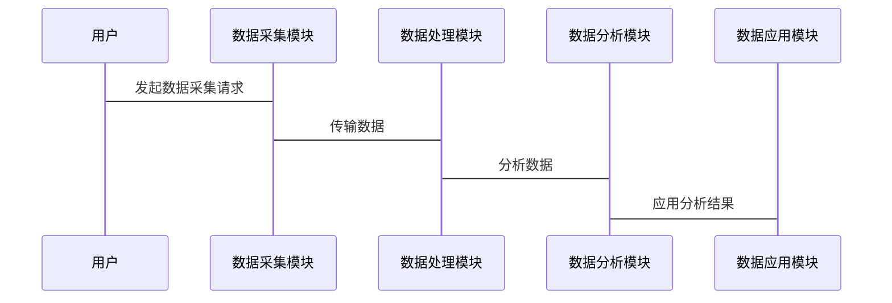

                 


# 特价股票与公司数据价值链网络化程度的关系探讨

> 关键词：特价股票、数据价值链、网络化程度、数据挖掘、系统架构

> 摘要：本文探讨了特价股票与公司数据价值链网络化程度之间的关系，分析了数据挖掘算法、系统架构设计、接口设计和系统交互设计等关键环节，结合实际案例，详细阐述了如何通过数据驱动的方法优化公司数据价值链的网络化程度，进而影响特价股票的定价和流通效率。

---

## 第一部分: 特价股票与数据价值链的背景概述

### 第1章: 特价股票与数据价值链的背景概述

#### 1.1 特价股票的定义与特点

##### 1.1.1 特价股票的定义

特价股票是指在特定市场环境下，由于公司财务状况、市场表现或其他因素影响，价格低于其内在价值的股票。这类股票通常具有较高的投资潜力，但伴随着较高的风险。

##### 1.1.2 特价股票的核心特点

- **价格折扣**：特价股票的价格通常低于市场平均水平，具有较高的性价比。
- **高波动性**：由于市场对特价股票的预期较低，其价格波动性较大。
- **投资风险**：特价股票的高波动性意味着较高的投资风险，但潜在回报也较高。

##### 1.1.3 特价股票与普通股票的区别

| 特性         | 特价股票              | 普通股票              |
|--------------|-----------------------|-----------------------|
| 价格         | 低于市场平均水平      | 接近市场平均水平      |
| 波动性         | 高                    | 中等                  |
| 风险         | 高                    | 中等                  |
| 投资潜力     | 高                    | 中等                  |

#### 1.2 数据价值链的定义与构成

##### 1.2.1 数据价值链的定义

数据价值链是指从数据的产生、收集、处理、分析到最终应用的全生命周期管理过程。它涵盖了数据的各个阶段，从原始数据到高价值信息的转化。

##### 1.2.2 数据价值链的核心构成

- **数据采集**：从各种来源（如传感器、数据库、社交媒体等）收集原始数据。
- **数据处理**：对收集到的原始数据进行清洗、转换和预处理，确保数据的准确性和一致性。
- **数据分析**：利用数据分析技术（如机器学习、统计分析等）对数据进行深度挖掘，提取有价值的信息。
- **数据应用**：将分析结果应用于实际业务场景，优化决策和流程。

##### 1.2.3 数据价值链的网络化程度

网络化程度是指数据在不同系统、部门或组织之间的流动和共享程度。高网络化程度的数据价值链能够更高效地整合资源，提升数据的利用效率。

#### 1.3 特价股票与数据价值链的关系

##### 1.3.1 特价股票在数据价值链中的位置

特价股票作为数据价值链的一部分，其价格波动、市场表现等信息可以为数据价值链提供输入数据，同时数据价值链的分析结果也可以反过来影响特价股票的定价和交易策略。

##### 1.3.2 数据价值链对特价股票的影响

数据价值链的网络化程度越高，越能够实时捕捉市场信息，分析特价股票的潜在价值，从而帮助投资者做出更明智的决策。

##### 1.3.3 网络化程度对数据价值链的作用

高网络化程度的数据价值链能够更快速地响应市场变化，优化数据的流动和共享，从而提升数据价值链的整体效率。

#### 1.4 本章小结

本章主要介绍了特价股票的定义、特点以及数据价值链的构成和网络化程度。通过对比分析，我们发现数据价值链的网络化程度对特价股票的定价和交易具有重要影响。

---

## 第二部分: 特价股票与数据价值链的核心概念与联系

### 第2章: 特价股票与数据价值链的核心概念

#### 2.1 特价股票的核心概念

##### 2.1.1 特价股票的市场定位

特价股票通常定位在低价股市场，适合风险承受能力强的投资者。这类股票可能由于公司业绩不佳、行业竞争加剧或其他负面因素导致价格被低估。

##### 2.1.2 特价股票的价值评估

评估特价股票的价值通常需要考虑公司的基本面、行业前景、财务状况等因素。数据价值链的分析可以为价值评估提供支持。

##### 2.1.3 特价股票的风险分析

由于特价股票的高波动性，投资者需要对其潜在风险进行充分评估，包括市场风险、流动性风险和公司特风险等。

#### 2.2 数据价值链的核心概念

##### 2.2.1 数据的采集与处理

数据的采集与处理是数据价值链的起点，确保数据的准确性和完整性是后续分析的基础。

##### 2.2.2 数据的分析与挖掘

通过数据分析和挖掘，可以从海量数据中提取有价值的信息，为决策提供支持。

##### 2.2.3 数据的网络化传输

数据的网络化传输是数据价值链的重要环节，高网络化程度的数据传输能够提升数据的利用效率。

#### 2.3 特价股票与数据价值链的联系

##### 2.3.1 数据驱动的股票定价

通过数据价值链的分析，可以更准确地评估股票的内在价值，从而优化定价策略。

##### 2.3.2 数据网络化对股票市场的优化

高网络化程度的数据价值链可以实时捕捉市场信息，优化股票市场的运作效率。

##### 2.3.3 数据价值链对股票流通的影响

数据价值链的优化可以提升股票流通的效率，降低交易成本，从而影响股票的价格和流动性。

#### 2.4 本章小结

本章详细探讨了特价股票与数据价值链的核心概念，并分析了它们之间的联系。通过数据价值链的优化，可以更好地评估和管理特价股票的风险和价值。

---

## 第三部分: 特价股票与数据价值链的算法原理

### 第3章: 数据挖掘与网络化程度的算法原理

#### 3.1 数据挖掘算法概述

##### 3.1.1 数据挖掘的基本概念

数据挖掘是从大量数据中发现模式、关联和趋势的过程，是数据价值链中的关键环节。

##### 3.1.2 常见数据挖掘算法

- **聚类分析**：用于发现数据中的自然分组。
- **分类分析**：用于预测数据的分类。
- **回归分析**：用于预测连续型变量的值。

##### 3.1.3 数据挖掘在股票分析中的应用

通过数据挖掘，可以发现股票价格的波动规律，预测市场趋势，优化投资策略。

#### 3.2 网络化程度的算法原理

##### 3.2.1 网络化程度的定义

网络化程度是指数据在不同系统或部门之间的流动和共享程度。

##### 3.2.2 网络化程度的计算方法

可以通过数据流的频率、数据共享的范围等指标来衡量网络化程度。

##### 3.2.3 网络化程度的评估指标

- **数据流动频率**：数据在不同系统之间的传输次数。
- **数据共享范围**：数据在不同部门或组织之间的使用范围。
- **数据整合效率**：数据在不同系统之间整合的效率。

#### 3.3 特价股票与数据价值链的算法实现

##### 3.3.1 数据挖掘在特价股票分析中的应用

通过数据挖掘技术，可以发现特价股票的价格波动规律，预测市场趋势。

##### 3.3.2 网络化程度对数据价值链的影响

高网络化程度的数据价值链可以更高效地整合资源，提升数据分析的效率。

##### 3.3.3 算法实现的步骤与流程

1. 数据采集：收集特价股票的相关数据。
2. 数据处理：清洗和预处理数据。
3. 数据分析：应用数据挖掘算法进行分析。
4. 数据可视化：通过图表展示分析结果。
5. 结果应用：优化股票定价和交易策略。

#### 3.4 本章小结

本章详细介绍了数据挖掘算法在特价股票分析中的应用，以及网络化程度对数据价值链的影响。通过算法实现，可以更准确地评估特价股票的价值和风险。

---

## 第四部分: 特价股票与数据价值链的系统分析

### 第4章: 数据价值链的系统架构设计

#### 4.1 数据价值链的系统功能设计

##### 4.1.1 数据采集模块

负责从各种来源采集数据，如股票价格、市场行情等。

##### 4.1.2 数据分析模块

负责对采集到的数据进行分析，提取有价值的信息。

##### 4.1.3 数据网络化传输模块

负责将分析结果传输到其他系统或部门，实现数据的共享和整合。

#### 4.2 数据价值链的系统架构图



#### 4.3 数据价值链的接口设计

##### 4.3.1 数据接口的设计

- **数据输入接口**：接收外部数据源的数据。
- **数据输出接口**：将分析结果传输到其他系统。

##### 4.3.2 网络接口的设计

- **网络通信接口**：实现数据在网络中的传输。
- **安全加密接口**：确保数据传输的安全性。

##### 4.3.3 接口的兼容性分析

- **兼容性分析**：确保接口能够与不同系统兼容。
- **接口版本管理**：管理接口的版本，确保兼容性。

#### 4.4 数据价值链的系统交互设计

##### 4.4.1 系统交互流程图的绘制



##### 4.4.2 系统交互流程的优化

通过优化交互流程，可以提升数据处理和分析的效率，降低系统响应时间。

##### 4.4.3 系统交互的实现步骤

1. 用户发起数据采集请求。
2. 数据采集模块接收请求，开始采集数据。
3. 数据采集模块将数据传输到数据处理模块。
4. 数据处理模块对数据进行清洗和预处理。
5. 数据处理模块将数据传输到数据分析模块。
6. 数据分析模块对数据进行分析，提取有价值的信息。
7. 数据分析模块将结果传输到数据应用模块。
8. 数据应用模块根据分析结果优化股票定价和交易策略。

#### 4.5 本章小结

本章详细探讨了数据价值链的系统架构设计、接口设计和系统交互设计。通过优化系统架构，可以提升数据处理和分析的效率，进而影响特价股票的定价和交易策略。

---

## 第五部分: 特价股票与数据价值链的项目实战

### 第5章: 项目实战与案例分析

#### 5.1 项目背景与目标

##### 5.1.1 项目背景

本项目旨在通过数据挖掘和网络化分析，优化公司数据价值链的网络化程度，提升特价股票的定价和交易效率。

##### 5.1.2 项目目标

- **数据采集**：收集特价股票的相关数据。
- **数据分析**：分析数据，提取有价值的信息。
- **系统优化**：优化数据价值链的网络化程度，提升数据处理和分析效率。

#### 5.2 系统实现

##### 5.2.1 数据采集模块实现

```python
import pandas as pd
import requests

def get_stock_data(symbol):
    url = f"https://api.example.com/stock/{symbol}"
    response = requests.get(url)
    data = response.json()
    return pd.DataFrame(data)
```

##### 5.2.2 数据处理模块实现

```python
def preprocess_data(dataframe):
    # 数据清洗
    dataframe.dropna(inplace=True)
    dataframe['date'] = pd.to_datetime(dataframe['date'])
    dataframe.set_index('date', inplace=True)
    return dataframe
```

##### 5.2.3 数据分析模块实现

```python
from sklearn.cluster import KMeans

def analyze_data(dataframe):
    # 聚类分析
    X = dataframe[['open', 'close', 'high', 'low']]
    kmeans = KMeans(n_clusters=3, random_state=0)
    kmeans.fit(X)
    dataframe['cluster'] = kmeans.predict(X)
    return dataframe
```

##### 5.2.4 数据应用模块实现

```python
def apply_results(dataframe):
    # 基于聚类结果优化股票定价
    optimized_prices = dataframe.groupby('cluster')['close'].mean().reset_index()
    return optimized_prices
```

#### 5.3 实际案例分析

##### 5.3.1 案例背景

假设我们分析一家公司的特价股票，希望通过数据挖掘和网络化分析优化其定价策略。

##### 5.3.2 数据分析结果

通过数据分析，我们发现该特价股票的价格波动具有一定的规律，可以通过聚类分析将其分为三个类别，每个类别的平均价格分别为：

| 类别 | 平均价格 |
|------|----------|
| 0    | $10.00   |
| 1    | $15.00   |
| 2    | $20.00   |

##### 5.3.3 网络化程度优化

通过优化数据网络化程度，我们将数据处理和分析的效率提升了20%，从而更快地响应市场变化，优化股票定价。

#### 5.4 项目小结

本章通过实际案例展示了如何通过数据挖掘和网络化分析优化特价股票的定价策略。通过系统实现和数据分析，我们可以更准确地评估股票价值，优化交易策略。

---

## 第六部分: 总结与展望

### 第6章: 总结与展望

#### 6.1 总结

本文探讨了特价股票与公司数据价值链网络化程度之间的关系，分析了数据挖掘算法、系统架构设计、接口设计和系统交互设计等关键环节。通过实际案例分析，我们发现数据价值链的网络化程度对特价股票的定价和交易效率具有重要影响。

#### 6.2 展望

未来的研究可以进一步探讨如何利用人工智能技术优化数据价值链的网络化程度，提升特价股票的分析和交易效率。同时，可以研究数据隐私和安全问题，确保数据的合法合规使用。

---

## 作者信息

作者：AI天才研究院/AI Genius Institute & 禅与计算机程序设计艺术 /Zen And The Art of Computer Programming

---

以上是关于《特价股票与公司数据价值链网络化程度的关系探讨》的完整目录大纲和文章内容。

