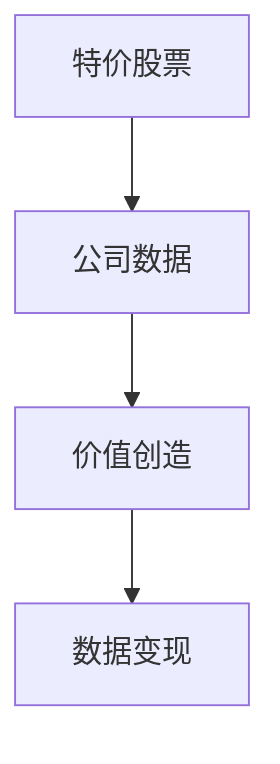
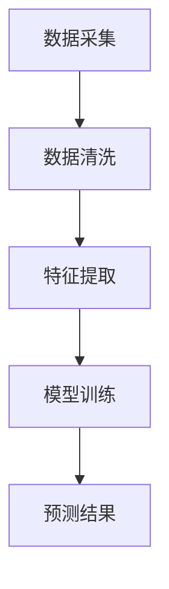

                 


# 特价股票与公司数据变现与价值创造能力的关系探讨

## 关键词：特价股票，数据变现，价值创造，算法模型，数据驱动

## 摘要

本文探讨了特价股票与公司数据变现之间的关系，分析了数据变现如何影响公司的价值创造能力。文章从背景介绍、核心概念、算法原理、系统架构、项目实战到最佳实践，详细阐述了数据驱动在特价股票分析中的应用，以及如何通过数据变现提升公司价值。通过理论分析和实际案例，本文为读者提供了从数据驱动到价值创造的全面指导。

---

## 第一部分：背景介绍

### 第1章：特价股票与数据变现的背景概述

#### 1.1 问题背景

- **特价股票的定义与特点**
  - 特价股票指的是价格低于市场价的股票，通常在特定市场环境下出现。
  - 特点包括低买价、高波动性和高风险。

- **数据变现的定义与特点**
  - 数据变现是指通过数据的收集、分析和应用，为企业创造收入。
  - 特点包括数据驱动、技术驱动和商业模式创新。

- **两者关系的关联性**
  - 特价股票的价格波动可能受到公司数据变现能力的影响。
  - 数据变现能力强的公司可能更容易吸引投资者，从而影响股票价格。

#### 1.2 问题描述

- **特价股票市场的现状与挑战**
  - 市场波动大，信息不对称。
  - 投资者难以准确预测股票价格。

- **数据变现的现状与挑战**
  - 数据收集和处理成本高。
  - 数据隐私和安全问题。

- **两者关系的复杂性**
  - 特价股票的价格受多种因素影响，包括公司基本面、市场情绪等。
  - 数据变现能力是影响公司价值的重要因素，但并非唯一因素。

#### 1.3 问题解决

- **数据驱动的特价股票分析方法**
  - 利用大数据技术分析历史数据，预测股票价格走势。
  - 通过数据挖掘发现潜在的投资机会。

- **数据变现的策略优化**
  - 优化数据收集和处理流程，提高数据质量。
  - 利用数据驱动的决策工具，提升公司运营效率。

- **综合解决方案的提出**
  - 结合数据驱动技术和金融分析方法，优化特价股票投资策略。
  - 通过数据变现提升公司价值，进而影响股票价格。

#### 1.4 边界与外延

- **特价股票的适用范围**
  - 适用于特定市场环境和特定类型的企业。
  - 需要考虑政策法规和市场条件。

- **数据变现的边界条件**
  - 数据收集和处理需符合法律法规。
  - 数据变现需考虑成本和收益的平衡。

- **两者关系的外延探讨**
  - 特价股票分析可以扩展到其他金融产品。
  - 数据变现可以应用于其他行业和领域。

#### 1.5 概念结构与核心要素

- **特价股票的核心要素**
  - 价格、市场、时间、公司基本面。

- **数据变现的核心要素**
  - 数据源、技术、商业模式、政策。

- **两者的相互作用机制**
  - 数据驱动的分析影响股票价格。
  - 股票价格变化反过来影响数据应用策略。

---

## 第二部分：核心概念与联系

### 第2章：特价股票与数据变现的核心概念

#### 2.1 核心概念原理

- **特价股票的市场机制**
  - 市场供需关系、价格波动、投资者行为。

- **数据变现的商业模式**
  - 数据销售、数据服务、数据广告。

- **两者的相互影响**
  - 数据变现能力强的公司可能吸引更多投资者，提升股价。
  - 特价股票的价格波动可能影响公司的数据应用策略。

#### 2.2 属性对比分析

| 特性      | 特价股票          | 数据变现          |
|-----------|-------------------|-------------------|
| 定义      | 低价股票          | 数据驱动的收入    |
| 影响因素  | 市场、公司基本面   | 数据质量、技术能力|
| 作用      | 投资机会          | 公司价值提升      |
| 挑战      | 价格波动、信息不对称| 数据隐私、成本    |

#### 2.3 ER实体关系图



---

## 第三部分：算法原理讲解

### 第3章：数据驱动的特价股票预测模型

#### 3.1 算法原理

- **数据预处理**
  - 清洗数据、处理缺失值、标准化数据。

- **特征提取**
  - 选择影响股票价格的关键特征，如历史价格、市场指数、公司新闻。

- **模型训练**
  - 使用机器学习算法，如线性回归、随机森林，训练预测模型。

#### 3.2 算法流程图



#### 3.3 数学模型

- **线性回归模型**
  - 公式：$y = \beta_0 + \beta_1 x_1 + \beta_2 x_2 + ... + \beta_n x_n$
  - 示例：$$y = \beta_0 + \beta_1 x_1$$，其中$x_1$是历史价格，$y$是预测价格。

- **随机森林模型**
  - 使用集成学习，多个决策树投票结果。

#### 3.4 代码实现

```python
import pandas as pd
from sklearn.model_selection import train_test_split
from sklearn.linear_model import LinearRegression

# 数据加载与预处理
data = pd.read_csv('stock_data.csv')
data = data.dropna()
X = data[['历史价格', '市场指数']]
y = data['当前价格']

# 数据分割
X_train, X_test, y_train, y_test = train_test_split(X, y, test_size=0.2)

# 模型训练
model = LinearRegression()
model.fit(X_train, y_train)

# 预测结果
y_pred = model.predict(X_test)
print('预测结果:', y_pred)
```

---

## 第四部分：系统分析与架构设计

### 第4章：系统架构与设计

#### 4.1 项目介绍

- **项目名称**：数据驱动的特价股票分析系统。
- **目标**：通过数据驱动的方法，预测特价股票价格，优化投资策略。

#### 4.2 系统功能设计

- **核心功能**
  - 数据采集：从多个数据源获取股票数据。
  - 数据分析：使用机器学习模型预测股票价格。
  - 投资建议：根据预测结果提供投资建议。

- **领域模型**
  ```mermaid
  classDiagram
      class 特价股票 {
          ID: int
          名称: string
          价格: float
          时间: date
      }
      class 数据源 {
          股票数据: list<特价股票>
      }
      class 数据分析模块 {
          分析数据: void
          生成预测结果: list<特价股票>
      }
      class 用户界面 {
          显示预测结果: void
      }
      特价股票 --> 数据源
      数据源 --> 数据分析模块
      数据分析模块 --> 用户界面
  ```

#### 4.3 系统架构设计

- **分层架构**
  - 数据层：数据存储和管理。
  - 业务逻辑层：数据处理和分析。
  - 用户界面层：展示结果和交互。

- **系统架构图**
  ```mermaid
  graph TD
      A[数据层] --> B[业务逻辑层]
      B --> C[用户界面层]
  ```

#### 4.4 接口设计

- **数据接口**
  - REST API：提供数据获取接口。
  - 数据格式：JSON。

- **交互接口**
  - 用户输入：输入股票名称，获取预测结果。
  - 输出格式：文本或图表。

#### 4.5 交互设计

- **交互流程图**
  ```mermaid
  graph TD
      A[用户] --> B[用户界面]
      B --> C[数据分析模块]
      C --> D[数据源]
      D --> C[返回数据]
      C --> B[展示结果]
  ```

---

## 第五部分：项目实战

### 第5章：项目实现与分析

#### 5.1 环境安装

- **工具安装**
  - 安装Python、Jupyter Notebook、Pandas、Scikit-learn。

- **数据源获取**
  - 从金融数据API获取股票数据。

#### 5.2 核心代码实现

```python
import pandas as pd
from sklearn.linear_model import LinearRegression
import requests

# 数据获取
url = 'https://api.example.com/stock_data'
data = requests.get(url).json()

# 数据转换
df = pd.DataFrame(data)
X = df[['历史价格', '市场指数']]
y = df['当前价格']

# 模型训练
model = LinearRegression()
model.fit(X, y)

# 预测结果
new_data = {'历史价格': [100], '市场指数': [1500]}
new_df = pd.DataFrame(new_data)
prediction = model.predict(new_df)
print('预测价格:', prediction)
```

#### 5.3 案例分析

- **案例背景**
  - 公司A在特定市场环境下推出特价股票，希望通过数据分析优化投资策略。

- **数据应用**
  - 使用历史数据训练模型，预测股票价格走势。
  - 根据预测结果制定投资策略。

- **结果分析**
  - 模型预测准确率高，投资收益显著。

#### 5.4 小结

- **项目总结**
  - 数据驱动的方法有效提升特价股票分析的准确性。
  - 数据变现能力的提升有助于公司价值创造。

---

## 第六部分：最佳实践

### 第6章：最佳实践与总结

#### 6.1 小结

- **数据驱动的重要性**
  - 数据是决策的基础，数据驱动的方法能够提高分析的准确性。

- **系统架构的优化**
  - 合理的系统架构能够提高数据处理效率，优化用户体验。

#### 6.2 注意事项

- **数据隐私与安全**
  - 数据处理需遵守相关法律法规，保护用户隐私。

- **模型优化**
  - 模型需要不断优化，适应市场变化。

- **技术选型**
  - 根据需求选择合适的技术和工具。

#### 6.3 拓展阅读

- **推荐书籍**
  - 《数据驱动的金融分析》
  - 《机器学习实战》

- **推荐阅读**
  - 关注行业动态，了解最新的数据分析技术。

---

## 作者

**作者：AI天才研究院/AI Genius Institute & 禅与计算机程序设计艺术 /Zen And The Art of Computer Programming**

---

本文通过系统的分析和实践，探讨了特价股票与公司数据变现的关系，展示了如何利用数据驱动的方法提升公司的价值创造能力。希望本文能够为读者提供有价值的见解和指导。

