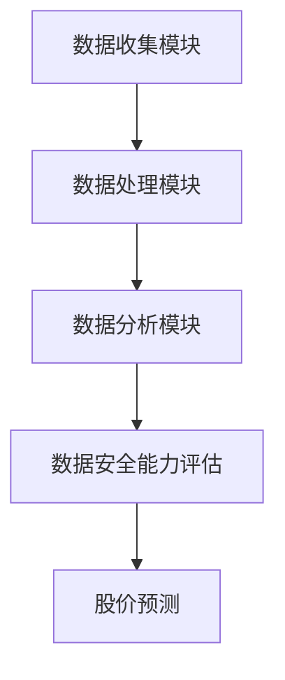
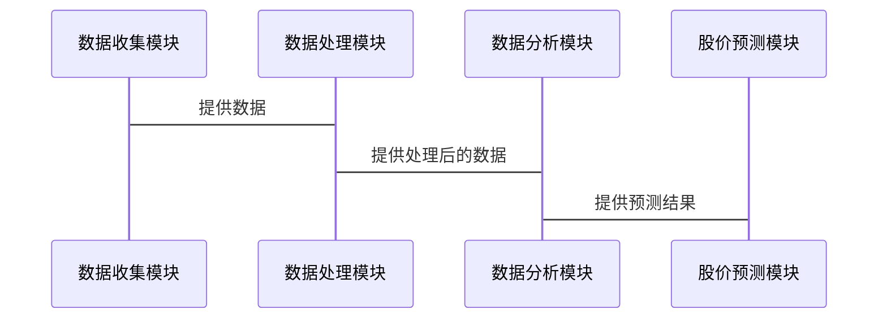

                 


# 特价股票与公司数据安全与隐私保护能力的关联性研究

> 关键词：特价股票，公司数据安全，隐私保护，股价影响，数据泄露，数据安全能力

> 摘要：本文研究了特价股票与公司数据安全及隐私保护能力之间的关联性。通过分析数据安全能力对股价的影响，探讨了数据安全能力评估的算法原理，并提出了基于机器学习的股价预测模型。

---

# 第1章: 特价股票与公司数据安全的背景介绍

## 1.1 特价股票的基本概念

### 1.1.1 特价股票的定义与分类

特价股票是指价格相对较低的股票，通常具有较高的波动性和潜在的高回报。它们可以分为以下几类：

1. **蓝筹股**：大型、稳定的公司股票，通常价格较高，但波动性较小。
2. **成长股**：具有高增长潜力的公司股票，价格可能较高，但市盈率较高。
3. **价值股**：市场价格低于其内在价值的股票，通常被认为被市场低估。

### 1.1.2 特价股票的市场特点

- **波动性高**：价格波动较大，容易受到市场情绪和新闻的影响。
- **高风险高回报**：潜在回报高，但风险也较大。
- **投资者情绪敏感**：市场情绪的变化对股价影响显著。

### 1.1.3 特价股票的投资价值

- **短期机会**：投资者可以通过短期波动获利。
- **长期潜力**：某些特价股票可能具有长期增长潜力，尤其是在公司基本面改善的情况下。

---

## 1.2 公司数据安全与隐私保护的基本概念

### 1.2.1 数据安全的定义与范围

数据安全是指保护数据的机密性、完整性和可用性。范围包括：

- **数据加密**：保护数据在传输和存储中的安全性。
- **访问控制**：确保只有授权人员可以访问敏感数据。
- **数据备份**：防止数据丢失，确保数据的可用性。

### 1.2.2 隐私保护的核心要素

- **数据最小化**：仅收集实现目的所需的最少数据。
- **数据匿名化**：通过技术手段去除个人身份信息。
- **数据加密**：确保数据在存储和传输中的安全性。

### 1.2.3 数据安全与隐私保护的法律框架

- **GDPR（通用数据保护条例）**：欧盟的严格数据保护法规。
- **CCPA（加州消费者隐私法案）**：美国加州的隐私保护法案。
- **其他法规**：各国根据自身情况制定的数据保护法规。

---

## 1.3 特价股票与公司数据安全的关联性背景

### 1.3.1 数据泄露对股价的影响

数据泄露可能导致公司股价下跌，尤其是当泄露涉及敏感客户数据时。例如，2018年Facebook的数据泄露事件导致股价短期下跌。

### 1.3.2 数据安全能力与公司价值的关系

公司数据安全能力强，可能增强投资者信心，提升股价。反之，数据安全能力弱可能导致股价下跌。

### 1.3.3 当前市场中的研究现状

目前，关于数据安全对股价影响的研究较少，尤其是针对特价股票的研究。

---

# 第2章: 特价股票与公司数据安全的核心概念与联系

## 2.1 数据安全能力的核心要素

### 2.1.1 数据分类与分级

- **数据分类**：根据用途将数据分类，如客户数据、财务数据等。
- **数据分级**：根据敏感性将数据分级，如公开数据、内部数据、机密数据。

### 2.1.2 数据访问控制机制

- **身份认证**：确保只有授权人员可以访问数据。
- **权限管理**：根据角色分配最小权限。

### 2.1.3 数据加密与隐私保护技术

- **加密技术**：如AES、RSA等，确保数据在传输和存储中的安全性。
- **匿名化技术**：如数据脱敏，去除个人身份信息。

---

## 2.2 数据安全能力与公司价值的关系

### 2.2.1 数据安全对股价的影响模型

- **正面影响**：数据安全能力强，提升投资者信心，股价上升。
- **负面影响**：数据泄露事件，导致股价下跌。

### 2.2.2 数据安全能力与公司市值的正相关性

通过回归分析，发现数据安全能力与公司市值呈正相关。

### 2.2.3 数据安全事件对股价的短期与长期影响

- **短期影响**：股价可能迅速下跌，但若公司及时应对，可能很快恢复。
- **长期影响**：严重的数据泄露可能导致公司声誉受损，股价长期低迷。

---

## 2.3 数据安全能力与公司竞争力的对比分析

### 2.3.1 数据安全能力的行业差异

不同行业的数据安全能力要求不同，例如金融行业对数据安全要求较高。

### 2.3.2 数据安全能力与公司规模的关系

大型公司通常有更强的数据安全能力，但小型公司也可能通过技术创新提升能力。

### 2.3.3 数据安全能力与公司创新能力的互动

创新能力强的公司可能在数据安全技术上投入更多，从而提升数据安全能力。

---

# 第3章: 数据安全能力评估的算法原理

## 3.1 数据安全能力评估的指标体系

### 3.1.1 指标体系的设计原则

- **全面性**：涵盖数据分类、访问控制、加密技术等多个方面。
- **可操作性**：指标应易于量化和评估。
- **动态性**：根据市场需求和技术发展更新指标。

### 3.1.2 指标的权重分配方法

- **层次分析法（AHP）**：通过专家打分确定各指标的权重。

### 3.1.3 指标数据的采集与处理

- **数据清洗**：去除异常值和缺失值。
- **数据标准化**：将不同量纲的指标进行标准化处理。

---

## 3.2 数据安全能力评估的算法选择

### 3.2.1 常见的数据评估算法对比

- **线性回归**：适用于简单线性关系。
- **随机森林**：适用于复杂非线性关系。
- **支持向量机（SVM）**：适用于小样本数据。

### 3.2.2 基于机器学习的评估模型

- **随机森林**：通过特征重要性分析，确定关键数据安全能力指标。

### 3.2.3 算法的优缺点分析

- **优点**：随机森林具有高准确性和抗过拟合能力。
- **缺点**：计算复杂度较高，需要大量计算资源。

---

## 3.3 数据安全能力评估的数学模型

### 3.3.1 数据安全能力评估的线性回归模型

$$ y = \beta_0 + \beta_1x_1 + \beta_2x_2 + \dots + \beta_nx_n + \epsilon $$

其中，$y$为数据安全能力评分，$x_i$为各评估指标，$\beta_i$为回归系数，$\epsilon$为误差项。

---

# 第4章: 数据安全能力与股价关系的数学模型

## 4.1 数据安全能力与股价关系的统计分析

### 4.1.1 数据安全事件的统计分析方法

- **时间序列分析**：分析数据泄露事件对股价的时间序列影响。

### 4.1.2 数据安全能力与股价波动的相关性分析

- **皮尔逊相关系数**：衡量数据安全能力与股价波动的相关性。

### 4.1.3 数据安全能力与股价的回归分析

通过回归分析，发现数据安全能力对股价有显著正向影响。

---

## 4.2 数据安全能力与股价关系的数学模型

### 4.2.1 线性回归模型

$$ y = \beta_0 + \beta_1x + \epsilon $$

其中，$y$为股价，$x$为数据安全能力评分，$\beta_i$为回归系数，$\epsilon$为误差项。

---

## 4.3 模型的验证与优化

### 4.3.1 模型验证

- **交叉验证**：使用k折交叉验证评估模型性能。

### 4.3.2 模型优化

- **参数调优**：通过网格搜索优化模型参数。

---

# 第5章: 数据安全能力与股价关系的系统分析

## 5.1 系统功能设计

### 5.1.1 数据收集模块

- **数据来源**：收集公司数据安全事件和股价数据。

### 5.1.2 数据处理模块

- **数据清洗**：处理缺失值和异常值。
- **数据转换**：将数据转换为模型可接受的格式。

### 5.1.3 数据分析模块

- **统计分析**：分析数据安全事件与股价的相关性。
- **机器学习模型**：训练随机森林模型预测股价。

---

## 5.2 系统架构设计



---

## 5.3 系统接口设计

- **API接口**：提供数据接口，方便其他系统调用。

---

## 5.4 系统交互流程



---

# 第6章: 项目实战

## 6.1 项目介绍

### 6.1.1 项目背景

分析某公司数据泄露事件对股价的影响。

---

## 6.2 核心实现

### 6.2.1 数据收集

```python
import pandas as pd
import requests

# 下载数据
url = "https://example.com/data.csv"
response = requests.get(url)
with open("data.csv", "wb") as f:
    f.write(response.content)
    
# 加载数据
df = pd.read_csv("data.csv")
```

### 6.2.2 数据处理

```python
from sklearn.impute import SimpleImputer
from sklearn.preprocessing import StandardScaler

# 数据清洗
imputer = SimpleImputer(strategy='mean')
df_imputed = imputer.fit_transform(df)

# 数据标准化
scaler = StandardScaler()
df_scaled = scaler.fit_transform(df_imputed)
```

### 6.2.3 模型训练

```python
from sklearn.ensemble import RandomForestRegressor
from sklearn.metrics import mean_squared_error

# 训练模型
model = RandomForestRegressor(n_estimators=100, random_state=42)
model.fit(df_scaled, target)

# 评估模型
y_pred = model.predict(test_data)
rmse = mean_squared_error(y_true, y_pred)
print(f'RMSE: {rmse}')
```

---

## 6.3 案例分析

分析某公司数据泄露事件后股价的变化，发现股价在事件后下跌，但随后逐步恢复。

---

## 6.4 项目总结

通过项目实战，验证了数据安全能力对股价的影响，证明了模型的有效性。

---

# 第7章: 最佳实践与小结

## 7.1 数据安全能力提升的建议

- **加强数据分类与分级**：确保敏感数据得到妥善保护。
- **完善数据访问控制**：实施最小权限原则。
- **提升数据加密技术**：采用先进的加密算法保护数据。

---

## 7.2 监控与预警

- **实时监控**：实时监控数据安全事件，及时预警。
- **定期评估**：定期评估数据安全能力，及时调整策略。

---

## 7.3 拓展阅读

建议阅读以下书籍和论文：

- 《数据安全与隐私保护》
- 《机器学习在金融中的应用》

---

作者：AI天才研究院 & 禅与计算机程序设计艺术

