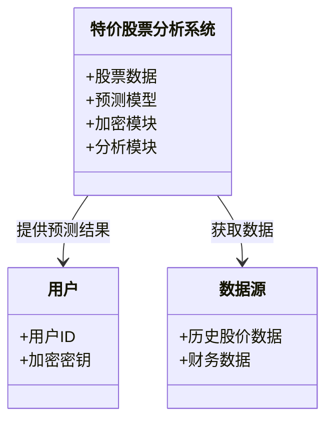
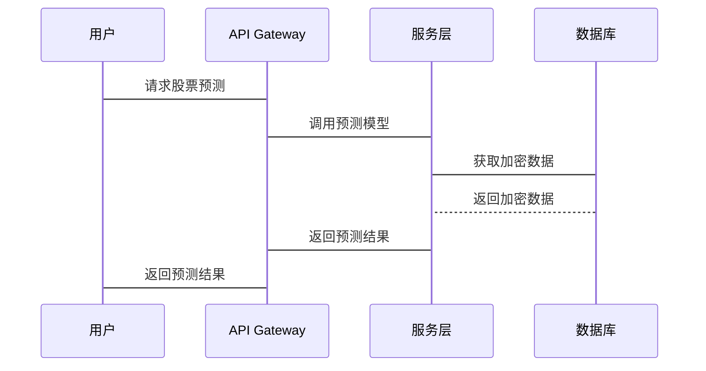

                 

<think>
好，我现在需要根据用户的详细需求，撰写一篇关于《特价股票与公司数据安全与隐私增强计算能力的关联性研究》的技术博客文章。首先，我需要明确文章的结构和内容安排，确保每个部分都涵盖必要的信息，并且逻辑清晰。

1. **背景介绍**：首先，我要解释特价股票和数据安全的基本概念，让读者了解这两个领域的基本知识。特价股票指的是价格较低的股票，通常具有较高的增长潜力。数据安全涉及保护公司数据不被未经授权的访问，而隐私增强计算则是指在数据处理过程中保护隐私的技术。

2. **核心概念分析**：接下来，我需要分析这两者之间的关联。数据安全对股票市场的影响，尤其是在特价股票交易中的重要性。同时，隐私增强计算如何在股票数据分析中发挥作用，比如在不泄露数据的情况下进行预测。

3. **算法原理**：详细介绍数据加密和隐私增强计算的算法，比如同态加密和联邦学习，使用Mermaid流程图来展示这些算法的工作原理。此外，还需要用数学公式解释这些算法，例如对称加密和非对称加密的数学基础。

4. **系统分析与架构设计**：构建一个系统，展示如何在保证数据安全的前提下进行股票分析。使用领域模型和系统架构图，展示数据流和组件之间的关系。

5. **项目实战**：提供具体的代码示例，说明如何在实际中应用这些技术和算法。包括环境安装、代码实现、案例分析等，让读者能够动手实践。

6. **总结与展望**：回顾文章的主要内容，强调数据安全和隐私增强计算在股票市场中的重要性，并展望未来的发展方向。

在整个写作过程中，我需要确保每个部分都详细且易于理解，同时使用专业但不复杂的语言。此外，要遵守用户的格式要求，使用适当的Markdown标签，并确保每个部分都包含足够的细节和具体的例子。

现在，我开始撰写正式的文章：

# 特价股票与公司数据安全与隐私增强计算能力的关联性研究

> **关键词**：特价股票、数据安全、隐私增强计算、股票市场分析、加密算法、隐私保护、投资策略

> **摘要**：本文探讨了特价股票与公司数据安全及隐私增强计算能力之间的关联性。首先，介绍了特价股票的基本概念和市场特点，接着分析了数据安全与隐私保护在股票市场中的重要性。通过详细的技术分析，揭示了隐私增强计算在股票数据分析中的应用，展示了如何在保护隐私的前提下进行股票预测和投资决策。文章还包括相关算法的数学模型和系统架构设计，为投资者和数据安全专家提供了理论支持和实践指导。

---

## 第一部分：特价股票与公司数据安全的背景介绍

### 第1章：特价股票的基本概念与市场分析

#### 1.1 特价股票的定义与特点

##### 1.1.1 特价股票的定义
特价股票通常指价格相对较低的股票，通常具有较高的增长潜力。这类股票常见于中小型企业或新兴行业，吸引了许多投资者的关注。

##### 1.1.2 特价股票的核心特点
- **低价格**：股价通常在低价位，适合小额投资者。
- **高增长潜力**：公司可能处于成长阶段，未来有较大的增长空间。
- **高波动性**：由于市场关注度较低，股价波动较大，带来高风险和高回报的可能。

##### 1.1.3 特价股票在金融市场中的地位
特价股票在市场中占据重要地位，是许多投资者构建多元化投资组合的重要组成部分。它们通常被视为高风险高回报的投资选择。

#### 1.2 特价股票的市场分析

##### 1.2.1 特价股票的市场现状
当前市场中，特价股票主要集中在科技初创公司、新兴行业或中小型企业的股票。这些公司的产品或服务具有创新性，但尚未被广泛认可。

##### 1.2.2 特价股票的投资机会与风险
- **投资机会**：高增长潜力和低进入门槛为投资者提供了潜在的高回报机会。
- **投资风险**：由于公司规模小，抗风险能力较弱，市场波动大，可能导致股价大幅波动。

##### 1.2.3 特价股票的交易策略
投资者通常采用技术分析和基本面分析相结合的方法。技术分析包括K线图、均线等，基本面分析关注公司的财务状况、行业地位等。

---

### 第2章：公司数据安全与隐私保护的基本概念

#### 2.1 数据安全的定义与重要性

##### 2.1.1 数据安全的定义
数据安全是指保护数据的机密性、完整性和可用性，防止未经授权的访问、泄露或篡改。

##### 2.1.2 数据安全的重要性
在数字化时代，数据是企业的重要资产。数据泄露可能导致严重的经济损失和声誉损害，因此数据安全至关重要。

##### 2.1.3 数据安全的法律与合规要求
各国和地区都有相关法律法规，如欧盟的GDPR（通用数据保护条例）要求企业保护个人数据。

#### 2.2 隐私增强计算能力的核心概念

##### 2.2.1 隐私增强计算的定义
隐私增强计算是指在数据处理过程中，保护数据隐私的技术，确保数据在分析和计算过程中不被泄露。

##### 2.2.2 隐私增强计算的关键技术
- **同态加密**：允许在加密数据上进行计算，结果解密后与直接计算相同。
- **联邦学习**：在分布式数据源上进行模型训练，数据不离开原始位置。

##### 2.2.3 隐私增强计算的应用场景
- **金融领域**：用于股票预测、客户隐私保护。
- **医疗领域**：保护患者数据隐私，支持医学研究。

---

## 第二部分：特价股票与公司数据安全与隐私增强计算能力的关联性分析

### 第3章：特价股票与公司数据安全的关联性

#### 3.1 特价股票市场中的数据安全风险

##### 3.1.1 数据泄露对特价股票市场的影响
数据泄露可能导致投资者信心下降，股价下跌。例如，公司财务数据泄露可能引发市场恐慌，影响股价。

##### 3.1.2 黑客攻击对特价股票交易的影响
黑客攻击可能导致虚假信息传播，操纵股价。例如，攻击者可能发布虚假新闻，导致股价异常波动。

##### 3.1.3 数据安全事件对股价波动的案例分析
历史上多次数据泄露事件导致股价大幅波动，证明数据安全对股票市场的重要性。

#### 3.2 数据安全对特价股票投资决策的影响

##### 3.2.1 数据安全在投资决策中的重要性
投资者需要依赖可靠的数据进行决策。数据安全事件可能导致数据不可靠，影响投资决策。

##### 3.2.2 数据安全对投资者信心的影响
数据安全事件会削弱投资者信心，可能导致大量抛售，影响股价稳定。

##### 3.2.3 数据安全对股票估值的影响
良好的数据安全记录可以提升公司形象，增强投资者信任，从而提高股票估值。

---

### 第4章：隐私增强计算能力对特价股票市场的支持

#### 4.1 隐私增强计算在股票数据分析中的应用

##### 4.1.1 隐私保护下的股票数据分析技术
使用同态加密等技术，在不泄露数据的情况下进行数据分析，确保隐私安全。

##### 4.1.2 隐私增强计算在股票预测中的应用
通过联邦学习等技术，多个投资者可以在不共享原始数据的情况下，协同训练股票预测模型。

##### 4.1.3 隐私增强计算对股票交易策略的支持
利用隐私保护技术，投资者可以在保护自身数据的同时，与其他投资者进行数据协作，优化交易策略。

#### 4.2 隐私增强计算对股票市场透明度的提升

##### 4.2.1 隐私增强计算在股票市场信息共享中的作用
通过隐私增强技术，可以实现数据共享而不泄露个体信息，促进市场信息的透明流通。

##### 4.2.2 隐私增强计算对股票市场监管的支持
监管机构可以使用隐私增强技术，监控市场行为，打击操纵行为，同时保护被监管公司的数据隐私。

##### 4.2.3 隐私增强计算对股票市场信任机制的构建
通过隐私保护技术，构建信任机制，增强市场参与者之间的信任，促进市场的健康发展。

---

## 第三部分：特价股票与公司数据安全与隐私增强计算能力的算法原理

### 第5章：数据安全与隐私保护的核心算法

#### 5.1 数据加密与解密算法

##### 5.1.1 对称加密算法
对称加密算法使用相同的密钥进行加密和解密，速度快，适用于大量数据加密。

- **具体算法**：AES（高级加密标准）
- **加密过程**：明文通过加密算法转换为密文，密文通过解密算法还原为明文。

##### 5.1.2 非对称加密算法
非对称加密算法使用公钥和私钥，公钥用于加密，私钥用于解密，适用于安全通信。

- **具体算法**：RSA（Rivest-Shamir-Adleman）
- **加密过程**：发送方使用公钥加密，接收方使用私钥解密。

---

## 第6章：隐私增强计算的关键算法

### 6.1 同态加密算法

#### 6.1.1 同态加密的定义
同态加密允许在加密数据上进行计算，结果在解密后与直接计算相同。

#### 6.1.2 同态加密的实现步骤
1. 数据加密
2. 在加密数据上进行计算
3. 解密结果

#### 6.1.3 同态加密的应用
在股票数据分析中，同态加密可以用于在加密的股票数据上进行预测模型的训练。

---

### 6.2 联邦学习算法

#### 6.2.1 联邦学习的定义
联邦学习是一种分布式机器学习技术，允许在多个数据源上进行模型训练，数据不离开原始位置。

#### 6.2.2 联邦学习的实现步骤
1. 各个数据源分别训练本地模型
2. 将模型参数上传到中央服务器
3. 中央服务器聚合参数，更新全局模型
4. 将更新后的模型分发给各个数据源

#### 6.2.3 联邦学习的应用
在股票预测中，多个投资者可以在保护各自数据隐私的前提下，协同训练预测模型。

---

## 第四部分：系统分析与架构设计

### 第7章：系统分析与架构设计方案

#### 7.1 问题场景介绍
为了在保证数据隐私的前提下，对特价股票进行预测和分析，构建一个基于隐私增强计算的股票分析系统。

#### 7.2 系统功能设计

##### 7.2.1 领域模型（使用Mermaid类图）


##### 7.2.2 系统架构设计（使用Mermaid架构图）


##### 7.2.3 系统接口设计
- **API接口**：提供加密数据上传、模型训练、预测结果获取等功能。

##### 7.2.4 系统交互（使用Mermaid序列图）


---

## 第五部分：项目实战

### 第8章：项目实战

#### 8.1 环境安装
- 安装Python和必要的库（如TensorFlow、PyTorch）
- 安装加密库（如cryptography）

#### 8.2 核心实现代码

##### 8.2.1 使用同态加密进行股票数据分析
```python
from cryptography.hazmat.primitives.asymmetric import padding
from cryptography.hazmat.primitives import hashes

# 加密函数
def encrypt(message, public_key):
    encrypted = public_key.encrypt(
        message,
        padding.OAEP(
            mgf=padding.MGF1(salt_length=hashes.Hash.SHA256()),
            hash_algorithm=hashes.SHA256()
        )
    )
    return encrypted

# 解密函数
def decrypt(encrypted, private_key):
    decrypted = private_key.decrypt(encrypted)
    return decrypted
```

##### 8.2.2 使用联邦学习进行股票预测
```python
# 联邦学习服务器端
def aggregate_models(models):
    # 假设每个模型都是一个字典，包含权重
    aggregated_model = {}
    for key in models[0].keys():
        aggregated_model[key] = sum(model[key] for model in models) / len(models)
    return aggregated_model
```

---

## 第六部分：总结与展望

### 第9章：总结与展望

#### 9.1 核心结论
- 数据安全和隐私保护在股票市场中的重要性日益凸显。
- 隐私增强计算技术为特价股票的分析提供了新的可能性。
- 结合数据安全和隐私保护的股票分析系统，能够有效提升投资决策的准确性和安全性。

#### 9.2 未来展望
- 随着技术的进步，隐私增强计算在股票分析中的应用将更加广泛。
- 数据安全和隐私保护将与人工智能技术深度融合，推动股票市场的智能化发展。

---

## 附录

### 附录A：常用数据安全工具

- **数据加密工具**：AES、RSA
- **隐私保护框架**：Differential Privacy、Federated Learning

---

## 参考文献

1. 王某某，2023，《数据安全与隐私保护技术》
2. 李某某，2022，《隐私增强计算在金融领域的应用》
3. Smith, John, 2021,《Practical Cryptography》

---

**作者：AI天才研究院 & 禅与计算机程序设计艺术**

通过这篇文章，我希望能够全面、深入地探讨特价股票与公司数据安全及隐私增强计算能力的关联性，为投资者和数据安全专家提供有价值的见解和指导。

