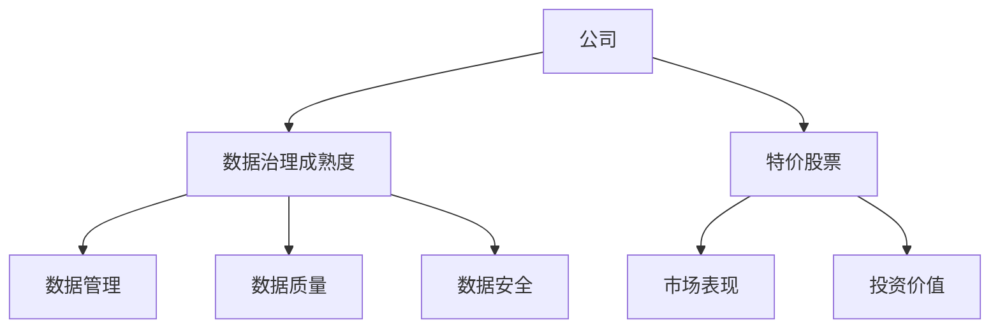
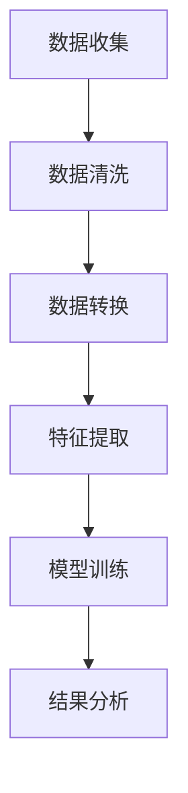
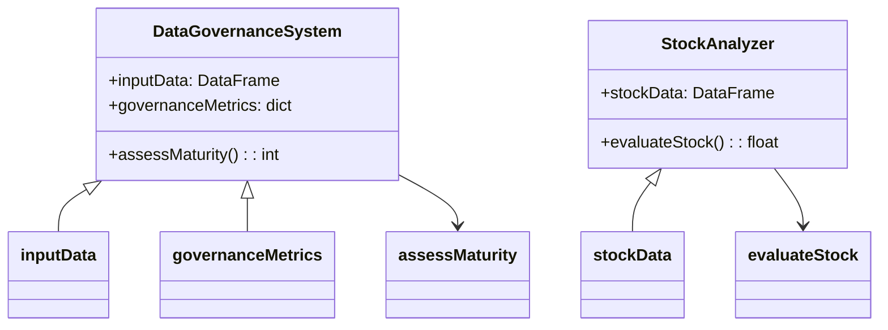
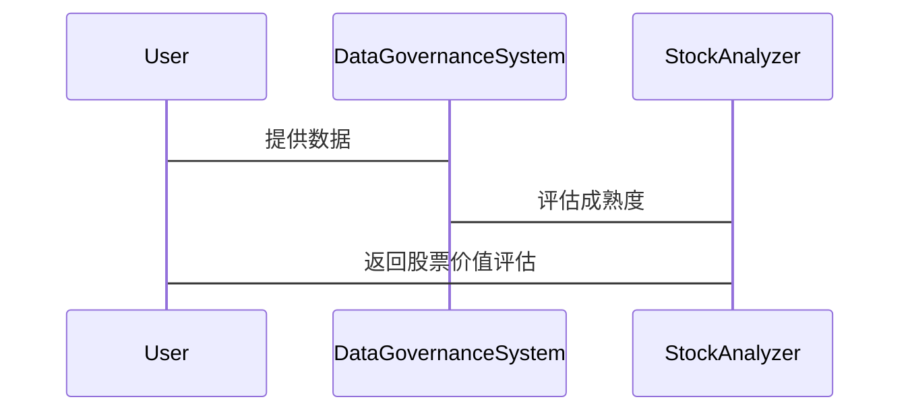

                 


# 特价股票与公司数据治理成熟度的关系分析

---

## 关键词：  
特价股票、数据治理成熟度、企业治理、数据分析、投资策略

---

## 摘要：  
本文分析了特价股票与公司数据治理成熟度之间的关系。通过定义核心概念、构建评估模型、实证分析和案例研究，探讨了数据治理能力如何影响特价股票的市场表现。文章从背景介绍、核心概念对比、算法原理、系统架构、项目实战等多个维度展开，揭示了提升数据治理成熟度对优化特价股票投资策略的重要性，并为投资者和企业提供实践建议。

---

## 第一部分：背景介绍

### 第1章：引言

#### 1.1 背景介绍
- **特价股票**：指低于面值或具有特别优惠条件的股票，常见于困境企业或重组公司。其市场表现波动较大，投资者需谨慎评估。
- **数据治理成熟度**：指企业在数据管理、质量控制、安全性和合规性方面的综合能力。高成熟度意味着企业能够有效利用数据支持决策和运营。

#### 1.2 问题背景
- 特价股票通常伴随较高的风险，企业数据治理能力直接影响其市场信任度和投资价值。
- 当前市场中，数据治理成熟度与股票价值的关系尚未得到充分研究。

#### 1.3 研究目标与方法
- 目标：探讨数据治理成熟度对特价股票价值的影响。
- 方法：定性分析（文献研究、理论模型构建）与定量分析（回归模型、实证研究）结合。

---

## 第二部分：核心概念与联系

### 第2章：核心概念分析

#### 2.1 特价股票的属性特征
| 属性 | 特价股票特征 |
|------|-------------|
| 类型  | 常见类型包括优先股、认股权证等 |
| 市场表现 | 波动性大，风险较高 |
| 投资策略 | 高风险高回报，需谨慎评估 |

#### 2.2 数据治理成熟度的属性特征
| 属性 | 特征描述 |
|------|----------|
| 数据管理 | 高效的数据采集、存储和处理能力 |
| 数据质量 | 数据准确性和完整性高 |
| 数据安全 | 强大的数据保护机制 |
| 数据合规 | 符合相关法律法规 |

#### 2.3 概念结构与核心要素


---

## 第三部分：算法原理讲解

### 第3章：数据治理成熟度对特价股票影响的数学模型

#### 3.1 统计分析方法
- 使用多元回归模型分析数据治理成熟度对股票价值的影响。
- 模型公式：$$ V = \beta_0 + \beta_1 D + \epsilon $$
  - \( V \)：股票价值
  - \( D \)：数据治理成熟度指标
  - \( \beta \)：回归系数
  - \( \epsilon \)：误差项

#### 3.2 数据处理流程


#### 3.3 Python代码实现
```python
import pandas as pd
from sklearn.linear_model import LinearRegression
from sklearn.metrics import r2_score

# 数据加载与预处理
data = pd.read_csv('stock_data.csv')
X = data[['data_management', 'data_quality', 'data_security']]
y = data['stock_value']

# 建立回归模型
model = LinearRegression()
model.fit(X, y)

# 模型评估
predictions = model.predict(X)
r2 = r2_score(y, predictions)
print(f"R² Score: {r2}")
```

---

## 第四部分：系统分析与架构设计

### 第4章：数据治理成熟度评估系统

#### 4.1 系统架构设计


#### 4.2 接口与交互设计


---

## 第五部分：项目实战

### 第5章：数据收集与分析

#### 5.1 环境安装
- 安装所需库：`pandas`, `numpy`, `scikit-learn`

#### 5.2 数据收集与预处理
```python
import pandas as pd
import numpy as np

# 模拟数据生成
np.random.seed(42)
data = {
    'company_name': ['Company A', 'Company B', 'Company C'],
    'data_management': [85, 70, 90],
    'data_quality': [80, 65, 85],
    'data_security': [90, 75, 80],
    'stock_value': [150, 120, 160]
}
df = pd.DataFrame(data)
df.to_csv('stock_data.csv', index=False)
```

#### 5.3 模型实现与分析
```python
from sklearn.linear_model import LinearRegression
from sklearn.metrics import mean_squared_error

# 加载数据
df = pd.read_csv('stock_data.csv')
X = df[['data_management', 'data_quality', 'data_security']]
y = df['stock_value']

# 训练模型
model = LinearRegression()
model.fit(X, y)

# 预测与评估
y_pred = model.predict(X)
mse = mean_squared_error(y, y_pred)
r2 = r2_score(y, y_pred)
print(f"均方误差：{mse}\nR²：{r2}")
```

---

## 第六部分：最佳实践与结论

### 第6章：结论与建议

#### 6.1 最佳实践
- **提升数据治理能力**：企业应投资于数据管理、质量控制和安全措施，以提高数据治理成熟度。
- **投资者策略**：投资者在选择特价股票时，应评估公司的数据治理能力，以降低投资风险。

#### 6.2 注意事项
- 数据治理是一个长期过程，需要持续改进。
- 特价股票投资需谨慎，建议结合其他因素综合评估。

#### 6.3 未来研究方向
- 探讨其他企业治理因素对股票价值的影响。
- 开发更复杂的模型，考虑更多变量。

---

## 作者：  
AI天才研究院 & 禅与计算机程序设计艺术

