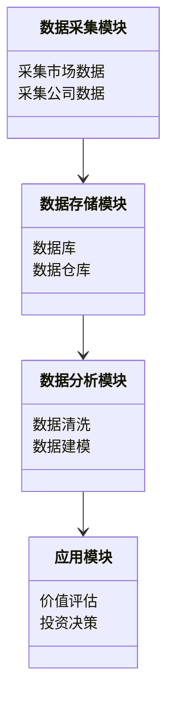

                 


# 特价股票与公司数据生态系统价值评估

> 关键词：特价股票、公司数据生态系统、价值评估、数据分析、算法原理

> 摘要：本文深入探讨了特价股票与公司数据生态系统的关系，结合数据分析、数学建模和系统设计的方法，详细阐述了如何通过公司数据生态系统实现特价股票的价值评估。文章从背景介绍、核心概念、算法原理、系统架构到项目实战，层层递进，最终为读者提供了一套完整的解决方案。

---

## 第一部分: 特价股票与公司数据生态系统概述

### 第1章: 特价股票与公司数据生态系统背景介绍

#### 1.1 问题背景与问题描述

##### 1.1.1 特价股票的定义与特点
特价股票通常指市盈率低、市值小或股价处于低位的股票，具有较高的投资潜力。其特点包括价格波动大、风险高、收益潜力大等。

##### 1.1.2 公司数据生态系统的核心概念
公司数据生态系统是指通过数据的采集、存储、分析和应用，构建一个支持公司决策和优化的闭环系统。其核心在于数据的全生命周期管理。

##### 1.1.3 问题解决方法与目标
通过构建数据生态系统，利用数据分析技术对特价股票进行价值评估，挖掘潜在投资机会，降低投资风险。

#### 1.2 问题的边界与外延

##### 1.2.1 特价股票的边界
特价股票的范围通常包括小盘股、低价股和低市值股，但需排除僵尸企业或财务状况不佳的公司。

##### 1.2.2 公司数据生态系统的外延
公司数据生态系统不仅包括内部数据，还包括外部市场数据、行业数据等，形成一个全方位的数据网络。

##### 1.2.3 相关概念的对比分析
- **数据生态系统**：强调数据的流动和协同。
- **数据管理系统**：注重数据的存储和处理。
- **数据价值评估**：关注数据的经济价值。

---

### 第2章: 数据生态系统的核心原理

#### 2.1 数据生态系统的原理

##### 2.1.1 数据的生成与流动
数据通过采集、清洗、存储、分析和应用的流程，形成一个闭环。

##### 2.1.2 数据的清洗与预处理
- 数据清洗：去除冗余和错误数据。
- 数据预处理：标准化和特征提取。

##### 2.1.3 数据的存储与管理
采用分布式存储和数据库技术，确保数据的高效管理和快速访问。

#### 2.2 数据价值评估的原理

##### 2.2.1 数据价值的定义与度量
数据价值可通过其对决策的影响程度来衡量，常用指标包括相关性、准确性等。

##### 2.2.2 数据质量的评估标准
数据质量包括完整性、准确性、一致性和及时性。

##### 2.2.3 数据价值的动态变化
数据价值会因市场变化和公司动态而波动，需实时监控和调整评估模型。

#### 2.3 数据生态系统与价值评估的关系

##### 2.3.1 数据生态系统的整体性
数据生态系统为价值评估提供全面的数据支持。

##### 2.3.2 价值评估的系统性
价值评估是数据生态系统的重要组成部分，通过反馈优化数据管理。

##### 2.3.3 数据生态系统的动态平衡
通过实时数据流动和价值反馈，保持数据生态系统的动态平衡。

---

## 第三部分: 数据生态系统与价值评估的核心概念

### 第3章: 核心概念的对比与分析

#### 3.1 数据生态系统与传统数据管理的对比

##### 3.1.1 数据管理方式的对比
- 传统数据管理：注重数据存储和查询。
- 数据生态系统：强调数据的流动和协同。

##### 3.1.2 数据价值的实现方式
- 传统数据管理：被动提供数据。
- 数据生态系统：主动挖掘数据价值。

##### 3.1.3 系统架构的差异
- 传统数据管理：单体架构。
- 数据生态系统：分布式架构。

#### 3.2 价值评估模型的对比分析

##### 3.2.1 不同模型的特征对比
| 模型 | 特点 | 优缺点 |
|------|------|--------|
| 线性回归 | 简单易懂 | 适用于线性关系 |
| 支持向量机 | 高维数据表现好 | 计算复杂 |
| 随机森林 | 抗噪声能力强 | 对参数敏感 |

##### 3.2.2 模型的适用场景分析
- 线性回归适用于简单场景。
- 支持向量机适用于高维数据。
- 随机森林适用于复杂场景。

##### 3.2.3 模型的优缺点总结
- 线性回归：简单但可能忽略复杂关系。
- 支持向量机：计算复杂但效果好。
- 随机森林：鲁棒性强但需要参数调优。

---

## 第四部分: 算法原理与数学模型

### 第4章: 数据清洗与特征工程

#### 4.1 数据清洗的流程
1. 去重
2. 填充缺失值
3. 处理异常值

#### 4.2 特征工程的核心步骤
1. 特征选择
2. 特征提取
3. 特征变换

---

## 第五部分: 系统分析与架构设计

### 第5章: 系统功能设计

#### 5.1 领域模型类图


---

## 第六部分: 项目实战与总结

### 第6章: 项目实战

#### 6.1 环境安装与配置
- 数据库：MySQL
- 分析工具：Python + Pandas
- 模型训练：Scikit-learn

#### 6.2 核心代码实现
```python
import pandas as pd
from sklearn.linear_model import LinearRegression

# 数据加载
data = pd.read_csv('stock_data.csv')

# 特征选择
X = data[['市盈率', '市值']]
y = data['股价']

# 模型训练
model = LinearRegression()
model.fit(X, y)

# 预测与评估
 predictions = model.predict(X)
 print('均方误差:', mean_squared_error(y, predictions))
```

---

## 第七部分: 最佳实践与总结

### 第7章: 最佳实践

#### 7.1 小结
通过构建数据生态系统，利用数据分析技术，实现特价股票的价值评估，为投资决策提供科学依据。

#### 7.2 注意事项
- 数据质量是关键。
- 模型需定期更新。
- 风险控制是重点。

#### 7.3 拓展阅读
- 《数据挖掘导论》
- 《机器学习实战》

---

作者：AI天才研究院 & 禅与计算机程序设计艺术

