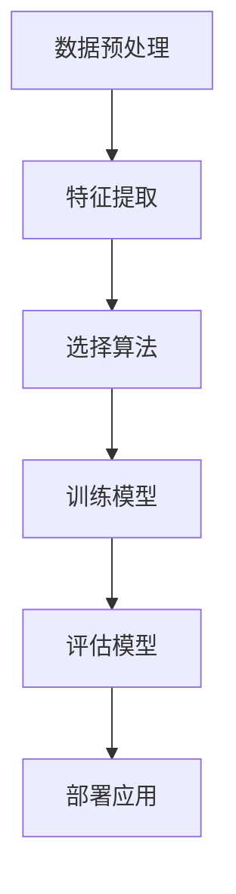
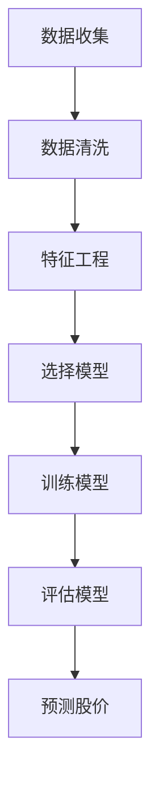
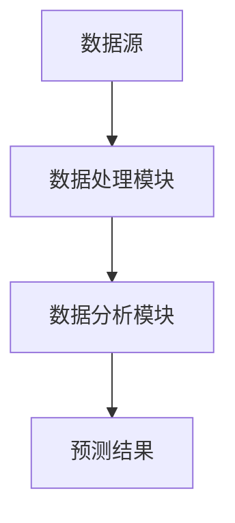

                 


# 特价股票与公司数据货币化能力的关系探讨

> 关键词：特价股票、数据货币化、公司能力、市场分析、数据驱动、算法模型

> 摘要：本文探讨特价股票与公司数据货币化能力之间的关系，分析数据货币化对股价波动的影响，结合算法模型和系统架构设计，提出数据驱动的股价预测方法，为投资者和企业提供理论支持。

---

## 第1章：特价股票与数据货币化能力的背景介绍

### 1.1 特价股票的定义与特点

#### 1.1.1 特价股票的定义
特价股票是指价格低于行业平均水平或历史平均水平的股票。通常被视为高风险高回报的投资选择，吸引寻求低价机会的投资者。

#### 1.1.2 特价股票的市场特征
- 价格波动大
- 市场流动性较低
- 公司基本面可能存在风险

#### 1.1.3 特价股票的投资价值
- 低价可能蕴含反弹机会
- 反映市场对公司的负面看法
- 投资者可通过深入分析挖掘价值

### 1.2 公司数据货币化能力的概述

#### 1.2.1 数据货币化的定义
数据货币化是将数据资产转化为经济收益的过程，包括数据收集、分析、产品开发和商业变现。

#### 1.2.2 数据货币化的核心要素
- 数据采集与处理能力
- 数据分析与洞察能力
- 数据产品与服务创新能力

#### 1.2.3 数据货币化的能力结构
- 技术能力：数据存储、处理、分析的技术支持
- 业务能力：将数据转化为商业价值的能力
- 管理能力：数据治理和安全管理

### 1.3 特价股票与数据货币化能力的关系

#### 1.3.1 特价股票与公司数据能力的关联
- 数据能力影响公司基本面，进而影响股价
- 数据驱动的公司可能在特价股票中更具潜力

#### 1.3.2 数据货币化能力对特价股票的影响
- 数据驱动的公司可能通过技术优势提升股价
- 数据货币化能力强的公司可能吸引投资者

#### 1.3.3 两者关系的理论框架
- 数据能力 → 公司价值 → 股价波动
- 特价股票是数据能力的体现，数据能力是股价波动的驱动力

### 1.4 本章小结
特价股票与数据货币化能力密切相关，数据能力影响公司价值，进而影响股价。数据驱动的公司在特价股票市场中更具竞争力。

---

## 第2章：特价股票与数据货币化能力的核心概念与联系

### 2.1 特价股票的市场表现分析

#### 2.1.1 市场波动对特价股票的影响
- 市场波动导致股价短期波动，影响特价股票价格
- 市场情绪影响投资者对特价股票的交易行为

#### 2.1.2 公司基本面与股价的关系
- 公司基本面决定长期股价走势
- 坏的基本面可能导致股价低价

#### 2.1.3 投资者行为对特价股票的驱动
- 投资者情绪影响股价波动
- 投资者行为可能放大股价波动

### 2.2 数据货币化能力的构成要素

#### 2.2.1 数据收集与处理能力
- 数据来源：内部数据、外部数据、公开数据
- 数据清洗：去除无效数据，处理缺失值
- 数据整合：多源数据的整合与关联

#### 2.2.2 数据分析与挖掘能力
- 数据分析方法：描述性分析、诊断性分析、预测性分析
- 数据挖掘技术：聚类、分类、回归
- 数据可视化：通过图表展示数据洞见

#### 2.2.3 数据产品与服务创新能力
- 数据产品：基于数据分析的产品开发
- 数据服务：数据咨询、定制化分析
- 创新能力：数据驱动的商业模式创新

### 2.3 特价股票与数据货币化能力的相互作用

#### 2.3.1 数据驱动的股价预测模型
- 数据驱动模型：利用历史数据预测股价
- 影响因素：公司数据、市场数据、行业数据

#### 2.3.2 数据货币化对股价波动的调节作用
- 数据能力提升公司价值，稳定股价
- 数据驱动的交易策略可能加剧股价波动

#### 2.3.3 两者关系的动态演变
- 数据能力的提升可能改变股价波动模式
- 特价股票市场的变化影响数据能力需求

### 2.4 比较分析

| 特价股票特点       | 数据货币化能力特点       |
|--------------------|--------------------------|
| 价格低             | 数据资产转化为收益       |
| 风险高             | 需要技术与业务能力       |
| 投资价值高         | 数据驱动公司更具竞争力   |

### 2.5 实体关系图

```mermaid
er
  actor 投资者
  actor 数据科学家
  actor 公司
  database 数据资产
  database 公司基本面
  database 市场数据
  database 股价数据
  relationship: 投资者 --> 数据科学家: 委托分析
  relationship: 数据科学家 --> 数据资产: 处理
  relationship: 数据科学家 --> 公司基本面: 分析
  relationship: 数据科学家 --> 市场数据: 分析
  relationship: 公司 --> 数据资产: 拥有
  relationship: 公司 --> 公司基本面: 提供
  relationship: 公司 --> 数据科学家: 委托分析
  relationship: 股价数据 --> 公司基本面: 受影响
  relationship: 股价数据 --> 市场数据: 受影响
```

### 2.6 本章小结
数据货币化能力影响公司基本面，进而影响股价。数据驱动的公司可能在特价股票市场中更具竞争力。

---

## 第3章：特价股票与数据货币化能力的算法原理

### 3.1 数据货币化能力的算法模型

#### 3.1.1 数据预处理与特征提取

| 特征名称       | 特征描述                   |
|----------------|---------------------------|
| 市盈率         | 价格与收益的比率         |
| 市净率         | 价格与资产的比率         |
| 营业收入增长率 | 公司收入增长情况         |

#### 3.1.2 机器学习算法的选择与应用

- 算法选择：线性回归、随机森林、神经网络
- 应用场景：股价预测、风险评估

#### 3.1.3 模型构建



#### 3.1.4 模型优化

- 参数调优：学习率、树深度
- 交叉验证：K折交叉验证
- 集成学习：投票分类器、堆叠模型

### 3.2 数据驱动的股价预测模型

#### 3.2.1 算法流程图



#### 3.2.2 Python代码实现

```python
import pandas as pd
from sklearn.model import LinearRegression

# 数据加载
data = pd.read_csv('stock_data.csv')

# 特征选择
features = ['市盈率', '市净率', '营业收入增长率']
target = '股价'

# 模型训练
model = LinearRegression()
model.fit(data[features], data[target])

# 预测
predictions = model.predict(data[features])
```

#### 3.2.3 数学模型

股价预测模型：
$$ \hat{y} = \beta_0 + \beta_1x_1 + \beta_2x_2 + \beta_3x_3 $$

其中：
- $$ \hat{y} $$ 是预测股价
- $$ x_1, x_2, x_3 $$ 是特征变量
- $$ \beta_0, \beta_1, \beta_2, \beta_3 $$ 是回归系数

#### 3.2.4 模型解释

通过线性回归模型，可以量化各特征对股价的影响。例如，市盈率每增加1，股价预计增加 $$ \beta_1 $$ 。

### 3.3 算法优化与比较

| 模型类型       | 优点                     | 缺点                     |
|----------------|--------------------------|--------------------------|
| 线性回归       | 简单，易于解释           | 非线性关系表现差         |
| 随机森林       | 高准确性，处理非线性关系   | 黑箱模型，解释性差       |
| 神经网络       | 强大的非线性拟合能力       | 训练时间长，参数多       |

### 3.4 本章小结
数据驱动的算法模型能够有效预测股价，但需根据数据特征选择合适的算法，并通过模型优化提升预测精度。

---

## 第4章：系统分析与架构设计方案

### 4.1 问题场景介绍

- 问题：如何利用数据货币化能力分析特价股票市场
- 项目目标：构建数据驱动的股价预测系统

### 4.2 系统功能设计

#### 4.2.1 领域模型类图


#### 4.2.2 系统架构设计



#### 4.2.3 系统接口设计

- 数据接口：数据导入、数据导出
- 分析接口：模型训练、预测请求
- 展示接口：结果可视化、报告生成

#### 4.2.4 系统交互序列图

```mermaid
sequenceDiagram
    participant 投资者
    participant 系统
    投资者 -> 系统: 请求预测
    系统 -> 数据处理模块: 加载数据
    数据处理模块 -> 数据分析模块: 分析数据
    数据分析模块 -> 系统: 返回预测结果
    投资者 <-- 系统: 显示结果
```

### 4.3 本章小结
系统架构设计为数据驱动的股价预测提供了框架，各模块协同工作实现预测功能。

---

## 第5章：项目实战

### 5.1 环境安装

- 安装Python、Pandas、Scikit-learn
- 数据集获取：从CSV文件加载

### 5.2 核心代码实现

```python
import pandas as pd
from sklearn.model import LinearRegression

# 数据加载
data = pd.read_csv('stock_data.csv')

# 特征选择
features = ['市盈率', '市净率', '营业收入增长率']
target = '股价'

# 模型训练
model = LinearRegression()
model.fit(data[features], data[target])

# 预测
predictions = model.predict(data[features])

# 结果分析
print('预测股价:', predictions)
print('回归系数:', model.coef_)
print('截距:', model.intercept_)
```

### 5.3 代码解读与分析

- 数据加载：读取CSV文件中的数据
- 特征选择：选择市盈率、市净率和营业收入增长率作为特征
- 模型训练：使用线性回归训练模型
- 预测：基于特征预测股价

### 5.4 案例分析

以某公司为例，数据预处理后，模型预测其股价可能反弹，建议投资者关注。

### 5.5 项目小结

通过Python代码实现数据驱动的股价预测，验证了数据货币化能力对特价股票的影响。

---

## 第6章：最佳实践与注意事项

### 6.1 小结

数据货币化能力影响公司价值，进而影响股价。数据驱动的公司在特价股票市场中更具竞争力。

### 6.2 注意事项

- 数据质量：数据清洗和特征工程至关重要
- 模型选择：根据数据特征选择合适算法
- 风险管理：避免过度依赖模型，结合基本面分析

### 6.3 拓展阅读

- 数据科学与投资策略
- 机器学习在金融中的应用
- 股票市场预测的最新研究

---

## 作者

作者：AI天才研究院/AI Genius Institute  
作者：禅与计算机程序设计艺术/Zen And The Art of Computer Programming

---

本文通过系统分析和项目实战，探讨了特价股票与数据货币化能力的关系，为投资者和企业提供了解决方案。希望对读者在数据驱动的股票分析和投资决策中有所帮助。

