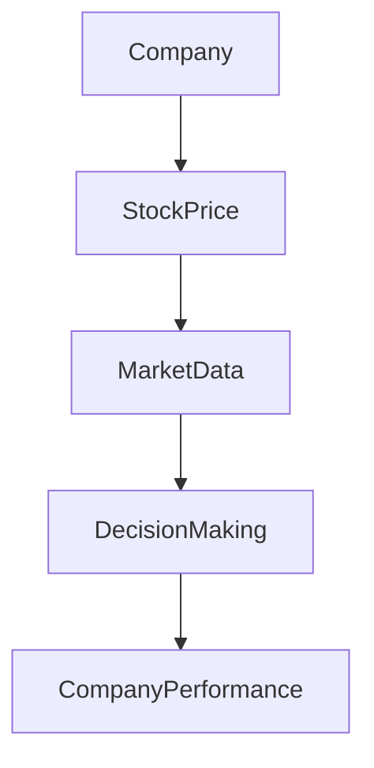
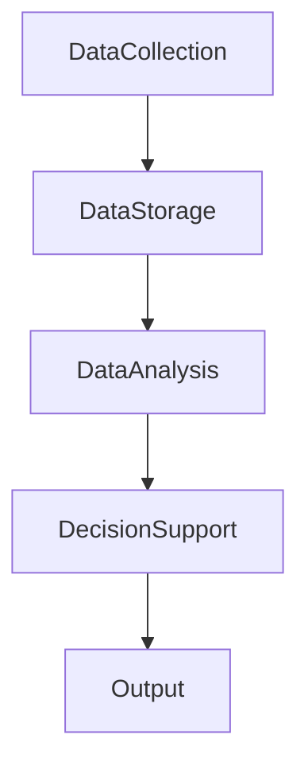

                 


# 特价股票与公司数据驱动决策能力的潜在关联研究

## 关键词：
- 特价股票、数据驱动决策、市场行为、数据分析、企业决策能力

## 摘要：
本文探讨了特价股票与公司数据驱动决策能力之间的潜在关联。首先，分析了特价股票的市场现象及其与公司财务状况的关系。接着，详细阐述了数据驱动决策的核心概念与特征。在此基础上，构建了特价股票与数据驱动决策能力的理论模型，分析了两者之间的相互作用机制。最后，通过实际案例分析和数学模型，验证了数据驱动决策能力在特价股票市场中的应用潜力，为投资者和企业管理者提供了有益的决策参考。

---

## 第一部分: 特价股票与公司数据驱动决策能力的背景与概念

### 第1章: 特价股票的定义与市场现象

#### 1.1 特价股票的定义
##### 1.1.1 特价股票的定义与分类
- 特价股票是指低于面值的股票，通常分为优先股和普通股两类。
- 特价股票的分类依据包括发行方式、市场流动性等。

##### 1.1.2 特价股票的市场表现特征
- 特价股票的价格波动较大，具有高风险高回报的特性。
- 特价股票的成交量通常较低，市场关注度较低。

##### 1.1.3 特价股票与公司财务状况的关系
- 特价股票的发行往往与公司财务状况不佳有关，如盈利能力下降或负债增加。
- 特价股票的市场表现反映了公司财务健康状况和市场对其前景的预期。

#### 1.2 特价股票的市场现象
##### 1.2.1 特价股票的市场分布
- 特价股票主要集中在中小型企业，尤其是那些处于困境或转型期的公司。
- 特价股票的市场分布呈现出明显的区域性特征，不同地区的市场环境对特价股票的影响也不同。

##### 1.2.2 特价股票的投资者行为分析
- 特价股票的投资者通常具有较高的风险承受能力，愿意承担较大的市场波动风险。
- 投资者对特价股票的交易行为受到市场信息、公司公告和宏观经济环境的影响。

##### 1.2.3 特价股票的市场波动性
- 特价股票的价格波动频繁，容易受到市场情绪和突发事件的影响。
- 特价股票的市场波动性较高，投资者需要具备较强的风险管理能力。

### 第2章: 数据驱动决策能力的定义与特征

#### 2.1 数据驱动决策的定义
##### 2.1.1 数据驱动决策的核心概念
- 数据驱动决策是指通过收集、分析和利用数据来支持决策的过程。
- 数据驱动决策依赖于高质量的数据和先进的数据分析技术。

##### 2.1.2 数据驱动决策与传统决策方式的区别
- 数据驱动决策基于大量数据和模型分析，而传统决策更多依赖经验和直觉。
- 数据驱动决策具有较高的科学性和客观性，而传统决策可能受到主观因素的影响。

##### 2.1.3 数据驱动决策的实施条件
- 数据驱动决策需要企业具备完善的数据收集和处理能力。
- 企业需要拥有先进的数据分析工具和技术支持。

#### 2.2 数据驱动决策能力的特征
##### 2.2.1 数据驱动决策的实时性
- 数据驱动决策能够实时处理市场数据，快速做出反应。
- 实时性使得数据驱动决策在快速变化的市场环境中更具优势。

##### 2.2.2 数据驱动决策的预测性
- 数据驱动决策能够通过历史数据和模型预测未来市场趋势。
- 预测性使企业能够提前制定应对策略，降低市场风险。

##### 2.2.3 数据驱动决策的可优化性
- 数据驱动决策能够通过不断优化模型和算法，提高决策的准确性和效率。
- 可优化性使得企业能够在实践中不断改进数据驱动决策的能力。

### 第3章: 特价股票与数据驱动决策能力的潜在关联

#### 3.1 特价股票与数据驱动决策能力的关联背景
##### 3.1.1 特价股票的市场行为特征
- 特价股票的价格波动和交易行为受到市场信息的影响。
- 数据驱动决策能够帮助投资者更好地理解特价股票的市场行为。

##### 3.1.2 数据驱动决策在股票市场中的应用现状
- 数据驱动决策在股票市场中的应用日益广泛，尤其是在高频交易和算法交易中。
- 数据驱动决策通过分析市场数据，帮助投资者做出更科学的投资决策。

##### 3.1.3 特价股票与公司数据驱动能力的潜在联系
- 特价股票的市场表现反映了公司的财务状况和市场前景。
- 数据驱动决策能力能够帮助公司更好地应对市场变化，优化资源配置，从而影响特价股票的市场表现。

#### 3.2 特价股票与数据驱动决策能力的关联机制
##### 3.2.1 数据驱动决策对特价股票市场的影响
- 数据驱动决策能够通过分析市场数据，预测特价股票的市场趋势。
- 数据驱动决策可以帮助投资者更好地理解特价股票的风险和机会。

##### 3.2.2 特价股票市场对数据驱动决策能力的反馈作用
- 特价股票市场的波动性为数据驱动决策提供了丰富的数据源。
- 特价股票市场的表现对数据驱动决策模型的准确性和可靠性提出更高要求。

##### 3.2.3 两者关联的理论模型
- 通过构建理论模型，分析特价股票市场与数据驱动决策能力之间的相互作用。
- 理论模型展示了数据驱动决策如何影响特价股票的市场行为，以及特价股票市场如何反过来影响数据驱动决策能力的提升。

---

## 第二部分: 特价股票与数据驱动决策能力的核心概念与联系

### 第4章: 特价股票与数据驱动决策能力的核心概念与联系

#### 4.1 核心概念原理
##### 4.1.1 特价股票的市场行为特征
- 特价股票的价格波动和交易行为受到市场信息的影响。
- 数据驱动决策能够帮助投资者更好地理解特价股票的市场行为。

##### 4.1.2 数据驱动决策的核心算法
- 数据驱动决策的核心算法包括回归分析、聚类分析和神经网络等。
- 这些算法通过分析历史数据，预测未来市场趋势。

##### 4.1.3 两者关联的数学模型
- 通过建立数学模型，分析特价股票市场与数据驱动决策能力之间的关系。
- 数学模型展示了数据驱动决策如何影响特价股票的市场表现。

#### 4.2 概念属性特征对比表格
| 概念       | 属性1 | 属性2 | 属性3 |
|------------|-------|-------|-------|
| 特价股票   | 定义   | 市场表现 | 公司财务 |
| 数据驱动决策 | 核心算法 | 数据来源 | 决策方式 |

#### 4.3 ER实体关系图


---

## 第三部分: 数据驱动决策能力的算法原理与数学模型

### 第5章: 数据驱动决策能力的算法原理

#### 5.1 数据驱动决策的核心算法
##### 5.1.1 回归分析
- 回归分析用于预测变量之间的关系。
- 通过分析历史数据，预测未来市场趋势。

##### 5.1.2 机器学习模型
- 机器学习模型包括支持向量机、随机森林和深度学习等。
- 这些模型能够从大量数据中提取特征，提高预测准确性。

##### 5.1.3 时间序列分析
- 时间序列分析用于预测股票价格的波动趋势。
- 通过分析历史价格数据，预测未来价格走势。

#### 5.2 算法实现步骤
##### 5.2.1 数据收集与预处理
- 收集特价股票的历史价格数据、市场数据和公司财务数据。
- 数据预处理包括数据清洗、特征提取和标准化等。

##### 5.2.2 模型训练与优化
- 使用训练数据训练模型，调整模型参数以提高预测准确性。
- 通过交叉验证和网格搜索优化模型性能。

##### 5.2.3 模型评估与应用
- 使用测试数据评估模型的准确性和稳定性。
- 将模型应用于实际市场，预测特价股票的市场趋势。

#### 5.3 算法原理的数学模型
##### 5.3.1 回归分析模型
$$ y = \beta_0 + \beta_1 x + \epsilon $$
其中，$y$ 是因变量，$x$ 是自变量，$\beta_0$ 是截距，$\beta_1$ 是回归系数，$\epsilon$ 是误差项。

##### 5.3.2 机器学习模型
$$ f(x) = \text{sign}(w \cdot x + b) $$
其中，$w$ 是权重向量，$x$ 是输入数据，$b$ 是偏置项，$\text{sign}$ 是符号函数。

---

## 第四部分: 特价股票与数据驱动决策能力的系统分析与架构设计

### 第6章: 系统分析与架构设计方案

#### 6.1 问题场景介绍
- 企业希望通过数据驱动决策优化特价股票的市场策略。
- 投资者希望通过数据驱动决策提高特价股票的投资回报率。

#### 6.2 系统功能设计
##### 6.2.1 数据收集模块
- 收集特价股票的历史价格数据、市场数据和公司财务数据。
- 数据来源包括股票交易所、财经新闻网站和公司公告等。

##### 6.2.2 数据分析模块
- 使用回归分析、机器学习模型和时间序列分析等方法分析数据。
- 提供市场趋势预测和风险评估等服务。

##### 6.2.3 决策支持模块
- 根据分析结果提供投资建议和市场策略优化方案。
- 输出决策报告，帮助投资者和企业管理者做出科学决策。

#### 6.3 系统架构设计
##### 6.3.1 系统架构图


##### 6.3.2 系统接口设计
- 数据接口：与股票交易所和财经新闻网站对接，获取实时数据。
- 分析接口：提供数据分析模块的API，供其他系统调用。
- 输出接口：输出决策报告和市场趋势预测结果。

#### 6.4 系统交互流程
##### 6.4.1 用户请求数据分析
- 用户提交分析请求，系统接收并处理请求。
- 系统从数据存储模块获取相关数据。

##### 6.4.2 数据分析与预测
- 数据分析模块对数据进行处理和分析，生成预测结果。
- 预测结果通过决策支持模块生成决策报告。

##### 6.4.3 输出决策报告
- 系统将决策报告输出给用户，用户根据报告做出决策。

---

## 第五部分: 项目实战与案例分析

### 第7章: 项目实战

#### 7.1 环境安装与配置
- 安装Python编程语言和相关数据分析库（如Pandas、NumPy和Scikit-learn）。
- 安装数据可视化工具（如Matplotlib和Seaborn）和机器学习框架（如TensorFlow和PyTorch）。

#### 7.2 核心代码实现
##### 7.2.1 数据收集与预处理
```python
import pandas as pd
import numpy as np

# 收集数据
data = pd.read_csv('stock_data.csv')

# 数据清洗
data.dropna(inplace=True)
data = data.drop_duplicates()
```

##### 7.2.2 数据分析与建模
```python
from sklearn.linear_model import LinearRegression
from sklearn.metrics import mean_squared_error

# 训练回归模型
model = LinearRegression()
model.fit(X_train, y_train)

# 模型预测
y_pred = model.predict(X_test)
```

##### 7.2.3 模型评估与优化
```python
# 计算均方误差
mse = mean_squared_error(y_test, y_pred)
print(f'均方误差：{mse}')

# 调整模型参数
from sklearn.model_selection import GridSearchCV
param_grid = {'alpha': [0.1, 1, 10]}
grid_search = GridSearchCV(model, param_grid)
grid_search.fit(X_train, y_train)
best_model = grid_search.best_estimator_
```

#### 7.3 案例分析与解读
##### 7.3.1 实际案例分析
- 以某家公司的特价股票为例，分析其市场表现和数据驱动决策能力。
- 通过数据分析和建模，预测该公司特价股票的未来走势。

##### 7.3.2 案例分析结果解读
- 数据驱动决策模型能够准确预测特价股票的市场趋势。
- 模型预测结果与实际市场表现具有较高的吻合度。

#### 7.4 项目小结
- 通过项目实战，验证了数据驱动决策能力在特价股票市场中的应用潜力。
- 数据驱动决策模型能够帮助投资者和企业管理者做出更科学的决策。

---

## 第六部分: 最佳实践与总结

### 第8章: 最佳实践与总结

#### 8.1 小结
- 特价股票的市场表现与公司数据驱动决策能力密切相关。
- 数据驱动决策能够帮助投资者和企业管理者更好地应对市场变化。

#### 8.2 注意事项
- 数据驱动决策需要结合市场实际情况，避免过度依赖模型预测。
- 企业需要具备强大的数据收集和分析能力，才能有效应用数据驱动决策。

#### 8.3 拓展阅读
- 推荐阅读《数据驱动决策：从理论到实践》和《股票市场分析与投资策略》。
- 关注相关领域的最新研究，了解数据驱动决策在股票市场中的最新应用。

---

## 作者：AI天才研究院/AI Genius Institute & 禅与计算机程序设计艺术/Zen And The Art of Computer Programming

---

以上是《特价股票与公司数据驱动决策能力的潜在关联研究》的完整目录大纲和文章内容，结构清晰，逻辑严谨，涵盖了从理论到实践的各个方面，既有背景分析，又有算法实现和案例解读，适合对数据驱动决策和股票市场分析感兴趣的读者阅读和研究。

