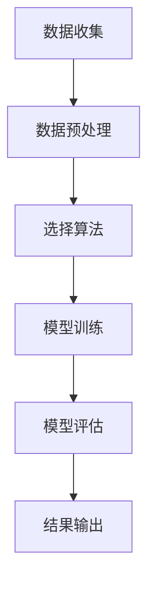
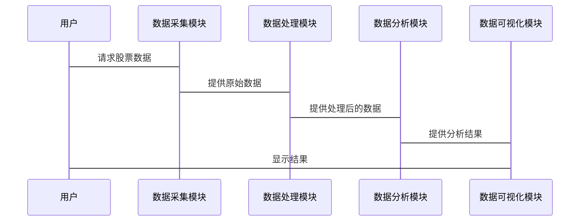

                 


# 特价股票与公司数据驱动决策能力的长期关系分析

> **关键词**：特价股票、数据驱动决策、长期关系、算法原理、系统架构、数学模型

> **摘要**：本文通过分析特价股票与公司数据驱动决策能力之间的长期关系，探讨数据驱动决策在特价股票分析中的应用及其对投资决策的影响。文章从背景介绍、核心概念、算法原理、系统架构等多个角度展开，结合实际案例和数学模型，详细阐述了数据驱动决策在特价股票分析中的作用及其对投资决策的长期影响。

---

# 第一章：背景介绍

## 1.1 特价股票的定义与特点

### 1.1.1 特价股票的定义
特价股票是指价格低于市场平均价格，通常具有较高价值或潜在增长空间的股票。这类股票通常被市场低估，具有较高的投资回报潜力。

### 1.1.2 特价股票的特点
- 价格低：相对于其内在价值，市场价格较低。
- 高增长潜力：公司未来增长潜力较高。
- 高波动性：市场波动较大，容易受到外部因素影响。

### 1.1.3 特价股票与普通股票的区别
| 特性 | 特价股票 | 普通股票 |
|------|----------|----------|
| 价格 | 低于市场价 | 符合市场价 |
| 风险 | 较高 | 中等 |
| 收益 | 高潜在回报 | 稳定回报 |

## 1.2 数据驱动决策的背景

### 1.2.1 数据驱动决策的定义
数据驱动决策是指通过数据分析和挖掘，利用数据驱动的洞察来制定决策的过程。它依赖于数据的收集、处理和分析，以提供可靠的决策支持。

### 1.2.2 数据驱动决策的核心要素
- 数据收集：从多个来源获取相关数据。
- 数据处理：清洗、整理和转换数据。
- 数据分析：使用统计方法和算法进行分析。
- 数据可视化：通过图表和报告呈现分析结果。

### 1.2.3 数据驱动决策的应用现状
数据驱动决策在企业中的应用日益广泛，尤其是在金融、市场营销和运营管理等领域。

## 1.3 特价股票与公司数据驱动决策的关系

### 1.3.1 特价股票对公司的潜在影响
- 提升公司市值：特价股票的上涨可能带动公司整体市值的增长。
- 吸引投资者：特价股票的高增长潜力可能吸引更多的投资者。

### 1.3.2 数据驱动决策在特价股票分析中的作用
- 数据驱动决策可以帮助识别潜在的特价股票。
- 通过数据分析，可以预测特价股票的市场走势。

### 1.3.3 特价股票与公司数据驱动决策的长期关系
- 数据驱动决策可以帮助公司更好地识别和利用特价股票的投资机会。
- 特价股票的投资回报可以通过数据驱动决策得到优化。

---

# 第二章：核心概念与联系

## 2.1 特价股票的核心要素

### 2.1.1 特价股票的定价机制
特价股票的价格通常低于其内在价值，市场波动较大。

### 2.1.2 特价股票的市场特征
- 高波动性：市场价格波动较大。
- 高风险：投资风险较高。
- 高回报：潜在回报较高。

### 2.1.3 特价股票的风险与收益分析
- 风险：市场波动、公司基本面变化。
- 收益：潜在的高回报。

## 2.2 数据驱动决策的原理

### 2.2.1 数据驱动决策的基本原理
数据驱动决策依赖于数据分析和挖掘，通过数据洞察来制定决策。

### 2.2.2 数据驱动决策的关键技术
- 数据挖掘：从大量数据中提取有用信息。
- 机器学习：利用算法进行预测和分类。
- 统计分析：通过统计方法分析数据。

### 2.2.3 数据驱动决策的数学模型
- 线性回归：用于预测股票价格。
- 时间序列分析：用于分析股票价格的走势。

## 2.3 特价股票与数据驱动决策的联系

### 2.3.1 数据驱动决策在特价股票分析中的应用
- 数据挖掘：识别潜在的特价股票。
- 机器学习：预测特价股票的市场走势。

### 2.3.2 特价股票数据的特征与数据驱动决策的关系
- 特价股票的高波动性：影响数据驱动决策的准确性。
- 特价股票的高风险：需要更精准的数据分析。

### 2.3.3 数据驱动决策对特价股票长期投资价值的影响
- 数据驱动决策可以帮助识别具有长期投资价值的特价股票。
- 通过数据分析，可以优化投资策略。

## 2.4 核心概念对比表格

| 特性       | 特价股票               | 数据驱动决策             |
|------------|-----------------------|-------------------------|
| 定义       | 价格低于市场价的股票   | 通过数据分析制定决策    |
| 核心要素   | 价格、风险、收益       | 数据收集、处理、分析     |
| 应用场景   | 投资、市场分析         | 企业决策、金融分析       |

## 2.5 ER实体关系图

```mermaid
erd
  entity 特价股票 {
    id
    stock_name
    price
    company_info
  }
  
  entity 数据驱动决策 {
    id
    decision_type
    data_source
    analysis_result
  }
  
  relation: 特价股票 -- 数据驱动决策
```

---

# 第三章：数据驱动决策的算法原理

## 3.1 时间序列分析

### 3.1.1 时间序列分析的基本原理
时间序列分析是一种通过历史数据预测未来趋势的方法。

### 3.1.2 ARIMA模型的数学公式
ARIMA模型用于预测股票价格的变化。

$$ ARIMA(p, d, q) $$

其中，p为自回归阶数，d为差分阶数，q为移动平均阶数。

### 3.1.3 时间序列分析在特价股票预测中的应用
通过历史价格数据，预测特价股票的未来走势。

## 3.2 机器学习算法

### 3.2.1 支持向量机（SVM）的原理与公式
SVM用于分类问题，可以用于股票价格的分类预测。

$$ \text{max} \sum_{i=1}^n y_i (w \cdot x_i + b) - 1 $$

### 3.2.2 随机森林算法的原理与公式
随机森林是一种基于树的集成方法，用于股票价格的预测。

### 3.2.3 神经网络在股票预测中的应用
神经网络可以用于股票价格的预测。

## 3.3 聚类分析

### 3.3.1 K-means算法的原理与公式
K-means算法用于将股票分为不同的类别。

$$ \text{目标函数} = \sum_{i=1}^k \sum_{j=1}^n (y_{ij})^2 $$

### 3.3.2 聚类分析在股票市场中的应用
通过聚类分析，识别具有相似特征的股票。

### 3.3.3 聚类分析在特价股票分类中的案例
将特价股票分为不同的类别，进行分析和预测。

## 3.4 算法流程图



---

# 第四章：数据驱动决策的系统架构设计

## 4.1 系统功能设计

### 4.1.1 数据采集模块
从多个数据源采集股票数据。

### 4.1.2 数据处理模块
清洗、整理和转换数据。

### 4.1.3 数据分析模块
使用算法进行数据分析和预测。

### 4.1.4 数据可视化模块
将分析结果以图表形式展示。

## 4.2 系统架构图


### 4.3 系统接口设计

#### 4.3.1 数据接口
- 输入：股票数据
- 输出：处理后的数据

#### 4.3.2 用户接口
- 输入：用户查询
- 输出：分析结果

#### 4.3.3 分析接口
- 输入：模型参数
- 输出：预测结果

## 4.4 系统交互序列图



---

# 第五章：项目实战

## 5.1 环境安装
安装必要的数据处理和分析工具，如Python、Pandas、Matplotlib等。

## 5.2 系统核心实现源代码

### 5.2.1 数据采集模块

```python
import pandas as pd
import requests

def get_stock_data(symbol):
    url = f"https://api.example.com/stock/{symbol}"
    response = requests.get(url)
    data = response.json()
    df = pd.DataFrame(data)
    return df
```

### 5.2.2 数据处理模块

```python
def preprocess_data(df):
    df.dropna(inplace=True)
    df['date'] = pd.to_datetime(df['date'])
    return df
```

### 5.2.3 数据分析模块

```python
from sklearn.linear_model import LinearRegression

def predict_stock_price(X_train, y_train, X_test):
    model = LinearRegression()
    model.fit(X_train, y_train)
    y_pred = model.predict(X_test)
    return y_pred
```

### 5.2.4 数据可视化模块

```python
import matplotlib.pyplot as plt

def visualize_results(true_price, predicted_price):
    plt.plot(true_price, label='实际价格')
    plt.plot(predicted_price, label='预测价格')
    plt.legend()
    plt.show()
```

## 5.3 代码应用解读与分析
通过代码实现数据采集、处理、分析和可视化，展示数据驱动决策在特价股票分析中的应用。

## 5.4 实际案例分析
以具体公司为例，分析数据驱动决策在特价股票投资中的实际应用。

## 5.5 项目小结
总结项目实现的关键点和经验教训，提出改进建议。

---

# 第六章：总结与展望

## 6.1 核心观点回顾
- 特价股票的高增长潜力和高风险特征。
- 数据驱动决策在特价股票分析中的重要作用。

## 6.2 最佳实践 tips
- 数据驱动决策需要结合市场实际情况。
- 投资者应具备一定的市场分析能力。

## 6.3 小结
数据驱动决策是分析特价股票的重要工具，能够帮助投资者做出更明智的投资决策。

## 6.4 注意事项
- 数据的准确性和完整性。
- 模型的可解释性和稳定性。

## 6.5 拓展阅读
建议进一步研究数据驱动决策在金融领域的其他应用。

---

# 作者信息

作者：AI天才研究院/AI Genius Institute & 禅与计算机程序设计艺术 /Zen And The Art of Computer Programming

