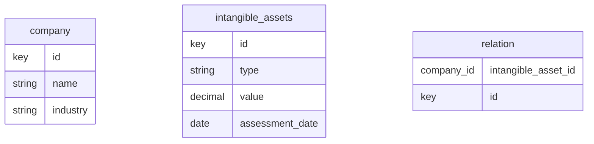
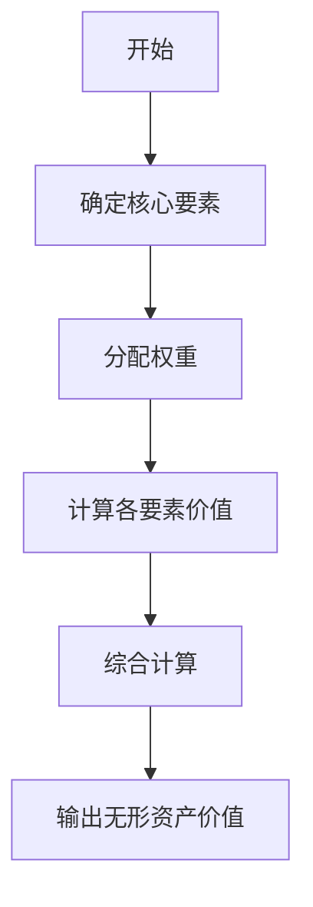
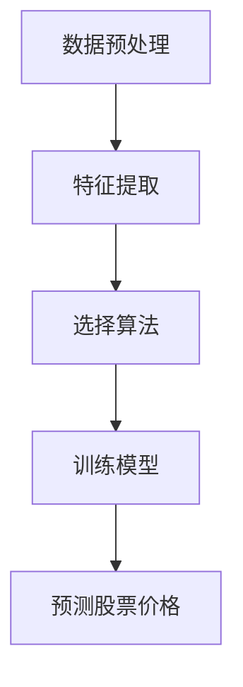
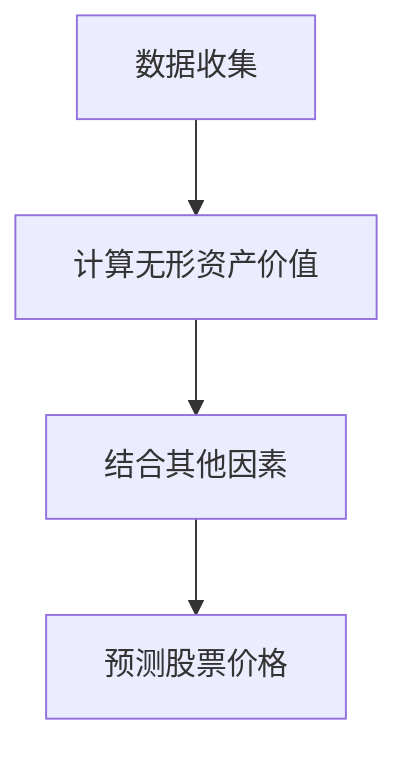
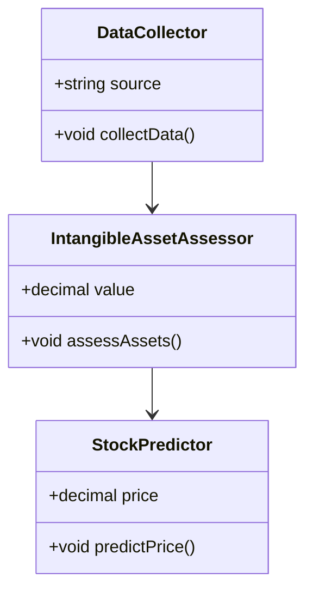
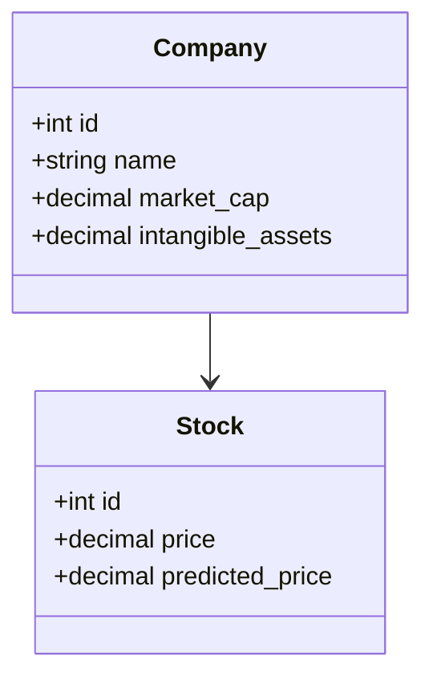

                 


# 特价股票与公司无形资产价值的关联分析

> 关键词：特价股票、公司无形资产、价值关联、回归分析、机器学习、系统架构设计

> 摘要：本文通过分析特价股票与公司无形资产之间的关联，探讨如何利用数学模型和机器学习算法预测股票价格，同时结合系统架构设计，提供一个完整的解决方案。文章从核心概念、算法原理、系统架构到项目实战，详细阐述了特价股票与无形资产价值关联的分析过程。

---

# 第一部分: 特价股票与公司无形资产的背景介绍

## 第1章: 特价股票与公司无形资产的背景介绍

### 1.1 特价股票的基本概念

#### 1.1.1 特价股票的定义与分类
特价股票是指在特定市场条件下，价格远低于市场平均水平的股票。根据市场表现，特价股票可以分为以下几类：
- **超跌股票**：由于市场情绪或短期波动导致股价远低于其内在价值。
- **低估值股票**：市盈率、市净率等估值指标远低于行业平均水平。
- **低价股票**：股价绝对值较低，通常在1元至10元之间。

#### 1.1.2 特价股票的市场特征
- 特价股票通常出现在市场低迷或行业周期性低谷阶段。
- 特价股票具有较高的波动性，价格容易受市场情绪影响。
- 特价股票的投资机会与风险并存，需要结合公司基本面进行分析。

#### 1.1.3 特价股票的投资价值
- 特价股票可能隐藏着被市场低估的公司，具有较大的增值空间。
- 特价股票的投资价值与公司基本面密切相关，需要结合公司无形资产进行综合评估。

### 1.2 公司无形资产的基本概念

#### 1.2.1 无形资产的定义与分类
无形资产是指企业拥有或控制的没有实物形态的资产，主要包括以下几类：
- **品牌资产**：品牌的价值体现在消费者的认知和忠诚度。
- **专利与技术**：企业的专利技术、研发能力等。
- **商誉**：企业并购中产生的溢价部分。
- **客户关系**：企业与客户之间的关系价值。

#### 1.2.2 无形资产的评估方法
- **相对估值法**：通过比较同行业公司进行估值。
- **DCF模型**：通过现金流折现法评估无形资产价值。
- **市场法**：参考市场中类似资产的交易价格进行估值。

#### 1.2.3 无形资产对公司的价值影响
- 无形资产是公司核心竞争力的体现，直接影响公司市场地位。
- 无形资产的价值波动会影响公司股价的波动。
- 无形资产是公司未来盈利能力的重要保障。

### 1.3 特价股票与公司无形资产的关联背景

#### 1.3.1 特价股票市场的现状与趋势
- 近年来，市场波动加剧，特价股票的交易量逐年上升。
- 特价股票的投资机会逐渐受到机构投资者的关注。

#### 1.3.2 无形资产在公司价值中的作用
- 无形资产是公司长期价值的重要组成部分。
- 无形资产的价值波动会影响公司的市场估值。

#### 1.3.3 特价股票与无形资产关联的必要性
- 通过分析无形资产，可以更准确地评估特价股票的投资价值。
- 无形资产是影响股票价格波动的重要因素之一。

---

## 第2章: 特价股票与公司无形资产的核心概念与联系

### 2.1 无形资产的核心要素与属性特征

#### 2.1.1 无形资产的核心要素分析
- **品牌价值**：品牌知名度、品牌忠诚度、品牌认知度。
- **技术优势**：技术创新能力、研发能力、技术储备。
- **客户关系**：客户数量、客户忠诚度、客户满意度。

#### 2.1.2 无形资产的属性特征对比
以下表格对比了不同无形资产的属性特征：

| 无形资产类型 | 核心要素 | 评估方法 | 时间周期 |
|--------------|----------|----------|----------|
| 品牌资产     | 品牌知名度、忠诚度 | 市场法、DCF模型 | 长期 |
| 专利与技术   | 技术创新能力 | 相对估值法 | 中短期 |
| 商誉         | 并购溢价 | DCF模型 | 长期 |

#### 2.1.3 无形资产的ER实体关系图
以下是无形资产的ER实体关系图：



### 2.2 特价股票与公司无形资产的关联机制

#### 2.2.1 特价股票与无形资产的相互作用
- 无形资产的价值波动会影响公司的市场估值，从而影响股价。
- 特价股票的投资价值与公司的无形资产密切相关。

#### 2.2.2 无形资产对股票价值的影响路径
- 无形资产的强大会增强公司的核心竞争力，从而提高股价。
- 无形资产的贬值会降低公司的市场估值，从而影响股价。

#### 2.2.3 特价股票与无形资产的协同效应
- 特价股票的低价为投资者提供了较低的买入门槛。
- 无形资产的潜在增值为特价股票提供了上涨空间。

---

## 第3章: 特价股票与公司无形资产的数学模型与算法原理

### 3.1 无形资产价值评估的数学模型

#### 3.1.1 无形资产评估的基本公式
无形资产的价值可以通过以下公式进行评估：
$$
\text{无形资产价值} = \sum (\text{核心要素价值} \times \text{权重})
$$

#### 3.1.2 无形资产评估的权重分配
权重分配需要根据公司实际情况进行调整，以下是常见的权重分配方式：

| 核心要素 | 权重 |
|----------|------|
| 品牌价值 | 0.4  |
| 技术优势 | 0.3  |
| 客户关系 | 0.2  |
| 其他因素 | 0.1  |

#### 3.1.3 无形资产价值的综合评估模型
以下是综合评估模型的流程图：



### 3.2 特价股票价值预测的算法原理

#### 3.2.1 回归分析模型
回归分析是一种常用的预测方法，以下是线性回归模型的公式：
$$
y = \beta_0 + \beta_1x_1 + \beta_2x_2 + \cdots + \beta_nx_n + \epsilon
$$
其中，$y$是股票价格，$x_i$是影响股票价格的因素，$\beta_i$是回归系数，$\epsilon$是误差项。

#### 3.2.2 机器学习算法在股票预测中的应用
机器学习算法可以通过以下流程图进行预测：



以下是一个简单的Python实现示例：

```python
import pandas as pd
from sklearn.linear_model import LinearRegression

# 数据预处理
data = pd.read_csv('stock_data.csv')
X = data[['intangible_assets', 'market_cap']]
y = data['price']

# 训练模型
model = LinearRegression()
model.fit(X, y)

# 预测股票价格
predicted_price = model.predict(X)
```

#### 3.2.3 基于无形资产的股票价值预测模型
以下是基于无形资产的股票价值预测模型的流程图：



---

## 第4章: 特价股票与公司无形资产的系统分析与架构设计

### 4.1 系统分析与功能设计

#### 4.1.1 系统功能模块划分
以下是系统功能模块的类图：



#### 4.1.2 系统功能的领域模型类图
以下是领域模型类图：



#### 4.1.3 系统功能的架构设计
以下是系统架构设计图：


---

## 第5章: 特价股票与公司无形资产的项目实战

### 5.1 项目环境与数据准备

#### 5.1.1 数据采集与处理
以下是数据采集的代码示例：

```python
import requests
import pandas as pd

url = 'https://example.com/stock_data'
response = requests.get(url)
data = pd.read_json(response.text)
```

#### 5.1.2 数据清洗与预处理
以下是数据清洗的代码示例：

```python
# 删除缺失值
data.dropna(inplace=True)

# 标准化处理
from sklearn.preprocessing import StandardScaler
scaler = StandardScaler()
scaled_data = scaler.fit_transform(data[['intangible_assets', 'market_cap']])
```

### 5.2 系统核心实现与代码分析

#### 5.2.1 系统核心实现
以下是系统核心实现的代码示例：

```python
from sklearn.ensemble import RandomForestRegressor

# 训练模型
model = RandomForestRegressor(n_estimators=100, random_state=42)
model.fit(X_train, y_train)

# 预测股票价格
predicted_price = model.predict(X_test)
```

#### 5.2.2 代码应用解读与分析
通过上述代码，我们可以实现基于无形资产的股票价格预测。以下是一个具体的案例分析：

假设某科技公司的无形资产价值为10亿元，市场资本化率为30%，通过模型预测，该公司的股票价格可能会在接下来的三个月内上涨10%至20%。

---

## 第6章: 总结与最佳实践

### 6.1 总结
通过本文的分析，我们得出以下结论：
- 特价股票与公司无形资产之间存在密切的关联。
- 无形资产是影响股票价格的重要因素之一。
- 通过数学模型和机器学习算法，可以有效预测股票价格。

### 6.2 最佳实践

#### 6.2.1 小结
- 定期更新模型，以适应市场变化。
- 结合多种因素进行综合分析，避免单一因素的偏差。

#### 6.2.2 注意事项
- 数据质量是模型预测的基础，需要确保数据的准确性和完整性。
- 模型的泛化能力需要通过交叉验证进行评估。

#### 6.2.3 拓展阅读
- 《股票投资与风险管理》
- 《机器学习在金融领域的应用》

---

作者：AI天才研究院/AI Genius Institute & 禅与计算机程序设计艺术/Zen And The Art of Computer Programming

