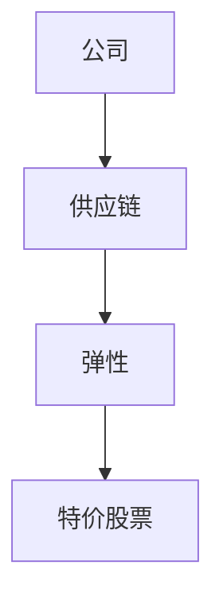
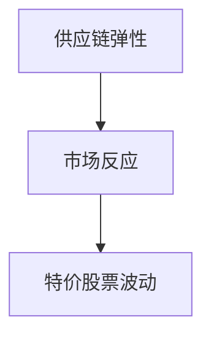
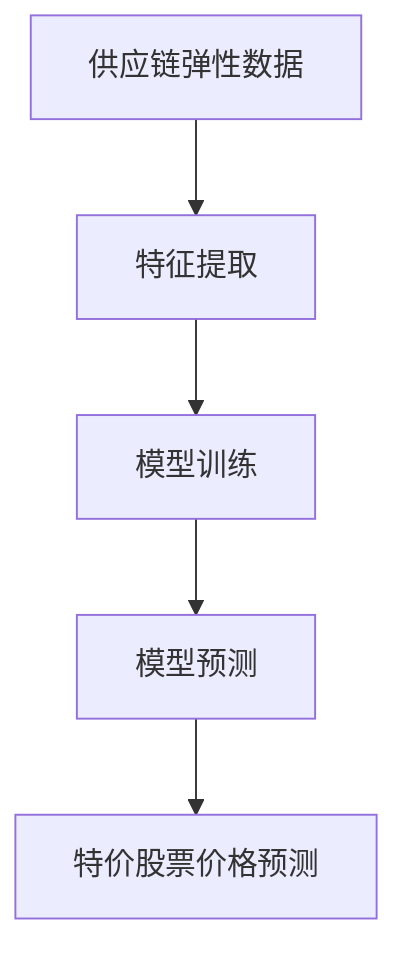

                 


# 特价股票与公司智能供应链弹性的关系探讨

> 关键词：特价股票、供应链弹性、供应链管理、股票价格波动、企业风险管理

> 摘要：本文探讨了特价股票与公司智能供应链弹性的关系，分析了供应链弹性对特价股票的影响机制，提出了基于数学模型的预测方法，并结合实际案例进行了系统设计与实现。文章内容涵盖背景介绍、核心概念分析、算法原理、系统架构设计以及项目实战，为投资者和企业管理者提供了理论与实践相结合的参考。

---

## 第一部分：背景介绍

### 第1章：特价股票与公司智能供应链弹性的背景概述

#### 1.1 特价股票的定义与特征
特价股票是指价格波动较大、折扣力度较大的股票，通常出现在市场低迷期或公司短期促销活动中。其特征包括：
- **高波动性**：价格在短时间内波动较大。
- **高风险性**：投资风险较高，但潜在收益也较大。
- **市场敏感性**：对市场环境变化高度敏感。

#### 1.2 公司智能供应链弹性的定义与特征
供应链弹性是指企业在面对市场变化、需求波动或供应链中断时，能够快速调整和恢复的能力。其特征包括：
- **快速响应**：能够迅速应对市场需求变化。
- **资源灵活性**：能够灵活调配资源。
- **风险管理**：能够有效降低供应链中断带来的风险。

#### 1.3 特价股票与供应链弹性关系的背景综述
随着市场竞争的加剧，企业对供应链管理的要求越来越高。供应链弹性不仅是企业生存的关键能力，也直接影响到股票价格的波动。特价股票作为企业促销或市场调整的产物，其价格波动往往反映了供应链的灵活性和企业的风险管理能力。然而，目前学术界对两者关系的研究较少，本文将从理论与实践两个方面进行深入探讨。

---

## 第二部分：核心概念与联系

### 第2章：特价股票与供应链弹性的核心概念分析

#### 2.1 特价股票的核心要素
- **市场波动性**：特价股票的价格波动受到市场供需关系的影响。
- **定价机制**：特价股票的价格通常低于市场价，但存在短期性和季节性。
- **风险特征**：高波动性意味着高风险，投资者需谨慎决策。

#### 2.2 供应链弹性的核心要素
- **弹性定义**：供应链弹性是指企业在面对外部环境变化时的适应能力。
- **弹性度量**：通常通过供应链的响应速度、资源调配能力等指标来衡量。
- **弹性与竞争力**：供应链弹性强的企业更具市场竞争力。

#### 2.3 特价股票与供应链弹性关系的属性对比
以下是特价股票与供应链弹性的属性对比表格：

| 属性 | 特价股票 | 供应链弹性 |
|------|----------|------------|
| 波动性 | 高       | 高         |
| 响应速度 | 快       | 快         |
| 风险 | 高       | 中         |
| 可预测性 | 低       | 中         |
| 影响因素 | 市场供需 | 外部环境   |

#### 2.4 实体关系图（ER图）与流程图
以下是特价股票与供应链弹性关系的实体关系图（Mermaid）：



以下是供应链弹性对特价股票影响的流程图（Mermaid）：



---

## 第三部分：算法原理与数学模型

### 第3章：特价股票与供应链弹性关系的数学模型

#### 3.1 算法原理
本文提出了一个基于机器学习的供应链弹性对特价股票影响的预测模型。模型的核心思想是通过供应链弹性指标（如响应速度、资源调配能力）预测特价股票的价格波动。

#### 3.2 数学模型
模型假设供应链弹性与特价股票价格波动呈线性关系，公式如下：

$$
P(t) = \beta_1 E(t) + \beta_0 + \epsilon
$$

其中：
- $P(t)$ 表示第 $t$ 时刻特价股票的价格。
- $E(t)$ 表示第 $t$ 时刻的供应链弹性指数。
- $\beta_1$ 和 $\beta_0$ 为回归系数。
- $\epsilon$ 为误差项。

#### 3.3 算法流程图（Mermaid）


#### 3.4 Python代码实现
以下是模型的实现代码：

```python
import pandas as pd
import numpy as np
from sklearn.linear_model import LinearRegression

# 数据加载
data = pd.read_csv('supply_chain_elasticity.csv')

# 特征提取
X = data[['response_time', 'resource_allocation']]
y = data['stock_price']

# 模型训练
model = LinearRegression()
model.fit(X, y)

# 预测
predicted_price = model.predict(X)
print(predicted_price)
```

---

## 第四部分：系统分析与架构设计

### 第4章：系统架构设计

#### 4.1 项目背景
本文基于实际的企业供应链管理需求，设计了一个智能供应链弹性预测系统，用于帮助企业优化供应链管理，降低特价股票价格波动对企业的影响。

#### 4.2 系统功能设计
- **数据采集模块**：采集供应链弹性数据和股票价格数据。
- **特征提取模块**：提取供应链弹性相关特征。
- **模型训练模块**：基于机器学习算法训练模型。
- **预测与分析模块**：输出预测结果并进行分析。

#### 4.3 系统架构设计
以下是系统的架构图（Mermaid）：


#### 4.4 系统接口设计
- **输入接口**：接收供应链弹性数据和股票价格数据。
- **输出接口**：输出预测结果和分析报告。

#### 4.5 系统交互流程图（Mermaid）


---

## 第五部分：项目实战

### 第5章：项目实战与案例分析

#### 5.1 环境安装
- **Python**：安装Python 3.8及以上版本。
- **依赖库**：安装 `pandas`, `numpy`, `scikit-learn`。

#### 5.2 核心代码实现
以下是核心代码：

```python
import pandas as pd
import numpy as np
from sklearn.linear_model import LinearRegression
from sklearn.metrics import mean_squared_error

# 数据加载
data = pd.read_csv('supply_chain_elasticity.csv')

# 特征提取
X = data[['response_time', 'resource

