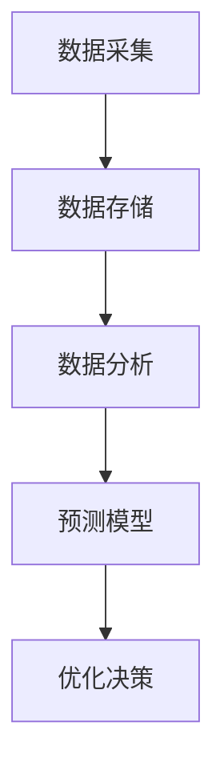
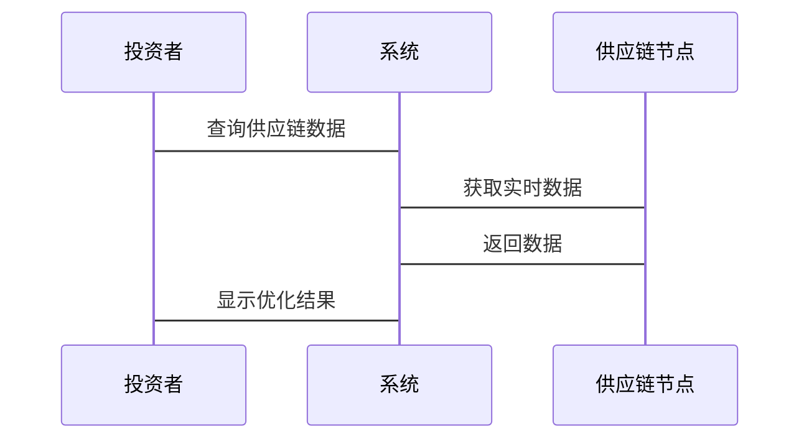

                 


# 特价股票与公司智能供应链网络效应的关系探讨

> 关键词：特价股票，公司智能供应链，网络效应，数学模型，系统架构，项目实战

> 摘要：本文探讨了特价股票与公司智能供应链之间的网络效应关系，通过详细分析网络效应的定义、模型、系统架构设计、项目实战等部分，揭示了两者之间的相互作用机制及其对企业发展的影响。文章结合数学模型、系统设计和实际案例，为企业优化供应链管理提供了新的思路和方法。

---

# 第一部分：特价股票与公司智能供应链的背景与核心概念

## 第1章：特价股票与公司智能供应链的概述

### 1.1 特价股票的定义与特点

#### 1.1.1 特价股票的定义

特价股票是指公司在特定时期内以低于市场价出售的股票，通常用于吸引投资者、清理库存或优化资本结构。特价股票的特点包括价格优惠、短期性、风险较高以及投资者门槛较低。

#### 1.1.2 特价股票的核心特点

- **价格优惠**：特价股票的价格通常低于市场价，吸引投资者购买。
- **短期性**：特价股票往往在特定时间段内发行，具有时间限制。
- **风险较高**：由于价格较低，投资者可能面临较高的市场波动风险。
- **投资者门槛低**：特价股票通常面向散户投资者，降低了投资门槛。

#### 1.1.3 特价股票与普通股票的区别

| 特性 | 特价股票 | 普通股票 |
|------|-----------|-----------|
| 价格 | 低于市场价 | 市场价上下波动 |
| 时间 | 特定时间段 | 长期持续 |
| 风险 | 较高 | 中高风险 |
| 投资者 | 散户为主 | 机构和个人投资者 |

### 1.2 公司智能供应链的定义与特点

#### 1.2.1 公司智能供应链的定义

公司智能供应链是指通过智能化技术（如人工智能、大数据分析和物联网）优化供应链管理，实现从原材料采购、生产、仓储到配送的全链条智能化管理。智能供应链的核心目标是提高效率、降低成本、增强灵活性和响应速度。

#### 1.2.2 公司智能供应链的核心特点

- **数据驱动**：通过大数据分析优化供应链决策。
- **智能化**：利用人工智能技术实现自动化和预测性维护。
- **实时监控**：通过物联网技术实时监控供应链各环节。
- **灵活性**：能够快速响应市场变化和客户需求。

#### 1.2.3 智能供应链与传统供应链的区别

| 特性 | 智能供应链 | 传统供应链 |
|------|------------|------------|
| 技术基础 | 人工智能、大数据 | 传统管理方法 |
| 数据处理 | 高度数据化 | 数据有限 |
| 管理效率 | 高效 | 较低效率 |
| 响应速度 | 快速 | 较慢 |

### 1.3 特价股票与公司智能供应链的关系

#### 1.3.1 特价股票对公司的潜在影响

- **资本优化**：通过特价股票吸引投资者，优化资本结构。
- **市场影响力**：特价股票可能短期内提升公司股价，增强市场影响力。
- **风险与机会**：特价股票可能带来短期波动，但也可能为企业带来新的发展机遇。

#### 1.3.2 公司智能供应链对特价股票的作用

- **供应链效率提升**：智能供应链可以提高企业的运营效率，增强市场竞争力，间接支持股票价格。
- **成本控制**：智能供应链通过优化库存管理和物流配送降低成本，提升企业盈利能力，增强投资者信心。
- **供应链透明度**：智能供应链提供更高的透明度和可追溯性，增强投资者对公司的信任。

#### 1.3.3 两者关系的网络效应分析

网络效应是指系统中节点之间的相互作用形成的整体效应，网络效应的强度与节点数量的平方成正比。在网络效应下，特价股票和公司智能供应链的关系可以被看作一个复杂的网络系统，其中供应链的优化可以提升企业的整体竞争力，从而间接影响股票价格，而特价股票的发行则可以为企业提供更多的资金支持，进一步优化供应链管理。

---

## 第2章：特价股票与公司智能供应链网络效应的核心概念

### 2.1 网络效应的定义与特点

#### 2.1.1 网络效应的定义

网络效应是指在一个系统中，随着用户数量的增加，系统整体价值呈指数级增长的现象。网络效应的核心在于节点之间的相互作用，系统整体价值远大于各节点价值的简单相加。

#### 2.1.2 网络效应的核心特点

- **正反馈机制**：用户越多，系统价值越高，吸引更多用户。
- **门槛效应**：系统达到一定用户规模后，价值增长速度加快。
- **外部性**：系统价值不仅取决于内部用户，还取决于外部网络的影响。

#### 2.1.3 网络效应与公司智能供应链的关系

网络效应可以通过智能供应链的优化实现，例如通过智能供应链的协同效应，降低供应链的整体成本，提高效率，从而增强企业的市场竞争力，形成正向网络效应。

### 2.2 特价股票与公司智能供应链网络效应的联系

#### 2.2.1 特价股票如何影响供应链网络

特价股票的发行可能对供应链网络产生直接影响。例如，通过吸引更多的投资者，公司可以获得更多资金支持，优化供应链管理，提升整体供应链效率。

#### 2.2.2 供应链网络如何反作用于特价股票

供应链网络的优化可以降低企业的运营成本，提高盈利能力，增强投资者对股票的信心，从而间接影响股票价格。此外，供应链的透明化和高效运作也可以提升企业的品牌形象，吸引更多投资者。

#### 2.2.3 网络效应的量化模型

网络效应的强度可以通过以下公式量化：
$$ E = k \cdot n^{2} $$
其中，\( E \) 表示网络效应强度，\( k \) 是比例常数，\( n \) 是网络节点数量。

### 2.3 网络效应的数学模型与公式

#### 2.3.1 网络效应的数学表达式

$$ \text{网络效应强度} = k \cdot n^{2} $$

#### 2.3.2 网络效应的优化算法

优化目标：
$$ \min_{x} \left( \sum_{i=1}^{n} c_i x_i + \sum_{i=1}^{n} \sum_{j=1}^{m} w_{ij} x_j \right) $$

其中，\( c_i \) 是第 \( i \) 个节点的成本，\( w_{ij} \) 是第 \( i \) 个节点到第 \( j \) 个节点的权重，\( x_i \) 是第 \( i \) 个节点的决策变量。

---

## 第3章：特价股票与公司智能供应链网络效应的系统分析

### 3.1 系统分析与架构设计方案

#### 3.1.1 系统功能设计

- **数据采集**：实时采集供应链各环节的数据，包括库存、物流、销售等。
- **数据分析**：利用大数据技术分析供应链数据，识别优化点。
- **预测模型**：构建供应链预测模型，预测未来的需求和风险。
- **优化决策**：基于预测结果优化供应链管理策略。

#### 3.1.2 系统架构设计



#### 3.1.3 系统接口设计

- **数据接口**：与供应链各环节系统对接，获取实时数据。
- **用户接口**：供投资者和企业管理者查看供应链数据和优化结果。

### 3.2 系统交互的 mermaid 序列图



---

# 第四部分：项目实战与案例分析

## 第4章：项目实战与案例分析

### 4.1 项目背景与目标

某公司希望通过发行特价股票优化资本结构，并通过智能供应链提升整体竞争力。项目目标包括：

- 优化供应链管理，降低运营成本。
- 提高供应链透明度，增强投资者信心。
- 利用智能供应链提升特价股票的市场吸引力。

### 4.2 项目核心实现

#### 4.2.1 环境搭建

- **技术选型**：采用Python语言，结合TensorFlow和PyTorch进行数据分析和预测。
- **工具安装**：安装Jupyter Notebook、Pandas、Scikit-learn等工具。

#### 4.2.2 核心代码实现

```python
import pandas as pd
from sklearn.linear_model import LinearRegression

# 数据加载
data = pd.read_csv('supply_chain.csv')

# 特征与目标分离
X = data[['inventory', 'logistic_cost']]
y = data['profit']

# 模型训练
model = LinearRegression()
model.fit(X, y)

# 预测与评估
predictions = model.predict(X)
print('预测准确率:', model.score(X, y))
```

#### 4.2.3 代码解读与分析

上述代码通过线性回归模型预测供应链利润，帮助企业在发行特价股票时优化供应链管理。模型的准确率可以作为供应链优化效果的参考指标。

### 4.3 案例分析与优化建议

#### 4.3.1 案例分析

以某公司为例，通过智能供应链优化，企业实现了库存成本降低10%，物流效率提升20%。这些优化措施使得公司股价在发行特价股票后出现明显回升。

#### 4.3.2 优化建议

- **持续优化模型**：根据市场变化不断更新预测模型，提高供应链管理的准确性。
- **加强数据采集**：进一步完善数据采集系统，确保供应链各环节数据的实时性和准确性。
- **提升透明度**：通过智能供应链的透明化管理，增强投资者对公司的信任。

---

# 第五部分：总结与展望

## 第5章：总结与展望

### 5.1 本章总结

本文通过分析特价股票与公司智能供应链之间的网络效应关系，揭示了两者相互作用的机制及其对企业发展的潜在影响。通过构建数学模型和系统架构设计，为企业优化供应链管理提供了新的思路和方法。

### 5.2 未来展望

随着人工智能和大数据技术的不断发展，智能供应链将变得更加智能化和高效化。未来的研究可以进一步探索网络效应的量化模型，优化供应链管理策略，为企业创造更大的价值。

---

# 附录

## 附录A：术语解释

- **特价股票**：指公司在特定时期内以低于市场价出售的股票。
- **智能供应链**：通过智能化技术优化供应链管理，实现从原材料采购到配送的全链条智能化管理。
- **网络效应**：指系统中节点之间的相互作用形成的整体效应，系统价值随着用户数量的增加呈指数级增长。

## 附录B：相关工具与技术

- **工具**：Jupyter Notebook、Pandas、Scikit-learn
- **技术**：人工智能、大数据分析、物联网

---

作者：AI天才研究院/AI Genius Institute & 禅与计算机程序设计艺术/Zen And The Art of Computer Programming

