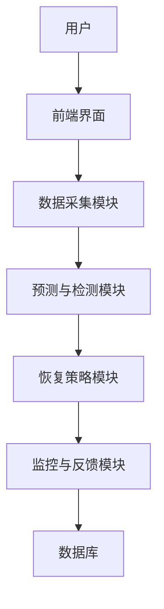
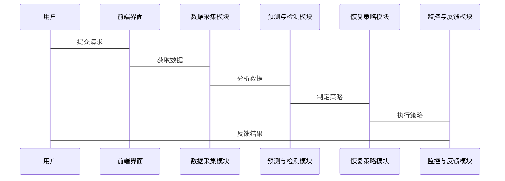

                 


# 特价股票与公司智能供应链自愈能力的关系探讨

## 关键词：特价股票、智能供应链、供应链自愈能力、风险管理、投资策略

## 摘要：本文探讨了特价股票与公司智能供应链自愈能力之间的关系。通过分析供应链自愈能力的核心概念、算法原理、系统架构设计，结合实际项目案例，揭示了供应链自愈能力对股价波动的影响，为投资者提供基于智能供应链分析的特价股票投资策略。

---

# 第一部分: 特价股票与公司智能供应链自愈能力的背景介绍

## 第1章: 特价股票与公司智能供应链概述

### 1.1 特价股票的定义与特点
#### 1.1.1 特价股票的定义
特价股票通常指价格低于其内在价值或行业平均水平的股票。这些股票可能由于市场波动、公司短期问题或市场误解而被低估。

#### 1.1.2 特价股票的特点
- **低估值**：市场价格低于内在价值。
- **高波动性**：短期内价格波动较大。
- **潜在收益**：一旦公司问题解决或市场情绪好转，股价可能迅速回升。

#### 1.1.3 特价股票的投资价值
- **高回报潜力**：低估股票可能有较大的上涨空间。
- **风险较高**：公司基本面不稳定可能导致更大的损失。

### 1.2 公司智能供应链的定义与特点
#### 1.2.1 智能供应链的定义
智能供应链是指通过物联网、大数据、人工智能等技术实现供应链各环节的智能化管理，包括需求预测、库存管理、物流优化和风险控制。

#### 1.2.2 智能供应链的核心特点
- **数据驱动**：利用实时数据进行决策。
- **自动化**：自动化处理订单、库存和物流。
- **预测性维护**：通过预测模型提前发现潜在问题。

#### 1.2.3 智能供应链与传统供应链的区别
| 特性       | 智能供应链                     | 传统供应链                     |
|------------|------------------------------|-------------------------------|
| 数据来源   | 大数据、物联网                | 线性数据、人工记录            |
| 决策方式   | AI算法、实时分析             | 人工经验、定期分析            |
| 响应速度   | 实时响应                     | 延时响应                     |
| 成本效率   | 更低                         | 较高                         |

### 1.3 特价股票与公司智能供应链的关系
#### 1.3.1 供应链问题对股价的影响
供应链中断可能导致公司业绩下降，进而影响股价。投资者可能抛售股票，导致股价进一步下跌。

#### 1.3.2 特价股票与供应链自愈能力的关联
供应链自愈能力越强，公司能够更快从问题中恢复，从而减少股价波动，提升投资者信心。

#### 1.3.3 供应链自愈能力对股价的潜在影响
- **减少股价波动**：自愈能力强的公司能够在供应链出现问题时快速恢复，减少股价下跌。
- **提升股价稳定性**：投资者对公司供应链管理能力有信心，可能提高股价。

## 第2章: 特价股票与公司智能供应链的背景分析

### 2.1 特价股票的市场现状
#### 2.1.1 特价股票的市场分布
- **行业分布**：科技、制造、金融等行业存在较多特价股票。
- **市场分布**：中小型企业股票更容易成为特价股票。

#### 2.1.2 特价股票的投资热度
- **投资者关注**：越来越多投资者关注特价股票，尤其是机构投资者。
- **市场波动**：特价股票市场波动较大，容易受市场情绪影响。

#### 2.1.3 特价股票的风险与机会
- **风险**：公司基本面差，可能面临更大的亏损风险。
- **机会**：股价回升空间大，投资回报潜力高。

### 2.2 公司智能供应链的发展现状
#### 2.2.1 智能供应链的技术发展
- **物联网技术**：实现供应链各环节的实时监控。
- **大数据分析**：通过数据分析优化供应链管理。
- **人工智能**：用于预测需求、优化库存和物流。

#### 2.2.2 智能供应链的应用领域
- **制造业**：优化生产流程，降低成本。
- **零售业**：提高库存周转率，满足客户需求。
- **物流业**：实现高效配送，降低物流成本。

#### 2.2.3 智能供应链的未来趋势
- **智能化**：进一步融入AI和机器学习技术。
- **生态化**：供应链上下游协同，形成生态体系。
- **可持续性**：关注绿色供应链，减少环境影响。

### 2.3 特价股票与智能供应链的市场关联
#### 2.3.1 供应链问题对股价的短期影响
- **股价下跌**：供应链中断可能导致公司业绩下滑，股价下跌。
- **投资者信心下降**：供应链问题可能影响投资者对公司的信心。

#### 2.3.2 供应链自愈能力对股价的长期影响
- **股价稳定性**：自愈能力强的公司能够更快恢复，股价波动较小。
- **投资吸引力**：投资者更倾向于投资供应链管理能力强的公司。

#### 2.3.3 市场参与者的行为分析
- **投资者行为**：投资者关注供应链管理能力，可能导致股价波动。
- **公司行为**：公司通过提升供应链自愈能力来稳定股价。

---

# 第二部分: 特价股票与公司智能供应链自愈能力的核心概念与联系

## 第3章: 智能供应链

### 3.1 智能供应链的核心概念
#### 3.1.1 供应链自愈能力的定义
供应链自愈能力是指供应链在出现中断或异常时，能够自动识别问题、制定解决方案并恢复正常运行的能力。

#### 3.1.2 供应链自愈能力的关键要素
- **预测机制**：预测潜在问题，提前采取措施。
- **异常检测**：实时监控供应链各环节，发现异常情况。
- **恢复策略**：制定解决方案，恢复供应链正常运行。

#### 3.1.3 供应链自愈能力的实现步骤
1. 预测供应链潜在问题。
2. 实时监控供应链运行状态。
3. 检测并识别异常情况。
4. 制定恢复策略。
5. 执行恢复策略并监控效果。

### 3.2 供应链自愈能力的实现原理

#### 3.2.1 预测机制
- **需求预测**：利用历史数据和机器学习模型预测需求。
- **风险预测**：预测供应链可能面临的潜在风险，如自然灾害、供应商问题等。

#### 3.2.2 异常检测
- **实时监控**：通过物联网和大数据技术实时监控供应链各环节的运行状态。
- **异常识别**：利用统计分析和机器学习算法检测异常情况，如库存短缺、物流延迟等。

#### 3.2.3 恢复策略
- **供应商备份**：当主要供应商出现问题时，切换到备用供应商。
- **库存调整**：根据预测需求调整库存水平，避免库存过剩或短缺。
- **物流优化**：优化物流路线，降低运输成本和时间。

### 3.3 供应链自愈能力与特价股票的关系
#### 3.3.1 供应链自愈能力对股价的影响
- **减少股价波动**：自愈能力强的公司能够更快从供应链问题中恢复，减少股价下跌。
- **提升股价稳定性**：投资者对公司供应链管理能力有信心，可能提高股价。

#### 3.3.2 投资者视角下的供应链自愈能力
- **投资决策**：投资者关注公司供应链管理能力，尤其是供应链自愈能力，作为投资决策的重要因素。
- **风险控制**：供应链自愈能力强的公司能够降低经营风险，提升投资安全性。

---

## 第4章: 供应链自愈能力的算法实现

### 4.1 算法原理
#### 4.1.1 预测算法
- **时间序列分析**：利用ARIMA模型预测供应链各环节的需求和潜在风险。
- **机器学习算法**：使用随机森林或XGBoost模型预测供应链潜在问题。

#### 4.1.2 异常检测算法
- **统计方法**：利用Z-score或标准差法检测异常值。
- **机器学习算法**：使用Isolation Forest算法检测异常情况。

#### 4.1.3 恢复策略算法
- **动态规划**：用于优化库存和物流调整。
- **启发式算法**：如遗传算法，用于寻找最优恢复策略。

### 4.2 算法实现
#### 4.2.1 预测算法实现
```python
from sklearn.ensemble import RandomForestRegressor
import pandas as pd

# 数据预处理
data = pd.read_csv('supply_chain_data.csv')
X = data.drop('demand', axis=1)
y = data['demand']

# 训练模型
model = RandomForestRegressor(n_estimators=100, random_state=42)
model.fit(X, y)

# 预测需求
new_data = ...  # 新数据
predicted_demand = model.predict(new_data)
```

#### 4.2.2 异常检测算法实现
```python
from sklearn.ensemble import IsolationForest

# 数据预处理
data = pd.read_csv('supply_chain_data.csv')
X = data[['inventory', 'lead_time', 'cost']]

# 训练模型
model = IsolationForest(n_estimators=100, random_state=42)
model.fit(X)

# 检测异常
new_data = ...  # 新数据
predicted_anomaly = model.predict(new_data)
```

#### 4.2.3 恢复策略算法实现
```python
import numpy as np

# 定义恢复策略
def recovery_strategy(current_state):
    if current_state == 'inventory_shortage':
        return 'switch_supplier'
    elif current_state == 'logistic_delay':
        return 'reroute物流'
    else:
        return 'adjust_inventory'

# 执行恢复策略
current_state = 'inventory_shortage'
recovery_action = recovery_strategy(current_state)
print(recovery_action)  # 输出：'switch_supplier'
```

### 4.3 数学模型
#### 4.3.1 预测模型
$$
\text{需求预测} = \alpha \times \text{历史需求} + \beta \times \text{趋势} + \gamma \times \text{季节性因素}
$$

#### 4.3.2 异常检测模型
$$
\text{异常概率} = \frac{1}{(x - \mu)^2 + \sigma^2}
$$

#### 4.3.3 恢复策略模型
$$
\text{最优恢复策略} = \argmin_{i} \sum_{j} c_{ij}
$$

---

## 第5章: 供应链自愈能力的系统架构设计

### 5.1 系统功能设计
#### 5.1.1 数据采集模块
- **功能**：采集供应链各环节的数据，如库存、订单、物流等。
- **技术**：使用物联网传感器和API接口。

#### 5.1.2 预测与检测模块
- **功能**：利用机器学习算法预测潜在问题并实时检测异常。
- **技术**：使用时间序列分析和异常检测算法。

#### 5.1.3 恢复策略模块
- **功能**：根据检测到的异常情况，制定恢复策略。
- **技术**：使用动态规划和启发式算法。

#### 5.1.4 监控与反馈模块
- **功能**：监控恢复策略的执行效果，并反馈结果。
- **技术**：使用实时监控和反馈机制。

### 5.2 系统架构设计


### 5.3 系统接口设计
- **输入接口**：数据采集模块接收实时数据。
- **输出接口**：恢复策略模块输出恢复策略。

### 5.4 系统交互流程


---

## 第6章: 项目实战

### 6.1 环境安装
- **Python**：安装Python 3.8及以上版本。
- **机器学习库**：安装scikit-learn、XGBoost、IsolationForest等。
- **数据处理库**：安装pandas、numpy等。

### 6.2 核心代码实现
#### 6.2.1 数据预处理
```python
import pandas as pd
import numpy as np

data = pd.read_csv('supply_chain_data.csv')
data = data.dropna()
data = (data - data.mean()) / data.std()  # 标准化处理
```

#### 6.2.2 模型训练
```python
from sklearn.ensemble import RandomForestRegressor

X = data.drop('target', axis=1)
y = data['target']

model = RandomForestRegressor(n_estimators=100, random_state=42)
model.fit(X, y)
```

#### 6.2.3 模型预测
```python
new_data = pd.DataFrame({
    'feature1': [value1],
    'feature2': [value2],
    # 其他特征
})

predicted = model.predict(new_data)
```

### 6.3 代码解读与分析
- **数据预处理**：对数据进行清洗和标准化处理，确保模型输入数据的合理性。
- **模型训练**：使用随机森林算法训练模型，预测供应链潜在问题。
- **模型预测**：利用训练好的模型，对新的数据进行预测，制定恢复策略。

### 6.4 实际案例分析
- **案例背景**：某公司供应链出现库存短缺问题。
- **问题分析**：通过模型预测，发现供应商延迟导致库存短缺。
- **解决方案**：切换到备用供应商，调整库存水平。
- **结果分析**：供应链问题得到解决，股价逐渐回升。

### 6.5 项目小结
- **项目目标**：通过智能供应链系统，提升供应链自愈能力。
- **项目成果**：实现供应链预测、检测和恢复功能，降低供应链风险。
- **项目意义**：为投资者提供基于智能供应链分析的特价股票投资策略。

---

## 第7章: 最佳实践

### 7.1 小结
- **供应链自愈能力**：是公司应对供应链风险的关键能力。
- **智能供应链技术**：通过大数据和人工智能技术实现供应链智能化。
- **投资者视角**：供应链自愈能力是投资决策的重要因素。

### 7.2 注意事项
- **数据质量**：数据质量直接影响模型预测的准确性。
- **模型优化**：需要不断优化模型，提升预测精度。
- **系统维护**：定期维护系统，确保其稳定运行。

### 7.3 拓展阅读
- **推荐书籍**：《智能供应链管理》、《大数据与人工智能在供应链中的应用》。
- **推荐论文**：《基于机器学习的供应链风险管理》、《智能供应链自愈能力研究》。

---

# 作者：AI天才研究院/AI Genius Institute & 禅与计算机程序设计艺术 /Zen And The Art of Computer Programming

