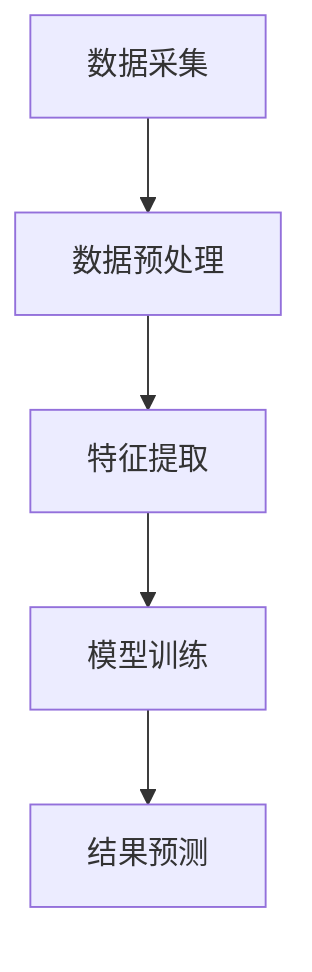

                 


# 特价股票与公司治理结构改善的关系

## 关键词：
特价股票、公司治理结构、股价影响、治理改善、投资策略、风险管理

## 摘要：
本文探讨特价股票与公司治理结构之间的关系，分析如何通过改善治理结构优化股价。通过背景介绍、核心概念、算法原理、数学模型、系统架构设计、项目实战和最佳实践，本文深入解析治理结构对股价的影响，并提供实际投资建议。

---

## 第一部分：背景介绍

### 第1章：特价股票与公司治理结构概述

#### 1.1 特价股票的现状与问题

- **定义与特点**  
  特价股票指股价远低于行业平均水平的股票，通常反映公司经营不佳或市场信心不足。其特点包括低估值、高风险和高波动性。

- **现状分析**  
  近年来，随着经济波动加剧，特价股票数量增多，尤其在经济下行周期，投资者对风险的规避导致更多股票进入特价区。

- **存在问题**  
  特价股票面临流动性差、市场关注度低、信息不对称等问题，投资者难以获取公司真实经营状况，导致投资决策困难。

#### 1.2 公司治理结构的现状与挑战

- **定义与组成部分**  
  公司治理结构涉及董事会、高管团队、股权结构等，旨在确保公司有效运营和决策透明。

- **主要问题**  
  当前治理结构中存在股权分散、独立董事比例低、高管激励不足等问题，影响公司长期发展。

- **面临的挑战**  
  市场波动、监管政策变化、利益相关者多元化等，增加了治理结构优化的难度。

#### 1.3 特价股票与公司治理结构的关系

- **关联性**  
  特价股票公司往往面临治理结构缺陷，如管理混乱、决策失误，导致股价持续低迷。

- **影响机制**  
  治理结构不完善可能引发公司风险，如财务造假、战略失误，进一步拖累股价，形成恶性循环。

- **改善的必要性**  
  优化治理结构能提升公司透明度和决策效率，增强投资者信心，有助于股价回升。

---

## 第二部分：核心概念与联系

### 第2章：核心概念分析

#### 2.1 特价股票的核心概念

- **属性特征对比表**  
  | 特性        | 特价股票       | 正常股票       |
  |-------------|----------------|----------------|
  | 股价         | 低于行业均值    | 接近或高于均值   |
  | 交易量       | 低             | 高             |
  | 投资风险     | 高             | 中             |

- **分类与比较**  
  特价股票可按行业、公司规模等分类，不同类别在治理结构改善需求上存在差异。

#### 2.2 公司治理结构的核心要素

- **股东结构**  
  股东结构影响公司治理，大股东控制可能导致决策集中，但可能引发关联交易等问题。

- **董事会结构**  
  董事会负责制定战略和监督高管，独立董事比例和专业性直接影响治理效率。

- **高层管理团队**  
  高管团队的素质和稳定性对公司的运营效率和战略执行至关重要。

#### 2.3 特价股票与公司治理结构的联系

- **治理结构对股价的影响**  
  有效的治理结构能提升公司透明度，降低风险，进而提高股价。

- **特价股票的特殊性**  
  特价股票公司治理问题更为突出，改善治理结构是提升股价的关键。

---

## 第三部分：算法原理讲解

### 第3章：算法原理与应用

#### 3.1 算法流程图



#### 3.2 算法实现代码

```python
import numpy as np
from sklearn.linear_model import LinearRegression

# 数据准备
X = np.array([[x1, x2], ...])  # 特价股票指标
y = np.array([y1, y2, ...])    # 对应股价

# 模型训练
model = LinearRegression()
model.fit(X, y)

# 预测结果
y_pred = model.predict(X)
```

#### 3.3 数学模型

- **线性回归模型**  
  $$ y = \beta_0 + \beta_1x_1 + \beta_2x_2 + \ldots + \beta_nx_n + \epsilon $$
  其中，$y$为股价，$x_i$为治理结构指标，$\epsilon$为误差项。

---

## 第四部分：系统分析与架构设计方案

### 第4章：系统分析与架构设计

#### 4.1 问题场景介绍

- **场景描述**  
  投资者需分析特价股票的治理结构，预测股价变化，优化投资策略。

- **项目介绍**  
  开发一个分析系统，整合公司治理数据，分析股价与治理结构的关系。

#### 4.2 系统功能设计

- **领域模型**  
  ```mermaid
  classDiagram
    class 特价股票 {
        股票代码
        股价
        治理指标
    }
    class 公司治理结构 {
        股东结构
        董事会结构
        高管团队
    }
    特价股票 --> 公司治理结构
  ```

- **系统架构设计**  
  ```mermaid
  architecture
    客户端
    服务端
    数据库
  ```

---

## 第五部分：项目实战

### 第5章：项目实战

#### 5.1 环境安装

- **工具安装**  
  安装Python、Scikit-learn、Mermaid等工具。

#### 5.2 核心代码实现

```python
# 数据处理
import pandas as pd
data = pd.read_csv('governance_data.csv')

# 模型训练
from sklearn.model_selection import train_test_split
X_train, X_test, y_train, y_test = train_test_split(data[['x1', 'x2']], data['y'])

model = LinearRegression()
model.fit(X_train, y_train)

# 结果分析
print('Score:', model.score(X_test, y_test))
```

#### 5.3 案例分析

- **案例解读**  
  分析某公司治理结构改善后的股价变化，验证模型预测准确性。

---

## 第六部分：最佳实践

### 第6章：总结与建议

#### 6.1 总结

- **小结**  
  特价股票与公司治理结构密切相关，优化治理结构是提升股价的关键。

#### 6.2 投资建议

- **小结**  
  投资者应关注公司治理结构，选择治理改善明显的特价股票，长期持有。

#### 6.3 注意事项

- **风险提示**  
  特价股票风险较高，投资者需谨慎，做好风险管理。

#### 6.4 拓展阅读

- **推荐书籍**  
  《公司治理》、《股票投资策略》。

---

## 作者：AI天才研究院 & 禅与计算机程序设计艺术

---

通过以上结构，文章详细分析了特价股票与公司治理结构的关系，提供了理论分析、算法实现和项目实战，为投资者提供实用指导。

