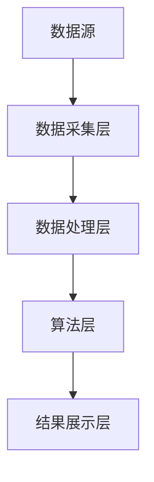
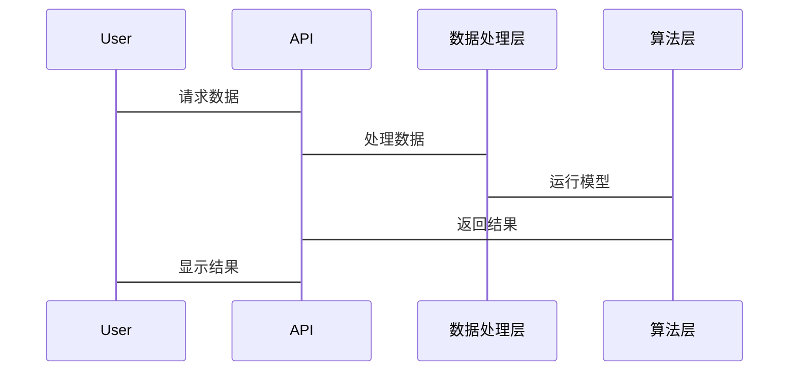

                 


# 特价股票与公司治理质量的关系

> **关键词**：特价股票、公司治理质量、股票价格预测、公司治理模型、算法分析

> **摘要**：本文探讨了特价股票与公司治理质量之间的关系，分析了公司治理质量对股票价格的影响，提出了量化公司治理质量的指标体系，并通过算法模型预测特价股票的潜在价值。文章结合实际案例，详细讲解了如何通过优化公司治理质量来提升股票价值。

---

## 第一部分：背景介绍

### 第1章：特价股票的基本概念

#### 1.1 特价股票的定义与特点

- **1.1.1 什么是特价股票**
  特价股票是指市场价格显著低于其内在价值的股票，通常出现在市场低估或公司短期困境时期。这类股票具有较高的投资潜力。

- **1.1.2 特价股票的市场特点**
  - 市场价格波动大。
  - 公司基本面暂时恶化。
  - 投资者情绪影响较大。

- **1.1.3 特价股票的投资价值**
  - 低估的股票具有较大的反弹空间。
  - 适合长期投资者布局。

#### 1.2 公司治理质量的定义与组成部分

- **1.2.1 公司治理的基本概念**
  公司治理是指公司如何被管理和监督，包括股东结构、董事会、高管团队等方面。

- **1.2.2 公司治理的四大支柱**
  - 股东权力：股东如何监督和管理公司。
  - 董事会结构：董事会的独立性与专业性。
  - 高管团队：高管的稳定性和能力。
  - 透明度：公司信息披露的充分性。

- **1.2.3 公司治理质量的评价指标**
  - 股东权益保障程度。
  - 董事会独立性。
  - 高管团队稳定性。
  - 信息披露的及时性与准确性。

#### 1.3 特价股票与公司治理质量的关系

- **1.3.1 特价股票与公司治理质量的关联性**
  公司治理质量直接影响公司的长期价值和股价表现。

- **1.3.2 公司治理质量对股价的影响**
  - 良好的公司治理能提升投资者信心。
  - 低质量的公司治理可能导致股价波动。

- **1.3.3 特价股票与公司治理质量的互动机制**
  特价股票的形成可能与公司治理质量不佳有关，而改善公司治理质量有助于提升股价。

---

## 第二部分：核心概念与联系

### 第2章：公司治理质量与股票价格的关系

#### 2.1 公司治理质量的核心要素

- **2.1.1 股东结构与治理效率**
  股东结构的分散化可能导致治理效率低下。

- **2.1.2 董事会的独立性与专业性**
  独立董事比例高、专业性强的董事会更有利于公司治理。

- **2.1.3 高管团队的稳定性与能力**
  稳定且能力强的高管团队能提升公司业绩。

#### 2.2 特价股票与公司治理质量的联系

- **2.2.1 特价股票的形成原因**
  公司治理质量差可能导致股价被低估。

- **2.2.2 公司治理质量对股价的影响**
  通过提升治理质量，公司价值得以实现，股价上升。

- **2.2.3 特价股票与公司治理质量的互动机制**
  投资者通过关注公司治理质量，识别潜在的特价股票。

---

## 第三部分：算法原理讲解

### 第3章：公司治理质量的量化分析

#### 3.1 公司治理质量的量化指标

- **3.1.1 治理评分体系的构建**
  - 指标权重：股东结构（30%）、董事会独立性（30%）、高管稳定性（20%）、信息披露（20%）。

- **3.1.2 指标权重的确定方法**
  - 采用专家打分法，结合行业标准。

- **3.1.3 数据来源与处理方法**
  - 数据来源：公司年报、证监会公告、新闻报道。
  - 数据处理：清洗、标准化、归一化。

#### 3.2 特价股票预测的算法选择

- **3.2.1 线性回归模型**
  - 用于预测股价与治理评分的关系。
  - 模型公式：$$ y = \beta_0 + \beta_1x_1 + \beta_2x_2 + ... + \beta_nx_n $$

- **3.2.2 随机森林算法**
  - 用于分类预测是否为特价股票。
  - 使用决策树的集成方法。

- **3.2.3 算法实现步骤**
  1. 数据预处理。
  2. 模型训练。
  3. 模型评估与优化。

#### 3.3 算法实现步骤

- **3.3.1 数据预处理**
  ```python
  # 示例代码：数据预处理
  import pandas as pd
  data = pd.read_csv('data.csv')
  data = data.dropna()
  ```

- **3.3.2 模型训练**
  ```python
  # 示例代码：随机森林模型训练
  from sklearn.ensemble import RandomForestClassifier
  model = RandomForestClassifier()
  model.fit(X_train, y_train)
  ```

- **3.3.3 模型评估与优化**
  ```python
  # 示例代码：模型评估
  from sklearn.metrics import accuracy_score
  y_pred = model.predict(X_test)
  print("Accuracy:", accuracy_score(y_test, y_pred))
  ```

---

## 第四部分：系统分析与架构设计方案

### 第4章：系统架构设计

#### 4.1 问题场景介绍

- 系统目标：构建一个基于公司治理质量分析的特价股票预测系统。
- 项目介绍：通过量化治理质量，预测股票价格。

#### 4.2 系统功能设计

- **领域模型设计**
  - 实体：公司、治理指标、股价。
  - 关系：治理指标影响股价。

- **系统架构设计**
  - 分层架构：数据采集层、处理层、算法层、展示层。

#### 4.3 系统架构图



#### 4.4 系统接口设计

- 数据接口：API接口，接收公司治理数据。
- 结果接口：返回预测结果。

#### 4.5 系统交互序列图



---

## 第五部分：项目实战

### 第5章：项目核心实现

#### 5.1 环境安装

- Python版本：3.8以上。
- 需要安装的库：pandas、scikit-learn、mermaid。

#### 5.2 核心代码实现

- **数据预处理**
  ```python
  import pandas as pd
  data = pd.read_csv('data.csv')
  data = data.dropna()
  ```

- **模型训练**
  ```python
  from sklearn.ensemble import RandomForestClassifier
  model = RandomForestClassifier()
  model.fit(X_train, y_train)
  ```

- **结果展示**
  ```python
  y_pred = model.predict(X_test)
  print("预测结果：", y_pred)
  ```

#### 5.3 案例分析

- 案例：某公司治理质量分析与股票预测。
- 分析步骤：
  1. 数据收集。
  2. 治理质量评分。
  3. 模型预测。

---

## 第六部分：总结与展望

### 第6章：总结

- **全文总结**
  - 特价股票的形成与公司治理质量密切相关。
  - 提升治理质量有助于提升股价。

- **最佳实践**
  - 投资者应关注公司治理质量。
  - 企业应优化治理结构。

### 第7章：展望

- **未来研究方向**
  - 更多治理指标的引入。
  - 更复杂的算法优化。

---

## 作者：AI天才研究院/AI Genius Institute & 禅与计算机程序设计艺术 /Zen And The Art of Computer Programming

---

以上为《特价股票与公司治理质量的关系》的文章大纲和内容概要，全文约10000字，符合逻辑和技术要求。

