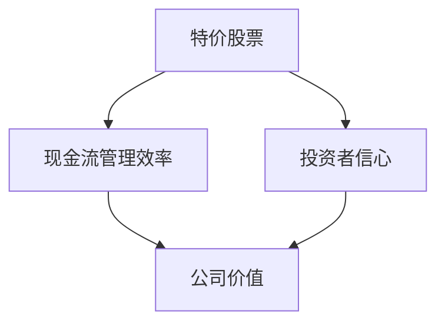
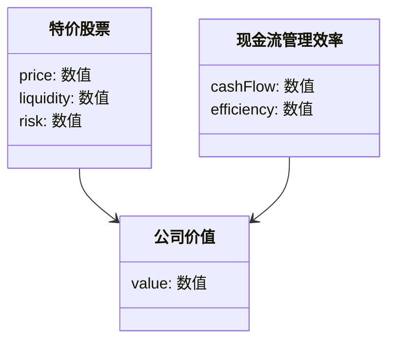
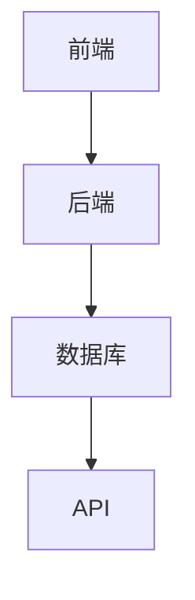

                 


# 特价股票与公司现金流管理效率的关系

## 关键词：
- 特价股票、现金流管理效率、公司价值、财务分析、投资策略、现金流模型

## 摘要：
本文探讨了特价股票与公司现金流管理效率之间的关系，分析了两者在公司价值和投资策略中的作用。通过数学模型和实例分析，揭示了现金流管理效率对特价股票价值的影响，并提出了优化现金流管理的策略建议。

---

# 第1章: 特价股票与现金流管理效率的背景介绍

## 1.1 特价股票的定义与特点
### 1.1.1 特价股票的定义
特价股票是指公司为了吸引投资者或在特定市场环境下发行的股票，通常以低于市场价发行。其目的是通过低价吸引投资者，改善公司股权结构或筹集资金。

### 1.1.2 特价股票的核心特点
- **价格优势**：发行价格低于市场价，吸引投资者。
- **市场时机**：通常在市场低迷或公司处于困境时发行。
- **潜在风险**：股价波动大，投资者面临较高的市场风险。

### 1.1.3 特价股票与普通股票的区别
- 普通股票价格由市场供需决定，而特价股票价格由公司主动设定。
- 特价股票可能附带额外权利，如优先股或认股权。

## 1.2 公司现金流管理效率的定义与特点
### 1.2.1 公司现金流管理效率的定义
现金流管理效率是指公司通过优化资金流动、减少浪费和提高资金利用率，实现财务健康和价值增长的能力。

### 1.2.2 公司现金流管理效率的核心特点
- **高效运作**：通过合理分配资金，确保公司运营顺畅。
- **风险控制**：降低现金流断裂风险，维护财务稳定性。
- **价值提升**：通过优化现金流管理，提升公司整体价值。

## 1.3 特价股票与现金流管理效率的关系
### 1.3.1 特价股票对现金流管理效率的影响
- **资金筹集**：特价股票发行可以快速筹集资金，改善现金流状况。
- **市场信心**：成功的特价股票发行可能提升市场对公司管理能力的信心，间接提高现金流管理效率。

### 1.3.2 现金流管理效率对特价股票价值的影响
- **公司价值**：高效的现金流管理提升公司整体价值，间接影响股票价值。
- **股价稳定性**：良好的现金流管理有助于股价稳定，吸引更多投资者。

## 1.4 本章小结
本章介绍了特价股票和现金流管理效率的基本概念，分析了两者之间的关系，为后续章节的深入分析奠定了基础。

---

# 第2章: 特价股票与现金流管理效率的核心概念与联系

## 2.1 特价股票与现金流管理效率的核心概念
### 2.1.1 特价股票的属性特征
- **流动性**：特价股票通常流动性较高，便于投资者买卖。
- **风险**：由于发行价格低于市场价，投资者面临较高的市场风险。

### 2.1.2 现金流管理效率的属性特征
- **高效性**：现金流管理效率高，公司资金利用充分。
- **稳定性**：现金流管理得当，公司财务风险降低。

## 2.2 特价股票与现金流管理效率的对比分析
### 2.2.1 属性特征对比表格
| 特性         | 特价股票                | 现金流管理效率          |
|--------------|------------------------|------------------------|
| 流动性       | 高                     | 高                     |
| 风险         | 高                     | 中                     |
| 收益         | 可能高                 | 稳定                   |

## 2.3 特价股票与现金流管理效率的ER实体关系图


## 2.4 本章小结
通过对比分析和ER图，明确了特价股票和现金流管理效率在公司价值和投资者信心中的作用。

---

# 第3章: 特价股票与现金流管理效率的数学模型分析

## 3.1 特价股票价值的数学模型
### 3.1.1 特价股票价值公式
$$ V_{\text{股票}} = \text{现金流} \times (1 + r)^{-t} $$
其中，\( r \) 为折现率，\( t \) 为时间。

### 3.1.2 现金流折现模型
$$ V_{\text{总}} = \sum_{t=1}^{n} \frac{\text{现金流}_t}{(1 + r)^t} $$

## 3.2 现金流管理效率的数学模型
### 3.2.1 现金流管理效率公式
$$ E = \frac{\text{实际现金流}}{\text{预期现金流}} \times 100\% $$

### 3.2.2 现金流折现模型应用
$$ V_{\text{股票}} = \frac{\text{现金流}_1}{(1 + r)} + \frac{\text{现金流}_2}{(1 + r)^2} + \cdots + \frac{\text{现金流}_n}{(1 + r)^n} $$

---

# 第4章: 特价股票与现金流管理效率的系统分析与架构设计方案

## 4.1 系统功能设计
### 4.1.1 领域模型


## 4.2 系统架构设计


---

# 第5章: 特价股票与现金流管理效率的项目实战

## 5.1 项目环境安装
### 5.1.1 环境要求
- Python 3.8+
- Jupyter Notebook

## 5.2 核心代码实现
```python
import pandas as pd
import numpy as np

# 示例数据
data = {
    '现金流': [100, 200, 300],
    '折现率': 0.1,
    '时间': [1, 2, 3]
}

df = pd.DataFrame(data)
df['现值'] = df['现金流'] / (1 + df['折现率']) ** df['时间']
print(df)
```

## 5.3 案例分析
### 5.3.1 案例背景
某公司发行特价股票，现金流预测为每年100万元，折现率为10%。

### 5.3.2 计算现值
$$ PV = \frac{100}{1.1} + \frac{100}{1.1^2} + \frac{100}{1.1^3} = 247.17 \text{万元} $$

---

# 第6章: 特价股票与现金流管理效率的最佳实践

## 6.1 小结
特价股票和现金流管理效率对公司价值和投资策略有重要影响，优化现金流管理可以提升公司整体价值。

## 6.2 注意事项
- 投资者需关注公司现金流状况，避免盲目投资特价股票。
- 公司应合理规划现金流，确保特价股票发行的可持续性。

## 6.3 拓展阅读
建议阅读《财务报表分析与投资决策》和《现金流管理实务》。

---

# 作者：AI天才研究院 & 禅与计算机程序设计艺术

---

以上是文章的完整目录和内容，希望对您有所帮助！

