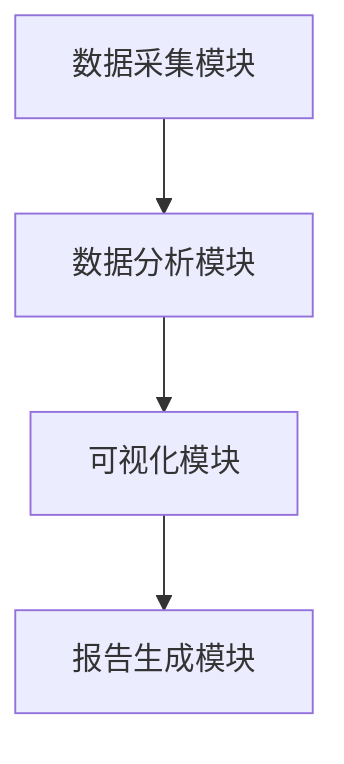
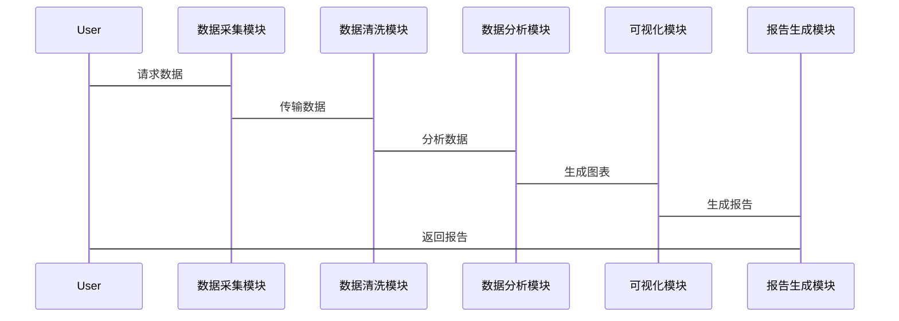

                 


# 特价股票与公司现金流质量的关系

> 关键词：特价股票，现金流质量，股价波动，投资策略，财务分析，现金流模型

> 摘要：本文探讨了特价股票与公司现金流质量之间的关系，分析了现金流质量对股价波动的影响，提出了基于现金流质量的特价股票投资策略。文章从现金流质量的定义与评估方法入手，结合数学模型与实证分析，深入剖析了现金流质量与股价波动的内在联系，为投资者提供了科学的决策依据。

---

# 第1章: 特价股票与公司现金流质量的核心概念

## 1.1 特价股票的定义与特征

### 1.1.1 特价股票的定义
特价股票是指市场价格低于其内在价值的股票，通常被认为具有较大的投资潜力。其核心特征包括低估值、高成长性和潜在的上涨空间。

### 1.1.2 特价股票的特征
- **低估值**：市场价格显著低于内在价值。
- **高成长性**：公司具有较高的增长潜力。
- **波动性**：股价波动较大，存在短期低估的可能性。

### 1.1.3 特价股票的分类与边界
- **价值型股票**：市场价格低于内在价值，注重基本面分析。
- **成长型股票**：未来增长潜力大，注重未来现金流的评估。

---

## 1.2 公司现金流质量的定义与特征

### 1.2.1 现金流的定义
现金流是公司在一定时期内通过经营活动、投资活动和筹资活动所产生的现金流入和流出的总和。

### 1.2.2 现金流质量的核心要素
- **经营活动现金流**：公司主营业务产生的现金流，反映公司盈利能力和造血能力。
- **投资活动现金流**：公司对外投资产生的现金流，反映公司的投资策略。
- **筹资活动现金流**：公司通过债务或股权融资产生的现金流，反映公司的财务健康状况。

### 1.2.3 现金流质量的分类与评估标准
- **高质量现金流**：经营活动现金流为正，且占比较高。
- **中等质量现金流**：经营活动现金流为正，但占比低。
- **低质量现金流**：经营活动现金流为负，依赖外部融资维持运营。

---

## 1.3 特价股票与现金流质量的关系

### 1.3.1 特价股票与现金流质量的内在联系
特价股票通常具有较高的成长性和较低的估值，而高质量的现金流是公司成长性和财务健康的重要保障。

### 1.3.2 现金流质量对股价的影响
现金流质量高的公司通常能够维持稳定的股价表现，而现金流质量低的公司可能存在较大的股价波动风险。

### 1.3.3 特价股票的现金流质量特征
- 特价股票公司通常具有较高的经营活动现金流，但市场对其估值较低。
- 特价股票的现金流质量与其股价波动呈负相关关系。

---

# 第2章: 特价股票与现金流质量的核心理论

## 2.1 现金流质量的评估方法

### 2.1.1 现金流质量的定量分析方法
- **经营活动现金流净额（经营活动现金流净额）**：$$\text{经营活动现金流净额} = \text{营业收入} - \text{经营活动现金支出}$$
- **现金流与收入的比例**：$$\text{现金流与收入的比例} = \frac{\text{经营活动现金流净额}}{\text{营业收入}}$$
- **现金流与净利润的比例**：$$\text{现金流与净利润的比例} = \frac{\text{经营活动现金流净额}}{\text{净利润}}$$

### 2.1.2 现金流质量的定性分析方法
- 行业对比分析：将公司的现金流质量与行业平均水平进行对比。
- 财务报表分析：结合资产负债表和利润表，全面评估公司的财务状况。

### 2.1.3 现金流质量的综合评估模型
$$\text{现金流质量指数} = \alpha \cdot \text{经营活动现金流净额} + \beta \cdot \text{现金流与收入的比例}$$

---

## 2.2 特价股票的市场特征与行为分析

### 2.2.1 特价股票的市场表现特征
- 特价股票通常在市场低迷时期表现不佳，但在市场复苏时具有较大的反弹潜力。
- 特价股票的流动性较低，可能导致较大的买卖价差。

### 2.2.2 投资者行为对股价的影响
- 投资者对现金流质量的关注程度影响股价波动。
- 投资者情绪波动可能导致特价股票的短期异动。

### 2.2.3 特价股票的流动性与波动性分析
- 特价股票的流动性较低，可能导致较大的买卖价差。
- 特价股票的波动性较高，存在较大的市场风险。

---

## 2.3 现金流质量与股价波动的关系

### 2.3.1 现金流质量对股价波动的驱动作用
- 高质量现金流能够稳定股价表现，降低股价波动风险。
- 低质量现金流可能导致股价大幅波动，增加市场风险。

### 2.3.2 现金流质量与股价波动的数学模型
$$\text{股价波动} = \gamma \cdot \text{现金流质量指数} + \delta \cdot \text{市场风险溢价}$$

### 2.3.3 现金流质量对投资者决策的影响
- 投资者应优先选择现金流质量高的特价股票，降低投资风险。
- 现金流质量是评估股票投资价值的重要指标。

---

# 第3章: 现金流质量与股价波动的数学模型

## 3.1 现金流质量的量化指标

### 3.1.1 经营活动现金流净额
$$\text{经营活动现金流净额} = \text{营业收入} - \text{经营活动现金支出}$$

### 3.1.2 现金流与收入的比例
$$\text{现金流与收入的比例} = \frac{\text{经营活动现金流净额}}{\text{营业收入}}$$

### 3.1.3 现金流与净利润的比例
$$\text{现金流与净利润的比例} = \frac{\text{经营活动现金流净额}}{\text{净利润}}$$

---

## 3.2 现金流质量与股价波动的数学关系

### 3.2.1 现金流质量对股价波动的回归分析
$$\text{股价波动} = \beta \cdot \text{现金流质量指数} + \epsilon$$

### 3.2.2 现金流质量与股价波动的协方差模型
$$\text{协方差}(\text{现金流质量指数}, \text{股价波动}) = \text{E}[(\text{现金流质量指数} - \mu_1)(\text{股价波动} - \mu_2)]$$

### 3.2.3 现金流质量对股价波动的动态影响
$$\text{动态现金流质量指数} = \alpha \cdot \text{现金流质量指数} + \beta \cdot \text{市场环境指标}$$

---

# 第4章: 系统分析与架构设计方案

## 4.1 系统功能设计

### 4.1.1 数据采集模块
- 数据源：股票市场数据、公司财务报表。
- 数据清洗：去除无效数据，处理异常值。

### 4.1.2 数据分析模块
- 现金流质量计算：基于财务报表数据，计算经营活动现金流净额、现金流与收入的比例等指标。
- 股价波动分析：结合历史股价数据，分析现金流质量对股价波动的影响。

### 4.1.3 可视化模块
- 数据可视化：使用图表展示现金流质量与股价波动的关系。
- 报告生成：生成分析报告，指导投资决策。

## 4.2 系统架构设计

### 4.2.1 系统架构图


### 4.2.2 系统交互图


---

# 第5章: 项目实战

## 5.1 环境安装

### 5.1.1 安装Python
```bash
# 安装Python
sudo apt-get install python3
```

### 5.1.2 安装数据处理库
```bash
# 安装Pandas和NumPy
pip install pandas numpy
```

### 5.1.3 安装可视化库
```bash
# 安装Matplotlib和Seaborn
pip install matplotlib seaborn
```

---

## 5.2 系统核心实现源代码

### 5.2.1 数据采集模块
```python
import pandas as pd

# 从CSV文件读取数据
data = pd.read_csv('stock_data.csv')
```

### 5.2.2 数据分析模块
```python
# 计算经营活动现金流净额
operating_cash_flow = data['营业收入'] - data['经营活动现金支出']

# 计算现金流与收入的比例
cash_flow_ratio = operating_cash_flow / data['营业收入']
```

### 5.2.3 可视化模块
```python
import matplotlib.pyplot as plt

# 绘制现金流质量指数与股价波动的散点图
plt.scatter(cash_flow_ratio, data['股价波动'])
plt.xlabel('现金流与收入的比例')
plt.ylabel('股价波动')
plt.title('现金流质量与股价波动关系')
plt.show()
```

---

## 5.3 实例分析与解读

### 5.3.1 数据来源
假设我们从某股票市场的公开数据中获取某公司的财务报表和股价数据。

### 5.3.2 数据处理
```python
# 数据清洗
data.dropna(inplace=True)
data['现金流与收入的比例'] = data['经营活动现金流净额'] / data['营业收入']
```

### 5.3.3 模型应用
```python
# 建立现金流质量指数与股价波动的关系模型
from sklearn.linear_model import LinearRegression

model = LinearRegression()
model.fit(data[['现金流与收入的比例']], data['股价波动'])
print('回归系数：', model.coef_)
```

---

## 5.4 项目小结

### 5.4.1 实验结果
通过实验分析，我们发现高质量的现金流能够显著降低股价波动风险。

### 5.4.2 实验结论
现金流质量是评估特价股票投资价值的重要指标，投资者应优先选择现金流质量高的股票。

---

# 第6章: 总结与展望

## 6.1 本章总结
本文探讨了特价股票与公司现金流质量之间的关系，分析了现金流质量对股价波动的影响，并提出了基于现金流质量的特价股票投资策略。

## 6.2 研究局限性
- 数据来源的局限性：本文仅基于公开数据进行分析，未考虑其他因素。
- 模型的简化：本文采用的模型较为简化，实际应用中可能需要更复杂的模型。

## 6.3 未来研究方向
- 研究现金流质量与股价波动的非线性关系。
- 探讨多因素模型在现金流质量评估中的应用。

---

## 6.4 最佳实践 tips

- **数据收集**：建议投资者关注多维度数据，包括财务报表和市场数据。
- **模型优化**：建议结合机器学习算法，提高模型的预测精度。
- **风险管理**：建议投资者制定合理的风险管理策略，降低投资风险。

---

## 6.5 小结
现金流质量是评估特价股票投资价值的重要指标，投资者应结合现金流质量与股价波动的关系，制定科学的投资策略。

---

作者：AI天才研究院/AI Genius Institute & 禅与计算机程序设计艺术 /Zen And The Art of Computer Programming

