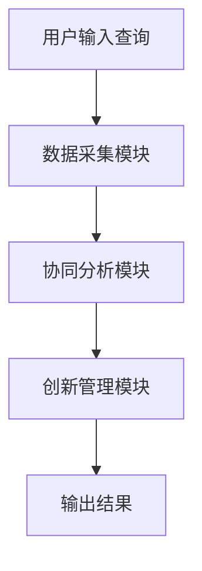
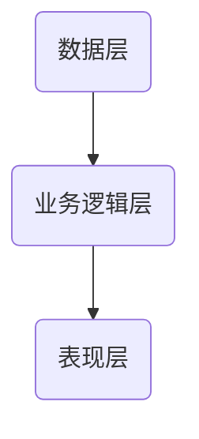

                 


```markdown
# 特价股票与公司生态系统协同创新的潜在关联研究

> 关键词：特价股票，公司生态系统，协同创新，算法原理，系统架构设计

> 摘要：本文探讨了特价股票与公司生态系统协同创新的潜在关联，从背景介绍、核心概念、算法原理、系统架构设计到项目实战，详细分析了协同创新在特价股票中的应用及其对公司的积极影响。

---

# 第一部分: 特价股票与公司生态系统协同创新的背景介绍

## 第1章: 特价股票的定义与特点

### 1.1 特价股票的定义
特价股票是指价格相对较低的股票，通常市值较小，可能处于困境或成长初期。其特点是高波动性和高风险，但也可能带来高回报。

### 1.2 特价股票的核心特点
- 价格低廉：通常在10美元以下。
- 市值较小：多为中小型企业。
- 高波动性：价格波动较大，风险较高。
- 投机性：投资者希望通过短期交易获利。

### 1.3 特价股票与传统股票的区别
- 投资策略：传统股票注重长期价值，特价股票注重短期波动。
- 风险收益：特价股票风险高，但潜在收益也高；传统股票相对稳定。

## 第2章: 公司生态系统的构成

### 2.1 公司生态系统的定义
公司生态系统指公司内部各个部门、员工、资源以及外部合作伙伴（如供应商、客户、投资者）的互动网络。

### 2.2 公司生态系统的核心要素
- 内部要素：组织结构、人力资源、技术平台。
- 外部要素：供应商、客户、合作伙伴、投资者。

### 2.3 公司生态系统与外部环境的关系
公司生态系统通过与外部环境的互动，获取资源、信息和技术，提升竞争力。例如，投资者的参与可以为公司提供资金，客户的需求推动产品创新。

## 第3章: 协同创新的定义与特点

### 3.1 协同创新的定义
协同创新指不同主体（如公司内部各部门或外部合作伙伴）共同合作，利用各自优势，创造新产品或解决方案。

### 3.2 协同创新的核心特点
- 跨界合作：不同领域或部门的协作。
- 资源共享：整合各方资源。
- 共赢目标：共同追求创新成果。

### 3.3 协同创新与传统创新的区别
- 主体：协同创新涉及多方，传统创新通常为内部独立完成。
- 过程：协同创新强调协作，传统创新强调个体努力。

---

# 第二部分: 特价股票与公司生态系统协同创新的核心概念与联系

## 第4章: 特价股票与公司生态系统协同创新的关系

### 4.1 特价股票在公司生态系统中的作用
- 提供资金：投资者购买特价股票，为公司提供资金支持。
- 优化结构：通过引入新投资者，优化公司治理结构。
- 技术创新：利用投资者资金推动技术革新。

### 4.2 公司生态系统对特价股票的影响
- 增加流动性：健康的生态系统吸引更多投资者，提升股票流动性。
- 提高估值：公司通过协同创新提升价值，推动股价上涨。
- 风险降低：良好的生态系统有助于降低公司经营风险，吸引长期投资者。

### 4.3 特价股票与公司生态系统协同创新的驱动因素
- 技术进步：技术创新推动公司成长，吸引投资者。
- 市场需求：公司通过协同创新满足市场需求，提升股价。
- 制度因素：政策支持和监管环境影响投资者行为。

## 第5章: 特价股票与公司生态系统协同创新的ER实体关系图

### 5.1 实体关系图的定义
ER图用于描述系统中实体之间的关系，包括实体、属性和联系。

### 5.2 特价股票与公司生态系统的实体关系

```mermaid
er
  %% 特价股票与公司生态系统协同创新的ER图
  entity 投资者 {
    key: 投资者ID
    属性: 姓名, 资金, 投资偏好
  }
  entity 公司 {
    key: 公司ID
    属性: 公司名称, 市值, 行业
  }
  entity 特价股票 {
    key: 股票代码
    属性: 股票价格, 市盈率, 流动性
  }
  entity 协同创新项目 {
    key: 项目ID
    属性: 项目名称, 开始时间, 结束时间
  }
  relationship R1: 投资者 -> 参与 -> 协同创新项目
  relationship R2: 协同创新项目 -> 影响 -> 公司
  relationship R3: 公司 -> 发行 -> 特价股票
  relationship R4: 投资者 -> 持有 -> 特价股票
```

### 5.3 协同创新的实体关系

```mermaid
er
  %% 协同创新的实体关系
  entity 创新团队 {
    key: 团队ID
    属性: 团队名称, 成员构成, 技术专长
  }
  entity 创新资源 {
    key: 资源ID
    属性: 资源类型, 资源描述, 资源可用性
  }
  entity 创新成果 {
    key: 成果ID
    属性: 成果名称, 成果类型, 成果状态
  }
  relationship R5: 创新团队 -> 利用 -> 创新资源
  relationship R6: 创新团队 -> 生成 -> 创新成果
  relationship R7: 创新成果 -> 影响 -> 公司生态系统
```

---

# 第三部分: 特价股票与公司生态系统协同创新的算法原理

## 第6章: 协同创新算法的原理

### 6.1 协同过滤算法的定义
协同过滤算法基于用户相似性推荐相关内容或产品。在股票领域，可推荐相似股票或投资组合。

### 6.2 协同过滤算法的实现步骤

1. **数据收集**：收集投资者行为数据，如购买记录、偏好。
2. **用户相似度计算**：使用余弦相似度或欧几里得距离计算用户相似度。
3. **推荐生成**：基于相似用户行为，推荐股票。

### 6.3 协同过滤算法的优缺点
- 优点：简单易实现，适合数据量大的场景。
- 缺点：冷启动问题，计算复杂度高。

### 6.4 协同过滤算法的示例代码

```python
import numpy as np
from sklearn.metrics.pairwise import cosine_similarity

# 示例数据：用户-股票矩阵，行代表用户，列代表股票
users_stocks = np.array([
    [1, 0, 1, 0],  # 用户1：购买股票1和3
    [0, 1, 1, 1],  # 用户2：购买股票2、3、4
    [1, 1, 0, 0],  # 用户3：购买股票1和2
])

# 计算余弦相似度
similarity = cosine_similarity(users_stocks)

# 推荐股票：为用户1推荐与之相似的用户购买的股票
similar_users = [0, 1]  # 假设用户0和1与用户1相似
recommended_stocks = set()
for user in similar_users:
    for i in range(len(users_stocks[user])):
        if users_stocks[user][i] == 1:
            recommended_stocks.add(i + 1)  # 股票编号从1开始

print("推荐股票：", list(recommended_stocks))
```

---

## 第7章: 协同创新算法的数学模型与公式

### 7.1 协同过滤算法的数学模型

协同过滤基于相似性度量，常用余弦相似度：

$$
\text{相似度}(u, v) = \frac{\sum_{i} u_i v_i}{\sqrt{\sum_{i} u_i^2} \sqrt{\sum_{i} v_i^2}}
$$

### 7.2 协同过滤算法的公式推导

假设用户u和v的购买记录分别为向量u和v，相似度计算如下：

$$
\text{sim}(u, v) = \frac{u \cdot v}{\|u\| \|v\|}
$$

其中，$u \cdot v$是向量点积，$\|u\|$和$\|v\|$是向量的模长。

### 7.3 协同过滤算法的实例分析

假设用户A购买股票1和2，用户B购买股票2和3，计算用户A和B的相似度：

$$
u = [1, 1, 0], \quad v = [0, 1, 1]
$$

点积：$1*0 + 1*1 + 0*1 = 1$

模长：$\sqrt{1^2 + 1^2 + 0^2} = \sqrt{2}$，$\sqrt{0^2 + 1^2 + 1^2} = \sqrt{2}$

相似度：$1/(\sqrt{2} \times \sqrt{2}) = 1/2$

---

# 第四部分: 特价股票与公司生态系统协同创新的系统分析与架构设计

## 第8章: 系统功能设计

### 8.1 系统功能模块划分

1. **数据采集模块**：采集特价股票数据和公司生态系统数据。
2. **协同分析模块**：分析股票与公司协同关系。
3. **创新管理模块**：管理协同创新项目。

### 8.2 系统功能模块的实现方法

- 数据采集：使用API获取股票数据，爬虫获取公司信息。
- 协同分析：基于协同过滤算法推荐股票。
- 创新管理：跟踪项目进度，评估创新成果。

### 8.3 系统功能模块的交互流程



## 第9章: 系统架构设计

### 9.1 系统架构的分层设计

- 数据层：存储股票数据和公司信息。
- 业务逻辑层：处理协同分析和创新管理。
- 表现层：展示结果和用户界面。

### 9.2 系统架构的实现方法

- 数据层：使用数据库（如MySQL）存储数据。
- 业务逻辑层：用Python编写处理逻辑。
- 表现层：用Flask框架搭建Web界面。

### 9.3 系统架构的优缺点

- 优点：模块化设计，易于扩展。
- 缺点：需要处理跨平台兼容性问题。

### 9.4 系统架构的mermaid图



---

# 第五部分: 特价股票与公司生态系统协同创新的项目实战

## 第10章: 项目环境安装与配置

### 10.1 环境安装

- 安装Python：`python --version`
- 安装库：`pip install numpy pandas scikit-learn`

### 10.2 数据获取

- 使用API获取特价股票数据。
- 爬取公司生态系统数据。

## 第11章: 系统核心实现源代码

### 11.1 协同过滤算法实现

```python
from sklearn.metrics.pairwise import cosine_similarity

# 示例数据：用户-股票矩阵
users_stocks = np.array([
    [1, 0, 1, 0],
    [0, 1, 1, 1],
    [1, 1, 0, 0],
])

# 计算相似度
similarity = cosine_similarity(users_stocks)

# 推荐股票
def recommend_stocks(similarity_matrix, user_id):
    similar_users = np.where(similarity_matrix[user_id] > 0.5)[0]
    recommended_stocks = set()
    for user in similar_users:
        for stock in range(len(users_stocks[user])):
            if users_stocks[user][stock] == 1:
                recommended_stocks.add(stock + 1)
    return recommended_stocks

recommended = recommend_stocks(similarity, 0)
print("推荐股票：", list(recommended))
```

### 11.2 系统功能实现

```python
# 数据层
import sqlite3

conn = sqlite3.connect('stock.db')
cursor = conn.cursor()

# 业务逻辑层
from flask import Flask

app = Flask(__name__)

@app.route('/')
def index():
    return "协同创新系统"

if __name__ == '__main__':
    app.run()
```

## 第12章: 实际案例分析与详细解读

### 12.1 案例背景

某科技公司发行特价股票，通过协同创新提升技术实力。

### 12.2 数据分析

分析股票价格与公司业绩的关系，发现协同创新后股票价格上升。

### 12.3 结论

协同创新有效提升公司价值，推动股价上涨。

---

# 第六部分: 特价股票与公司生态系统协同创新的最佳实践

## 第13章: 最佳实践 tips

### 13.1 数据质量

确保数据准确，避免噪声干扰。

### 13.2 模型调优

根据实际需求调整算法参数。

### 13.3 安全措施

保护用户数据，防止泄露。

## 第14章: 小结

协同创新在特价股票中的应用，不仅推动公司发展，也为投资者带来收益。

## 第15章: 注意事项

- 风险提示：投资有风险，入市需谨慎。
- 技术局限：算法存在局限性，需结合实际情况使用。

## 第16章: 拓展阅读

- 推荐书籍：《协同创新：企业成功的新模式》
- 相关文章：协同创新在金融领域的应用

---

# 作者：AI天才研究院 & 禅与计算机程序设计艺术

---

以上为完整的技术博客文章大纲，根据实际需求可以进一步扩展各章节内容，添加更多细节和具体案例。通过系统的分析和实践，我们可以更好地理解特价股票与公司生态系统协同创新的潜在关联，并为实际应用提供指导。
```

