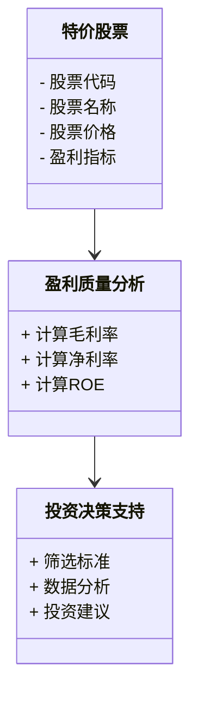
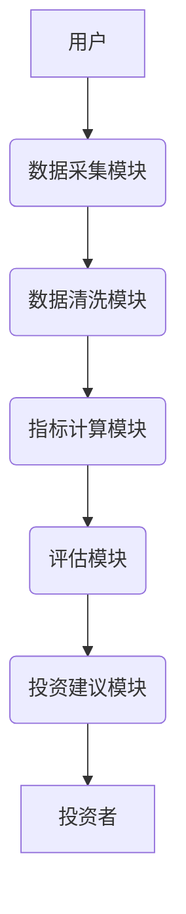
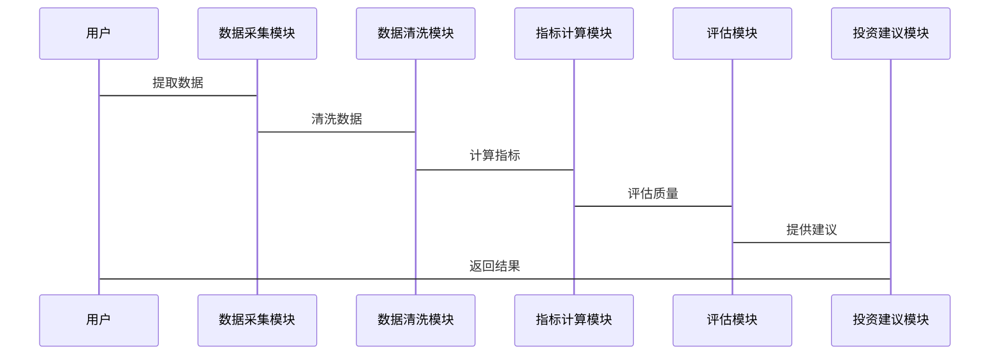

                 


# 特价股票与公司盈利质量的深度分析方法

## 关键词
特价股票、公司盈利质量、财务分析、投资决策、杜邦分析法

## 摘要
本文旨在探讨特价股票与公司盈利质量之间的关系，通过系统化的分析方法，帮助投资者识别具有潜力的特价股票。文章首先介绍了特价股票的定义、分类及其市场现状，随后分析了公司盈利质量的核心指标和杜邦分析法的应用。最后，通过实际案例展示了如何将这些方法应用于特价股票的选择，为投资者提供科学的决策依据。

---

# 第一部分: 特价股票与公司盈利质量分析基础

## 第1章: 特价股票的定义与分类

### 1.1 特价股票的定义与分类
#### 1.1.1 特价股票的定义
特价股票通常指价格低于市场平均水平的股票，具有较高的投资吸引力。这些股票可能因市场波动、公司短期问题或行业周期性因素而被低估。

#### 1.1.2 特价股票的分类
- **价值型股票**：市盈率、市净率低于行业平均水平。
- **成长型股票**：虽然当前估值较高，但未来增长潜力大。
- **周期性股票**：受经济周期影响较大的行业股票。

#### 1.1.3 特价股票的市场特点
- 价格波动较大
- 投资风险较高
- 存在较大的上涨潜力

### 1.2 特价股票的市场现状分析
#### 1.2.1 特价股票的市场分布
- 市场中存在大量低价股票，尤其是在新兴市场。
- 特价股票的分布与行业周期密切相关。

#### 1.2.2 特价股票的投资机会
- 价值被低估的公司可能有较高的上涨空间。
- 行业周期性低谷时，某些股票可能被错杀。

#### 1.2.3 特价股票的风险与挑战
- 信息不对称风险
- 公司基本面可能存在问题
- 市场波动风险

## 第2章: 公司盈利质量分析的背景与意义

### 2.1 公司盈利质量分析的定义
#### 2.1.1 盈利质量的定义
盈利质量指公司在一定时期内实现利润的能力，反映了公司的经营效率和财务健康状况。

#### 2.1.2 盈利质量的核心要素
- 盈利能力
- 盈利持续性
- 盈利结构合理性

#### 2.1.3 盈利质量与公司价值的关系
高盈利质量的公司通常具有较高的市场价值和抗风险能力。

### 2.2 盈利质量分析的重要性
#### 2.2.1 投资决策中的盈利质量分析
- 帮助投资者识别具有长期增长潜力的公司。
- 降低投资风险。

#### 2.2.2 盈利质量分析对企业管理的意义
- 优化公司经营策略
- 提高财务透明度
- 增强投资者信心

#### 2.2.3 盈利质量分析的行业差异性
不同行业对盈利质量的衡量标准不同，需结合行业特点进行分析。

---

# 第二部分: 盈利质量分析的核心方法

## 第3章: 盈利质量分析的核心指标

### 3.1 盈利能力指标
#### 3.1.1 净利润
净利润是公司利润的核心指标，反映了公司的整体盈利能力。

#### 3.1.2 毛利率
毛利率 = (营业收入 - 营业成本) / 营业收入
毛利率高表明公司产品具有较高的附加值。

#### 3.1.3 净利率
净利率 = 净利润 / 营业收入
高净利率表明公司运营效率较高。

### 3.2 盈利质量指标
#### 3.2.1 盈利持续性
盈利持续性通过分析公司过去几年的净利润变化趋势来衡量。

#### 3.2.2 盈利稳定性
盈利稳定性通过分析公司收入和成本的稳定性来判断。

#### 3.2.3 盈利结构合理性
合理的盈利结构应具备较高的主营业务收入占比和稳定的成本控制能力。

## 第4章: 盈利质量分析的杜邦模型

### 4.1 杜邦分析法的原理
#### 4.1.1 杜邦分析法的定义
杜邦分析法是通过分解ROE（净资产收益率）来评估公司盈利能力的一种方法。

#### 4.1.2 杜邦分析法的核心公式
$$ROE = \frac{净利润}{股东权益} = \frac{净利润}{营业收入} \times \frac{营业收入}{总资产} \times \frac{总资产}{股东权益}$$

#### 4.1.3 杜邦分析法的步骤
1. 计算净利润率（Net Profit Margin）：$\frac{净利润}{营业收入}$
2. 计算总资产周转率（Asset Turnover）：$\frac{营业收入}{总资产}$
3. 计算权益乘数（Equity Multiplier）：$\frac{总资产}{股东权益}$
4. 综合计算ROE：$ROE = 净利润率 \times 总资产周转率 \times 权益乘数$

### 4.2 杜邦分析法在盈利质量中的应用
#### 4.2.1 实际案例分析
假设某公司2022年的财务数据如下：
- 净利润：100万元
- 营业收入：500万元
- 总资产：1000万元
- 股东权益：400万元

计算ROE：
$$ROE = \frac{100}{400} = 0.25 = 25\%$$

通过杜邦分析法分解：
$$ROE = \frac{100}{500} \times \frac{500}{1000} \times \frac{1000}{400} = 0.2 \times 0.5 \times 2.5 = 0.25 = 25\%$$

#### 4.2.2 杜邦分析法的优缺点
- 优点：能够分解ROE的来源，帮助识别公司盈利的关键因素。
- 缺点：依赖于历史数据，可能存在滞后性。

---

# 第三部分: 特价股票与盈利质量分析的结合

## 第5章: 特价股票的筛选标准

### 5.1 特价股票的筛选标准
#### 5.1.1 盈利能力筛选
选择净利润率和净利率较高的公司。

#### 5.1.2 盈利质量筛选
评估公司盈利的持续性和稳定性。

#### 5.1.3 综合筛选标准
结合市盈率、市净率等估值指标，选择具有合理估值的公司。

### 5.2 特价股票的盈利质量分析流程
#### 5.2.1 数据采集与清洗
收集公司财务报表，清洗异常数据。

#### 5.2.2 盈利质量指标计算
计算毛利率、净利率、ROE等指标。

#### 5.2.3 盈利质量评估与排序
根据指标得分对股票进行排序，选择得分较高的股票。

## 第6章: 特价股票的盈利质量分析流程

### 6.1 数据采集与预处理
#### 6.1.1 数据来源
- 企业财报
- 行业报告
- 财务分析工具

#### 6.1.2 数据清洗
- 填补缺失值
- 处理异常值
- 标准化数据

### 6.2 盈利质量指标计算
#### 6.2.1 核心指标计算
- 净利润
- 毛利率
- 净利率
- ROE

#### 6.2.2 指标分析
- 比较公司指标与行业平均水平
- 分析指标变化趋势

### 6.3 盈利质量评估与排序
#### 6.3.1 评估标准
- 指标得分
- 市场地位
- 竞争优势

#### 6.3.2 排序方法
- 加权评分法
- 层次分析法

---

# 第四部分: 系统分析与架构设计

## 第7章: 系统分析与架构设计方案

### 7.1 问题场景介绍
通过系统化的分析方法，帮助投资者快速筛选出具有潜力的特价股票。

### 7.2 系统功能设计
#### 7.2.1 领域模型


### 7.3 系统架构设计


### 7.4 系统接口设计
- 数据接口：与财务数据库对接
- 用户接口：提供数据分析结果

### 7.5 系统交互设计


---

# 第五部分: 项目实战

## 第8章: 项目实战

### 8.1 环境安装
- 安装Python和相关库（Pandas、NumPy、Matplotlib）
- 数据库连接工具

### 8.2 核心实现
#### 8.2.1 数据采集与清洗
```python
import pandas as pd

# 数据采集
df = pd.read_csv('stock_data.csv')

# 数据清洗
df.dropna(inplace=True)
df = df[~df['revenue'].isnull()]
```

#### 8.2.2 盈利指标计算
```python
# 计算毛利率
df['gross_margin'] = df['gross_profit'] / df['revenue']

# 计算净利率
df['net_margin'] = df['net_profit'] / df['revenue']

# 计算ROE
df['roe'] = df['net_profit'] / df['equity']
```

#### 8.2.3 模型构建与评估
```python
from sklearn.metrics import mean_squared_error

# 训练模型
model.fit(X_train, y_train)

# 预测评估
y_pred = model.predict(X_test)
print(mean_squared_error(y_test, y_pred))
```

### 8.3 实际案例分析
以某公司为例，分析其财务数据，评估其盈利质量，得出投资建议。

### 8.4 项目总结
通过系统化的分析方法，帮助投资者识别具有潜力的特价股票，降低投资风险。

---

# 第六部分: 总结与展望

## 第9章: 总结与展望

### 9.1 总结
本文通过系统化的分析方法，探讨了特价股票与公司盈利质量的关系，提出了基于杜邦分析法的盈利质量评估模型，并通过实际案例展示了其应用。

### 9.2 展望
未来的研究可以进一步优化模型，结合更多指标，如现金流、债务结构等，提高分析的准确性。

---

# 第七部分: 注意事项和最佳实践

## 第10章: 投资注意事项

### 10.1 投资中的注意事项
- 风险管理：分散投资，避免过度集中。
- 信息获取：及时获取公司财务报表和行业动态。
- 时间因素：长期投资优于短期炒作。

### 10.2 最佳实践
- 定期复盘：评估投资组合的表现。
- 持续学习：关注行业动态和分析方法的更新。
- 专业咨询：必要时寻求专业投资顾问的帮助。

---

# 作者信息

作者：AI天才研究院/AI Genius Institute & 禅与计算机程序设计艺术/Zen And The Art of Computer Programming

---

通过本文的系统化分析，投资者可以更好地识别具有潜力的特价股票，做出明智的投资决策。希望本文的内容能够为读者提供有价值的参考和启发。

