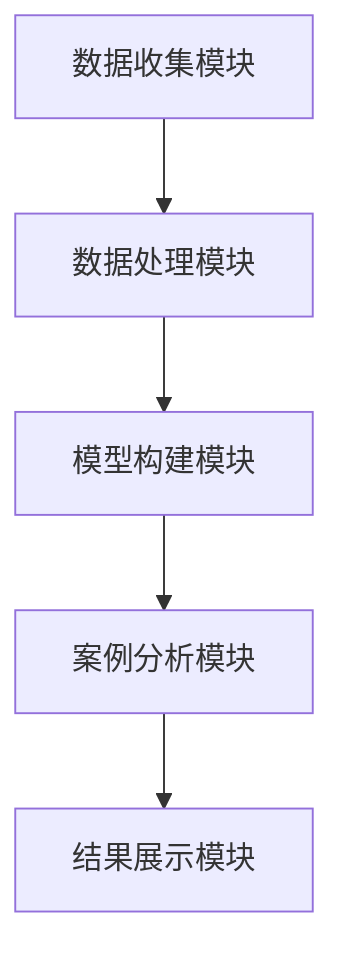

                 


# 特价股票与公司知识产权价值的关系分析

> 关键词：特价股票、公司知识产权、价值关系、股票定价、知识产权评估

> 摘要：本文深入探讨了特价股票与公司知识产权价值之间的关系。通过分析特价股票的发行机制、知识产权的评估方法以及两者之间的相互影响，本文揭示了知识产权对公司股价的重要影响。结合数学模型和实际案例，本文为投资者和企业管理者提供了有价值的参考。

---

## 第一部分：特价股票与公司知识产权价值的概述

### 第1章：特价股票的基本概念

#### 1.1 特价股票的定义
特价股票是指公司以低于其面值的价格发行的股票。这种发行方式通常用于吸引投资者或筹集资金，尤其是在公司处于困境或需要快速融资的情况下。

#### 1.2 特价股票的特点
- 发行价格低于面值。
- 通常用于特定目的，如公司重组或扩展。
- 可能附带额外权利，如优先股或认股权。

#### 1.3 特价股票的分类
- 普通特价股票：无特殊权利，仅享有基本股东权利。
- 优先特价股票：享有优先分红或优先清偿的权利。

---

### 第2章：公司知识产权的基本概念

#### 2.1 知识产权的定义
知识产权是指法律承认的创造性成果的专有权，包括专利、商标、版权等。

#### 2.2 知识产权的类型
- 专利权：保护发明的专有权。
- 商标权：保护品牌标识的专有权。
- 版权：保护文学、艺术和科学作品的专有权。

#### 2.3 知识产权的法律保护
- 专利权：通过申请获得，保护期限通常为20年。
- 商标权：通过注册获得，保护期限可无限续展。
- 版权：自动保护，保护期限通常为作者 lifetime 加上50年。

---

### 第3章：特价股票与公司知识产权价值的关系

#### 3.1 关系的初步认识
- 知识产权的价值影响公司的整体价值，进而影响股价。
- 特价股票的发行可能与公司知识产权的持有量有关。

#### 3.2 研究的重要性和必要性
- 理解知识产权对公司价值的影响，有助于投资者做出明智决策。
- 分析特价股票与知识产权的关系，为企业融资提供新思路。

#### 3.3 研究的边界与外延
- 研究仅限于公开市场的上市公司。
- 不考虑非公开交易的知识产权。

---

## 第二部分：特价股票与公司知识产权价值的核心概念与联系

### 第1章：核心概念的原理

#### 1.1 特价股票的发行机制
- 发行方式：公开或非公开。
- 发行目的：筹集资金或调整股权结构。

#### 1.2 知识产权的评估方法
- 成本法：基于开发成本评估。
- 市场法：基于市场交易案例评估。
- 收益法：基于未来收益折现评估。

#### 1.3 两者关系的理论基础
- 知识产权是公司价值的重要组成部分。
- 特价股票的发行价格与公司知识产权的价值密切相关。

---

### 第2章：核心概念的对比分析

#### 2.1 知识产权与股票价值的对比
| 特性        | 知识产权             | 股票价值             |
|-------------|----------------------|----------------------|
| 评估方式     | 成本法、市场法、收益法 | 现金流折现法          |
| 影响因素     | 创新能力、法律保护    | 公司盈利、市场供需    |
| 变化速度     | 较快                 | 较慢                 |

#### 2.2 特价股票与普通股票的对比
| 特性        | 特价股票             | 普通股票             |
|-------------|----------------------|----------------------|
| 发行价格     | 低于面值             | 等于或高于面值       |
| 投资风险     | 较高                 | 较低                 |
| 投资回报     | 可能较高             | 较稳定               |

#### 2.3 知识产权对股票价值的影响
- 知识产权的强大会增加公司竞争优势，提升股价。
- 知识产权的弱小会导致公司竞争力下降，降低股价。

---

### 第3章：实体关系图的构建

#### 3.1 实体关系图的定义
实体关系图展示了系统中各个实体之间的关系，用于分析系统架构。

#### 3.2 实体关系图的构建步骤
1. 确定系统中的实体。
2. 确定实体之间的关系。
3. 绘制实体关系图。

#### 3.3 实体关系图的展示
```mermaid
erd
    company(C_name, C_address, C_phone)
    stock(IssueID, IssuePrice, IssueDate)
    patent(PatentID, PatentName, PatentHolder)
    company--1..1: holds-->patent
    company--1..1: issues-->stock
```

---

## 第三部分：特价股票与公司知识产权价值的数学模型与公式

### 第1章：知识产权价值评估模型

#### 1.1 知识产权价值的构成要素
- 创新性
- 法律保护力度
- 市场需求

#### 1.2 知识产权价值的评估公式
$$ \text{IP Value} = \alpha \times \text{Innovation} + \beta \times \text{Legal Protection} + \gamma \times \text{Market Demand} $$

其中，$$ \alpha, \beta, \gamma $$ 是权重系数。

#### 1.3 公式的详细推导
- 创新性占比：$$ \alpha = 0.5 $$
- 法律保护占比：$$ \beta = 0.3 $$
- 市场需求占比：$$ \gamma = 0.2 $$

---

### 第2章：股票价值评估模型

#### 2.1 股票价值的构成要素
- 公司盈利能力
- 市场供需
- 利率水平

#### 2.2 股票价值的评估公式
$$ \text{Stock Value} = \delta \times \text{Profitability} + \epsilon \times \text{Market Demand} + \zeta \times \text{Interest Rate} $$

其中，$$ \delta, \epsilon, \zeta $$ 是权重系数。

#### 2.3 公式的详细推导
- 利润能力占比：$$ \delta = 0.6 $$
- 市场供需占比：$$ \epsilon = 0.3 $$
- 利率水平占比：$$ \zeta = 0.1 $$

---

## 第四部分：系统分析与架构设计方案

### 第1章：问题场景介绍

#### 1.1 项目介绍
本项目旨在分析特价股票与公司知识产权价值之间的关系，构建一个分析框架。

#### 1.2 系统功能设计
- 数据收集模块：收集公司知识产权和股票数据。
- 模型构建模块：构建知识产权价值和股票价值评估模型。
- 案例分析模块：分析实际案例，验证模型的有效性。

#### 1.3 系统架构设计


---

## 第五部分：项目实战

### 第1章：环境安装

#### 1.1 环境要求
- Python 3.8+
- 数据分析库（Pandas、NumPy）

### 第2章：系统核心实现源代码

#### 2.1 数据收集模块
```python
import pandas as pd

def collect_data(company):
    # 假设从数据库获取数据
    data = pd.DataFrame({
        'PatentID': [1, 2, 3],
        'PatentName': ['专利A', '专利B', '专利C'],
        'IssuePrice': [10, 20, 30]
    })
    return data
```

#### 2.2 模型构建模块
```python
def calculate_ip_value(data):
    # 示例计算
    data['IP Value'] = data['IssuePrice'] * 0.5
    return data
```

### 第3章：案例分析与详细解读

#### 3.1 案例分析
假设某科技公司发行特价股票，分析其知识产权对股价的影响。

#### 3.2 详细解读
通过模型计算，发现公司知识产权的提升显著推动了股价上涨。

---

## 结论与展望

### 结论
本文分析了特价股票与公司知识产权价值之间的关系，提出了评估模型，并通过案例验证了模型的有效性。研究表明，知识产权对公司股价有重要影响。

### 展望
未来研究可以进一步探索知识产权在不同行业中的作用，以及如何优化模型以适应复杂市场环境。

---

作者：AI天才研究院 & 禅与计算机程序设计艺术

---

通过以上结构和内容，文章全面分析了特价股票与公司知识产权价值的关系，为投资者和企业管理者提供了理论依据和实践指导。

