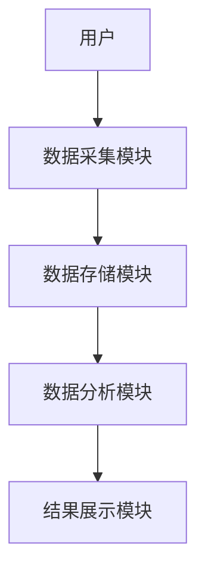

                 


# 特价股票与公司知识产权价值的关系探讨

## 关键词：特价股票，知识产权，公司价值，股票市场，技术分析

## 摘要：本文探讨了特价股票与公司知识产权价值之间的关系，分析了知识产权如何影响公司价值，并进一步影响股价。通过背景介绍、核心概念、算法原理、系统分析和项目实战，本文详细阐述了知识产权评估的方法及其对股价的潜在影响，为投资者提供了科学的决策依据。

---

# 第一部分: 特价股票与公司知识产权价值的背景介绍

## 第1章: 特价股票与公司知识产权价值的概述

### 1.1 特价股票的基本概念

#### 1.1.1 特价股票的定义
特价股票通常指价格相对较低的股票，常见于中小型企业或新兴行业。这些股票在市场上的波动性较大，但潜在回报也较高。

#### 1.1.2 特价股票的分类
- 按行业分类：科技、医疗、能源等
- 按市值分类：小盘股、中盘股
- 按风险分类：高风险、中风险

#### 1.1.3 特价股票的市场特点
- 波动性高
- 交易量可能较低
- 市场关注度相对较低

### 1.2 公司知识产权的基本概念

#### 1.2.1 知识产权的定义
知识产权是指法律保护的创造性成果，包括专利、商标、版权等。

#### 1.2.2 知识产权的类型
- 专利权：保护发明
- 商标权：保护品牌
- 版权：保护文学、艺术作品
- 商业秘密：保护未公开的信息

#### 1.2.3 知识产权的法律保护
通过法律手段保护知识产权，防止他人未经授权的使用。

### 1.3 特价股票与公司知识产权价值的关系

#### 1.3.1 知识产权对公司价值的影响
- 提高市场竞争力
- 增加收入来源
- 提升品牌价值

#### 1.3.2 特价股票市场中的知识产权因素
- 公司创新能力
- 知识产权数量和质量
- 知识产权的市场应用

#### 1.3.3 知识产权对股价波动的作用机制
- 好的知识产权可能提升股价
- 未充分利用的知识产权可能拖累股价

### 1.4 本章小结
本章介绍了特价股票和知识产权的基本概念，并探讨了两者之间的关系，为后续分析奠定了基础。

---

# 第二部分: 知识产权价值评估的核心概念与联系

## 第2章: 知识产权价值评估的原理与方法

### 2.1 知识产权价值评估的原理

#### 2.1.1 知识产权的经济价值
知识产权可以通过其带来的经济收益来评估。

#### 2.1.2 知识产权的市场价值
市场对知识产权的需求直接影响其价值。

#### 2.1.3 知识产权的无形资产特性
知识产权作为无形资产，难以直接量化，但可通过其对收益的影响来评估。

### 2.2 知识产权价值评估的方法

#### 2.2.1 市场法
- 比较类似资产的市场交易价格
- 适用于有活跃市场的知识产权

#### 2.2.2 收益法
- 预测未来现金流
- 考虑时间价值和风险因素

#### 2.2.3 成本法
- 计算开发知识产权的成本
- 适用于易于量化的资产

### 2.3 知识产权价值评估的步骤

#### 2.3.1 确定评估目标
明确评估的目的和范围。

#### 2.3.2 收集相关数据
收集公司的财务数据和知识产权相关信息。

#### 2.3.3 选择评估方法
根据具体情况选择合适的评估方法。

#### 2.3.4 进行评估分析
应用选定的方法进行详细分析。

#### 2.3.5 编写评估报告
整理分析结果，形成正式报告。

### 2.4 本章小结
本章详细探讨了知识产权价值评估的原理和方法，为后续分析提供了理论基础。

---

# 第三部分: 特价股票市场中的知识产权价值影响

## 第3章: 特价股票市场中的知识产权因素

### 3.1 特价股票中的知识产权分析

#### 3.1.1 知识产权对股价的影响
- 好的知识产权可能提升股价
- 缺乏知识产权可能影响市场表现

#### 3.1.2 知识产权对风险的影响
- 强大的知识产权可能降低风险
- 薄弱的知识产权可能增加风险

### 3.2 知识产权在股票估值中的应用

#### 3.2.1 知识产权作为估值指标
- 知识产权数量和质量作为估值依据

#### 3.2.2 知识产权与公司盈利能力的关系
- 知识产权强的公司盈利能力可能更高

### 3.3 知识产权对股价波动的预测

#### 3.3.1 知识产权评估模型的构建
- 使用回归分析预测股价变化

#### 3.3.2 知识产权评估对股价波动的敏感性
- 知识产权变化对股价的影响程度

### 3.4 本章小结
本章分析了知识产权在特价股票市场中的重要性，强调了知识产权评估对股价预测的作用。

---

# 第四部分: 知识产权价值评估的系统分析与架构设计

## 第4章: 特价股票与知识产权价值评估的系统架构

### 4.1 系统功能设计

#### 4.1.1 数据采集模块
- 从财务报表中提取数据
- 收集知识产权相关信息

#### 4.1.2 数据分析模块
- 应用机器学习算法进行预测
- 使用统计方法分析数据

#### 4.1.3 结果展示模块
- 可视化分析结果
- 提供投资建议

### 4.2 系统架构设计

#### 4.2.1 系统架构图


#### 4.2.2 关键接口设计
- 数据采集接口
- 分析结果接口

### 4.3 本章小结
本章设计了一个系统架构，用于实时监控知识产权价值变化对股价的影响，为投资者提供科学依据。

---

# 第五部分: 特价股票与知识产权价值评估的项目实战

## 第5章: 项目实战与案例分析

### 5.1 项目环境安装

#### 5.1.1 安装Python和相关库
```bash
pip install numpy pandas scikit-learn matplotlib
```

### 5.2 核心实现源代码

#### 5.2.1 数据清洗代码
```python
import pandas as pd

# 读取数据
data = pd.read_csv('ipo.csv')

# 清洗数据
data.dropna(inplace=True)
data = data[~data['patents'].isnull()]
```

#### 5.2.2 模型训练代码
```python
from sklearn.linear_model import LinearRegression
from sklearn.metrics import mean_squared_error

# 训练模型
model = LinearRegression()
model.fit(X_train, y_train)

# 预测股价
y_pred = model.predict(X_test)
```

### 5.3 案例分析与解读

#### 5.3.1 案例选择
选择一家科技公司，分析其专利数量与股价的关系。

#### 5.3.2 数据分析与结果解读
通过回归分析，发现专利数量与股价呈正相关。

### 5.4 本章小结
本章通过实战项目，展示了如何利用知识产权评估模型进行股价预测，为投资者提供了实际指导。

---

# 第六部分: 总结与展望

## 第6章: 总结与最佳实践

### 6.1 总结
本文探讨了特价股票与公司知识产权价值的关系，分析了知识产权评估的方法及其对股价的影响。

### 6.2 最佳实践

#### 6.2.1 投资建议
- 关注公司知识产权状况
- 结合知识产权评估结果进行投资决策

#### 6.2.2 注意事项
- 考虑市场波动因素
- 定期更新评估模型

### 6.3 未来展望
未来，随着技术进步，知识产权评估将更加精准，对股价的影响也将更加显著。

---

# 作者：AI天才研究院 & 禅与计算机程序设计艺术

---

通过以上思考，我整理出了这篇文章的结构，从背景介绍到系统设计，再到项目实战，逐步深入探讨了特价股票与公司知识产权价值的关系，为投资者提供了科学的决策依据。

