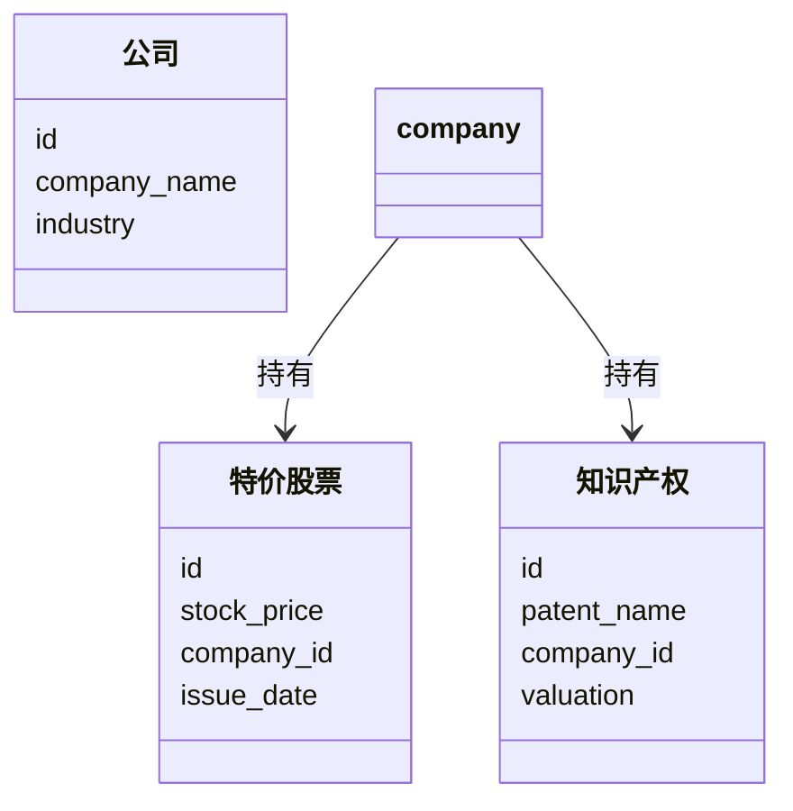

                 


# 特价股票与公司知识产权价值的关联性研究

> 关键词：特价股票、知识产权价值、关联性、回归分析、系统架构、案例分析

> 摘要：本文研究了特价股票与公司知识产权价值之间的关联性，探讨了知识产权对股价的影响，提出了基于回归分析和聚类分析的评估方法，并通过实际案例分析，得出知识产权是影响股价的重要因素。

---

## 第一部分：背景介绍

### 第1章：特价股票与公司知识产权价值的概述

#### 1.1 特价股票的基本概念
- 1.1.1 定义：特价股票是指面值低于发行价格的股票，通常用于吸引投资者。
- 1.1.2 分类：按发行方式可分为普通特价股票和优先特价股票。
- 1.1.3 市场特征：价格波动大、风险高、收益潜力大。

#### 1.2 公司知识产权的基本概念
- 1.2.1 定义：知识产权是公司拥有的专利、商标、版权等无形资产。
- 1.2.2 类型：专利权、商标权、版权、商业秘密。
- 1.2.3 评估方法：市场法、成本法、收益法。

#### 1.3 关联性问题背景
- 问题背景：知识产权影响公司价值，进而影响股价。
- 问题描述：研究知识产权对股价的具体影响机制。
- 解决的必要性：帮助投资者评估公司价值，做出明智投资决策。

---

## 第二部分：核心概念与联系

### 第2章：核心概念与联系

#### 2.1 核心概念对比
- 从属性对比：知识产权是公司资产，影响公司价值；特价股票是公司发行的股票，反映市场对公司价值的认可。
- 从价值评估对比：知识产权通过收益法评估，特价股票通过市盈率、市净率评估。
- 从市场影响对比：知识产权影响公司长期发展，特价股票影响短期市场行为。

#### 2.2 ER实体关系图
```mermaid
er
    entity 特价股票 {
        id: string
        stock_price: float
        company_id: string
        issue_date: date
    }
    entity 知识产权 {
        id: string
        patent_name: string
        company_id: string
        valuation: float
    }
    entity 公司 {
        id: string
        company_name: string
        industry: string
    }
    relation 特价股票-公司 {
        特价股票 --> 公司
    }
    relation 知识产权-公司 {
        知识产权 --> 公司
    }
```

---

## 第三部分：数学模型与算法原理

### 第3章：数学模型与算法原理

#### 3.1 知识产权价值评估模型
- 3.1.1 模型假设：知识产权价值与公司收入、行业地位、技术先进性相关。
- 3.1.2 模型公式：
  $$ V = \alpha \cdot R + \beta \cdot I + \gamma \cdot T $$
  其中，V为知识产权价值，R为收入，I为行业影响，T为技术先进性。

#### 3.2 回归分析算法
- 算法步骤：
  1. 收集数据：包括股价、知识产权价值、公司财务数据。
  2. 数据预处理：标准化、缺失值处理。
  3. 建立回归模型：
     $$ y = \beta_0 + \beta_1x_1 + \beta_2x_2 + \epsilon $$
  4. 模型训练：使用最小二乘法求解系数。
  5. 模型验证：R²检验、残差分析。

#### 3.3 聚类分析算法
- 算法步骤：
  1. 数据标准化：对股价和知识产权价值进行标准化。
  2. 选择聚类方法：K-means。
  3. 确定聚类数：肘部法。
  4. 聚类实现：将公司分为不同类别。
  5. 结果分析：不同类别公司的股价表现。

---

## 第四部分：系统分析与架构设计

### 第4章：系统分析与架构设计

#### 4.1 问题场景介绍
- 研究如何利用知识产权评估公司价值，进而分析对股价的影响。

#### 4.2 系统功能设计
- 领域模型：


#### 4.3 系统架构设计


---

## 第五部分：项目实战

### 第5章：项目实战

#### 5.1 环境安装
- 安装Python、NumPy、Pandas、Scikit-learn。

#### 5.2 核心代码实现
```python
import numpy as np
import pandas as pd
from sklearn.linear_model import LinearRegression

# 数据加载
data = pd.read_csv('ipo.csv')

# 数据预处理
X = data[['revenue', 'industry_influence', 'tech_advancement']]
y = data['stock_price']

# 模型训练
model = LinearRegression()
model.fit(X, y)

# 结果分析
print('Coefficients:', model.coef_)
print('Intercept:', model.intercept_)
```

#### 5.3 实际案例分析
- 案例：某科技公司，知识产权价值高，股价表现稳定。

---

## 第六部分：总结与展望

### 第6章：总结与展望

#### 6.1 最佳实践 tips
- 知识产权是影响股价的重要因素，建议投资者关注公司知识产权情况。

#### 6.2 小结
- 特价股票与知识产权价值密切相关，建立科学的评估模型有助于投资决策。

#### 6.3 注意事项
- 模型需结合实际市场情况，避免过度简化。

#### 6.4 拓展阅读
- 建议阅读相关金融学和知识产权评估的书籍。

---

作者：AI天才研究院/AI Genius Institute & 禅与计算机程序设计艺术/Zen And The Art of Computer Programming

