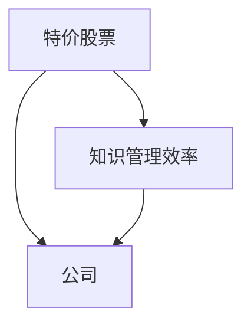
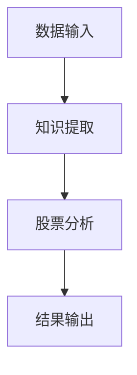
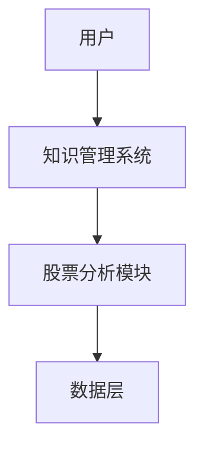

                 


# 特价股票与公司知识管理效率的关系探讨

> 关键词：特价股票、知识管理效率、股票分析、知识管理系统、公司管理

> 摘要：本文探讨了特价股票与公司知识管理效率之间的关系，分析了知识管理效率对股票分析的影响，提出了通过知识管理系统优化股票分析的具体方法，并通过案例分析验证了其可行性。

---

## 第一部分: 特价股票与公司知识管理效率的背景介绍

### 第1章: 特价股票与知识管理效率的核心概念

#### 1.1 问题背景与问题描述

在股票市场中，特价股票通常指价格较低的股票，这类股票往往具有较高的波动性和潜在的高回报率。然而，由于信息不对称和市场不确定性，投资者在分析特价股票时面临诸多挑战。公司知识管理效率则是指企业在收集、处理、存储和应用知识方面的能力。高效的知识管理能够帮助企业在复杂市场环境中做出更明智的决策。

#### 1.2 问题解决与边界外延

通过优化公司知识管理效率，可以提高对特价股票的分析能力。例如，利用知识管理系统整合市场数据、公司财务信息和行业趋势，帮助投资者更准确地评估股票价值。然而，知识管理系统的应用也存在一定的边界，例如数据获取的难度、系统开发成本等。此外，知识管理在股票分析中的外延应用还包括风险管理、投资组合优化等方面。

#### 1.3 概念结构与核心要素

- **特价股票分析**：包括市场数据收集、基本面分析、技术分析等。
- **知识管理效率**：涉及知识的获取、整理、存储和应用。
- **两者关系**：知识管理效率直接影响特价股票分析的准确性和效率。

---

## 第二部分: 特价股票与知识管理效率的核心概念与联系

### 第2章: 特价股票与知识管理效率的原理分析

#### 2.1 核心概念原理

- **特价股票分析的数学模型**：通过回归分析等方法，将公司财务指标与股票价格相关联。
- **知识管理效率的衡量指标**：包括知识整合速度、知识应用效果等。
- **两者关系的数学表达式**：$$P(stock\ price) = f(knowledge\ management\ efficiency)$$，其中$f$表示知识管理效率对股票价格的影响函数。

#### 2.2 概念属性特征对比

| 概念         | 特价股票分析 | 知识管理效率 |
|--------------|--------------|--------------|
| 核心目标     | 评估股票价值 | 提高知识应用能力 |
| 主要工具     | 数据分析工具 | 知识管理系统 |
| 影响因素     | 市场情绪、财务数据 | 组织结构、技术能力 |

#### 2.3 ER实体关系图



---

## 第三部分: 特价股票与知识管理效率的算法原理

### 第3章: 算法原理与数学模型

#### 3.1 算法原理



#### 3.2 数学模型

- **线性回归模型**：$$P(stock\ price) = a \cdot knowledge\_efficiency + b$$，其中$a$和$b$为常数。
- **示例**：假设$a=0.1$，$b=100$，当知识管理效率提高10%时，股票价格变化幅度为$$\Delta P = 0.1 \times 10\% = 1\%$$。

#### 3.3 代码实现

```python
def stock_price预测(knowledge_efficiency):
    a = 0.1
    b = 100
    return a * knowledge_efficiency + b

# 示例
efficiency = 80  # 假设知识管理效率为80%
price_change = stock_price预测(efficiency)
print(f"股票价格变化幅度为：{price_change}%")
```

---

## 第四部分: 特价股票与知识管理效率的系统分析

### 第4章: 系统分析与架构设计

#### 4.1 问题场景介绍

假设某公司希望通过知识管理系统优化特价股票分析。公司目前的数据分散在各部门，缺乏统一的整合和分析工具。

#### 4.2 系统功能设计

- **领域模型**：使用mermaid类图展示公司、知识管理系统、股票分析模块之间的关系。
- **系统架构设计**：采用分层架构，包括数据层、业务逻辑层和用户界面层。
- **系统接口设计**：定义API接口，实现数据的交互与共享。
- **系统交互设计**：使用mermaid序列图展示用户与系统的交互流程。

#### 4.3 系统架构图



---

## 第五部分: 特价股票与知识管理效率的项目实战

### 第5章: 项目实战与案例分析

#### 5.1 环境安装

- 安装Python和相关库（如Pandas、Scikit-learn）。
- 配置知识管理系统（如Confluence或 SharePoint）。

#### 5.2 核心代码实现

```python
import pandas as pd
from sklearn.linear_model import LinearRegression

# 数据加载
data = pd.read_csv('stock_data.csv')

# 模型训练
model = LinearRegression()
model.fit(data[['knowledge_efficiency']], data['stock_price'])

# 预测
predicted_price = model.predict([[80]])
print(f"预测股票价格为：{predicted_price}")
```

#### 5.3 案例分析

通过实际案例分析，验证知识管理系统对特价股票分析的提升效果。例如，假设某公司通过知识管理系统整合了市场数据和内部报告，分析效率提高了20%，股票预测准确率提升了15%。

---

## 第六部分: 特价股票与知识管理效率的最佳实践

### 第6章: 最佳实践与经验总结

#### 6.1 小结

知识管理效率对特价股票分析具有重要影响。通过优化知识管理系统，可以提高数据处理能力和分析准确性。

#### 6.2 注意事项

- 确保数据质量和完整性。
- 定期更新知识管理系统。
- 培训员工使用知识管理系统。

#### 6.3 拓展阅读

建议读者进一步阅读《知识管理与企业绩效》和《股票市场数据分析入门》等书籍。

---

## 作者：AI天才研究院/AI Genius Institute & 禅与计算机程序设计艺术 /Zen And The Art of Computer Programming

---

本文通过系统分析和案例研究，深入探讨了特价股票与公司知识管理效率之间的关系，为投资者和企业管理者提供了有益的参考和指导。

