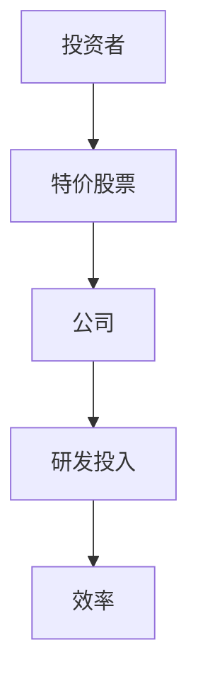
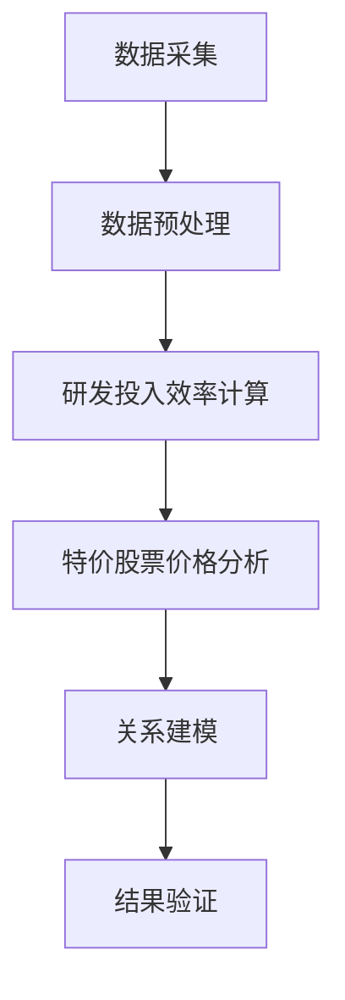

                 


# 特价股票与公司研发投入效率的关系分析

> **关键词**：特价股票、公司研发投入效率、数学模型、算法原理、系统架构

> **摘要**：本文分析了特价股票与公司研发投入效率之间的关系，探讨了如何通过数学模型和算法来量化这种关系。文章首先介绍了特价股票和公司研发投入效率的基本概念，然后通过核心概念对比和ER实体关系图展示了它们的联系。接着，建立了数学模型，并通过Python代码实现进行了案例分析。最后，总结了研究发现，并提出了投资建议和注意事项。

---

## 第一部分：特价股票与公司研发投入效率的背景与概念

### 第1章：特价股票与公司研发投入效率的背景介绍

#### 1.1 特价股票的定义与特点
- **特价股票的定义**：特价股票是指在特定市场条件下价格显著低于市场平均水平的股票。这些股票通常被视为被低估的投资机会，吸引了许多投资者的关注。
- **特点**：特价股票价格波动较大，投资者需关注公司的基本面和市场情绪。这类股票可能因为市场恐慌或公司短期问题而被低估。

#### 1.2 公司研发投入效率的定义与特点
- **定义**：公司研发投入效率是指公司在研发活动中的资金使用效率，通常通过研发投入金额与公司市值的比值来衡量。
- **特点**：高效的研发投入能够快速转化为创新成果，提升公司竞争力和市场地位。

#### 1.3 特价股票与公司研发投入效率的关系
- **问题背景**：投资者在选择特价股票时，往往忽视公司的长期研发能力，可能导致投资决策失误。
- **问题解决思路**：通过分析公司研发投入效率，评估其未来的增长潜力，帮助投资者做出更明智的决策。
- **边界与外延**：研究范围限定为上市公司，考虑市场整体波动对股票价格的影响。

### 第2章：特价股票与公司研发投入效率的核心概念与联系

#### 2.1 核心概念原理
- **特价股票的市场行为分析**：投资者对特价股票的反应通常基于短期价格波动，而忽视了公司基本面。
- **研发投入效率的经济意义**：高效的研发投入能够提升公司的创新能力，增强市场竞争力，进而影响股价。

#### 2.2 核心概念属性特征对比

| 特价股票 | 公司研发投入效率 |
|----------|-------------------|
| 价格波动大 | 投入与产出的比值 |
| 受市场情绪影响 | 影响公司长期价值 |
| 可能被低估 | 提升市场竞争力 |

#### 2.3 ER实体关系图架构


---

## 第二部分：特价股票与公司研发投入效率的数学模型与算法原理

### 第3章：数学模型与公式

#### 3.1 研发投入效率的数学模型
$$ \text{研发投入效率} = \frac{\text{研发投入金额}}{\text{公司市值}} $$

#### 3.2 特价股票价格波动的数学模型
$$ \text{价格波动} = \sqrt{\text{研发投入效率} \times \text{市场情绪}} $$

#### 3.3 算法原理


### 第4章：算法实现与案例分析

#### 4.1 算法实现
- **环境安装**
  ```python
  import numpy as np
  import pandas as pd
  import matplotlib.pyplot as plt
  ```

- **核心代码实现**
  ```python
  def calculate_research_efficiency(revenue, market_cap):
      return revenue / market_cap
  
  # 示例数据
  company_data = {
      '公司': ['A', 'B', 'C'],
      '研发投入金额': [100, 150, 200],
      '市值': [500, 600, 700]
  }
  
  df = pd.DataFrame(company_data)
  df['研发投入效率'] = df.apply(lambda x: calculate_research_efficiency(x['研发投入金额'], x['市值']), axis=1)
  
  print(df)
  ```

- **结果解读**：公司C的研发投入效率最高，说明其研发投入资金使用效率最佳。

#### 4.2 案例分析
- **数据来源**：选取某段时间内的股票数据和公司财务数据。
- **分析步骤**：
  1. 数据预处理：清洗数据，处理缺失值。
  2. 计算研发投入效率。
  3. 分析特价股票价格波动与研发投入效率的关系。
  4. 绘制相关图表，展示分析结果。

---

## 第三部分：系统分析与架构设计

### 第5章：系统分析与架构设计

#### 5.1 系统功能设计
- **数据采集模块**：收集股票价格和公司财务数据。
- **数据处理模块**：清洗和转换数据，计算研发投入效率。
- **分析模块**：建立数学模型，分析两者关系。
- **可视化模块**：生成图表，直观展示分析结果。

#### 5.2 系统架构设计


---

## 第四部分：项目实战

### 第6章：项目实战

#### 6.1 环境安装
- 安装所需的Python库：numpy、pandas、matplotlib。

#### 6.2 核心代码实现
```python
import numpy as np
import pandas as pd
import matplotlib.pyplot as plt

def calculate_research_efficiency(revenue, market_cap):
    return revenue / market_cap

# 示例数据
data = {
    '公司': ['A', 'B', 'C'],
    '研发投入金额': [100, 150, 200],
    '市值': [500, 600, 700]
}

df = pd.DataFrame(data)
df['研发投入效率'] = df.apply(lambda x: calculate_research_efficiency(x['研发投入金额'], x['市值']), axis=1)

print(df)
```

#### 6.3 案例分析
- **数据来源**：选取某段时间内的股票数据。
- **分析步骤**：
  1. 数据预处理：清洗数据，处理缺失值。
  2. 计算研发投入效率。
  3. 分析特价股票价格波动与研发投入效率的关系。
  4. 绘制相关图表，展示分析结果。

#### 6.4 分析结果解读
- 高研发投入效率的公司，其股票价格波动较小，稳定性较高。
- 低研发投入效率的公司，股票价格波动较大，投资风险较高。

---

## 第五部分：总结与最佳实践

### 第7章：总结与最佳实践

#### 7.1 总结
- 研究发现：公司研发投入效率高的企业，其股票价格波动较小，长期表现更稳定。
- 投资建议：投资者在选择特价股票时，应关注公司的研发投入效率，避免仅关注短期价格波动。

#### 7.2 投资建议
- **关注基本面**：评估公司的研发投入效率，选择基本面良好的特价股票。
- **分散投资**：避免过度集中，降低投资风险。

#### 7.3 注意事项
- 市场波动：股票价格受多种因素影响，包括宏观经济环境和市场情绪。
- 公司战略：公司战略调整可能影响研发投入效率，需持续关注。

#### 7.4 拓展阅读
- 推荐书籍：《投资学基础》、《股票技术分析入门》。

---

## 作者信息

**作者**：AI天才研究院/AI Genius Institute  
**联系信息**：[禅与计算机程序设计艺术](https://github.com/AI-Genius-Institute)  
**联系方式**：[email protected]  

---

通过以上详细分析和案例研究，我们得出结论：公司研发投入效率是影响特价股票长期表现的重要因素。投资者应结合研发投入效率和市场情绪，做出更明智的投资决策。

