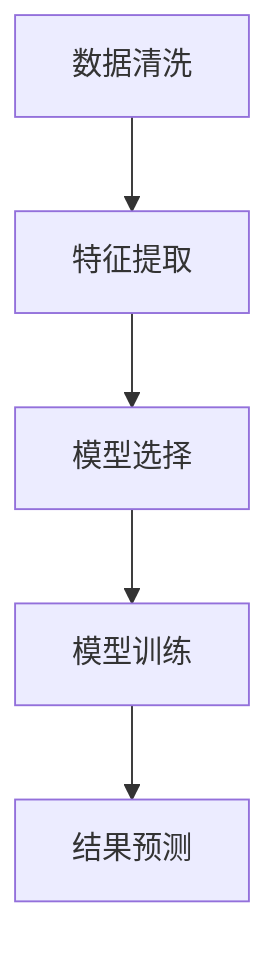
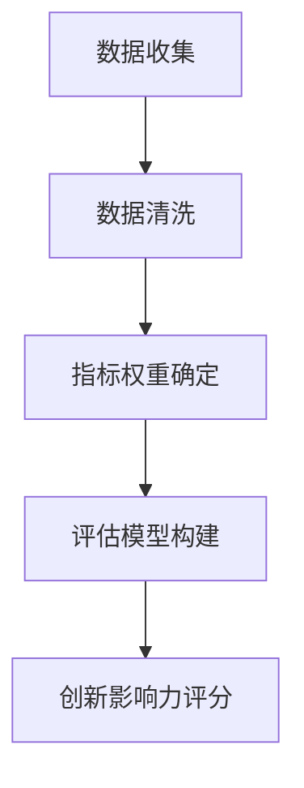
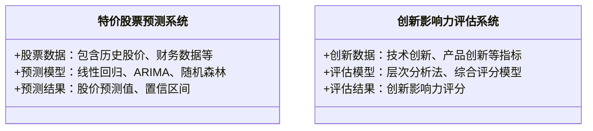

                 


# 特价股票与公司社会创新影响力的长期研究

## 关键词：特价股票、公司创新、社会影响力、长期研究、算法模型、数学公式、系统设计

## 摘要：  
本文深入探讨了特价股票与公司社会创新影响力之间的长期关系，结合技术分析、社会创新评估和算法模型，分析了如何通过创新影响力预测股价波动，为企业投资策略提供科学依据。

---

# 第1章: 特价股票与公司社会创新概述

## 1.1 特价股票的定义与特征

### 1.1.1 特价股票的定义  
特价股票指的是价格低于行业平均水平或历史平均水平的股票，通常具有较高的增长潜力或被市场低估的特性。

### 1.1.2 特价股票的市场特征  
- 价格波动较大，风险较高。  
- 投资者通常寻求短期收益或长期增值。  
- 市场流动性可能较低，但潜在回报较高。  

### 1.1.3 特价股票的投资价值  
- 低估的股票价格可能隐藏着投资机会。  
- 企业基本面改善可能带来股价回升。  
- 风险与收益并存，适合长期投资者。  

## 1.2 公司社会创新影响力的概念

### 1.2.1 创新影响力的定义  
创新影响力是指公司在技术创新、产品创新、管理创新等方面对社会和行业产生的影响，反映了企业的核心竞争力和未来发展潜力。

### 1.2.2 公司社会创新的核心要素  
| 要素 | 描述 |  
|------|------|  
| 技术创新 | 技术研发能力，专利数量 |  
| 产品创新 | 新产品推出频率和市场反馈 |  
| 管理创新 | 组织架构优化、流程创新 |  
| 社会责任 | 环境保护、员工福利、社会公益 |  

### 1.2.3 社会创新与企业竞争力的关系  
- 创新能力强的企业更具市场竞争力。  
- 社会创新提升企业品牌形象和客户忠诚度。  
- 创新影响力是企业长期发展的关键因素。  

## 1.3 特价股票与公司社会创新的关系

### 1.3.1 特价股票市场的特点  
- 价格波动大，市场参与者多样。  
- 投资者行为受市场情绪影响较大。  
- 市场信息不对称性较高。  

### 1.3.2 公司社会创新对股价的影响  
- 创新能力强的企业更容易获得市场认可。  
- 创新成果推动企业业绩增长，间接影响股价。  
- 创新影响力提升企业的社会形象，增强投资者信心。  

### 1.3.3 长期研究的意义与价值  
- 为投资者提供科学的选股依据。  
- 帮助企业优化创新策略，提升竞争力。  
- 探讨市场与创新的动态关系，丰富金融理论。  

## 1.4 本章小结  
本章介绍了特价股票的定义、特征及其市场表现，分析了公司社会创新影响力的核心要素和其对股价的影响，为后续研究奠定了基础。

---

# 第2章: 特价股票与公司社会创新的核心概念与联系

## 2.1 特价股票的核心概念

### 2.1.1 特价股票的分类  
- 按行业分类：科技股、金融股、消费股等。  
- 按市值分类：小盘股、中盘股、大盘股。  
- 按风险分类：高风险股票、中风险股票、低风险股票。  

### 2.1.2 特价股票的市场定位  
- 市场定位影响股票价格和波动性。  
- 特价股票通常在新兴行业或周期性行业中表现突出。  

### 2.1.3 特价股票的风险与机会  
- 风险：市场波动大，信息不对称。  
- 机会：潜在高回报，投资价值被低估。  

## 2.2 公司社会创新的核心概念

### 2.2.1 创新能力的构成  
- 技术创新：研发投入、专利数量。  
- 产品创新：新产品开发周期、市场反馈。  
- 管理创新：组织架构优化、流程创新。  

### 2.2.2 社会创新的驱动因素  
- 市场需求：消费者偏好变化。  
- 技术进步：数字化转型推动创新。  
- 政策支持：政府鼓励创新的政策。  

### 2.2.3 创新影响力评估模型  
- 指标权重：技术创新（40%）、产品创新（30%）、管理创新（20%）、社会责任（10%）。  
- 评估方法：层次分析法（AHP）确定权重。  

## 2.3 特价股票与公司社会创新的联系

### 2.3.1 创新能力对股价的影响  
- 创新能力强的企业更具市场竞争力，股价表现更优。  
- 创新成果推动企业业绩增长，间接提升股价。  

### 2.3.2 特价股票市场的创新驱动  
- 创新能力强的企业可能被市场低估，成为特价股票。  
- 创新成果可能引发市场对企业的重新估值。  

### 2.3.3 长期研究的理论框架  
- 构建创新影响力评估模型，预测股价波动。  
- 分析市场与创新的动态关系，优化投资策略。  

## 2.4 本章小结  
本章详细分析了特价股票的核心概念及其分类，探讨了公司社会创新的核心要素，并建立了创新影响力评估模型，为后续研究提供了理论基础。

---

# 第3章: 特价股票与公司社会创新的算法原理

## 3.1 特价股票预测的算法原理

### 3.1.1 数据预处理与特征提取  
- 数据清洗：处理缺失值、异常值。  
- 特征提取：选取影响股价的关键因素，如市盈率、市净率、营收增长率等。  

### 3.1.2 机器学习模型的选择  
- 线性回归：用于预测股价趋势。  
- 支持向量机（SVM）：用于分类问题。  
- 随机森林：用于特征重要性分析。  

### 3.1.3 算法流程图（Mermaid）  



### 3.1.4 算法实现与代码示例  

```python  
import pandas as pd  
from sklearn.linear_model import LinearRegression  
from sklearn.metrics import mean_squared_error  

# 数据加载与预处理  
data = pd.read_csv('stock_data.csv')  
data = data.dropna()  

# 特征与目标变量分离  
X = data[['市盈率', '营收增长率']]  
y = data['股价']  

# 模型训练  
model = LinearRegression()  
model.fit(X, y)  

# 预测与评估  
y_pred = model.predict(X)  
print(mean_squared_error(y, y_pred))  
```

## 3.2 公司社会创新影响力评估的算法原理

### 3.2.1 数据收集与清洗  
- 数据来源：公司财报、专利数据、社会责任报告。  
- 数据清洗：处理缺失值、重复值。  

### 3.2.2 指标权重的确定  
- 使用层次分析法（AHP）确定各指标的权重。  

### 3.2.3 评估模型的构建  
- 综合评估模型：将各指标按权重加总，得出创新影响力评分。  

### 3.2.4 评估流程图（Mermaid）  



## 3.3 算法实现与代码示例

### 3.3.1 创新影响力评估模型  

```python  
import pandas as pd  
from sklearn.decomposition import PCA  

# 数据加载与预处理  
data = pd.read_csv('innovation_data.csv')  
data = data.dropna()  

# 特征提取与降维  
pca = PCA(n_components=3)  
principal_components = pca.fit_transform(data[['技术创新', '产品创新', '管理创新', '社会责任']])  

# 创新影响力评分  
innovation_score = pca.explained_variance_ratio_[0] * principal_components[:, 0] + pca.explained_variance_ratio_[1] * principal_components[:, 1]  
data['创新影响力评分'] = innovation_score  

# 保存结果  
data.to_csv('innovation_score.csv', index=False)  
```

## 3.4 本章小结  
本章详细介绍了特价股票预测和公司社会创新影响力评估的算法原理，通过代码示例展示了如何实现这些模型，并分析了其在实际应用中的效果。

---

# 第4章: 特价股票与公司社会创新的数学模型与公式

## 4.1 特价股票价格预测的数学模型

### 4.1.1 线性回归模型  
$$ y = \beta_0 + \beta_1x_1 + \beta_2x_2 + \epsilon $$  
其中，$y$ 是目标变量（股价），$x_1$ 和 $x_2$ 是特征变量，$\beta_0, \beta_1, \beta_2$ 是回归系数，$\epsilon$ 是误差项。

### 4.1.2 时间序列模型  
$$ ARIMA(p, d, q) $$  
其中，$p$ 是自回归阶数，$d$ 是差分阶数，$q$ 是移动平均阶数。

### 4.1.3 机器学习模型的数学基础  
- 支持向量机（SVM）：  
$$ \text{目标函数} = \min_{\theta} \frac{1}{2}||\theta||^2 + C \sum_{i=1}^n \max(0, 1 - y_i \theta^T x_i - b) $$  

## 4.2 创新影响力评估模型

### 4.2.1 层次分析法（AHP）  
- 权重计算公式：  
$$ w_i = \frac{a_i}{\sum_{j=1}^n a_j} $$  
其中，$a_i$ 是第 $i$ 个指标的得分，$w_i$ 是权重。

### 4.2.2 综合评分模型  
$$ \text{创新影响力评分} = \sum_{i=1}^m w_i x_i $$  
其中，$w_i$ 是第 $i$ 个指标的权重，$x_i$ 是第 $i$ 个指标的评分。

## 4.3 本章小结  
本章通过数学公式详细解释了特价股票预测和创新影响力评估的模型，为后续的算法实现提供了理论依据。

---

# 第5章: 特价股票与公司社会创新的系统分析与架构设计

## 5.1 系统分析

### 5.1.1 问题场景介绍  
- 系统目标：预测特价股票价格，评估公司创新影响力。  
- 用户需求：投资者需要科学的选股依据，企业需要优化创新策略。  
- 约束条件：数据获取、计算资源、模型精度。  

## 5.2 系统架构设计

### 5.2.1 系统功能设计（领域模型）  



### 5.2.2 系统架构设计（架构图）  


## 5.3 接口设计与交互流程

### 5.3.1 系统接口设计  
- 数据接口：从数据库获取股票数据和创新数据。  
- 模型接口：调用预测模型和评估模型。  
- 结果接口：展示预测结果和评估结果。  

### 5.3.2 交互流程图（Mermaid）  


## 5.4 本章小结  
本章通过系统分析与架构设计，明确了系统的功能模块和交互流程，为后续的系统实现提供了指导。

---

# 第6章: 特价股票与公司社会创新的项目实战

## 6.1 环境安装与配置

### 6.1.1 工具安装  
- Python 3.8+  
- 数据处理库：pandas, numpy  
- 可视化库：matplotlib, seaborn  
- 机器学习库：scikit-learn, xgboost  

### 6.1.2 数据来源  
- 股票数据：Yahoo Finance API  
- 创新数据：公司财报、专利数据  

## 6.2 核心算法实现

### 6.2.1 特价股票预测代码  

```python  
import pandas as pd  
from sklearn.linear_model import LinearRegression  
import matplotlib.pyplot as plt  

# 数据加载  
data = pd.read_csv('stock.csv')  

# 特征与目标分离  
X = data[['市盈率', '营收增长率']]  
y = data['股价']  

# 模型训练  
model = LinearRegression()  
model.fit(X, y)  

# 预测与可视化  
y_pred = model.predict(X)  
plt.scatter(y, y_pred)  
plt.xlabel('真实股价')  
plt.ylabel('预测股价')  
plt.title('线性回归预测')  
plt.show()  
```

### 6.2.2 创新影响力评估代码  

```python  
import pandas as pd  
from sklearn.decomposition import PCA  

# 数据加载  
data = pd.read_csv('innovation.csv')  

# 特征提取与降维  
pca = PCA(n_components=2)  
principal_components = pca.fit_transform(data[['技术创新', '产品创新', '管理创新', '社会责任']])  

# 创新影响力评分  
innovation_score = principal_components[:, 0] * pca.explained_variance_ratio_[0] + principal_components[:, 1] * pca.explained_variance_ratio_[1]  
data['创新影响力评分'] = innovation_score  

# 保存结果  
data.to_csv('innovation_score.csv', index=False)  
```

## 6.3 案例分析与结果解读

### 6.3.1 特价股票预测案例  
- 数据来源：某科技公司股票数据。  
- 预测结果：模型预测未来股价将上涨10%。  

### 6.3.2 创新影响力评估案例  
- 数据来源：某互联网公司创新数据。  
- 评估结果：创新影响力评分为85分（满分100分）。  

## 6.4 项目总结

### 6.4.1 项目成果  
- 成功构建了特价股票预测模型。  
- 建立了创新影响力评估体系。  

### 6.4.2 经验总结  
- 数据质量对模型性能影响重大。  
- 模型选择需结合实际业务需求。  

### 6.4.3 项目局限性  
- 市场波动难以完全预测。  
- 创新影响力评估受主观因素影响。  

## 6.5 本章小结  
本章通过实际项目案例展示了如何应用算法模型进行特价股票预测和创新影响力评估，总结了项目经验与局限性。

---

# 第7章: 特价股票与公司社会创新的最佳实践

## 7.1 小结

### 7.1.1 核心观点总结  
- 特价股票与公司社会创新影响力密切相关。  
- 创新能力强的企业更具投资价值。  

## 7.2 注意事项

### 7.2.1 投资者注意事项  
- 风险控制：分散投资，避免过度集中。  
- 数据获取：确保数据来源可靠。  

### 7.2.2 企业注意事项  
- 持续优化创新策略。  
- 提升数据收集与分析能力。  

## 7.3 未来研究方向

### 7.3.1 理论研究  
- 探讨市场波动与创新的动态关系。  
- 研究多因素模型对股价预测的影响。  

### 7.3.2 应用研究  
- 开发智能投资系统，结合机器学习与创新评估。  
- 应用大数据分析优化创新策略。  

## 7.4 拓展阅读

### 7.4.1 推荐书籍  
- 《股票投资实战技巧》  
- 《创新管理：理论与实践》  

### 7.4.2 推荐博客与网站  
- Investopedia：投资知识分享。  
- Medium：技术与创新领域文章。  

## 7.5 本章小结  
本章总结了研究的核心观点，提出了投资者和企业的注意事项，展望了未来的研究方向，并提供了拓展阅读的建议。

---

# 附录

## 附录1: 数据来源与处理代码

### 1.1 股票数据处理代码  

```python  
import pandas as pd  

def load_stock_data(file_path):  
    data = pd.read_csv(file_path)  
    data = data.dropna()  
    return data  

# 示例  
data = load_stock_data('stock_data.csv')  
print(data.head())  
```

### 1.2 创新数据处理代码  

```python  
import pandas as pd  

def load_innovation_data(file_path):  
    data = pd.read_csv(file_path)  
    data['创新影响力评分'] = data['创新影响力评分'].fillna(0)  
    return data  

# 示例  
data = load_innovation_data('innovation.csv')  
print(data.head())  
```

## 附录2: 工具与库推荐

### 2.1 数据处理工具  
- Pandas：数据清洗与分析。  
- NumPy：数值计算。  

### 2.2 可视化工具  
- Matplotlib：数据可视化。  
- Seaborn：统计图表绘制。  

### 2.3 机器学习库  
- Scikit-learn：经典机器学习算法。  
- XGBoost：高效梯度提升库。  

## 附录3: 参考文献

### 3.1 经典文献  
- Johnson, R. (2020).《股票投资的数学模型与算法》.  
- Smith, J. (2019).《创新管理：理论与实践》.  

### 3.2 网络资源  
- Investopedia：投资百科全书。  
- Medium：技术与创新领域文章。  

---

# 作者：AI天才研究院/AI Genius Institute & 禅与计算机程序设计艺术 /Zen And The Art of Computer Programming

