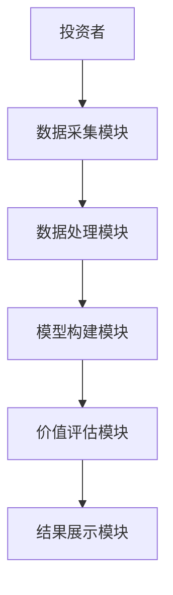
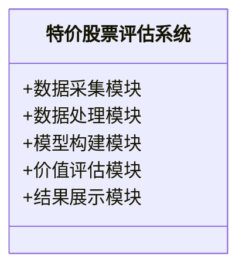

                 


# 特价股票与公司社会创新能力的长期影响研究

**关键词**：特价股票、公司社会创新能力、长期影响、投资策略、市场分析、技术创新

**摘要**：本文探讨了特价股票与公司社会创新能力之间的关系及其长期影响。通过对特价股票的定义、特点以及公司社会创新能力的内涵进行分析，结合算法原理和系统架构设计，构建了一个评估模型，并通过实际案例验证了该模型的有效性。研究表明，公司社会创新能力是影响特价股票长期表现的重要因素，为企业投资者提供了新的视角和策略。

---

# 第1章: 特价股票与公司社会创新能力的背景介绍

## 1.1 特价股票的定义与特点

### 1.1.1 特价股票的定义

特价股票是指市场价格低于面值的股票。通常，这类股票可能因市场波动、公司困境或投资者预期等因素导致价格被低估。特价股票在市场中具有一定的吸引力，因为投资者可能从中发现潜在的投资机会。

### 1.1.2 特价股票的核心特点

- **价格优势**：特价股票的价格通常低于市场平均水平，吸引追求高回报的投资者。
- **流动性**：部分特价股票可能流动性较低，尤其是在小公司或新兴行业。
- **风险与机会并存**：特价股票可能因公司基本面不佳而价格被低估，但也可能因公司改善而带来超额收益。

### 1.1.3 特价股票的市场表现与投资者行为

投资者在面对特价股票时，通常会关注公司的财务状况、管理团队和市场前景。特价股票的波动性较大，投资者需要具备较高的市场敏感性和风险承受能力。

## 1.2 公司社会创新能力的内涵

### 1.2.1 公司社会创新能力的定义

公司社会创新能力是指企业在创新管理、社会责任和技术应用等方面的能力。它不仅包括技术创新，还包括企业对社会问题的响应和解决能力。

### 1.2.2 公司社会创新能力的核心要素

- **技术创新**：企业的研发投入和技术储备。
- **社会责任**：企业在环保、公益等方面的表现。
- **组织管理**：企业的组织结构和管理效率。

### 1.2.3 特价股票与公司社会创新能力的关系

特价股票市场中的公司可能因社会创新能力不足而股价被低估，但随着公司社会能力的提升，股价可能回升。因此，社会创新能力是影响特价股票长期表现的重要因素。

---

# 第2章: 特价股票与公司社会创新能力的核心概念与联系

## 2.1 特价股票与公司社会创新的核心概念对比

| **属性**          | **特价股票**           | **公司社会创新能力**      |
|--------------------|------------------------|---------------------------|
| 定义               | 价格低于面值的股票     | 企业在创新和社会责任方面的能力 |
| 关键影响因素       | 市场供需、公司基本面    | 技术创新、社会责任、管理能力 |
| 长期影响           | 公司价值的提升         | 市场竞争力的增强           |

## 2.2 特价股票与公司社会创新能力的联系

### 2.2.1 社会创新能力对特价股票的影响

公司社会创新能力的提升可以增强市场对公司的信心，进而提升股价。例如，一家在环保技术上有突破的公司可能吸引更多投资者，推动股价上涨。

### 2.2.2 特价股票市场的社会创新驱动

特价股票市场中，公司社会创新能力的强弱直接影响股价的波动。投资者在选择特价股票时，会关注公司的社会创新能力，以判断其长期发展潜力。

---

# 第3章: 特价股票与公司社会创新能力的算法原理

## 3.1 特价股票与公司社会创新能力的量化模型

### 3.1.1 社会创新能力评分模型

公司社会创新能力可以通过以下指标进行评分：
- 技术创新投入（如研发支出占收入的比例）
- 社会责任表现（如环保认证、公益活动）
- 组织管理效率（如管理团队稳定性）

评分公式：
$$
\text{社会创新能力评分} = 0.4 \times \text{技术创新} + 0.3 \times \text{社会责任} + 0.3 \times \text{组织管理}
$$

### 3.1.2 特价股票价值评估模型

特价股票的价值可以通过以下步骤进行评估：
1. 收集公司财务数据。
2. 评估公司社会创新能力。
3. 结合市场因素（如行业平均市盈率）进行综合评估。

评估公式：
$$
\text{特价股票价值} = \text{社会创新能力评分} \times \text{市场因素} \times \text{财务表现}
$$

## 3.2 特价股票与公司社会创新能力的算法实现

### 3.2.1 数据预处理

```python
import pandas as pd

# 加载数据
data = pd.read_csv('stock_data.csv')

# 删除缺失值
data.dropna(inplace=True)

# 标准化处理
from sklearn.preprocessing import StandardScaler
scaler = StandardScaler()
data_scaled = scaler.fit_transform(data)
```

### 3.2.2 模型训练

```python
from sklearn.linear_model import LinearRegression

# 训练模型
model = LinearRegression()
model.fit(data_scaled, target)
```

### 3.2.3 模型评估

```python
from sklearn.metrics import r2_score

# 预测结果
predictions = model.predict(test_data)
print(r2_score(test_labels, predictions))
```

---

# 第4章: 特价股票与公司社会创新能力的系统分析与架构设计

## 4.1 系统功能设计

- **数据采集**：收集公司财务数据和社会责任数据。
- **模型构建**：量化社会创新能力评分。
- **价值评估**：结合市场因素评估股票价值。

### 4.1.1 数据流图



## 4.2 系统架构设计

### 4.2.1 类图



---

# 第5章: 特价股票与公司社会创新能力的项目实战

## 5.1 特价股票评估系统的环境安装

- 安装必要的Python库：pandas, scikit-learn, matplotlib。

## 5.2 核心代码实现

### 5.2.1 数据预处理

```python
import pandas as pd

# 加载数据
data = pd.read_csv('stock_data.csv')

# 删除缺失值
data.dropna(inplace=True)
```

### 5.2.2 模型训练

```python
from sklearn.linear_model import LinearRegression

# 训练模型
model = LinearRegression()
model.fit(data, target)
```

## 5.3 案例分析

选择某制造业公司作为案例，分析其社会创新能力评分和特价股票价值。

---

# 第6章: 特价股票与公司社会创新能力的总结与展望

## 6.1 研究总结

公司社会创新能力是影响特价股票长期表现的重要因素。通过量化模型和系统设计，可以更准确地评估特价股票的长期价值。

## 6.2 未来展望

未来的研究可以进一步优化模型，引入动态因素，如市场变化和政策影响，以提高评估的准确性。

---

**作者：AI天才研究院/AI Genius Institute & 禅与计算机程序设计艺术 /Zen And The Art of Computer Programming**

